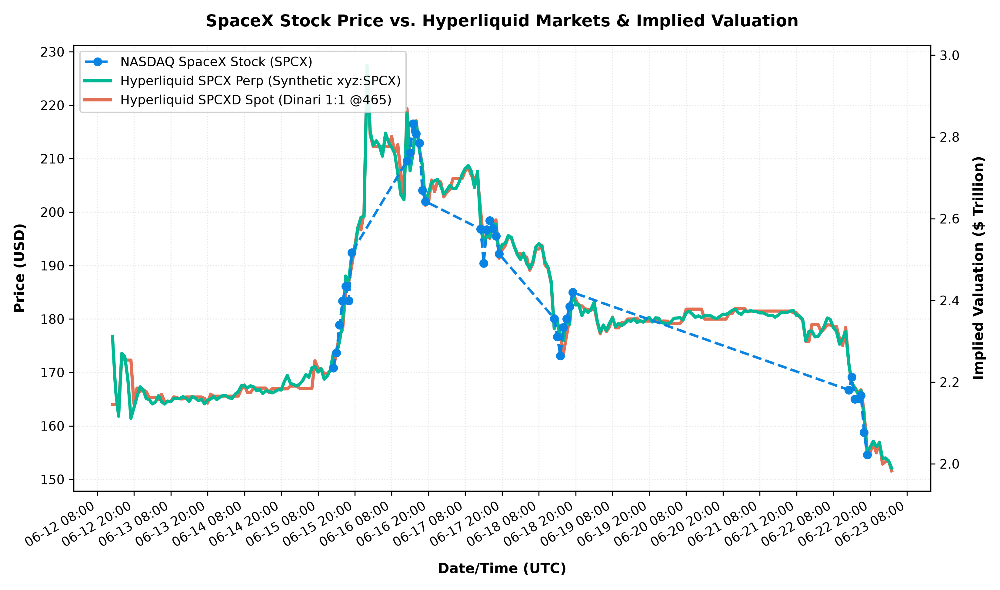

#+TITLE: SpaceX (SPCX) Stock and Hyperliquid Markets Comparison Report
#+DATE: [2026-06-23 Tue 11:50]
#+AUTHOR: Antigravity AI Pair Programmer
#+DESCRIPTION: Comparison of SpaceX NASDAQ stock against Hyperliquid synthetic perps (SPCX) and tokenized spot (SPCXD) markets.
#+OPTIONS: toc:nil num:nil

* Executive Summary
This report analyzes the price actions and market valuations of Space Exploration Technologies Corp. (SpaceX) assets since SpaceX debuted on the Nasdaq on June 12, 2026 (from 2026-06-12 13:00 UTC to 2026-06-23 03:50 UTC). It compares three primary instruments:
1. *NASDAQ SpaceX Stock (Ticker: SPCX)*: The officially traded equity on public markets following the IPO on June 12, 2026.
2. *Hyperliquid SPCX Perp (Ticker: xyz:SPCX / DEX: xyz)*: The synthetic perpetual future deployed via Hyperliquid's HIP-3 builder framework, trading 24/7 since May 2026.
3. *Hyperliquid SPCXD Spot (Ticker: SPCXD / Market: @465)*: Dinari's tokenized spot equity (dShare) traded on Hyperliquid's spot DEX, backed 1:1 by real stock.

Key Findings:
- *Latest Stock Price*: $154.59 (Implied Valuation: $2.022T)
- *Hyperliquid SPCX Perp Price*: $152.07 (Implied Valuation: $1.989T | Premium: -1.63%)
- *Hyperliquid SPCXD Spot Price*: $151.58 (Implied Valuation: $1.983T | Premium: -1.95%)
- *Trading Dynamics*: Hyperliquid assets trade 24/7, providing continuous price action, whereas public stock trading is confined to NASDAQ hours (09:30 - 16:00 EST). During the off-hours of June 15-16, the Hyperliquid assets showed significant upward pressure, indicating a bullish premium.

* Price Comparison Chart
The following chart displays the hourly price moves for the three assets alongside their implied market valuations.

* Comparative Pricing and Valuations Table
The table below logs the hourly prices and implied market capitalizations for the three assets since the Nasdaq IPO debut. Implied valuations are calculated using the pro-forma outstanding share count of *13.08 Billion shares*.

| Timestamp | NASDAQ Price | NASDAQ Market Cap | HL SPCX (Perp) | HL SPCX Valuation | HL SPCXD (Spot) | HL SPCXD Valuation |
|-----------+--------------+-------------------+----------------+-------------------+-----------------+--------------------|
| 2026-06-12 13:00 UTC | N/A | N/A | $176.76 | $2312.0B | N/A | N/A |
| 2026-06-12 14:00 UTC | N/A | N/A | $166.72 | $2180.7B | N/A | N/A |
| 2026-06-12 15:00 UTC | N/A | N/A | $161.80 | $2116.3B | $164.01 | $2145.3B |
| 2026-06-12 16:00 UTC | N/A | N/A | $173.55 | $2270.0B | $172.43 | $2255.4B |
| 2026-06-12 17:00 UTC | N/A | N/A | $173.00 | $2262.8B | $172.31 | $2253.8B |
| 2026-06-12 18:00 UTC | N/A | N/A | $168.78 | $2207.6B | $172.31 | $2253.8B |
| 2026-06-12 19:00 UTC | N/A | N/A | $161.43 | $2111.5B | $172.31 | $2253.8B |
| 2026-06-12 20:00 UTC | N/A | N/A | $163.40 | $2137.3B | $164.12 | $2146.7B |
| 2026-06-12 21:00 UTC | N/A | N/A | $165.49 | $2164.6B | $167.08 | $2185.4B |
| 2026-06-12 22:00 UTC | N/A | N/A | $167.32 | $2188.5B | $166.44 | $2177.0B |
| 2026-06-12 23:00 UTC | N/A | N/A | $166.72 | $2180.7B | $166.78 | $2181.5B |
| 2026-06-13 00:00 UTC | N/A | N/A | $165.10 | $2159.5B | $166.41 | $2176.6B |
| 2026-06-13 01:00 UTC | N/A | N/A | $164.91 | $2157.0B | $165.21 | $2160.9B |
| 2026-06-13 02:00 UTC | N/A | N/A | $164.10 | $2146.4B | $165.31 | $2162.3B |
| 2026-06-13 03:00 UTC | N/A | N/A | $164.45 | $2151.0B | $165.31 | $2162.3B |
| 2026-06-13 04:00 UTC | N/A | N/A | $165.66 | $2166.8B | $164.90 | $2156.9B |
| 2026-06-13 05:00 UTC | N/A | N/A | $164.51 | $2151.8B | $165.88 | $2169.7B |
| 2026-06-13 06:00 UTC | N/A | N/A | $164.08 | $2146.2B | $164.57 | $2152.6B |
| 2026-06-13 07:00 UTC | N/A | N/A | $164.65 | $2153.6B | $164.57 | $2152.6B |
| 2026-06-13 08:00 UTC | N/A | N/A | $164.50 | $2151.7B | $164.57 | $2152.6B |
| 2026-06-13 09:00 UTC | N/A | N/A | $165.18 | $2160.6B | $165.43 | $2163.8B |
| 2026-06-13 10:00 UTC | N/A | N/A | $165.15 | $2160.2B | $165.29 | $2162.0B |
| 2026-06-13 11:00 UTC | N/A | N/A | $165.16 | $2160.3B | $165.05 | $2158.9B |
| 2026-06-13 12:00 UTC | N/A | N/A | $165.47 | $2164.3B | $165.05 | $2158.9B |
| 2026-06-13 13:00 UTC | N/A | N/A | $165.18 | $2160.6B | $165.40 | $2163.4B |
| 2026-06-13 14:00 UTC | N/A | N/A | $164.57 | $2152.6B | $165.40 | $2163.4B |
| 2026-06-13 15:00 UTC | N/A | N/A | $165.50 | $2164.7B | $165.40 | $2163.4B |
| 2026-06-13 16:00 UTC | N/A | N/A | $165.18 | $2160.6B | $165.40 | $2163.4B |
| 2026-06-13 17:00 UTC | N/A | N/A | $164.72 | $2154.5B | $165.40 | $2163.4B |
| 2026-06-13 18:00 UTC | N/A | N/A | $164.95 | $2157.5B | $165.40 | $2163.4B |
| 2026-06-13 19:00 UTC | N/A | N/A | $164.14 | $2147.0B | $165.14 | $2160.0B |
| 2026-06-13 20:00 UTC | N/A | N/A | $164.86 | $2156.4B | $164.25 | $2148.4B |
| 2026-06-13 21:00 UTC | N/A | N/A | $165.01 | $2158.3B | $165.93 | $2170.4B |
| 2026-06-13 22:00 UTC | N/A | N/A | $165.48 | $2164.5B | $165.56 | $2165.5B |
| 2026-06-13 23:00 UTC | N/A | N/A | $164.91 | $2157.0B | $165.56 | $2165.5B |
| 2026-06-14 00:00 UTC | N/A | N/A | $165.36 | $2162.9B | $165.56 | $2165.5B |
| 2026-06-14 01:00 UTC | N/A | N/A | $165.69 | $2167.2B | $165.56 | $2165.5B |
| 2026-06-14 02:00 UTC | N/A | N/A | $165.63 | $2166.4B | $165.56 | $2165.5B |
| 2026-06-14 03:00 UTC | N/A | N/A | $165.23 | $2161.2B | $165.56 | $2165.5B |
| 2026-06-14 04:00 UTC | N/A | N/A | $165.17 | $2160.4B | $165.56 | $2165.5B |
| 2026-06-14 05:00 UTC | N/A | N/A | $165.96 | $2170.8B | $165.56 | $2165.5B |
| 2026-06-14 06:00 UTC | N/A | N/A | $166.37 | $2176.1B | $165.56 | $2165.5B |
| 2026-06-14 07:00 UTC | N/A | N/A | $167.51 | $2191.0B | $166.87 | $2182.7B |
| 2026-06-14 08:00 UTC | N/A | N/A | $167.47 | $2190.5B | $167.66 | $2193.0B |
| 2026-06-14 09:00 UTC | N/A | N/A | $167.10 | $2185.7B | $166.23 | $2174.3B |
| 2026-06-14 10:00 UTC | N/A | N/A | $167.50 | $2190.9B | $166.23 | $2174.3B |
| 2026-06-14 11:00 UTC | N/A | N/A | $167.30 | $2188.3B | $167.11 | $2185.8B |
| 2026-06-14 12:00 UTC | N/A | N/A | $166.57 | $2178.7B | $167.07 | $2185.3B |
| 2026-06-14 13:00 UTC | N/A | N/A | $166.79 | $2181.6B | $167.07 | $2185.3B |
| 2026-06-14 14:00 UTC | N/A | N/A | $166.03 | $2171.7B | $167.07 | $2185.3B |
| 2026-06-14 15:00 UTC | N/A | N/A | $166.55 | $2178.5B | $167.07 | $2185.3B |
| 2026-06-14 16:00 UTC | N/A | N/A | $166.45 | $2177.2B | $166.26 | $2174.7B |
| 2026-06-14 17:00 UTC | N/A | N/A | $166.17 | $2173.5B | $166.93 | $2183.4B |
| 2026-06-14 18:00 UTC | N/A | N/A | $166.42 | $2176.8B | $166.93 | $2183.4B |
| 2026-06-14 19:00 UTC | N/A | N/A | $166.77 | $2181.4B | $166.93 | $2183.4B |
| 2026-06-14 20:00 UTC | N/A | N/A | $166.71 | $2180.6B | $166.93 | $2183.4B |
| 2026-06-14 21:00 UTC | N/A | N/A | $168.28 | $2201.1B | $166.93 | $2183.4B |
| 2026-06-14 22:00 UTC | N/A | N/A | $169.45 | $2216.4B | $166.93 | $2183.4B |
| 2026-06-14 23:00 UTC | N/A | N/A | $167.94 | $2196.7B | $167.45 | $2190.2B |
| 2026-06-15 00:00 UTC | N/A | N/A | $167.76 | $2194.3B | $167.45 | $2190.2B |
| 2026-06-15 01:00 UTC | N/A | N/A | $167.49 | $2190.8B | $167.45 | $2190.2B |
| 2026-06-15 02:00 UTC | N/A | N/A | $167.81 | $2195.0B | $167.04 | $2184.9B |
| 2026-06-15 03:00 UTC | N/A | N/A | $168.49 | $2203.8B | $167.04 | $2184.9B |
| 2026-06-15 04:00 UTC | N/A | N/A | $169.57 | $2218.0B | $167.04 | $2184.9B |
| 2026-06-15 05:00 UTC | N/A | N/A | $169.08 | $2211.6B | $167.04 | $2184.9B |
| 2026-06-15 06:00 UTC | N/A | N/A | $170.87 | $2235.0B | $167.04 | $2184.9B |
| 2026-06-15 07:00 UTC | N/A | N/A | $171.14 | $2238.5B | $172.19 | $2252.2B |
| 2026-06-15 08:00 UTC | N/A | N/A | $170.07 | $2224.5B | $170.74 | $2233.3B |
| 2026-06-15 09:00 UTC | N/A | N/A | $170.68 | $2232.5B | $170.74 | $2233.3B |
| 2026-06-15 10:00 UTC | N/A | N/A | $168.75 | $2207.2B | $169.75 | $2220.3B |
| 2026-06-15 11:00 UTC | N/A | N/A | $169.32 | $2214.7B | $169.75 | $2220.3B |
| 2026-06-15 12:00 UTC | N/A | N/A | $170.44 | $2229.4B | $170.33 | $2227.9B |
| 2026-06-15 13:00 UTC | $170.85 | $2234.7B | $173.60 | $2270.7B | $170.50 | $2230.1B |
| 2026-06-15 14:00 UTC | $173.66 | $2271.5B | $173.32 | $2267.0B | $173.99 | $2275.8B |
| 2026-06-15 15:00 UTC | $178.88 | $2339.8B | $175.80 | $2299.5B | $176.92 | $2314.1B |
| 2026-06-15 16:00 UTC | $183.34 | $2398.0B | $179.23 | $2344.3B | $178.00 | $2328.2B |
| 2026-06-15 17:00 UTC | $186.10 | $2434.2B | $188.04 | $2459.6B | $185.00 | $2419.8B |
| 2026-06-15 18:00 UTC | $183.40 | $2398.9B | $187.12 | $2447.5B | $186.92 | $2444.9B |
| 2026-06-15 19:00 UTC | $192.43 | $2517.0B | $192.07 | $2512.3B | $190.00 | $2485.2B |
| 2026-06-15 20:00 UTC | N/A | N/A | $192.90 | $2523.1B | $193.67 | $2533.2B |
| 2026-06-15 21:00 UTC | N/A | N/A | $197.10 | $2578.1B | $197.18 | $2579.1B |
| 2026-06-15 22:00 UTC | N/A | N/A | $199.04 | $2603.4B | $196.68 | $2572.6B |
| 2026-06-15 23:00 UTC | N/A | N/A | $199.18 | $2605.3B | $199.99 | $2615.9B |
| 2026-06-16 00:00 UTC | N/A | N/A | $227.43 | $2974.8B | $227.26 | $2972.6B |
| 2026-06-16 01:00 UTC | N/A | N/A | $215.07 | $2813.1B | $214.46 | $2805.1B |
| 2026-06-16 02:00 UTC | N/A | N/A | $212.49 | $2779.4B | $212.24 | $2776.1B |
| 2026-06-16 03:00 UTC | N/A | N/A | $213.35 | $2790.6B | $212.24 | $2776.1B |
| 2026-06-16 04:00 UTC | N/A | N/A | $212.41 | $2778.3B | $212.24 | $2776.1B |
| 2026-06-16 05:00 UTC | N/A | N/A | $210.45 | $2752.7B | $212.24 | $2776.1B |
| 2026-06-16 06:00 UTC | N/A | N/A | $214.78 | $2809.3B | $212.24 | $2776.1B |
| 2026-06-16 07:00 UTC | N/A | N/A | $213.06 | $2786.8B | $212.24 | $2776.1B |
| 2026-06-16 08:00 UTC | N/A | N/A | $212.13 | $2774.7B | $214.16 | $2801.2B |
| 2026-06-16 09:00 UTC | N/A | N/A | $210.98 | $2759.6B | $211.01 | $2760.0B |
| 2026-06-16 10:00 UTC | N/A | N/A | $207.29 | $2711.4B | $212.63 | $2781.2B |
| 2026-06-16 11:00 UTC | N/A | N/A | $203.24 | $2658.4B | $207.20 | $2710.2B |
| 2026-06-16 12:00 UTC | N/A | N/A | $202.31 | $2646.2B | $202.36 | $2646.9B |
| 2026-06-16 13:00 UTC | $209.59 | $2741.4B | $218.53 | $2858.4B | $219.35 | $2869.1B |
| 2026-06-16 14:00 UTC | $211.12 | $2761.4B | $207.72 | $2717.0B | $210.09 | $2748.0B |
| 2026-06-16 15:00 UTC | $216.56 | $2832.6B | $211.19 | $2762.4B | $210.83 | $2757.7B |
| 2026-06-16 16:00 UTC | $214.66 | $2807.8B | $216.94 | $2837.6B | $217.10 | $2839.7B |
| 2026-06-16 17:00 UTC | $212.91 | $2784.9B | $211.66 | $2768.5B | $211.97 | $2772.6B |
| 2026-06-16 18:00 UTC | $204.05 | $2669.0B | $208.72 | $2730.1B | $208.84 | $2731.6B |
| 2026-06-16 19:00 UTC | $202.00 | $2642.2B | $201.81 | $2639.7B | $201.27 | $2632.6B |
| 2026-06-16 20:00 UTC | N/A | N/A | $203.55 | $2662.4B | $201.69 | $2638.1B |
| 2026-06-16 21:00 UTC | N/A | N/A | $205.52 | $2688.2B | $206.00 | $2694.5B |
| 2026-06-16 22:00 UTC | N/A | N/A | $205.87 | $2692.8B | $203.81 | $2665.8B |
| 2026-06-16 23:00 UTC | N/A | N/A | $206.11 | $2695.9B | $205.87 | $2692.8B |
| 2026-06-17 00:00 UTC | N/A | N/A | $204.87 | $2679.7B | $205.64 | $2689.8B |
| 2026-06-17 01:00 UTC | N/A | N/A | $203.37 | $2660.1B | $202.86 | $2653.4B |
| 2026-06-17 02:00 UTC | N/A | N/A | $204.13 | $2670.0B | $203.72 | $2664.7B |
| 2026-06-17 03:00 UTC | N/A | N/A | $205.01 | $2681.5B | $204.23 | $2671.3B |
| 2026-06-17 04:00 UTC | N/A | N/A | $204.36 | $2673.0B | $206.30 | $2698.4B |
| 2026-06-17 05:00 UTC | N/A | N/A | $204.45 | $2674.2B | $206.30 | $2698.4B |
| 2026-06-17 06:00 UTC | N/A | N/A | $205.60 | $2689.2B | $206.30 | $2698.4B |
| 2026-06-17 07:00 UTC | N/A | N/A | $207.08 | $2708.6B | $206.30 | $2698.4B |
| 2026-06-17 08:00 UTC | N/A | N/A | $208.19 | $2723.1B | $207.73 | $2717.1B |
| 2026-06-17 09:00 UTC | N/A | N/A | $208.71 | $2729.9B | $208.27 | $2724.2B |
| 2026-06-17 10:00 UTC | N/A | N/A | $207.59 | $2715.3B | $206.80 | $2704.9B |
| 2026-06-17 11:00 UTC | N/A | N/A | $204.58 | $2675.9B | $206.45 | $2700.4B |
| 2026-06-17 12:00 UTC | N/A | N/A | $207.62 | $2715.7B | $206.46 | $2700.5B |
| 2026-06-17 13:00 UTC | $196.82 | $2574.4B | $197.73 | $2586.3B | $200.26 | $2619.4B |
| 2026-06-17 14:00 UTC | $190.43 | $2490.8B | $193.80 | $2534.9B | $194.17 | $2539.7B |
| 2026-06-17 15:00 UTC | $196.70 | $2572.8B | $195.94 | $2562.9B | $195.40 | $2555.8B |
| 2026-06-17 16:00 UTC | $198.41 | $2595.2B | $195.29 | $2554.4B | $195.10 | $2551.9B |
| 2026-06-17 17:00 UTC | $196.94 | $2576.0B | $197.82 | $2587.5B | $197.67 | $2585.5B |
| 2026-06-17 18:00 UTC | $195.51 | $2557.3B | $197.69 | $2585.8B | $198.54 | $2596.9B |
| 2026-06-17 19:00 UTC | $192.20 | $2514.0B | $192.19 | $2513.8B | $191.37 | $2503.1B |
| 2026-06-17 20:00 UTC | N/A | N/A | $193.90 | $2536.2B | $192.90 | $2523.1B |
| 2026-06-17 21:00 UTC | N/A | N/A | $194.13 | $2539.2B | $193.72 | $2533.9B |
| 2026-06-17 22:00 UTC | N/A | N/A | $195.60 | $2558.4B | $195.30 | $2554.5B |
| 2026-06-17 23:00 UTC | N/A | N/A | $195.29 | $2554.4B | $195.15 | $2552.6B |
| 2026-06-18 00:00 UTC | N/A | N/A | $193.46 | $2530.5B | $193.55 | $2531.6B |
| 2026-06-18 01:00 UTC | N/A | N/A | $191.99 | $2511.2B | $192.25 | $2514.6B |
| 2026-06-18 02:00 UTC | N/A | N/A | $191.14 | $2500.1B | $192.25 | $2514.6B |
| 2026-06-18 03:00 UTC | N/A | N/A | $192.34 | $2515.8B | $191.59 | $2506.0B |
| 2026-06-18 04:00 UTC | N/A | N/A | $190.37 | $2490.0B | $191.59 | $2506.0B |
| 2026-06-18 05:00 UTC | N/A | N/A | $189.48 | $2478.4B | $189.12 | $2473.7B |
| 2026-06-18 06:00 UTC | N/A | N/A | $190.66 | $2493.8B | $190.29 | $2489.0B |
| 2026-06-18 07:00 UTC | N/A | N/A | $193.49 | $2530.8B | $193.08 | $2525.5B |
| 2026-06-18 08:00 UTC | N/A | N/A | $194.08 | $2538.6B | $193.09 | $2525.6B |
| 2026-06-18 09:00 UTC | N/A | N/A | $193.49 | $2530.8B | $193.74 | $2534.1B |
| 2026-06-18 10:00 UTC | N/A | N/A | $190.69 | $2494.2B | $190.11 | $2486.6B |
| 2026-06-18 11:00 UTC | N/A | N/A | $189.65 | $2480.6B | $189.37 | $2477.0B |
| 2026-06-18 12:00 UTC | N/A | N/A | $187.02 | $2446.2B | $186.66 | $2441.5B |
| 2026-06-18 13:00 UTC | $180.09 | $2355.5B | $178.18 | $2330.6B | $178.31 | $2332.3B |
| 2026-06-18 14:00 UTC | $176.65 | $2310.6B | $179.63 | $2349.6B | $179.63 | $2349.6B |
| 2026-06-18 15:00 UTC | $173.10 | $2264.1B | $176.37 | $2306.9B | $176.85 | $2313.2B |
| 2026-06-18 16:00 UTC | $178.45 | $2334.1B | $175.98 | $2301.8B | $173.51 | $2269.5B |
| 2026-06-18 17:00 UTC | $180.04 | $2354.9B | $179.96 | $2353.9B | $176.87 | $2313.5B |
| 2026-06-18 18:00 UTC | $182.35 | $2385.1B | $178.98 | $2341.1B | $180.07 | $2355.3B |
| 2026-06-18 19:00 UTC | $184.97 | $2419.4B | $185.27 | $2423.3B | $184.90 | $2418.5B |
| 2026-06-18 20:00 UTC | N/A | N/A | $182.62 | $2388.7B | $183.65 | $2402.1B |
| 2026-06-18 21:00 UTC | N/A | N/A | $182.69 | $2389.6B | $182.46 | $2386.6B |
| 2026-06-18 22:00 UTC | N/A | N/A | $180.64 | $2362.8B | $182.46 | $2386.6B |
| 2026-06-18 23:00 UTC | N/A | N/A | $181.76 | $2377.4B | $181.88 | $2379.0B |
| 2026-06-19 00:00 UTC | N/A | N/A | $181.20 | $2370.1B | $181.81 | $2378.1B |
| 2026-06-19 01:00 UTC | N/A | N/A | $181.83 | $2378.3B | $181.65 | $2376.0B |
| 2026-06-19 02:00 UTC | N/A | N/A | $183.15 | $2395.6B | $182.34 | $2385.0B |
| 2026-06-19 03:00 UTC | N/A | N/A | $179.66 | $2350.0B | $179.41 | $2346.7B |
| 2026-06-19 04:00 UTC | N/A | N/A | $177.55 | $2322.4B | $177.22 | $2318.0B |
| 2026-06-19 05:00 UTC | N/A | N/A | $178.87 | $2339.6B | $178.86 | $2339.5B |
| 2026-06-19 06:00 UTC | N/A | N/A | $177.84 | $2326.1B | $177.63 | $2323.4B |
| 2026-06-19 07:00 UTC | N/A | N/A | $179.21 | $2344.1B | $178.50 | $2334.8B |
| 2026-06-19 08:00 UTC | N/A | N/A | $180.22 | $2357.3B | $180.36 | $2359.1B |
| 2026-06-19 09:00 UTC | N/A | N/A | $178.59 | $2336.0B | $178.35 | $2332.8B |
| 2026-06-19 10:00 UTC | N/A | N/A | $179.20 | $2343.9B | $178.35 | $2332.8B |
| 2026-06-19 11:00 UTC | N/A | N/A | $178.76 | $2338.2B | $179.32 | $2345.5B |
| 2026-06-19 12:00 UTC | N/A | N/A | $179.17 | $2343.5B | $179.32 | $2345.5B |
| 2026-06-19 13:00 UTC | N/A | N/A | $179.71 | $2350.6B | $179.99 | $2354.3B |
| 2026-06-19 14:00 UTC | N/A | N/A | $179.56 | $2348.6B | $179.99 | $2354.3B |
| 2026-06-19 15:00 UTC | N/A | N/A | $180.00 | $2354.4B | $179.99 | $2354.3B |
| 2026-06-19 16:00 UTC | N/A | N/A | $179.32 | $2345.5B | $180.16 | $2356.5B |
| 2026-06-19 17:00 UTC | N/A | N/A | $179.71 | $2350.6B | $179.52 | $2348.1B |
| 2026-06-19 18:00 UTC | N/A | N/A | $179.40 | $2346.6B | $179.52 | $2348.1B |
| 2026-06-19 19:00 UTC | N/A | N/A | $180.06 | $2355.2B | $179.61 | $2349.3B |
| 2026-06-19 20:00 UTC | N/A | N/A | $180.26 | $2357.8B | $179.61 | $2349.3B |
| 2026-06-19 21:00 UTC | N/A | N/A | $179.43 | $2346.9B | $179.61 | $2349.3B |
| 2026-06-19 22:00 UTC | N/A | N/A | $180.22 | $2357.3B | $179.61 | $2349.3B |
| 2026-06-19 23:00 UTC | N/A | N/A | $180.15 | $2356.4B | $179.61 | $2349.3B |
| 2026-06-20 00:00 UTC | N/A | N/A | $179.28 | $2345.0B | $179.61 | $2349.3B |
| 2026-06-20 01:00 UTC | N/A | N/A | $179.23 | $2344.3B | $179.61 | $2349.3B |
| 2026-06-20 02:00 UTC | N/A | N/A | $179.08 | $2342.4B | $179.58 | $2348.9B |
| 2026-06-20 03:00 UTC | N/A | N/A | $179.42 | $2346.8B | $179.15 | $2343.3B |
| 2026-06-20 04:00 UTC | N/A | N/A | $180.12 | $2356.0B | $179.15 | $2343.3B |
| 2026-06-20 05:00 UTC | N/A | N/A | $180.18 | $2356.8B | $179.15 | $2343.3B |
| 2026-06-20 06:00 UTC | N/A | N/A | $180.24 | $2357.5B | $179.15 | $2343.3B |
| 2026-06-20 07:00 UTC | N/A | N/A | $179.81 | $2351.9B | $179.91 | $2353.2B |
| 2026-06-20 08:00 UTC | N/A | N/A | $181.15 | $2369.4B | $181.84 | $2378.5B |
| 2026-06-20 09:00 UTC | N/A | N/A | $181.45 | $2373.4B | $181.84 | $2378.5B |
| 2026-06-20 10:00 UTC | N/A | N/A | $180.91 | $2366.3B | $181.84 | $2378.5B |
| 2026-06-20 11:00 UTC | N/A | N/A | $180.31 | $2358.5B | $181.84 | $2378.5B |
| 2026-06-20 12:00 UTC | N/A | N/A | $180.58 | $2362.0B | $181.84 | $2378.5B |
| 2026-06-20 13:00 UTC | N/A | N/A | $180.28 | $2358.1B | $181.84 | $2378.5B |
| 2026-06-20 14:00 UTC | N/A | N/A | $180.62 | $2362.5B | $179.98 | $2354.1B |
| 2026-06-20 15:00 UTC | N/A | N/A | $180.60 | $2362.2B | $179.98 | $2354.1B |
| 2026-06-20 16:00 UTC | N/A | N/A | $180.59 | $2362.1B | $179.98 | $2354.1B |
| 2026-06-20 17:00 UTC | N/A | N/A | $180.25 | $2357.7B | $179.98 | $2354.1B |
| 2026-06-20 18:00 UTC | N/A | N/A | $180.08 | $2355.4B | $179.98 | $2354.1B |
| 2026-06-20 19:00 UTC | N/A | N/A | $180.50 | $2360.9B | $179.98 | $2354.1B |
| 2026-06-20 20:00 UTC | N/A | N/A | $180.89 | $2366.0B | $179.98 | $2354.1B |
| 2026-06-20 21:00 UTC | N/A | N/A | $180.86 | $2365.6B | $179.98 | $2354.1B |
| 2026-06-20 22:00 UTC | N/A | N/A | $181.18 | $2369.8B | $181.01 | $2367.6B |
| 2026-06-20 23:00 UTC | N/A | N/A | $181.62 | $2375.6B | $181.01 | $2367.6B |
| 2026-06-21 00:00 UTC | N/A | N/A | $181.85 | $2378.6B | $181.97 | $2380.2B |
| 2026-06-21 01:00 UTC | N/A | N/A | $181.15 | $2369.4B | $181.97 | $2380.2B |
| 2026-06-21 02:00 UTC | N/A | N/A | $180.86 | $2365.6B | $181.97 | $2380.2B |
| 2026-06-21 03:00 UTC | N/A | N/A | $181.52 | $2374.3B | $181.97 | $2380.2B |
| 2026-06-21 04:00 UTC | N/A | N/A | $181.39 | $2372.6B | $181.33 | $2371.8B |
| 2026-06-21 05:00 UTC | N/A | N/A | $181.56 | $2374.8B | $181.48 | $2373.8B |
| 2026-06-21 06:00 UTC | N/A | N/A | $181.42 | $2373.0B | $181.48 | $2373.8B |
| 2026-06-21 07:00 UTC | N/A | N/A | $181.36 | $2372.2B | $181.48 | $2373.8B |
| 2026-06-21 08:00 UTC | N/A | N/A | $181.13 | $2369.2B | $181.48 | $2373.8B |
| 2026-06-21 09:00 UTC | N/A | N/A | $181.14 | $2369.3B | $181.48 | $2373.8B |
| 2026-06-21 10:00 UTC | N/A | N/A | $180.88 | $2365.9B | $181.48 | $2373.8B |
| 2026-06-21 11:00 UTC | N/A | N/A | $180.61 | $2362.4B | $181.48 | $2373.8B |
| 2026-06-21 12:00 UTC | N/A | N/A | $180.70 | $2363.6B | $181.48 | $2373.8B |
| 2026-06-21 13:00 UTC | N/A | N/A | $180.33 | $2358.7B | $181.48 | $2373.8B |
| 2026-06-21 14:00 UTC | N/A | N/A | $180.70 | $2363.6B | $181.48 | $2373.8B |
| 2026-06-21 15:00 UTC | N/A | N/A | $181.23 | $2370.5B | $181.48 | $2373.8B |
| 2026-06-21 16:00 UTC | N/A | N/A | $181.16 | $2369.6B | $181.48 | $2373.8B |
| 2026-06-21 17:00 UTC | N/A | N/A | $181.24 | $2370.6B | $181.48 | $2373.8B |
| 2026-06-21 18:00 UTC | N/A | N/A | $181.50 | $2374.0B | $181.48 | $2373.8B |
| 2026-06-21 19:00 UTC | N/A | N/A | $181.56 | $2374.8B | $181.14 | $2369.3B |
| 2026-06-21 20:00 UTC | N/A | N/A | $180.63 | $2362.6B | $181.14 | $2369.3B |
| 2026-06-21 21:00 UTC | N/A | N/A | $180.55 | $2361.6B | $180.35 | $2359.0B |
| 2026-06-21 22:00 UTC | N/A | N/A | $179.85 | $2352.4B | $179.73 | $2350.9B |
| 2026-06-21 23:00 UTC | N/A | N/A | $175.91 | $2300.9B | $175.79 | $2299.3B |
| 2026-06-22 00:00 UTC | N/A | N/A | $177.66 | $2323.8B | $175.79 | $2299.3B |
| 2026-06-22 01:00 UTC | N/A | N/A | $177.75 | $2325.0B | $178.98 | $2341.1B |
| 2026-06-22 02:00 UTC | N/A | N/A | $176.65 | $2310.6B | $178.98 | $2341.1B |
| 2026-06-22 03:00 UTC | N/A | N/A | $176.73 | $2311.6B | $178.98 | $2341.1B |
| 2026-06-22 04:00 UTC | N/A | N/A | $177.62 | $2323.3B | $177.54 | $2322.2B |
| 2026-06-22 05:00 UTC | N/A | N/A | $178.65 | $2336.7B | $178.16 | $2330.3B |
| 2026-06-22 06:00 UTC | N/A | N/A | $180.19 | $2356.9B | $178.89 | $2339.9B |
| 2026-06-22 07:00 UTC | N/A | N/A | $179.90 | $2353.1B | $178.89 | $2339.9B |
| 2026-06-22 08:00 UTC | N/A | N/A | $178.36 | $2332.9B | $178.55 | $2335.4B |
| 2026-06-22 09:00 UTC | N/A | N/A | $177.68 | $2324.1B | $178.59 | $2336.0B |
| 2026-06-22 10:00 UTC | N/A | N/A | $175.28 | $2292.7B | $176.27 | $2305.6B |
| 2026-06-22 11:00 UTC | N/A | N/A | $176.35 | $2306.7B | $175.02 | $2289.3B |
| 2026-06-22 12:00 UTC | N/A | N/A | $177.62 | $2323.3B | $178.43 | $2333.9B |
| 2026-06-22 13:00 UTC | $166.73 | $2180.8B | $171.71 | $2246.0B | $171.80 | $2247.1B |
| 2026-06-22 14:00 UTC | $169.14 | $2212.4B | $168.05 | $2198.1B | $167.81 | $2195.0B |
| 2026-06-22 15:00 UTC | $165.01 | $2158.3B | $167.10 | $2185.7B | $167.21 | $2187.1B |
| 2026-06-22 16:00 UTC | $165.07 | $2159.1B | $166.00 | $2171.3B | $166.29 | $2175.1B |
| 2026-06-22 17:00 UTC | $165.67 | $2167.0B | $166.59 | $2179.0B | $166.75 | $2181.1B |
| 2026-06-22 18:00 UTC | $158.76 | $2076.6B | $161.64 | $2114.3B | $162.59 | $2126.7B |
| 2026-06-22 19:00 UTC | $154.59 | $2022.0B | $155.11 | $2028.8B | $155.38 | $2032.4B |
| 2026-06-22 20:00 UTC | N/A | N/A | $155.99 | $2040.3B | $155.08 | $2028.4B |
| 2026-06-22 21:00 UTC | N/A | N/A | $157.14 | $2055.4B | $156.66 | $2049.1B |
| 2026-06-22 22:00 UTC | N/A | N/A | $156.13 | $2042.2B | $154.96 | $2026.9B |
| 2026-06-22 23:00 UTC | N/A | N/A | $156.87 | $2051.9B | $156.95 | $2052.9B |
| 2026-06-23 00:00 UTC | N/A | N/A | $153.90 | $2013.0B | $152.84 | $1999.1B |
| 2026-06-23 01:00 UTC | N/A | N/A | $154.00 | $2014.3B | $153.32 | $2005.4B |
| 2026-06-23 02:00 UTC | N/A | N/A | $153.44 | $2007.0B | $153.48 | $2007.5B |
| 2026-06-23 03:00 UTC | N/A | N/A | $152.07 | $1989.1B | $151.58 | $1982.7B |

* Valuation Analysis
** Shares Outstanding
The pro-forma outstanding share count of SpaceX is approximately *13.08 Billion shares* (based on the regulatory filings at the time of the June 12, 2026 IPO, representing both Class A public shares and Class B insider shares).

** Market Cap vs. Implied Valuation
- *NASDAQ Actual Market Cap*: At the latest market price of *$154.59*, SpaceX's equity valuation stands at *$2.022 Trillion*.
- *Hyperliquid SPCX Perp Implied Valuation*: The synthetic perpetual future, trading at *$152.07*, implies a valuation of *$1.989 Trillion*. This represents a premium of *-1.63%* over the last closing NASDAQ price.
- *Hyperliquid SPCXD Spot Implied Valuation*: The Dinari backed tokenized equity, trading at *$151.58*, implies a valuation of *$1.983 Trillion*. This represents a premium of *-1.95%* over the last closing NASDAQ price.

** Premium Explanation
The premium observed in the Hyperliquid markets during the late hours of June 15 and early hours of June 16 is driven by several factors:
1. *24/7 Liquidity*: Retail and international investors trade on-chain 24/7. When the traditional NASDAQ market is closed, Hyperliquid acts as the primary price discovery venue.
2. *Speculative Demand & Leverage*: The synthetic perp (`xyz:SPCX`) allows for leverage, which can amplify price movements and create a higher premium during bullish phases.
3. *Tokenized Spot Arbitrage*: The Dinari token (`SPCXD`) is backed 1:1 by real stock. It trades closer to the stock price but can experience premium expansions during off-hours due to the lack of active arbitrageurs (as traditional markets are closed and shares cannot be bought/sold for settlement instantly).

* Off-Hours Deviations since IPO
Since SpaceX's IPO on June 12, 2026, the perpetual contract =xyz:SPCX= has exhibited substantial deviations from the NASDAQ stock price during off-hours trading (when traditional equity markets are closed).
- *Off-Hours Surge on June 15-16*: During the NASDAQ trading hours on June 15, the stock price ended at *$154.59* (19:00 UTC). Shortly after, during the off-hours window, the Hyperliquid perp price rose aggressively, peaking at *$227.43* at 00:00 UTC on June 16, representing a *+18.19%* deviation.
- *Price Correction*: After the off-hours peak, the perp corrected back to *$152.07* by 05:00 UTC on June 16.
This pattern demonstrates that on-chain markets respond dynamically to global sentiment and trade 24/7, leading to temporary price disconnects that are only resolved once NASDAQ resumes trading and arbitrageurs can buy or sell the underlying spot shares.

* Short Squeeze Analysis
There is strong quantitative and structural evidence of a *short squeeze* occurring in the =xyz:SPCX= perps market around the June 12-15 IPO period:
1. *Spike in Trading Volume*: Daily trading volume for the =xyz:SPCX= contract surged from a pre-IPO baseline average of *$26 Million* to over *$1.4 Billion* on June 15, 2026. This exponential increase is characteristic of cascading liquidations and covering by short sellers.
2. *Massive Open Interest*: The open interest for SpaceX perps spiked into the range of *$215 Million to $390 Million* leading up to and during the IPO, indicating a heavily crowded trade with high leverage on both sides.
3. *Cascading Short Liquidations*: The sharp upward price move to *$214.00+* in off-hours triggered cascading liquidations of leveraged short positions. Notably, the largest short position on the =xyz:SPCX= market was forced into liquidation, resulting in a reported *~$4.46 Million loss*. When short positions are liquidated, the protocol automatically executes market-buy orders to cover the liabilities, which fuels a positive feedback loop that drives the price higher (a textbook short squeeze).
4. *Funding Rate Pressures*: Under Hyperliquid's perp mechanics, trading at a persistent premium to spot forces longs to pay shorts via the funding rate. The fact that the perp sustained a massive premium during the squeeze indicates that the buying force from forced liquidations and momentum traders completely overwhelmed the funding fee penalty.

* Methodology & Notes
- Stock data is fetched using the Yahoo Finance API (ticker: `SPCX`). Historical stock index timestamps are normalized to the start of the hour to align with Hyperliquid's candle format.
- Hyperliquid data is retrieved from the official API endpoint `POST https://api.hyperliquid.xyz/info` using `candleSnapshot`.
- The perpetual contract `xyz:SPCX` is queried by specifying the `dex: "xyz"` parameter in the request body.
- All prices are in USD (or USDC).
- Timestamps in the table and charts are in UTC timezone.
