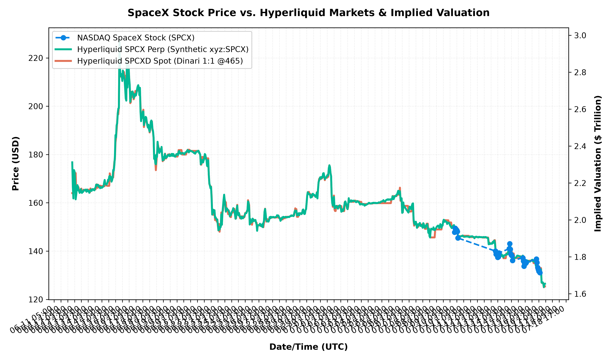

#+TITLE: SpaceX (SPCX) Stock and Hyperliquid Markets Comparison Report
#+DATE: [2026-07-17 Fri 12:25]
#+AUTHOR: Antigravity AI Pair Programmer
#+DESCRIPTION: Comparison of SpaceX NASDAQ stock against Hyperliquid synthetic perps (SPCX) and tokenized spot (SPCXD) markets.
#+OPTIONS: toc:nil num:nil

* Executive Summary
This report analyzes the price actions and market valuations of Space Exploration Technologies Corp. (SpaceX) assets since SpaceX debuted on the Nasdaq on June 12, 2026 (from 2026-06-12 13:00 UTC to 2026-07-17 04:25 UTC). It compares three primary instruments:
1. *NASDAQ SpaceX Stock (Ticker: SPCX)*: The officially traded equity on public markets following the IPO on June 12, 2026.
2. *Hyperliquid SPCX Perp (Ticker: xyz:SPCX / DEX: xyz)*: The synthetic perpetual future deployed via Hyperliquid's HIP-3 builder framework, trading 24/7 since May 2026.
3. *Hyperliquid SPCXD Spot (Ticker: SPCXD / Market: @465)*: Dinari's tokenized spot equity (dShare) traded on Hyperliquid's spot DEX, backed 1:1 by real stock.

Key Findings:
- *Latest Stock Price*: $131.03 (Implied Valuation: $1.714T)
- *Hyperliquid SPCX Perp Price*: $126.48 (Implied Valuation: $1.654T | Premium: -3.47%)
- *Hyperliquid SPCXD Spot Price*: $125.40 (Implied Valuation: $1.640T | Premium: -4.30%)
- *Trading Dynamics*: Hyperliquid assets trade 24/7, providing continuous price action, whereas public stock trading is confined to NASDAQ hours (09:30 - 16:00 EST). During the off-hours of June 15-16, the Hyperliquid assets showed significant upward pressure, indicating a bullish premium.

* Price Comparison Chart
The following chart displays the hourly price moves for the three assets alongside their implied market valuations.

* Comparative Pricing and Valuations Table
The table below logs the hourly prices and implied market capitalizations for the three assets since the Nasdaq IPO debut. Implied valuations are calculated using the pro-forma outstanding share count of *13.08 Billion shares*.

| Timestamp | NASDAQ Price | NASDAQ Market Cap | HL SPCX (Perp) | HL SPCX Valuation | HL SPCXD (Spot) | HL SPCXD Valuation |
|-----------+--------------+-------------------+----------------+-------------------+-----------------+--------------------|
| 2026-06-12 13:00 UTC | N/A | N/A | $176.76 | $2312.0B | N/A | N/A |
| 2026-06-12 14:00 UTC | N/A | N/A | $166.72 | $2180.7B | N/A | N/A |
| 2026-06-12 15:00 UTC | N/A | N/A | $161.80 | $2116.3B | $164.01 | $2145.3B |
| 2026-06-12 16:00 UTC | N/A | N/A | $173.55 | $2270.0B | $172.43 | $2255.4B |
| 2026-06-12 17:00 UTC | N/A | N/A | $173.00 | $2262.8B | $172.31 | $2253.8B |
| 2026-06-12 18:00 UTC | N/A | N/A | $168.78 | $2207.6B | $172.31 | $2253.8B |
| 2026-06-12 19:00 UTC | N/A | N/A | $161.43 | $2111.5B | $172.31 | $2253.8B |
| 2026-06-12 20:00 UTC | N/A | N/A | $163.40 | $2137.3B | $164.12 | $2146.7B |
| 2026-06-12 21:00 UTC | N/A | N/A | $165.49 | $2164.6B | $167.08 | $2185.4B |
| 2026-06-12 22:00 UTC | N/A | N/A | $167.32 | $2188.5B | $166.44 | $2177.0B |
| 2026-06-12 23:00 UTC | N/A | N/A | $166.72 | $2180.7B | $166.78 | $2181.5B |
| 2026-06-13 00:00 UTC | N/A | N/A | $165.10 | $2159.5B | $166.41 | $2176.6B |
| 2026-06-13 01:00 UTC | N/A | N/A | $164.91 | $2157.0B | $165.21 | $2160.9B |
| 2026-06-13 02:00 UTC | N/A | N/A | $164.10 | $2146.4B | $165.31 | $2162.3B |
| 2026-06-13 03:00 UTC | N/A | N/A | $164.45 | $2151.0B | $165.31 | $2162.3B |
| 2026-06-13 04:00 UTC | N/A | N/A | $165.66 | $2166.8B | $164.90 | $2156.9B |
| 2026-06-13 05:00 UTC | N/A | N/A | $164.51 | $2151.8B | $165.88 | $2169.7B |
| 2026-06-13 06:00 UTC | N/A | N/A | $164.08 | $2146.2B | $164.57 | $2152.6B |
| 2026-06-13 07:00 UTC | N/A | N/A | $164.65 | $2153.6B | $164.57 | $2152.6B |
| 2026-06-13 08:00 UTC | N/A | N/A | $164.50 | $2151.7B | $164.57 | $2152.6B |
| 2026-06-13 09:00 UTC | N/A | N/A | $165.18 | $2160.6B | $165.43 | $2163.8B |
| 2026-06-13 10:00 UTC | N/A | N/A | $165.15 | $2160.2B | $165.29 | $2162.0B |
| 2026-06-13 11:00 UTC | N/A | N/A | $165.16 | $2160.3B | $165.05 | $2158.9B |
| 2026-06-13 12:00 UTC | N/A | N/A | $165.47 | $2164.3B | $165.05 | $2158.9B |
| 2026-06-13 13:00 UTC | N/A | N/A | $165.18 | $2160.6B | $165.40 | $2163.4B |
| 2026-06-13 14:00 UTC | N/A | N/A | $164.57 | $2152.6B | $165.40 | $2163.4B |
| 2026-06-13 15:00 UTC | N/A | N/A | $165.50 | $2164.7B | $165.40 | $2163.4B |
| 2026-06-13 16:00 UTC | N/A | N/A | $165.18 | $2160.6B | $165.40 | $2163.4B |
| 2026-06-13 17:00 UTC | N/A | N/A | $164.72 | $2154.5B | $165.40 | $2163.4B |
| 2026-06-13 18:00 UTC | N/A | N/A | $164.95 | $2157.5B | $165.40 | $2163.4B |
| 2026-06-13 19:00 UTC | N/A | N/A | $164.14 | $2147.0B | $165.14 | $2160.0B |
| 2026-06-13 20:00 UTC | N/A | N/A | $164.86 | $2156.4B | $164.25 | $2148.4B |
| 2026-06-13 21:00 UTC | N/A | N/A | $165.01 | $2158.3B | $165.93 | $2170.4B |
| 2026-06-13 22:00 UTC | N/A | N/A | $165.48 | $2164.5B | $165.56 | $2165.5B |
| 2026-06-13 23:00 UTC | N/A | N/A | $164.91 | $2157.0B | $165.56 | $2165.5B |
| 2026-06-14 00:00 UTC | N/A | N/A | $165.36 | $2162.9B | $165.56 | $2165.5B |
| 2026-06-14 01:00 UTC | N/A | N/A | $165.69 | $2167.2B | $165.56 | $2165.5B |
| 2026-06-14 02:00 UTC | N/A | N/A | $165.63 | $2166.4B | $165.56 | $2165.5B |
| 2026-06-14 03:00 UTC | N/A | N/A | $165.23 | $2161.2B | $165.56 | $2165.5B |
| 2026-06-14 04:00 UTC | N/A | N/A | $165.17 | $2160.4B | $165.56 | $2165.5B |
| 2026-06-14 05:00 UTC | N/A | N/A | $165.96 | $2170.8B | $165.56 | $2165.5B |
| 2026-06-14 06:00 UTC | N/A | N/A | $166.37 | $2176.1B | $165.56 | $2165.5B |
| 2026-06-14 07:00 UTC | N/A | N/A | $167.51 | $2191.0B | $166.87 | $2182.7B |
| 2026-06-14 08:00 UTC | N/A | N/A | $167.47 | $2190.5B | $167.66 | $2193.0B |
| 2026-06-14 09:00 UTC | N/A | N/A | $167.10 | $2185.7B | $166.23 | $2174.3B |
| 2026-06-14 10:00 UTC | N/A | N/A | $167.50 | $2190.9B | $166.23 | $2174.3B |
| 2026-06-14 11:00 UTC | N/A | N/A | $167.30 | $2188.3B | $167.11 | $2185.8B |
| 2026-06-14 12:00 UTC | N/A | N/A | $166.57 | $2178.7B | $167.07 | $2185.3B |
| 2026-06-14 13:00 UTC | N/A | N/A | $166.79 | $2181.6B | $167.07 | $2185.3B |
| 2026-06-14 14:00 UTC | N/A | N/A | $166.03 | $2171.7B | $167.07 | $2185.3B |
| 2026-06-14 15:00 UTC | N/A | N/A | $166.55 | $2178.5B | $167.07 | $2185.3B |
| 2026-06-14 16:00 UTC | N/A | N/A | $166.45 | $2177.2B | $166.26 | $2174.7B |
| 2026-06-14 17:00 UTC | N/A | N/A | $166.17 | $2173.5B | $166.93 | $2183.4B |
| 2026-06-14 18:00 UTC | N/A | N/A | $166.42 | $2176.8B | $166.93 | $2183.4B |
| 2026-06-14 19:00 UTC | N/A | N/A | $166.77 | $2181.4B | $166.93 | $2183.4B |
| 2026-06-14 20:00 UTC | N/A | N/A | $166.71 | $2180.6B | $166.93 | $2183.4B |
| 2026-06-14 21:00 UTC | N/A | N/A | $168.28 | $2201.1B | $166.93 | $2183.4B |
| 2026-06-14 22:00 UTC | N/A | N/A | $169.45 | $2216.4B | $166.93 | $2183.4B |
| 2026-06-14 23:00 UTC | N/A | N/A | $167.94 | $2196.7B | $167.45 | $2190.2B |
| 2026-06-15 00:00 UTC | N/A | N/A | $167.76 | $2194.3B | $167.45 | $2190.2B |
| 2026-06-15 01:00 UTC | N/A | N/A | $167.49 | $2190.8B | $167.45 | $2190.2B |
| 2026-06-15 02:00 UTC | N/A | N/A | $167.81 | $2195.0B | $167.04 | $2184.9B |
| 2026-06-15 03:00 UTC | N/A | N/A | $168.49 | $2203.8B | $167.04 | $2184.9B |
| 2026-06-15 04:00 UTC | N/A | N/A | $169.57 | $2218.0B | $167.04 | $2184.9B |
| 2026-06-15 05:00 UTC | N/A | N/A | $169.08 | $2211.6B | $167.04 | $2184.9B |
| 2026-06-15 06:00 UTC | N/A | N/A | $170.87 | $2235.0B | $167.04 | $2184.9B |
| 2026-06-15 07:00 UTC | N/A | N/A | $171.14 | $2238.5B | $172.19 | $2252.2B |
| 2026-06-15 08:00 UTC | N/A | N/A | $170.07 | $2224.5B | $170.74 | $2233.3B |
| 2026-06-15 09:00 UTC | N/A | N/A | $170.68 | $2232.5B | $170.74 | $2233.3B |
| 2026-06-15 10:00 UTC | N/A | N/A | $168.75 | $2207.2B | $169.75 | $2220.3B |
| 2026-06-15 11:00 UTC | N/A | N/A | $169.32 | $2214.7B | $169.75 | $2220.3B |
| 2026-06-15 12:00 UTC | N/A | N/A | $170.44 | $2229.4B | $170.33 | $2227.9B |
| 2026-06-15 13:00 UTC | N/A | N/A | $173.60 | $2270.7B | $170.50 | $2230.1B |
| 2026-06-15 14:00 UTC | N/A | N/A | $173.32 | $2267.0B | $173.99 | $2275.8B |
| 2026-06-15 15:00 UTC | N/A | N/A | $175.80 | $2299.5B | $176.92 | $2314.1B |
| 2026-06-15 16:00 UTC | N/A | N/A | $179.23 | $2344.3B | $178.00 | $2328.2B |
| 2026-06-15 17:00 UTC | N/A | N/A | $188.04 | $2459.6B | $185.00 | $2419.8B |
| 2026-06-15 18:00 UTC | N/A | N/A | $187.12 | $2447.5B | $186.92 | $2444.9B |
| 2026-06-15 19:00 UTC | N/A | N/A | $192.07 | $2512.3B | $190.00 | $2485.2B |
| 2026-06-15 20:00 UTC | N/A | N/A | $192.90 | $2523.1B | $193.67 | $2533.2B |
| 2026-06-15 21:00 UTC | N/A | N/A | $197.10 | $2578.1B | $197.18 | $2579.1B |
| 2026-06-15 22:00 UTC | N/A | N/A | $199.04 | $2603.4B | $196.68 | $2572.6B |
| 2026-06-15 23:00 UTC | N/A | N/A | $199.18 | $2605.3B | $199.99 | $2615.9B |
| 2026-06-16 00:00 UTC | N/A | N/A | $227.43 | $2974.8B | $227.26 | $2972.6B |
| 2026-06-16 01:00 UTC | N/A | N/A | $215.07 | $2813.1B | $214.46 | $2805.1B |
| 2026-06-16 02:00 UTC | N/A | N/A | $212.49 | $2779.4B | $212.24 | $2776.1B |
| 2026-06-16 03:00 UTC | N/A | N/A | $213.35 | $2790.6B | $212.24 | $2776.1B |
| 2026-06-16 04:00 UTC | N/A | N/A | $212.41 | $2778.3B | $212.24 | $2776.1B |
| 2026-06-16 05:00 UTC | N/A | N/A | $210.45 | $2752.7B | $212.24 | $2776.1B |
| 2026-06-16 06:00 UTC | N/A | N/A | $214.78 | $2809.3B | $212.24 | $2776.1B |
| 2026-06-16 07:00 UTC | N/A | N/A | $213.06 | $2786.8B | $212.24 | $2776.1B |
| 2026-06-16 08:00 UTC | N/A | N/A | $212.13 | $2774.7B | $214.16 | $2801.2B |
| 2026-06-16 09:00 UTC | N/A | N/A | $210.98 | $2759.6B | $211.01 | $2760.0B |
| 2026-06-16 10:00 UTC | N/A | N/A | $207.29 | $2711.4B | $212.63 | $2781.2B |
| 2026-06-16 11:00 UTC | N/A | N/A | $203.24 | $2658.4B | $207.20 | $2710.2B |
| 2026-06-16 12:00 UTC | N/A | N/A | $202.31 | $2646.2B | $202.36 | $2646.9B |
| 2026-06-16 13:00 UTC | N/A | N/A | $218.53 | $2858.4B | $219.35 | $2869.1B |
| 2026-06-16 14:00 UTC | N/A | N/A | $207.72 | $2717.0B | $210.09 | $2748.0B |
| 2026-06-16 15:00 UTC | N/A | N/A | $211.19 | $2762.4B | $210.83 | $2757.7B |
| 2026-06-16 16:00 UTC | N/A | N/A | $216.94 | $2837.6B | $217.10 | $2839.7B |
| 2026-06-16 17:00 UTC | N/A | N/A | $211.66 | $2768.5B | $211.97 | $2772.6B |
| 2026-06-16 18:00 UTC | N/A | N/A | $208.72 | $2730.1B | $208.84 | $2731.6B |
| 2026-06-16 19:00 UTC | N/A | N/A | $201.81 | $2639.7B | $201.27 | $2632.6B |
| 2026-06-16 20:00 UTC | N/A | N/A | $203.55 | $2662.4B | $201.69 | $2638.1B |
| 2026-06-16 21:00 UTC | N/A | N/A | $205.52 | $2688.2B | $206.00 | $2694.5B |
| 2026-06-16 22:00 UTC | N/A | N/A | $205.87 | $2692.8B | $203.81 | $2665.8B |
| 2026-06-16 23:00 UTC | N/A | N/A | $206.11 | $2695.9B | $205.87 | $2692.8B |
| 2026-06-17 00:00 UTC | N/A | N/A | $204.87 | $2679.7B | $205.64 | $2689.8B |
| 2026-06-17 01:00 UTC | N/A | N/A | $203.37 | $2660.1B | $202.86 | $2653.4B |
| 2026-06-17 02:00 UTC | N/A | N/A | $204.13 | $2670.0B | $203.72 | $2664.7B |
| 2026-06-17 03:00 UTC | N/A | N/A | $205.01 | $2681.5B | $204.23 | $2671.3B |
| 2026-06-17 04:00 UTC | N/A | N/A | $204.36 | $2673.0B | $206.30 | $2698.4B |
| 2026-06-17 05:00 UTC | N/A | N/A | $204.45 | $2674.2B | $206.30 | $2698.4B |
| 2026-06-17 06:00 UTC | N/A | N/A | $205.60 | $2689.2B | $206.30 | $2698.4B |
| 2026-06-17 07:00 UTC | N/A | N/A | $207.08 | $2708.6B | $206.30 | $2698.4B |
| 2026-06-17 08:00 UTC | N/A | N/A | $208.19 | $2723.1B | $207.73 | $2717.1B |
| 2026-06-17 09:00 UTC | N/A | N/A | $208.71 | $2729.9B | $208.27 | $2724.2B |
| 2026-06-17 10:00 UTC | N/A | N/A | $207.59 | $2715.3B | $206.80 | $2704.9B |
| 2026-06-17 11:00 UTC | N/A | N/A | $204.58 | $2675.9B | $206.45 | $2700.4B |
| 2026-06-17 12:00 UTC | N/A | N/A | $207.62 | $2715.7B | $206.46 | $2700.5B |
| 2026-06-17 13:00 UTC | N/A | N/A | $197.73 | $2586.3B | $200.26 | $2619.4B |
| 2026-06-17 14:00 UTC | N/A | N/A | $193.80 | $2534.9B | $194.17 | $2539.7B |
| 2026-06-17 15:00 UTC | N/A | N/A | $195.94 | $2562.9B | $195.40 | $2555.8B |
| 2026-06-17 16:00 UTC | N/A | N/A | $195.29 | $2554.4B | $195.10 | $2551.9B |
| 2026-06-17 17:00 UTC | N/A | N/A | $197.82 | $2587.5B | $197.67 | $2585.5B |
| 2026-06-17 18:00 UTC | N/A | N/A | $197.69 | $2585.8B | $198.54 | $2596.9B |
| 2026-06-17 19:00 UTC | N/A | N/A | $192.19 | $2513.8B | $191.37 | $2503.1B |
| 2026-06-17 20:00 UTC | N/A | N/A | $193.90 | $2536.2B | $192.90 | $2523.1B |
| 2026-06-17 21:00 UTC | N/A | N/A | $194.13 | $2539.2B | $193.72 | $2533.9B |
| 2026-06-17 22:00 UTC | N/A | N/A | $195.60 | $2558.4B | $195.30 | $2554.5B |
| 2026-06-17 23:00 UTC | N/A | N/A | $195.29 | $2554.4B | $195.15 | $2552.6B |
| 2026-06-18 00:00 UTC | N/A | N/A | $193.46 | $2530.5B | $193.55 | $2531.6B |
| 2026-06-18 01:00 UTC | N/A | N/A | $191.99 | $2511.2B | $192.25 | $2514.6B |
| 2026-06-18 02:00 UTC | N/A | N/A | $191.14 | $2500.1B | $192.25 | $2514.6B |
| 2026-06-18 03:00 UTC | N/A | N/A | $192.34 | $2515.8B | $191.59 | $2506.0B |
| 2026-06-18 04:00 UTC | N/A | N/A | $190.37 | $2490.0B | $191.59 | $2506.0B |
| 2026-06-18 05:00 UTC | N/A | N/A | $189.48 | $2478.4B | $189.12 | $2473.7B |
| 2026-06-18 06:00 UTC | N/A | N/A | $190.66 | $2493.8B | $190.29 | $2489.0B |
| 2026-06-18 07:00 UTC | N/A | N/A | $193.49 | $2530.8B | $193.08 | $2525.5B |
| 2026-06-18 08:00 UTC | N/A | N/A | $194.08 | $2538.6B | $193.09 | $2525.6B |
| 2026-06-18 09:00 UTC | N/A | N/A | $193.49 | $2530.8B | $193.74 | $2534.1B |
| 2026-06-18 10:00 UTC | N/A | N/A | $190.69 | $2494.2B | $190.11 | $2486.6B |
| 2026-06-18 11:00 UTC | N/A | N/A | $189.65 | $2480.6B | $189.37 | $2477.0B |
| 2026-06-18 12:00 UTC | N/A | N/A | $187.02 | $2446.2B | $186.66 | $2441.5B |
| 2026-06-18 13:00 UTC | N/A | N/A | $178.18 | $2330.6B | $178.31 | $2332.3B |
| 2026-06-18 14:00 UTC | N/A | N/A | $179.63 | $2349.6B | $179.63 | $2349.6B |
| 2026-06-18 15:00 UTC | N/A | N/A | $176.37 | $2306.9B | $176.85 | $2313.2B |
| 2026-06-18 16:00 UTC | N/A | N/A | $175.98 | $2301.8B | $173.51 | $2269.5B |
| 2026-06-18 17:00 UTC | N/A | N/A | $179.96 | $2353.9B | $176.87 | $2313.5B |
| 2026-06-18 18:00 UTC | N/A | N/A | $178.98 | $2341.1B | $180.07 | $2355.3B |
| 2026-06-18 19:00 UTC | N/A | N/A | $185.27 | $2423.3B | $184.90 | $2418.5B |
| 2026-06-18 20:00 UTC | N/A | N/A | $182.62 | $2388.7B | $183.65 | $2402.1B |
| 2026-06-18 21:00 UTC | N/A | N/A | $182.69 | $2389.6B | $182.46 | $2386.6B |
| 2026-06-18 22:00 UTC | N/A | N/A | $180.64 | $2362.8B | $182.46 | $2386.6B |
| 2026-06-18 23:00 UTC | N/A | N/A | $181.76 | $2377.4B | $181.88 | $2379.0B |
| 2026-06-19 00:00 UTC | N/A | N/A | $181.20 | $2370.1B | $181.81 | $2378.1B |
| 2026-06-19 01:00 UTC | N/A | N/A | $181.83 | $2378.3B | $181.65 | $2376.0B |
| 2026-06-19 02:00 UTC | N/A | N/A | $183.15 | $2395.6B | $182.34 | $2385.0B |
| 2026-06-19 03:00 UTC | N/A | N/A | $179.66 | $2350.0B | $179.41 | $2346.7B |
| 2026-06-19 04:00 UTC | N/A | N/A | $177.55 | $2322.4B | $177.22 | $2318.0B |
| 2026-06-19 05:00 UTC | N/A | N/A | $178.87 | $2339.6B | $178.86 | $2339.5B |
| 2026-06-19 06:00 UTC | N/A | N/A | $177.84 | $2326.1B | $177.63 | $2323.4B |
| 2026-06-19 07:00 UTC | N/A | N/A | $179.21 | $2344.1B | $178.50 | $2334.8B |
| 2026-06-19 08:00 UTC | N/A | N/A | $180.22 | $2357.3B | $180.36 | $2359.1B |
| 2026-06-19 09:00 UTC | N/A | N/A | $178.59 | $2336.0B | $178.35 | $2332.8B |
| 2026-06-19 10:00 UTC | N/A | N/A | $179.20 | $2343.9B | $178.35 | $2332.8B |
| 2026-06-19 11:00 UTC | N/A | N/A | $178.76 | $2338.2B | $179.32 | $2345.5B |
| 2026-06-19 12:00 UTC | N/A | N/A | $179.17 | $2343.5B | $179.32 | $2345.5B |
| 2026-06-19 13:00 UTC | N/A | N/A | $179.71 | $2350.6B | $179.99 | $2354.3B |
| 2026-06-19 14:00 UTC | N/A | N/A | $179.56 | $2348.6B | $179.99 | $2354.3B |
| 2026-06-19 15:00 UTC | N/A | N/A | $180.00 | $2354.4B | $179.99 | $2354.3B |
| 2026-06-19 16:00 UTC | N/A | N/A | $179.32 | $2345.5B | $180.16 | $2356.5B |
| 2026-06-19 17:00 UTC | N/A | N/A | $179.71 | $2350.6B | $179.52 | $2348.1B |
| 2026-06-19 18:00 UTC | N/A | N/A | $179.40 | $2346.6B | $179.52 | $2348.1B |
| 2026-06-19 19:00 UTC | N/A | N/A | $180.06 | $2355.2B | $179.61 | $2349.3B |
| 2026-06-19 20:00 UTC | N/A | N/A | $180.26 | $2357.8B | $179.61 | $2349.3B |
| 2026-06-19 21:00 UTC | N/A | N/A | $179.43 | $2346.9B | $179.61 | $2349.3B |
| 2026-06-19 22:00 UTC | N/A | N/A | $180.22 | $2357.3B | $179.61 | $2349.3B |
| 2026-06-19 23:00 UTC | N/A | N/A | $180.15 | $2356.4B | $179.61 | $2349.3B |
| 2026-06-20 00:00 UTC | N/A | N/A | $179.28 | $2345.0B | $179.61 | $2349.3B |
| 2026-06-20 01:00 UTC | N/A | N/A | $179.23 | $2344.3B | $179.61 | $2349.3B |
| 2026-06-20 02:00 UTC | N/A | N/A | $179.08 | $2342.4B | $179.58 | $2348.9B |
| 2026-06-20 03:00 UTC | N/A | N/A | $179.42 | $2346.8B | $179.15 | $2343.3B |
| 2026-06-20 04:00 UTC | N/A | N/A | $180.12 | $2356.0B | $179.15 | $2343.3B |
| 2026-06-20 05:00 UTC | N/A | N/A | $180.18 | $2356.8B | $179.15 | $2343.3B |
| 2026-06-20 06:00 UTC | N/A | N/A | $180.24 | $2357.5B | $179.15 | $2343.3B |
| 2026-06-20 07:00 UTC | N/A | N/A | $179.81 | $2351.9B | $179.91 | $2353.2B |
| 2026-06-20 08:00 UTC | N/A | N/A | $181.15 | $2369.4B | $181.84 | $2378.5B |
| 2026-06-20 09:00 UTC | N/A | N/A | $181.45 | $2373.4B | $181.84 | $2378.5B |
| 2026-06-20 10:00 UTC | N/A | N/A | $180.91 | $2366.3B | $181.84 | $2378.5B |
| 2026-06-20 11:00 UTC | N/A | N/A | $180.31 | $2358.5B | $181.84 | $2378.5B |
| 2026-06-20 12:00 UTC | N/A | N/A | $180.58 | $2362.0B | $181.84 | $2378.5B |
| 2026-06-20 13:00 UTC | N/A | N/A | $180.28 | $2358.1B | $181.84 | $2378.5B |
| 2026-06-20 14:00 UTC | N/A | N/A | $180.62 | $2362.5B | $179.98 | $2354.1B |
| 2026-06-20 15:00 UTC | N/A | N/A | $180.60 | $2362.2B | $179.98 | $2354.1B |
| 2026-06-20 16:00 UTC | N/A | N/A | $180.59 | $2362.1B | $179.98 | $2354.1B |
| 2026-06-20 17:00 UTC | N/A | N/A | $180.25 | $2357.7B | $179.98 | $2354.1B |
| 2026-06-20 18:00 UTC | N/A | N/A | $180.08 | $2355.4B | $179.98 | $2354.1B |
| 2026-06-20 19:00 UTC | N/A | N/A | $180.50 | $2360.9B | $179.98 | $2354.1B |
| 2026-06-20 20:00 UTC | N/A | N/A | $180.89 | $2366.0B | $179.98 | $2354.1B |
| 2026-06-20 21:00 UTC | N/A | N/A | $180.86 | $2365.6B | $179.98 | $2354.1B |
| 2026-06-20 22:00 UTC | N/A | N/A | $181.18 | $2369.8B | $181.01 | $2367.6B |
| 2026-06-20 23:00 UTC | N/A | N/A | $181.62 | $2375.6B | $181.01 | $2367.6B |
| 2026-06-21 00:00 UTC | N/A | N/A | $181.85 | $2378.6B | $181.97 | $2380.2B |
| 2026-06-21 01:00 UTC | N/A | N/A | $181.15 | $2369.4B | $181.97 | $2380.2B |
| 2026-06-21 02:00 UTC | N/A | N/A | $180.86 | $2365.6B | $181.97 | $2380.2B |
| 2026-06-21 03:00 UTC | N/A | N/A | $181.52 | $2374.3B | $181.97 | $2380.2B |
| 2026-06-21 04:00 UTC | N/A | N/A | $181.39 | $2372.6B | $181.33 | $2371.8B |
| 2026-06-21 05:00 UTC | N/A | N/A | $181.56 | $2374.8B | $181.48 | $2373.8B |
| 2026-06-21 06:00 UTC | N/A | N/A | $181.42 | $2373.0B | $181.48 | $2373.8B |
| 2026-06-21 07:00 UTC | N/A | N/A | $181.36 | $2372.2B | $181.48 | $2373.8B |
| 2026-06-21 08:00 UTC | N/A | N/A | $181.13 | $2369.2B | $181.48 | $2373.8B |
| 2026-06-21 09:00 UTC | N/A | N/A | $181.14 | $2369.3B | $181.48 | $2373.8B |
| 2026-06-21 10:00 UTC | N/A | N/A | $180.88 | $2365.9B | $181.48 | $2373.8B |
| 2026-06-21 11:00 UTC | N/A | N/A | $180.61 | $2362.4B | $181.48 | $2373.8B |
| 2026-06-21 12:00 UTC | N/A | N/A | $180.70 | $2363.6B | $181.48 | $2373.8B |
| 2026-06-21 13:00 UTC | N/A | N/A | $180.33 | $2358.7B | $181.48 | $2373.8B |
| 2026-06-21 14:00 UTC | N/A | N/A | $180.70 | $2363.6B | $181.48 | $2373.8B |
| 2026-06-21 15:00 UTC | N/A | N/A | $181.23 | $2370.5B | $181.48 | $2373.8B |
| 2026-06-21 16:00 UTC | N/A | N/A | $181.16 | $2369.6B | $181.48 | $2373.8B |
| 2026-06-21 17:00 UTC | N/A | N/A | $181.24 | $2370.6B | $181.48 | $2373.8B |
| 2026-06-21 18:00 UTC | N/A | N/A | $181.50 | $2374.0B | $181.48 | $2373.8B |
| 2026-06-21 19:00 UTC | N/A | N/A | $181.56 | $2374.8B | $181.14 | $2369.3B |
| 2026-06-21 20:00 UTC | N/A | N/A | $180.63 | $2362.6B | $181.14 | $2369.3B |
| 2026-06-21 21:00 UTC | N/A | N/A | $180.55 | $2361.6B | $180.35 | $2359.0B |
| 2026-06-21 22:00 UTC | N/A | N/A | $179.85 | $2352.4B | $179.73 | $2350.9B |
| 2026-06-21 23:00 UTC | N/A | N/A | $175.91 | $2300.9B | $175.79 | $2299.3B |
| 2026-06-22 00:00 UTC | N/A | N/A | $177.66 | $2323.8B | $175.79 | $2299.3B |
| 2026-06-22 01:00 UTC | N/A | N/A | $177.75 | $2325.0B | $178.98 | $2341.1B |
| 2026-06-22 02:00 UTC | N/A | N/A | $176.65 | $2310.6B | $178.98 | $2341.1B |
| 2026-06-22 03:00 UTC | N/A | N/A | $176.73 | $2311.6B | $178.98 | $2341.1B |
| 2026-06-22 04:00 UTC | N/A | N/A | $177.62 | $2323.3B | $177.54 | $2322.2B |
| 2026-06-22 05:00 UTC | N/A | N/A | $178.65 | $2336.7B | $178.16 | $2330.3B |
| 2026-06-22 06:00 UTC | N/A | N/A | $180.19 | $2356.9B | $178.89 | $2339.9B |
| 2026-06-22 07:00 UTC | N/A | N/A | $179.90 | $2353.1B | $178.89 | $2339.9B |
| 2026-06-22 08:00 UTC | N/A | N/A | $178.36 | $2332.9B | $178.55 | $2335.4B |
| 2026-06-22 09:00 UTC | N/A | N/A | $177.68 | $2324.1B | $178.59 | $2336.0B |
| 2026-06-22 10:00 UTC | N/A | N/A | $175.28 | $2292.7B | $176.27 | $2305.6B |
| 2026-06-22 11:00 UTC | N/A | N/A | $176.35 | $2306.7B | $175.02 | $2289.3B |
| 2026-06-22 12:00 UTC | N/A | N/A | $177.62 | $2323.3B | $178.43 | $2333.9B |
| 2026-06-22 13:00 UTC | N/A | N/A | $171.71 | $2246.0B | $171.80 | $2247.1B |
| 2026-06-22 14:00 UTC | N/A | N/A | $168.05 | $2198.1B | $167.81 | $2195.0B |
| 2026-06-22 15:00 UTC | N/A | N/A | $167.10 | $2185.7B | $167.21 | $2187.1B |
| 2026-06-22 16:00 UTC | N/A | N/A | $166.00 | $2171.3B | $166.29 | $2175.1B |
| 2026-06-22 17:00 UTC | N/A | N/A | $166.59 | $2179.0B | $166.75 | $2181.1B |
| 2026-06-22 18:00 UTC | N/A | N/A | $161.64 | $2114.3B | $162.59 | $2126.7B |
| 2026-06-22 19:00 UTC | N/A | N/A | $155.11 | $2028.8B | $155.38 | $2032.4B |
| 2026-06-22 20:00 UTC | N/A | N/A | $155.99 | $2040.3B | $155.08 | $2028.4B |
| 2026-06-22 21:00 UTC | N/A | N/A | $157.14 | $2055.4B | $156.66 | $2049.1B |
| 2026-06-22 22:00 UTC | N/A | N/A | $156.13 | $2042.2B | $154.96 | $2026.9B |
| 2026-06-22 23:00 UTC | N/A | N/A | $156.87 | $2051.9B | $156.95 | $2052.9B |
| 2026-06-23 00:00 UTC | N/A | N/A | $153.90 | $2013.0B | $152.84 | $1999.1B |
| 2026-06-23 01:00 UTC | N/A | N/A | $154.00 | $2014.3B | $153.32 | $2005.4B |
| 2026-06-23 02:00 UTC | N/A | N/A | $153.44 | $2007.0B | $153.48 | $2007.5B |
| 2026-06-23 03:00 UTC | N/A | N/A | $152.91 | $2000.1B | $152.18 | $1990.5B |
| 2026-06-23 04:00 UTC | N/A | N/A | $153.01 | $2001.4B | $153.14 | $2003.1B |
| 2026-06-23 05:00 UTC | N/A | N/A | $150.84 | $1973.0B | $150.54 | $1969.1B |
| 2026-06-23 06:00 UTC | N/A | N/A | $148.60 | $1943.7B | $148.52 | $1942.6B |
| 2026-06-23 07:00 UTC | N/A | N/A | $149.95 | $1961.3B | $151.24 | $1978.2B |
| 2026-06-23 08:00 UTC | N/A | N/A | $148.92 | $1947.9B | $148.01 | $1936.0B |
| 2026-06-23 09:00 UTC | N/A | N/A | $149.97 | $1961.6B | $150.20 | $1964.6B |
| 2026-06-23 10:00 UTC | N/A | N/A | $149.97 | $1961.6B | $150.06 | $1962.8B |
| 2026-06-23 11:00 UTC | N/A | N/A | $155.19 | $2029.9B | $156.00 | $2040.5B |
| 2026-06-23 12:00 UTC | N/A | N/A | $150.90 | $1973.8B | $151.00 | $1975.1B |
| 2026-06-23 13:00 UTC | N/A | N/A | $155.82 | $2038.1B | $156.21 | $2043.2B |
| 2026-06-23 14:00 UTC | N/A | N/A | $158.39 | $2071.7B | $156.88 | $2052.0B |
| 2026-06-23 15:00 UTC | N/A | N/A | $161.28 | $2109.5B | $161.10 | $2107.2B |
| 2026-06-23 16:00 UTC | N/A | N/A | $163.35 | $2136.6B | $162.19 | $2121.4B |
| 2026-06-23 17:00 UTC | N/A | N/A | $161.19 | $2108.4B | $161.20 | $2108.5B |
| 2026-06-23 18:00 UTC | N/A | N/A | $158.72 | $2076.1B | $160.24 | $2095.9B |
| 2026-06-23 19:00 UTC | N/A | N/A | $156.31 | $2044.5B | $160.24 | $2095.9B |
| 2026-06-23 20:00 UTC | N/A | N/A | $157.24 | $2056.7B | $157.13 | $2055.3B |
| 2026-06-23 21:00 UTC | N/A | N/A | $157.69 | $2062.6B | $157.13 | $2055.3B |
| 2026-06-23 22:00 UTC | N/A | N/A | $157.20 | $2056.2B | $156.84 | $2051.5B |
| 2026-06-23 23:00 UTC | N/A | N/A | $156.98 | $2053.3B | $155.28 | $2031.1B |
| 2026-06-24 00:00 UTC | N/A | N/A | $156.60 | $2048.3B | $156.90 | $2052.3B |
| 2026-06-24 01:00 UTC | N/A | N/A | $156.00 | $2040.5B | $155.75 | $2037.2B |
| 2026-06-24 02:00 UTC | N/A | N/A | $154.44 | $2020.1B | $154.68 | $2023.2B |
| 2026-06-24 03:00 UTC | N/A | N/A | $155.08 | $2028.4B | $154.10 | $2015.6B |
| 2026-06-24 04:00 UTC | N/A | N/A | $154.98 | $2027.1B | $154.10 | $2015.6B |
| 2026-06-24 05:00 UTC | N/A | N/A | $156.02 | $2040.7B | $155.91 | $2039.3B |
| 2026-06-24 06:00 UTC | N/A | N/A | $156.47 | $2046.6B | $155.91 | $2039.3B |
| 2026-06-24 07:00 UTC | N/A | N/A | $156.80 | $2050.9B | $155.91 | $2039.3B |
| 2026-06-24 08:00 UTC | N/A | N/A | $157.77 | $2063.6B | $157.51 | $2060.2B |
| 2026-06-24 09:00 UTC | N/A | N/A | $157.07 | $2054.5B | $157.29 | $2057.4B |
| 2026-06-24 10:00 UTC | N/A | N/A | $156.75 | $2050.3B | $157.51 | $2060.2B |
| 2026-06-24 11:00 UTC | N/A | N/A | $155.23 | $2030.4B | $155.41 | $2032.8B |
| 2026-06-24 12:00 UTC | N/A | N/A | $153.40 | $2006.5B | $153.40 | $2006.5B |
| 2026-06-24 13:00 UTC | N/A | N/A | $154.32 | $2018.5B | $153.52 | $2008.0B |
| 2026-06-24 14:00 UTC | N/A | N/A | $157.29 | $2057.4B | $157.15 | $2055.5B |
| 2026-06-24 15:00 UTC | N/A | N/A | $158.80 | $2077.1B | $159.15 | $2081.7B |
| 2026-06-24 16:00 UTC | N/A | N/A | $156.09 | $2041.7B | $155.77 | $2037.5B |
| 2026-06-24 17:00 UTC | N/A | N/A | $154.83 | $2025.2B | $155.38 | $2032.4B |
| 2026-06-24 18:00 UTC | N/A | N/A | $155.76 | $2037.3B | $155.85 | $2038.5B |
| 2026-06-24 19:00 UTC | N/A | N/A | $154.58 | $2021.9B | $155.12 | $2029.0B |
| 2026-06-24 20:00 UTC | N/A | N/A | $154.07 | $2015.2B | $153.58 | $2008.8B |
| 2026-06-24 21:00 UTC | N/A | N/A | $154.19 | $2016.8B | $154.35 | $2018.9B |
| 2026-06-24 22:00 UTC | N/A | N/A | $153.41 | $2006.6B | $154.35 | $2018.9B |
| 2026-06-24 23:00 UTC | N/A | N/A | $154.27 | $2017.9B | $154.39 | $2019.4B |
| 2026-06-25 00:00 UTC | N/A | N/A | $153.78 | $2011.4B | $154.39 | $2019.4B |
| 2026-06-25 01:00 UTC | N/A | N/A | $153.56 | $2008.6B | $154.39 | $2019.4B |
| 2026-06-25 02:00 UTC | N/A | N/A | $154.04 | $2014.8B | $153.92 | $2013.3B |
| 2026-06-25 03:00 UTC | N/A | N/A | $154.17 | $2016.5B | $153.92 | $2013.3B |
| 2026-06-25 04:00 UTC | N/A | N/A | $154.76 | $2024.3B | $154.33 | $2018.6B |
| 2026-06-25 05:00 UTC | N/A | N/A | $155.49 | $2033.8B | $155.78 | $2037.6B |
| 2026-06-25 06:00 UTC | N/A | N/A | $155.73 | $2036.9B | $155.78 | $2037.6B |
| 2026-06-25 07:00 UTC | N/A | N/A | $155.71 | $2036.7B | $155.78 | $2037.6B |
| 2026-06-25 08:00 UTC | N/A | N/A | $156.30 | $2044.4B | $156.62 | $2048.6B |
| 2026-06-25 09:00 UTC | N/A | N/A | $157.07 | $2054.5B | $156.62 | $2048.6B |
| 2026-06-25 10:00 UTC | N/A | N/A | $160.54 | $2099.9B | $161.08 | $2106.9B |
| 2026-06-25 11:00 UTC | N/A | N/A | $160.02 | $2093.1B | $160.10 | $2094.1B |
| 2026-06-25 12:00 UTC | N/A | N/A | $157.70 | $2062.7B | $159.05 | $2080.4B |
| 2026-06-25 13:00 UTC | N/A | N/A | $151.00 | $1975.1B | $151.92 | $1987.1B |
| 2026-06-25 14:00 UTC | N/A | N/A | $153.27 | $2004.8B | $151.52 | $1981.9B |
| 2026-06-25 15:00 UTC | N/A | N/A | $152.23 | $1991.2B | $152.11 | $1989.6B |
| 2026-06-25 16:00 UTC | N/A | N/A | $151.79 | $1985.4B | $151.23 | $1978.1B |
| 2026-06-25 17:00 UTC | N/A | N/A | $152.17 | $1990.4B | $150.91 | $1973.9B |
| 2026-06-25 18:00 UTC | N/A | N/A | $153.45 | $2007.1B | $152.42 | $1993.7B |
| 2026-06-25 19:00 UTC | N/A | N/A | $153.11 | $2002.7B | $153.04 | $2001.8B |
| 2026-06-25 20:00 UTC | N/A | N/A | $152.41 | $1993.5B | $153.04 | $2001.8B |
| 2026-06-25 21:00 UTC | N/A | N/A | $152.71 | $1997.4B | $152.72 | $1997.6B |
| 2026-06-25 22:00 UTC | N/A | N/A | $152.59 | $1995.9B | $152.72 | $1997.6B |
| 2026-06-25 23:00 UTC | N/A | N/A | $152.90 | $1999.9B | $152.63 | $1996.4B |
| 2026-06-26 00:00 UTC | N/A | N/A | $151.85 | $1986.2B | $151.78 | $1985.3B |
| 2026-06-26 01:00 UTC | N/A | N/A | $151.02 | $1975.3B | $151.78 | $1985.3B |
| 2026-06-26 02:00 UTC | N/A | N/A | $148.40 | $1941.1B | $149.73 | $1958.5B |
| 2026-06-26 03:00 UTC | N/A | N/A | $150.66 | $1970.6B | $150.22 | $1964.9B |
| 2026-06-26 04:00 UTC | N/A | N/A | $150.71 | $1971.3B | $150.79 | $1972.3B |
| 2026-06-26 05:00 UTC | N/A | N/A | $150.67 | $1970.8B | $150.79 | $1972.3B |
| 2026-06-26 06:00 UTC | N/A | N/A | $150.73 | $1971.5B | $150.61 | $1970.0B |
| 2026-06-26 07:00 UTC | N/A | N/A | $151.33 | $1979.4B | $150.61 | $1970.0B |
| 2026-06-26 08:00 UTC | N/A | N/A | $150.67 | $1970.8B | $150.40 | $1967.2B |
| 2026-06-26 09:00 UTC | N/A | N/A | $150.44 | $1967.8B | $150.54 | $1969.1B |
| 2026-06-26 10:00 UTC | N/A | N/A | $150.20 | $1964.6B | $150.46 | $1968.0B |
| 2026-06-26 11:00 UTC | N/A | N/A | $151.16 | $1977.2B | $151.09 | $1976.3B |
| 2026-06-26 12:00 UTC | N/A | N/A | $149.91 | $1960.8B | $150.18 | $1964.4B |
| 2026-06-26 13:00 UTC | N/A | N/A | $151.69 | $1984.1B | $149.89 | $1960.6B |
| 2026-06-26 14:00 UTC | N/A | N/A | $152.39 | $1993.3B | $151.68 | $1984.0B |
| 2026-06-26 15:00 UTC | N/A | N/A | $156.26 | $2043.9B | $156.34 | $2044.9B |
| 2026-06-26 16:00 UTC | N/A | N/A | $157.43 | $2059.2B | $157.56 | $2060.9B |
| 2026-06-26 17:00 UTC | N/A | N/A | $155.37 | $2032.2B | $155.17 | $2029.6B |
| 2026-06-26 18:00 UTC | N/A | N/A | $153.00 | $2001.2B | $152.21 | $1990.9B |
| 2026-06-26 19:00 UTC | N/A | N/A | $152.53 | $1995.1B | $152.93 | $2000.3B |
| 2026-06-26 20:00 UTC | N/A | N/A | $152.25 | $1991.4B | $153.23 | $2004.2B |
| 2026-06-26 21:00 UTC | N/A | N/A | $152.38 | $1993.1B | $152.56 | $1995.5B |
| 2026-06-26 22:00 UTC | N/A | N/A | $152.20 | $1990.8B | $152.30 | $1992.1B |
| 2026-06-26 23:00 UTC | N/A | N/A | $152.87 | $1999.5B | $153.28 | $2004.9B |
| 2026-06-27 00:00 UTC | N/A | N/A | $154.05 | $2015.0B | $153.55 | $2008.4B |
| 2026-06-27 01:00 UTC | N/A | N/A | $153.59 | $2009.0B | $153.65 | $2009.7B |
| 2026-06-27 02:00 UTC | N/A | N/A | $154.21 | $2017.1B | $153.66 | $2009.9B |
| 2026-06-27 03:00 UTC | N/A | N/A | $154.11 | $2015.8B | $154.14 | $2016.2B |
| 2026-06-27 04:00 UTC | N/A | N/A | $153.89 | $2012.9B | $154.01 | $2014.5B |
| 2026-06-27 05:00 UTC | N/A | N/A | $153.95 | $2013.7B | $154.01 | $2014.5B |
| 2026-06-27 06:00 UTC | N/A | N/A | $154.18 | $2016.7B | $153.95 | $2013.7B |
| 2026-06-27 07:00 UTC | N/A | N/A | $154.03 | $2014.7B | $154.02 | $2014.6B |
| 2026-06-27 08:00 UTC | N/A | N/A | $154.04 | $2014.8B | $153.86 | $2012.5B |
| 2026-06-27 09:00 UTC | N/A | N/A | $153.95 | $2013.7B | $153.86 | $2012.5B |
| 2026-06-27 10:00 UTC | N/A | N/A | $154.09 | $2015.5B | $153.86 | $2012.5B |
| 2026-06-27 11:00 UTC | N/A | N/A | $154.04 | $2014.8B | $153.94 | $2013.5B |
| 2026-06-27 12:00 UTC | N/A | N/A | $154.22 | $2017.2B | $153.94 | $2013.5B |
| 2026-06-27 13:00 UTC | N/A | N/A | $154.84 | $2025.3B | $153.94 | $2013.5B |
| 2026-06-27 14:00 UTC | N/A | N/A | $154.56 | $2021.6B | $153.94 | $2013.5B |
| 2026-06-27 15:00 UTC | N/A | N/A | $154.78 | $2024.5B | $153.94 | $2013.5B |
| 2026-06-27 16:00 UTC | N/A | N/A | $154.43 | $2019.9B | $154.29 | $2018.1B |
| 2026-06-27 17:00 UTC | N/A | N/A | $153.64 | $2009.6B | $153.57 | $2008.7B |
| 2026-06-27 18:00 UTC | N/A | N/A | $153.63 | $2009.5B | $153.57 | $2008.7B |
| 2026-06-27 19:00 UTC | N/A | N/A | $152.53 | $1995.1B | $153.57 | $2008.7B |
| 2026-06-27 20:00 UTC | N/A | N/A | $152.94 | $2000.5B | $153.57 | $2008.7B |
| 2026-06-27 21:00 UTC | N/A | N/A | $153.15 | $2003.2B | $153.02 | $2001.5B |
| 2026-06-27 22:00 UTC | N/A | N/A | $153.97 | $2013.9B | $153.13 | $2002.9B |
| 2026-06-27 23:00 UTC | N/A | N/A | $153.68 | $2010.1B | $153.13 | $2002.9B |
| 2026-06-28 00:00 UTC | N/A | N/A | $154.18 | $2016.7B | $153.60 | $2009.1B |
| 2026-06-28 01:00 UTC | N/A | N/A | $154.11 | $2015.8B | $153.60 | $2009.1B |
| 2026-06-28 02:00 UTC | N/A | N/A | $153.98 | $2014.1B | $153.60 | $2009.1B |
| 2026-06-28 03:00 UTC | N/A | N/A | $154.05 | $2015.0B | $153.60 | $2009.1B |
| 2026-06-28 04:00 UTC | N/A | N/A | $154.16 | $2016.4B | $154.20 | $2016.9B |
| 2026-06-28 05:00 UTC | N/A | N/A | $154.05 | $2015.0B | $154.20 | $2016.9B |
| 2026-06-28 06:00 UTC | N/A | N/A | $153.88 | $2012.8B | $154.20 | $2016.9B |
| 2026-06-28 07:00 UTC | N/A | N/A | $154.10 | $2015.6B | $154.20 | $2016.9B |
| 2026-06-28 08:00 UTC | N/A | N/A | $154.10 | $2015.6B | $154.20 | $2016.9B |
| 2026-06-28 09:00 UTC | N/A | N/A | $154.20 | $2016.9B | $154.20 | $2016.9B |
| 2026-06-28 10:00 UTC | N/A | N/A | $154.06 | $2015.1B | $154.20 | $2016.9B |
| 2026-06-28 11:00 UTC | N/A | N/A | $154.27 | $2017.9B | $154.20 | $2016.9B |
| 2026-06-28 12:00 UTC | N/A | N/A | $154.41 | $2019.7B | $154.46 | $2020.3B |
| 2026-06-28 13:00 UTC | N/A | N/A | $154.49 | $2020.7B | $154.46 | $2020.3B |
| 2026-06-28 14:00 UTC | N/A | N/A | $154.81 | $2024.9B | $154.68 | $2023.2B |
| 2026-06-28 15:00 UTC | N/A | N/A | $154.55 | $2021.5B | $154.68 | $2023.2B |
| 2026-06-28 16:00 UTC | N/A | N/A | $154.61 | $2022.3B | $154.68 | $2023.2B |
| 2026-06-28 17:00 UTC | N/A | N/A | $154.72 | $2023.7B | $154.81 | $2024.9B |
| 2026-06-28 18:00 UTC | N/A | N/A | $154.49 | $2020.7B | $154.81 | $2024.9B |
| 2026-06-28 19:00 UTC | N/A | N/A | $155.36 | $2032.1B | $154.81 | $2024.9B |
| 2026-06-28 20:00 UTC | N/A | N/A | $156.48 | $2046.8B | $156.03 | $2040.9B |
| 2026-06-28 21:00 UTC | N/A | N/A | $156.83 | $2051.3B | $157.71 | $2062.8B |
| 2026-06-28 22:00 UTC | N/A | N/A | $156.19 | $2043.0B | $156.25 | $2043.8B |
| 2026-06-28 23:00 UTC | N/A | N/A | $156.66 | $2049.1B | $157.39 | $2058.7B |
| 2026-06-29 00:00 UTC | N/A | N/A | $154.77 | $2024.4B | $154.20 | $2016.9B |
| 2026-06-29 01:00 UTC | N/A | N/A | $154.87 | $2025.7B | $154.20 | $2016.9B |
| 2026-06-29 02:00 UTC | N/A | N/A | $155.10 | $2028.7B | $154.20 | $2016.9B |
| 2026-06-29 03:00 UTC | N/A | N/A | $155.69 | $2036.4B | $155.35 | $2032.0B |
| 2026-06-29 04:00 UTC | N/A | N/A | $154.84 | $2025.3B | $155.35 | $2032.0B |
| 2026-06-29 05:00 UTC | N/A | N/A | $155.71 | $2036.7B | $155.35 | $2032.0B |
| 2026-06-29 06:00 UTC | N/A | N/A | $155.48 | $2033.7B | $155.58 | $2035.0B |
| 2026-06-29 07:00 UTC | N/A | N/A | $155.67 | $2036.2B | $155.70 | $2036.6B |
| 2026-06-29 08:00 UTC | N/A | N/A | $155.33 | $2031.7B | $155.28 | $2031.1B |
| 2026-06-29 09:00 UTC | N/A | N/A | $155.64 | $2035.8B | $155.63 | $2035.6B |
| 2026-06-29 10:00 UTC | N/A | N/A | $156.95 | $2052.9B | $157.02 | $2053.8B |
| 2026-06-29 11:00 UTC | N/A | N/A | $157.24 | $2056.7B | $157.07 | $2054.5B |
| 2026-06-29 12:00 UTC | N/A | N/A | $155.94 | $2039.7B | $155.93 | $2039.6B |
| 2026-06-29 13:00 UTC | N/A | N/A | $155.34 | $2031.8B | $155.48 | $2033.7B |
| 2026-06-29 14:00 UTC | N/A | N/A | $155.46 | $2033.4B | $155.75 | $2037.2B |
| 2026-06-29 15:00 UTC | N/A | N/A | $156.91 | $2052.4B | $156.90 | $2052.3B |
| 2026-06-29 16:00 UTC | N/A | N/A | $157.36 | $2058.3B | $157.37 | $2058.4B |
| 2026-06-29 17:00 UTC | N/A | N/A | $160.05 | $2093.5B | $160.03 | $2093.2B |
| 2026-06-29 18:00 UTC | N/A | N/A | $162.94 | $2131.3B | $163.03 | $2132.4B |
| 2026-06-29 19:00 UTC | N/A | N/A | $164.36 | $2149.8B | $164.43 | $2150.7B |
| 2026-06-29 20:00 UTC | N/A | N/A | $163.97 | $2144.7B | $164.08 | $2146.2B |
| 2026-06-29 21:00 UTC | N/A | N/A | $163.71 | $2141.3B | $164.53 | $2152.1B |
| 2026-06-29 22:00 UTC | N/A | N/A | $163.42 | $2137.5B | $163.65 | $2140.5B |
| 2026-06-29 23:00 UTC | N/A | N/A | $163.45 | $2137.9B | $163.58 | $2139.6B |
| 2026-06-30 00:00 UTC | N/A | N/A | $162.13 | $2120.7B | $163.58 | $2139.6B |
| 2026-06-30 01:00 UTC | N/A | N/A | $162.92 | $2131.0B | $162.60 | $2126.8B |
| 2026-06-30 02:00 UTC | N/A | N/A | $162.32 | $2123.1B | $162.54 | $2126.0B |
| 2026-06-30 03:00 UTC | N/A | N/A | $163.56 | $2139.4B | $162.61 | $2126.9B |
| 2026-06-30 04:00 UTC | N/A | N/A | $163.74 | $2141.7B | $163.68 | $2140.9B |
| 2026-06-30 05:00 UTC | N/A | N/A | $163.22 | $2134.9B | $163.15 | $2134.0B |
| 2026-06-30 06:00 UTC | N/A | N/A | $163.35 | $2136.6B | $163.32 | $2136.2B |
| 2026-06-30 07:00 UTC | N/A | N/A | $163.07 | $2133.0B | $163.06 | $2132.8B |
| 2026-06-30 08:00 UTC | N/A | N/A | $162.63 | $2127.2B | $162.91 | $2130.9B |
| 2026-06-30 09:00 UTC | N/A | N/A | $162.41 | $2124.3B | $162.91 | $2130.9B |
| 2026-06-30 10:00 UTC | N/A | N/A | $163.20 | $2134.7B | $162.91 | $2130.9B |
| 2026-06-30 11:00 UTC | N/A | N/A | $164.19 | $2147.6B | $164.38 | $2150.1B |
| 2026-06-30 12:00 UTC | N/A | N/A | $161.81 | $2116.5B | $162.08 | $2120.0B |
| 2026-06-30 13:00 UTC | N/A | N/A | $165.44 | $2164.0B | $165.51 | $2164.9B |
| 2026-06-30 14:00 UTC | N/A | N/A | $168.50 | $2204.0B | $168.41 | $2202.8B |
| 2026-06-30 15:00 UTC | N/A | N/A | $169.31 | $2214.6B | $169.87 | $2221.9B |
| 2026-06-30 16:00 UTC | N/A | N/A | $170.06 | $2224.4B | $170.21 | $2226.3B |
| 2026-06-30 17:00 UTC | N/A | N/A | $170.60 | $2231.4B | $170.56 | $2230.9B |
| 2026-06-30 18:00 UTC | N/A | N/A | $169.97 | $2223.2B | $169.79 | $2220.9B |
| 2026-06-30 19:00 UTC | N/A | N/A | $170.70 | $2232.8B | $170.49 | $2230.0B |
| 2026-06-30 20:00 UTC | N/A | N/A | $170.33 | $2227.9B | $170.11 | $2225.0B |
| 2026-06-30 21:00 UTC | N/A | N/A | $170.67 | $2232.4B | $170.59 | $2231.3B |
| 2026-06-30 22:00 UTC | N/A | N/A | $172.16 | $2251.9B | $170.59 | $2231.3B |
| 2026-06-30 23:00 UTC | N/A | N/A | $172.28 | $2253.4B | $172.11 | $2251.2B |
| 2026-07-01 00:00 UTC | N/A | N/A | $171.05 | $2237.3B | $170.66 | $2232.2B |
| 2026-07-01 01:00 UTC | N/A | N/A | $169.82 | $2221.2B | $169.37 | $2215.4B |
| 2026-07-01 02:00 UTC | N/A | N/A | $170.07 | $2224.5B | $170.38 | $2228.6B |
| 2026-07-01 03:00 UTC | N/A | N/A | $170.58 | $2231.2B | $170.38 | $2228.6B |
| 2026-07-01 04:00 UTC | N/A | N/A | $170.58 | $2231.2B | $170.38 | $2228.6B |
| 2026-07-01 05:00 UTC | N/A | N/A | $171.33 | $2241.0B | $170.38 | $2228.6B |
| 2026-07-01 06:00 UTC | N/A | N/A | $171.18 | $2239.0B | $171.70 | $2245.8B |
| 2026-07-01 07:00 UTC | N/A | N/A | $171.44 | $2242.4B | $170.75 | $2233.4B |
| 2026-07-01 08:00 UTC | N/A | N/A | $174.35 | $2280.5B | $173.99 | $2275.8B |
| 2026-07-01 09:00 UTC | N/A | N/A | $175.52 | $2295.8B | $175.55 | $2296.2B |
| 2026-07-01 10:00 UTC | N/A | N/A | $174.85 | $2287.0B | $174.71 | $2285.2B |
| 2026-07-01 11:00 UTC | N/A | N/A | $172.18 | $2252.1B | $172.41 | $2255.1B |
| 2026-07-01 12:00 UTC | N/A | N/A | $171.08 | $2237.7B | $171.00 | $2236.7B |
| 2026-07-01 13:00 UTC | N/A | N/A | $162.91 | $2130.9B | $162.76 | $2128.9B |
| 2026-07-01 14:00 UTC | N/A | N/A | $159.86 | $2091.0B | $160.46 | $2098.8B |
| 2026-07-01 15:00 UTC | N/A | N/A | $158.84 | $2077.6B | $158.33 | $2071.0B |
| 2026-07-01 16:00 UTC | N/A | N/A | $160.12 | $2094.4B | $160.45 | $2098.7B |
| 2026-07-01 17:00 UTC | N/A | N/A | $162.42 | $2124.5B | $163.01 | $2132.2B |
| 2026-07-01 18:00 UTC | N/A | N/A | $157.85 | $2064.7B | $157.16 | $2055.7B |
| 2026-07-01 19:00 UTC | N/A | N/A | $157.79 | $2063.9B | $156.60 | $2048.3B |
| 2026-07-01 20:00 UTC | N/A | N/A | $158.30 | $2070.6B | $156.60 | $2048.3B |
| 2026-07-01 21:00 UTC | N/A | N/A | $158.73 | $2076.2B | $158.47 | $2072.8B |
| 2026-07-01 22:00 UTC | N/A | N/A | $158.49 | $2073.0B | $158.72 | $2076.1B |
| 2026-07-01 23:00 UTC | N/A | N/A | $157.94 | $2065.9B | $158.72 | $2076.1B |
| 2026-07-02 00:00 UTC | N/A | N/A | $157.57 | $2061.0B | $158.72 | $2076.1B |
| 2026-07-02 01:00 UTC | N/A | N/A | $158.47 | $2072.8B | $157.97 | $2066.2B |
| 2026-07-02 02:00 UTC | N/A | N/A | $158.73 | $2076.2B | $157.97 | $2066.2B |
| 2026-07-02 03:00 UTC | N/A | N/A | $158.93 | $2078.8B | $158.64 | $2075.0B |
| 2026-07-02 04:00 UTC | N/A | N/A | $158.81 | $2077.2B | $158.64 | $2075.0B |
| 2026-07-02 05:00 UTC | N/A | N/A | $157.75 | $2063.4B | $158.64 | $2075.0B |
| 2026-07-02 06:00 UTC | N/A | N/A | $156.30 | $2044.4B | $158.64 | $2075.0B |
| 2026-07-02 07:00 UTC | N/A | N/A | $156.51 | $2047.2B | $156.52 | $2047.3B |
| 2026-07-02 08:00 UTC | N/A | N/A | $157.27 | $2057.1B | $156.52 | $2047.3B |
| 2026-07-02 09:00 UTC | N/A | N/A | $156.63 | $2048.7B | $156.57 | $2047.9B |
| 2026-07-02 10:00 UTC | N/A | N/A | $157.01 | $2053.7B | $156.57 | $2047.9B |
| 2026-07-02 11:00 UTC | N/A | N/A | $158.65 | $2075.1B | $156.57 | $2047.9B |
| 2026-07-02 12:00 UTC | N/A | N/A | $160.00 | $2092.8B | $160.31 | $2096.9B |
| 2026-07-02 13:00 UTC | N/A | N/A | $160.56 | $2100.1B | $160.53 | $2099.7B |
| 2026-07-02 14:00 UTC | N/A | N/A | $159.93 | $2091.9B | $158.87 | $2078.0B |
| 2026-07-02 15:00 UTC | N/A | N/A | $159.20 | $2082.3B | $159.37 | $2084.6B |
| 2026-07-02 16:00 UTC | N/A | N/A | $157.75 | $2063.4B | $159.01 | $2079.9B |
| 2026-07-02 17:00 UTC | N/A | N/A | $157.39 | $2058.7B | $157.33 | $2057.9B |
| 2026-07-02 18:00 UTC | N/A | N/A | $159.05 | $2080.4B | $158.34 | $2071.1B |
| 2026-07-02 19:00 UTC | N/A | N/A | $161.91 | $2117.8B | $161.66 | $2114.5B |
| 2026-07-02 20:00 UTC | N/A | N/A | $160.30 | $2096.7B | $160.43 | $2098.4B |
| 2026-07-02 21:00 UTC | N/A | N/A | $160.51 | $2099.5B | $160.43 | $2098.4B |
| 2026-07-02 22:00 UTC | N/A | N/A | $160.67 | $2101.6B | $160.43 | $2098.4B |
| 2026-07-02 23:00 UTC | N/A | N/A | $161.03 | $2106.3B | $160.43 | $2098.4B |
| 2026-07-03 00:00 UTC | N/A | N/A | $160.47 | $2098.9B | $160.43 | $2098.4B |
| 2026-07-03 01:00 UTC | N/A | N/A | $160.88 | $2104.3B | $160.43 | $2098.4B |
| 2026-07-03 02:00 UTC | N/A | N/A | $160.79 | $2103.1B | $160.43 | $2098.4B |
| 2026-07-03 03:00 UTC | N/A | N/A | $160.80 | $2103.3B | $160.43 | $2098.4B |
| 2026-07-03 04:00 UTC | N/A | N/A | $160.91 | $2104.7B | $160.43 | $2098.4B |
| 2026-07-03 05:00 UTC | N/A | N/A | $160.69 | $2101.8B | $160.90 | $2104.6B |
| 2026-07-03 06:00 UTC | N/A | N/A | $160.65 | $2101.3B | $160.90 | $2104.6B |
| 2026-07-03 07:00 UTC | N/A | N/A | $160.54 | $2099.9B | $160.90 | $2104.6B |
| 2026-07-03 08:00 UTC | N/A | N/A | $160.23 | $2095.8B | $160.59 | $2100.5B |
| 2026-07-03 09:00 UTC | N/A | N/A | $160.43 | $2098.4B | $160.59 | $2100.5B |
| 2026-07-03 10:00 UTC | N/A | N/A | $160.74 | $2102.5B | $160.59 | $2100.5B |
| 2026-07-03 11:00 UTC | N/A | N/A | $160.59 | $2100.5B | $160.59 | $2100.5B |
| 2026-07-03 12:00 UTC | N/A | N/A | $160.27 | $2096.3B | $160.59 | $2100.5B |
| 2026-07-03 13:00 UTC | N/A | N/A | $160.32 | $2097.0B | $160.59 | $2100.5B |
| 2026-07-03 14:00 UTC | N/A | N/A | $159.72 | $2089.1B | $160.39 | $2097.9B |
| 2026-07-03 15:00 UTC | N/A | N/A | $159.26 | $2083.1B | $160.39 | $2097.9B |
| 2026-07-03 16:00 UTC | N/A | N/A | $159.41 | $2085.1B | $160.39 | $2097.9B |
| 2026-07-03 17:00 UTC | N/A | N/A | $159.62 | $2087.8B | $160.39 | $2097.9B |
| 2026-07-03 18:00 UTC | N/A | N/A | $159.53 | $2086.7B | $159.48 | $2086.0B |
| 2026-07-03 19:00 UTC | N/A | N/A | $159.23 | $2082.7B | $159.48 | $2086.0B |
| 2026-07-03 20:00 UTC | N/A | N/A | $159.43 | $2085.3B | $159.48 | $2086.0B |
| 2026-07-03 21:00 UTC | N/A | N/A | $159.48 | $2086.0B | $159.48 | $2086.0B |
| 2026-07-03 22:00 UTC | N/A | N/A | $159.08 | $2080.8B | $159.48 | $2086.0B |
| 2026-07-03 23:00 UTC | N/A | N/A | $158.80 | $2077.1B | $159.48 | $2086.0B |
| 2026-07-04 00:00 UTC | N/A | N/A | $159.22 | $2082.6B | $159.48 | $2086.0B |
| 2026-07-04 01:00 UTC | N/A | N/A | $159.07 | $2080.6B | $159.48 | $2086.0B |
| 2026-07-04 02:00 UTC | N/A | N/A | $159.23 | $2082.7B | $159.48 | $2086.0B |
| 2026-07-04 03:00 UTC | N/A | N/A | $159.33 | $2084.0B | $159.48 | $2086.0B |
| 2026-07-04 04:00 UTC | N/A | N/A | $159.56 | $2087.0B | $159.45 | $2085.6B |
| 2026-07-04 05:00 UTC | N/A | N/A | $159.62 | $2087.8B | $159.70 | $2088.9B |
| 2026-07-04 06:00 UTC | N/A | N/A | $159.93 | $2091.9B | $159.70 | $2088.9B |
| 2026-07-04 07:00 UTC | N/A | N/A | $159.98 | $2092.5B | $159.70 | $2088.9B |
| 2026-07-04 08:00 UTC | N/A | N/A | $159.79 | $2090.1B | $159.70 | $2088.9B |
| 2026-07-04 09:00 UTC | N/A | N/A | $159.76 | $2089.7B | $159.70 | $2088.9B |
| 2026-07-04 10:00 UTC | N/A | N/A | $159.66 | $2088.4B | $159.70 | $2088.9B |
| 2026-07-04 11:00 UTC | N/A | N/A | $159.77 | $2089.8B | $159.70 | $2088.9B |
| 2026-07-04 12:00 UTC | N/A | N/A | $159.90 | $2091.5B | $159.70 | $2088.9B |
| 2026-07-04 13:00 UTC | N/A | N/A | $159.83 | $2090.6B | $159.70 | $2088.9B |
| 2026-07-04 14:00 UTC | N/A | N/A | $160.00 | $2092.8B | $159.86 | $2091.0B |
| 2026-07-04 15:00 UTC | N/A | N/A | $160.00 | $2092.8B | $159.86 | $2091.0B |
| 2026-07-04 16:00 UTC | N/A | N/A | $159.89 | $2091.4B | $159.86 | $2091.0B |
| 2026-07-04 17:00 UTC | N/A | N/A | $159.99 | $2092.7B | $159.86 | $2091.0B |
| 2026-07-04 18:00 UTC | N/A | N/A | $159.87 | $2091.1B | $159.86 | $2091.0B |
| 2026-07-04 19:00 UTC | N/A | N/A | $159.96 | $2092.3B | $159.86 | $2091.0B |
| 2026-07-04 20:00 UTC | N/A | N/A | $159.84 | $2090.7B | $159.86 | $2091.0B |
| 2026-07-04 21:00 UTC | N/A | N/A | $159.87 | $2091.1B | $159.86 | $2091.0B |
| 2026-07-04 22:00 UTC | N/A | N/A | $159.96 | $2092.3B | $159.86 | $2091.0B |
| 2026-07-04 23:00 UTC | N/A | N/A | $159.98 | $2092.5B | $159.86 | $2091.0B |
| 2026-07-05 00:00 UTC | N/A | N/A | $160.20 | $2095.4B | $159.86 | $2091.0B |
| 2026-07-05 01:00 UTC | N/A | N/A | $160.12 | $2094.4B | $159.86 | $2091.0B |
| 2026-07-05 02:00 UTC | N/A | N/A | $160.08 | $2093.8B | $159.86 | $2091.0B |
| 2026-07-05 03:00 UTC | N/A | N/A | $160.23 | $2095.8B | $159.86 | $2091.0B |
| 2026-07-05 04:00 UTC | N/A | N/A | $160.54 | $2099.9B | $159.86 | $2091.0B |
| 2026-07-05 05:00 UTC | N/A | N/A | $160.58 | $2100.4B | $159.86 | $2091.0B |
| 2026-07-05 06:00 UTC | N/A | N/A | $160.52 | $2099.6B | $159.86 | $2091.0B |
| 2026-07-05 07:00 UTC | N/A | N/A | $160.75 | $2102.6B | $159.86 | $2091.0B |
| 2026-07-05 08:00 UTC | N/A | N/A | $161.09 | $2107.1B | $159.86 | $2091.0B |
| 2026-07-05 09:00 UTC | N/A | N/A | $160.64 | $2101.2B | $159.86 | $2091.0B |
| 2026-07-05 10:00 UTC | N/A | N/A | $160.56 | $2100.1B | $159.86 | $2091.0B |
| 2026-07-05 11:00 UTC | N/A | N/A | $160.46 | $2098.8B | $159.86 | $2091.0B |
| 2026-07-05 12:00 UTC | N/A | N/A | $160.92 | $2104.8B | $159.86 | $2091.0B |
| 2026-07-05 13:00 UTC | N/A | N/A | $161.16 | $2108.0B | $159.86 | $2091.0B |
| 2026-07-05 14:00 UTC | N/A | N/A | $161.31 | $2109.9B | $159.86 | $2091.0B |
| 2026-07-05 15:00 UTC | N/A | N/A | $161.23 | $2108.9B | $159.86 | $2091.0B |
| 2026-07-05 16:00 UTC | N/A | N/A | $161.48 | $2112.2B | $159.86 | $2091.0B |
| 2026-07-05 17:00 UTC | N/A | N/A | $161.23 | $2108.9B | $159.86 | $2091.0B |
| 2026-07-05 18:00 UTC | N/A | N/A | $161.36 | $2110.6B | $159.86 | $2091.0B |
| 2026-07-05 19:00 UTC | N/A | N/A | $161.42 | $2111.4B | $159.86 | $2091.0B |
| 2026-07-05 20:00 UTC | N/A | N/A | $161.23 | $2108.9B | $159.86 | $2091.0B |
| 2026-07-05 21:00 UTC | N/A | N/A | $161.50 | $2112.4B | $159.86 | $2091.0B |
| 2026-07-05 22:00 UTC | N/A | N/A | $161.41 | $2111.2B | $161.40 | $2111.1B |
| 2026-07-05 23:00 UTC | N/A | N/A | $161.34 | $2110.3B | $161.40 | $2111.1B |
| 2026-07-06 00:00 UTC | N/A | N/A | $162.69 | $2128.0B | $162.78 | $2129.2B |
| 2026-07-06 01:00 UTC | N/A | N/A | $161.98 | $2118.7B | $162.78 | $2129.2B |
| 2026-07-06 02:00 UTC | N/A | N/A | $161.52 | $2112.7B | $162.78 | $2129.2B |
| 2026-07-06 03:00 UTC | N/A | N/A | $162.22 | $2121.8B | $162.78 | $2129.2B |
| 2026-07-06 04:00 UTC | N/A | N/A | $162.80 | $2129.4B | $162.78 | $2129.2B |
| 2026-07-06 05:00 UTC | N/A | N/A | $162.69 | $2128.0B | $162.78 | $2129.2B |
| 2026-07-06 06:00 UTC | N/A | N/A | $162.76 | $2128.9B | $162.78 | $2129.2B |
| 2026-07-06 07:00 UTC | N/A | N/A | $163.37 | $2136.9B | $162.78 | $2129.2B |
| 2026-07-06 08:00 UTC | N/A | N/A | $163.39 | $2137.1B | $163.28 | $2135.7B |
| 2026-07-06 09:00 UTC | N/A | N/A | $164.24 | $2148.3B | $163.28 | $2135.7B |
| 2026-07-06 10:00 UTC | N/A | N/A | $164.97 | $2157.8B | $163.78 | $2142.2B |
| 2026-07-06 11:00 UTC | N/A | N/A | $163.74 | $2141.7B | $163.78 | $2142.2B |
| 2026-07-06 12:00 UTC | N/A | N/A | $164.18 | $2147.5B | $163.24 | $2135.2B |
| 2026-07-06 13:00 UTC | N/A | N/A | $164.79 | $2155.5B | $166.26 | $2174.7B |
| 2026-07-06 14:00 UTC | N/A | N/A | $161.83 | $2116.7B | $160.81 | $2103.4B |
| 2026-07-06 15:00 UTC | N/A | N/A | $160.90 | $2104.6B | $160.81 | $2103.4B |
| 2026-07-06 16:00 UTC | N/A | N/A | $161.87 | $2117.3B | $160.81 | $2103.4B |
| 2026-07-06 17:00 UTC | N/A | N/A | $155.83 | $2038.3B | $156.06 | $2041.3B |
| 2026-07-06 18:00 UTC | N/A | N/A | $156.06 | $2041.3B | $156.00 | $2040.5B |
| 2026-07-06 19:00 UTC | N/A | N/A | $160.15 | $2094.8B | $158.72 | $2076.1B |
| 2026-07-06 20:00 UTC | N/A | N/A | $158.08 | $2067.7B | $158.72 | $2076.1B |
| 2026-07-06 21:00 UTC | N/A | N/A | $158.50 | $2073.2B | $158.72 | $2076.1B |
| 2026-07-06 22:00 UTC | N/A | N/A | $158.08 | $2067.7B | $158.72 | $2076.1B |
| 2026-07-06 23:00 UTC | N/A | N/A | $157.66 | $2062.2B | $158.72 | $2076.1B |
| 2026-07-07 00:00 UTC | N/A | N/A | $157.32 | $2057.7B | $158.72 | $2076.1B |
| 2026-07-07 01:00 UTC | N/A | N/A | $156.88 | $2052.0B | $158.72 | $2076.1B |
| 2026-07-07 02:00 UTC | N/A | N/A | $156.71 | $2049.8B | $158.72 | $2076.1B |
| 2026-07-07 03:00 UTC | N/A | N/A | $156.22 | $2043.4B | $158.72 | $2076.1B |
| 2026-07-07 04:00 UTC | N/A | N/A | $155.94 | $2039.7B | $156.39 | $2045.6B |
| 2026-07-07 05:00 UTC | N/A | N/A | $157.18 | $2055.9B | $156.39 | $2045.6B |
| 2026-07-07 06:00 UTC | N/A | N/A | $158.40 | $2071.9B | $156.39 | $2045.6B |
| 2026-07-07 07:00 UTC | N/A | N/A | $158.24 | $2069.8B | $156.39 | $2045.6B |
| 2026-07-07 08:00 UTC | N/A | N/A | $157.50 | $2060.1B | $156.39 | $2045.6B |
| 2026-07-07 09:00 UTC | N/A | N/A | $157.38 | $2058.5B | $156.39 | $2045.6B |
| 2026-07-07 10:00 UTC | N/A | N/A | $158.82 | $2077.4B | $158.79 | $2077.0B |
| 2026-07-07 11:00 UTC | N/A | N/A | $159.61 | $2087.7B | $158.79 | $2077.0B |
| 2026-07-07 12:00 UTC | N/A | N/A | $159.76 | $2089.7B | $158.79 | $2077.0B |
| 2026-07-07 13:00 UTC | N/A | N/A | $153.20 | $2003.9B | $152.50 | $1994.7B |
| 2026-07-07 14:00 UTC | N/A | N/A | $151.58 | $1982.7B | $150.52 | $1968.8B |
| 2026-07-07 15:00 UTC | N/A | N/A | $150.97 | $1974.7B | $151.63 | $1983.3B |
| 2026-07-07 16:00 UTC | N/A | N/A | $152.05 | $1988.8B | $151.80 | $1985.5B |
| 2026-07-07 17:00 UTC | N/A | N/A | $152.17 | $1990.4B | $152.06 | $1988.9B |
| 2026-07-07 18:00 UTC | N/A | N/A | $150.95 | $1974.4B | $151.21 | $1977.8B |
| 2026-07-07 19:00 UTC | N/A | N/A | $149.62 | $1957.0B | $150.79 | $1972.3B |
| 2026-07-07 20:00 UTC | N/A | N/A | $151.10 | $1976.4B | $150.00 | $1962.0B |
| 2026-07-07 21:00 UTC | N/A | N/A | $150.38 | $1967.0B | $150.00 | $1962.0B |
| 2026-07-07 22:00 UTC | N/A | N/A | $151.17 | $1977.3B | $151.17 | $1977.3B |
| 2026-07-07 23:00 UTC | N/A | N/A | $151.09 | $1976.3B | $151.17 | $1977.3B |
| 2026-07-08 00:00 UTC | N/A | N/A | $151.67 | $1983.8B | $151.02 | $1975.3B |
| 2026-07-08 01:00 UTC | N/A | N/A | $150.39 | $1967.1B | $151.02 | $1975.3B |
| 2026-07-08 02:00 UTC | N/A | N/A | $150.75 | $1971.8B | $151.02 | $1975.3B |
| 2026-07-08 03:00 UTC | N/A | N/A | $150.72 | $1971.4B | $151.02 | $1975.3B |
| 2026-07-08 04:00 UTC | N/A | N/A | $150.16 | $1964.1B | $151.02 | $1975.3B |
| 2026-07-08 05:00 UTC | N/A | N/A | $149.65 | $1957.4B | $151.02 | $1975.3B |
| 2026-07-08 06:00 UTC | N/A | N/A | $151.55 | $1982.3B | $151.02 | $1975.3B |
| 2026-07-08 07:00 UTC | N/A | N/A | $151.17 | $1977.3B | $151.02 | $1975.3B |
| 2026-07-08 08:00 UTC | N/A | N/A | $149.84 | $1959.9B | $150.13 | $1963.7B |
| 2026-07-08 09:00 UTC | N/A | N/A | $149.64 | $1957.3B | $149.21 | $1951.7B |
| 2026-07-08 10:00 UTC | N/A | N/A | $149.99 | $1961.9B | $149.21 | $1951.7B |
| 2026-07-08 11:00 UTC | N/A | N/A | $150.71 | $1971.3B | $149.21 | $1951.7B |
| 2026-07-08 12:00 UTC | N/A | N/A | $150.77 | $1972.1B | $151.36 | $1979.8B |
| 2026-07-08 13:00 UTC | N/A | N/A | $151.16 | $1977.2B | $151.36 | $1979.8B |
| 2026-07-08 14:00 UTC | N/A | N/A | $149.67 | $1957.7B | $151.36 | $1979.8B |
| 2026-07-08 15:00 UTC | N/A | N/A | $147.55 | $1930.0B | $148.00 | $1935.8B |
| 2026-07-08 16:00 UTC | N/A | N/A | $149.30 | $1952.8B | $148.00 | $1935.8B |
| 2026-07-08 17:00 UTC | N/A | N/A | $146.19 | $1912.2B | $148.73 | $1945.4B |
| 2026-07-08 18:00 UTC | N/A | N/A | $145.64 | $1905.0B | $145.96 | $1909.2B |
| 2026-07-08 19:00 UTC | N/A | N/A | $148.33 | $1940.2B | $145.66 | $1905.2B |
| 2026-07-08 20:00 UTC | N/A | N/A | $149.31 | $1953.0B | $145.66 | $1905.2B |
| 2026-07-08 21:00 UTC | N/A | N/A | $149.10 | $1950.2B | $145.66 | $1905.2B |
| 2026-07-08 22:00 UTC | N/A | N/A | $149.06 | $1949.7B | $145.66 | $1905.2B |
| 2026-07-08 23:00 UTC | N/A | N/A | $148.91 | $1947.7B | $145.66 | $1905.2B |
| 2026-07-09 00:00 UTC | N/A | N/A | $149.83 | $1959.8B | $145.66 | $1905.2B |
| 2026-07-09 01:00 UTC | N/A | N/A | $148.79 | $1946.2B | $145.66 | $1905.2B |
| 2026-07-09 02:00 UTC | N/A | N/A | $148.67 | $1944.6B | $145.66 | $1905.2B |
| 2026-07-09 03:00 UTC | N/A | N/A | $148.96 | $1948.4B | $148.96 | $1948.4B |
| 2026-07-09 04:00 UTC | N/A | N/A | $149.41 | $1954.3B | $148.96 | $1948.4B |
| 2026-07-09 05:00 UTC | N/A | N/A | $149.65 | $1957.4B | $148.96 | $1948.4B |
| 2026-07-09 06:00 UTC | N/A | N/A | $150.22 | $1964.9B | $148.96 | $1948.4B |
| 2026-07-09 07:00 UTC | N/A | N/A | $150.32 | $1966.2B | $148.96 | $1948.4B |
| 2026-07-09 08:00 UTC | N/A | N/A | $150.58 | $1969.6B | $148.96 | $1948.4B |
| 2026-07-09 09:00 UTC | N/A | N/A | $150.28 | $1965.7B | $148.96 | $1948.4B |
| 2026-07-09 10:00 UTC | N/A | N/A | $149.56 | $1956.2B | $148.96 | $1948.4B |
| 2026-07-09 11:00 UTC | N/A | N/A | $150.17 | $1964.2B | $148.96 | $1948.4B |
| 2026-07-09 12:00 UTC | N/A | N/A | $151.17 | $1977.3B | $148.96 | $1948.4B |
| 2026-07-09 13:00 UTC | N/A | N/A | $150.31 | $1966.1B | $148.96 | $1948.4B |
| 2026-07-09 14:00 UTC | N/A | N/A | $149.64 | $1957.3B | $148.96 | $1948.4B |
| 2026-07-09 15:00 UTC | N/A | N/A | $150.82 | $1972.7B | $150.55 | $1969.2B |
| 2026-07-09 16:00 UTC | N/A | N/A | $150.55 | $1969.2B | $150.55 | $1969.2B |
| 2026-07-09 17:00 UTC | N/A | N/A | $152.27 | $1991.7B | $152.30 | $1992.1B |
| 2026-07-09 18:00 UTC | N/A | N/A | $152.98 | $2001.0B | $152.80 | $1998.6B |
| 2026-07-09 19:00 UTC | N/A | N/A | $152.09 | $1989.3B | $152.80 | $1998.6B |
| 2026-07-09 20:00 UTC | N/A | N/A | $152.63 | $1996.4B | $152.80 | $1998.6B |
| 2026-07-09 21:00 UTC | N/A | N/A | $152.26 | $1991.6B | $152.80 | $1998.6B |
| 2026-07-09 22:00 UTC | N/A | N/A | $152.12 | $1989.7B | $152.80 | $1998.6B |
| 2026-07-09 23:00 UTC | N/A | N/A | $152.18 | $1990.5B | $152.75 | $1998.0B |
| 2026-07-10 00:00 UTC | N/A | N/A | $151.22 | $1978.0B | $152.75 | $1998.0B |
| 2026-07-10 01:00 UTC | N/A | N/A | $151.69 | $1984.1B | $152.75 | $1998.0B |
| 2026-07-10 02:00 UTC | N/A | N/A | $151.76 | $1985.0B | $152.75 | $1998.0B |
| 2026-07-10 03:00 UTC | N/A | N/A | $151.74 | $1984.8B | $151.85 | $1986.2B |
| 2026-07-10 04:00 UTC | N/A | N/A | $151.35 | $1979.7B | $151.85 | $1986.2B |
| 2026-07-10 05:00 UTC | N/A | N/A | $150.69 | $1971.0B | $151.85 | $1986.2B |
| 2026-07-10 06:00 UTC | N/A | N/A | $150.28 | $1965.7B | $151.85 | $1986.2B |
| 2026-07-10 07:00 UTC | N/A | N/A | $149.95 | $1961.3B | $151.85 | $1986.2B |
| 2026-07-10 08:00 UTC | N/A | N/A | $149.53 | $1955.9B | $150.00 | $1962.0B |
| 2026-07-10 09:00 UTC | N/A | N/A | $150.15 | $1964.0B | $150.00 | $1962.0B |
| 2026-07-10 10:00 UTC | N/A | N/A | $149.99 | $1961.9B | $150.00 | $1962.0B |
| 2026-07-10 11:00 UTC | N/A | N/A | $150.61 | $1970.0B | $150.00 | $1962.0B |
| 2026-07-10 12:00 UTC | N/A | N/A | $150.77 | $1972.1B | $150.00 | $1962.0B |
| 2026-07-10 13:00 UTC | $147.84 | $1933.7B | $148.20 | $1938.5B | $149.57 | $1956.4B |
| 2026-07-10 14:00 UTC | $149.49 | $1955.3B | $147.98 | $1935.6B | $149.57 | $1956.4B |
| 2026-07-10 15:00 UTC | $148.43 | $1941.5B | $148.85 | $1947.0B | $149.57 | $1956.4B |
| 2026-07-10 16:00 UTC | $148.57 | $1943.3B | $148.82 | $1946.6B | $149.57 | $1956.4B |
| 2026-07-10 17:00 UTC | $148.66 | $1944.5B | $148.94 | $1948.1B | $149.57 | $1956.4B |
| 2026-07-10 18:00 UTC | $148.12 | $1937.4B | $148.64 | $1944.2B | $149.57 | $1956.4B |
| 2026-07-10 19:00 UTC | $145.42 | $1902.1B | $145.57 | $1904.1B | $145.64 | $1905.0B |
| 2026-07-10 20:00 UTC | N/A | N/A | $145.89 | $1908.2B | $145.64 | $1905.0B |
| 2026-07-10 21:00 UTC | N/A | N/A | $146.26 | $1913.1B | $145.64 | $1905.0B |
| 2026-07-10 22:00 UTC | N/A | N/A | $145.94 | $1908.9B | $146.18 | $1912.0B |
| 2026-07-10 23:00 UTC | N/A | N/A | $146.01 | $1909.8B | $146.18 | $1912.0B |
| 2026-07-11 00:00 UTC | N/A | N/A | $146.04 | $1910.2B | $146.18 | $1912.0B |
| 2026-07-11 01:00 UTC | N/A | N/A | $146.20 | $1912.3B | $146.18 | $1912.0B |
| 2026-07-11 02:00 UTC | N/A | N/A | $146.29 | $1913.5B | $146.18 | $1912.0B |
| 2026-07-11 03:00 UTC | N/A | N/A | $146.45 | $1915.6B | $146.18 | $1912.0B |
| 2026-07-11 04:00 UTC | N/A | N/A | $146.25 | $1913.0B | $146.18 | $1912.0B |
| 2026-07-11 05:00 UTC | N/A | N/A | $145.96 | $1909.2B | $146.38 | $1914.7B |
| 2026-07-11 06:00 UTC | N/A | N/A | $145.91 | $1908.5B | $146.33 | $1914.0B |
| 2026-07-11 07:00 UTC | N/A | N/A | $145.95 | $1909.0B | $146.33 | $1914.0B |
| 2026-07-11 08:00 UTC | N/A | N/A | $145.99 | $1909.5B | $146.33 | $1914.0B |
| 2026-07-11 09:00 UTC | N/A | N/A | $146.00 | $1909.7B | $146.33 | $1914.0B |
| 2026-07-11 10:00 UTC | N/A | N/A | $146.02 | $1909.9B | $146.33 | $1914.0B |
| 2026-07-11 11:00 UTC | N/A | N/A | $146.12 | $1911.2B | $146.33 | $1914.0B |
| 2026-07-11 12:00 UTC | N/A | N/A | $145.97 | $1909.3B | $146.33 | $1914.0B |
| 2026-07-11 13:00 UTC | N/A | N/A | $146.00 | $1909.7B | $146.33 | $1914.0B |
| 2026-07-11 14:00 UTC | N/A | N/A | $145.92 | $1908.6B | $146.33 | $1914.0B |
| 2026-07-11 15:00 UTC | N/A | N/A | $145.71 | $1905.9B | $145.79 | $1906.9B |
| 2026-07-11 16:00 UTC | N/A | N/A | $145.84 | $1907.6B | $145.79 | $1906.9B |
| 2026-07-11 17:00 UTC | N/A | N/A | $146.10 | $1911.0B | $145.79 | $1906.9B |
| 2026-07-11 18:00 UTC | N/A | N/A | $146.08 | $1910.7B | $145.79 | $1906.9B |
| 2026-07-11 19:00 UTC | N/A | N/A | $146.06 | $1910.5B | $145.79 | $1906.9B |
| 2026-07-11 20:00 UTC | N/A | N/A | $146.16 | $1911.8B | $145.79 | $1906.9B |
| 2026-07-11 21:00 UTC | N/A | N/A | $145.99 | $1909.5B | $145.79 | $1906.9B |
| 2026-07-11 22:00 UTC | N/A | N/A | $145.92 | $1908.6B | $145.79 | $1906.9B |
| 2026-07-11 23:00 UTC | N/A | N/A | $145.69 | $1905.6B | $145.79 | $1906.9B |
| 2026-07-12 00:00 UTC | N/A | N/A | $145.32 | $1900.8B | $145.79 | $1906.9B |
| 2026-07-12 01:00 UTC | N/A | N/A | $145.71 | $1905.9B | $145.79 | $1906.9B |
| 2026-07-12 02:00 UTC | N/A | N/A | $145.89 | $1908.2B | $145.79 | $1906.9B |
| 2026-07-12 03:00 UTC | N/A | N/A | $145.97 | $1909.3B | $145.79 | $1906.9B |
| 2026-07-12 04:00 UTC | N/A | N/A | $145.92 | $1908.6B | $145.79 | $1906.9B |
| 2026-07-12 05:00 UTC | N/A | N/A | $145.81 | $1907.2B | $145.79 | $1906.9B |
| 2026-07-12 06:00 UTC | N/A | N/A | $145.69 | $1905.6B | $145.79 | $1906.9B |
| 2026-07-12 07:00 UTC | N/A | N/A | $145.66 | $1905.2B | $145.79 | $1906.9B |
| 2026-07-12 08:00 UTC | N/A | N/A | $145.91 | $1908.5B | $145.79 | $1906.9B |
| 2026-07-12 09:00 UTC | N/A | N/A | $145.84 | $1907.6B | $145.79 | $1906.9B |
| 2026-07-12 10:00 UTC | N/A | N/A | $145.77 | $1906.7B | $145.79 | $1906.9B |
| 2026-07-12 11:00 UTC | N/A | N/A | $145.81 | $1907.2B | $145.79 | $1906.9B |
| 2026-07-12 12:00 UTC | N/A | N/A | $145.76 | $1906.5B | $145.79 | $1906.9B |
| 2026-07-12 13:00 UTC | N/A | N/A | $145.71 | $1905.9B | $145.79 | $1906.9B |
| 2026-07-12 14:00 UTC | N/A | N/A | $145.75 | $1906.4B | $145.62 | $1904.7B |
| 2026-07-12 15:00 UTC | N/A | N/A | $145.71 | $1905.9B | $145.62 | $1904.7B |
| 2026-07-12 16:00 UTC | N/A | N/A | $145.83 | $1907.5B | $145.62 | $1904.7B |
| 2026-07-12 17:00 UTC | N/A | N/A | $145.66 | $1905.2B | $145.62 | $1904.7B |
| 2026-07-12 18:00 UTC | N/A | N/A | $145.77 | $1906.7B | $145.62 | $1904.7B |
| 2026-07-12 19:00 UTC | N/A | N/A | $145.81 | $1907.2B | $145.62 | $1904.7B |
| 2026-07-12 20:00 UTC | N/A | N/A | $145.80 | $1907.1B | $145.62 | $1904.7B |
| 2026-07-12 21:00 UTC | N/A | N/A | $145.66 | $1905.2B | $145.62 | $1904.7B |
| 2026-07-12 22:00 UTC | N/A | N/A | $145.49 | $1903.0B | $145.62 | $1904.7B |
| 2026-07-12 23:00 UTC | N/A | N/A | $145.52 | $1903.4B | $145.62 | $1904.7B |
| 2026-07-13 00:00 UTC | N/A | N/A | $145.27 | $1900.1B | $145.62 | $1904.7B |
| 2026-07-13 01:00 UTC | N/A | N/A | $142.81 | $1868.0B | $143.80 | $1880.9B |
| 2026-07-13 02:00 UTC | N/A | N/A | $143.34 | $1874.9B | $143.53 | $1877.4B |
| 2026-07-13 03:00 UTC | N/A | N/A | $142.89 | $1869.0B | $143.23 | $1873.4B |
| 2026-07-13 04:00 UTC | N/A | N/A | $143.04 | $1871.0B | $143.23 | $1873.4B |
| 2026-07-13 05:00 UTC | N/A | N/A | $143.18 | $1872.8B | $143.23 | $1873.4B |
| 2026-07-13 06:00 UTC | N/A | N/A | $143.02 | $1870.7B | $143.23 | $1873.4B |
| 2026-07-13 07:00 UTC | N/A | N/A | $143.04 | $1871.0B | $143.23 | $1873.4B |
| 2026-07-13 08:00 UTC | N/A | N/A | $143.75 | $1880.2B | $143.23 | $1873.4B |
| 2026-07-13 09:00 UTC | N/A | N/A | $143.40 | $1875.7B | $144.00 | $1883.5B |
| 2026-07-13 10:00 UTC | N/A | N/A | $144.12 | $1885.1B | $144.00 | $1883.5B |
| 2026-07-13 11:00 UTC | N/A | N/A | $144.34 | $1888.0B | $144.51 | $1890.2B |
| 2026-07-13 12:00 UTC | N/A | N/A | $143.31 | $1874.5B | $144.51 | $1890.2B |
| 2026-07-13 13:00 UTC | $139.99 | $1831.1B | $140.63 | $1839.4B | $141.00 | $1844.3B |
| 2026-07-13 14:00 UTC | $138.68 | $1813.9B | $139.58 | $1825.7B | $139.45 | $1824.0B |
| 2026-07-13 15:00 UTC | $138.54 | $1812.1B | $139.77 | $1828.2B | $139.33 | $1822.4B |
| 2026-07-13 16:00 UTC | $138.59 | $1812.8B | $138.95 | $1817.5B | $138.72 | $1814.5B |
| 2026-07-13 17:00 UTC | $137.44 | $1797.7B | $137.64 | $1800.3B | $137.78 | $1802.2B |
| 2026-07-13 18:00 UTC | $137.63 | $1800.2B | $137.95 | $1804.4B | $137.49 | $1798.4B |
| 2026-07-13 19:00 UTC | $139.22 | $1821.0B | $139.25 | $1821.4B | $138.97 | $1817.7B |
| 2026-07-13 20:00 UTC | N/A | N/A | $138.70 | $1814.2B | $138.49 | $1811.4B |
| 2026-07-13 21:00 UTC | N/A | N/A | $138.89 | $1816.7B | $138.49 | $1811.4B |
| 2026-07-13 22:00 UTC | N/A | N/A | $138.46 | $1811.1B | $138.71 | $1814.3B |
| 2026-07-13 23:00 UTC | N/A | N/A | $137.97 | $1804.6B | $138.71 | $1814.3B |
| 2026-07-14 00:00 UTC | N/A | N/A | $138.62 | $1813.1B | $138.00 | $1805.0B |
| 2026-07-14 01:00 UTC | N/A | N/A | $138.09 | $1806.2B | $138.00 | $1805.0B |
| 2026-07-14 02:00 UTC | N/A | N/A | $137.71 | $1801.2B | $138.00 | $1805.0B |
| 2026-07-14 03:00 UTC | N/A | N/A | $137.44 | $1797.7B | $137.05 | $1792.6B |
| 2026-07-14 04:00 UTC | N/A | N/A | $138.25 | $1808.3B | $137.05 | $1792.6B |
| 2026-07-14 05:00 UTC | N/A | N/A | $138.31 | $1809.1B | $137.05 | $1792.6B |
| 2026-07-14 06:00 UTC | N/A | N/A | $138.27 | $1808.6B | $137.05 | $1792.6B |
| 2026-07-14 07:00 UTC | N/A | N/A | $138.38 | $1810.0B | $137.05 | $1792.6B |
| 2026-07-14 08:00 UTC | N/A | N/A | $138.77 | $1815.1B | $139.05 | $1818.8B |
| 2026-07-14 09:00 UTC | N/A | N/A | $138.58 | $1812.6B | $138.63 | $1813.3B |
| 2026-07-14 10:00 UTC | N/A | N/A | $138.75 | $1814.8B | $138.63 | $1813.3B |
| 2026-07-14 11:00 UTC | N/A | N/A | $139.56 | $1825.4B | $139.54 | $1825.2B |
| 2026-07-14 12:00 UTC | N/A | N/A | $140.16 | $1833.3B | $139.54 | $1825.2B |
| 2026-07-14 13:00 UTC | $141.00 | $1844.3B | $142.50 | $1863.9B | $141.80 | $1854.7B |
| 2026-07-14 14:00 UTC | $143.06 | $1871.2B | $141.40 | $1849.5B | $141.26 | $1847.7B |
| 2026-07-14 15:00 UTC | $140.77 | $1841.3B | $142.46 | $1863.4B | $141.26 | $1847.7B |
| 2026-07-14 16:00 UTC | $138.82 | $1815.7B | $138.75 | $1814.8B | $141.11 | $1845.7B |
| 2026-07-14 17:00 UTC | $138.33 | $1809.4B | $138.70 | $1814.2B | $141.11 | $1845.7B |
| 2026-07-14 18:00 UTC | $138.13 | $1806.7B | $138.75 | $1814.8B | $139.02 | $1818.4B |
| 2026-07-14 19:00 UTC | $136.12 | $1780.4B | $136.20 | $1781.5B | $139.02 | $1818.4B |
| 2026-07-14 20:00 UTC | N/A | N/A | $136.84 | $1789.9B | $139.02 | $1818.4B |
| 2026-07-14 21:00 UTC | N/A | N/A | $137.01 | $1792.1B | $139.02 | $1818.4B |
| 2026-07-14 22:00 UTC | N/A | N/A | $137.11 | $1793.4B | $136.98 | $1791.7B |
| 2026-07-14 23:00 UTC | N/A | N/A | $137.19 | $1794.4B | $137.11 | $1793.4B |
| 2026-07-15 00:00 UTC | N/A | N/A | $137.23 | $1795.0B | $137.11 | $1793.4B |
| 2026-07-15 01:00 UTC | N/A | N/A | $137.37 | $1796.8B | $137.11 | $1793.4B |
| 2026-07-15 02:00 UTC | N/A | N/A | $137.49 | $1798.4B | $137.11 | $1793.4B |
| 2026-07-15 03:00 UTC | N/A | N/A | $138.09 | $1806.2B | $137.11 | $1793.4B |
| 2026-07-15 04:00 UTC | N/A | N/A | $138.13 | $1806.7B | $137.11 | $1793.4B |
| 2026-07-15 05:00 UTC | N/A | N/A | $138.05 | $1805.7B | $137.11 | $1793.4B |
| 2026-07-15 06:00 UTC | N/A | N/A | $137.93 | $1804.1B | $137.11 | $1793.4B |
| 2026-07-15 07:00 UTC | N/A | N/A | $137.88 | $1803.5B | $137.11 | $1793.4B |
| 2026-07-15 08:00 UTC | N/A | N/A | $137.86 | $1803.2B | $137.11 | $1793.4B |
| 2026-07-15 09:00 UTC | N/A | N/A | $137.72 | $1801.4B | $137.11 | $1793.4B |
| 2026-07-15 10:00 UTC | N/A | N/A | $137.51 | $1798.6B | $137.83 | $1802.8B |
| 2026-07-15 11:00 UTC | N/A | N/A | $137.09 | $1793.1B | $136.87 | $1790.3B |
| 2026-07-15 12:00 UTC | N/A | N/A | $137.85 | $1803.1B | $137.30 | $1795.9B |
| 2026-07-15 13:00 UTC | $137.20 | $1794.6B | $138.13 | $1806.7B | $137.94 | $1804.3B |
| 2026-07-15 14:00 UTC | $135.90 | $1777.6B | $136.97 | $1791.6B | $137.94 | $1804.3B |
| 2026-07-15 15:00 UTC | $133.70 | $1748.8B | $135.95 | $1778.2B | $136.35 | $1783.5B |
| 2026-07-15 16:00 UTC | $134.88 | $1764.2B | $134.15 | $1754.7B | $134.05 | $1753.4B |
| 2026-07-15 17:00 UTC | $135.74 | $1775.5B | $135.45 | $1771.7B | $134.74 | $1762.4B |
| 2026-07-15 18:00 UTC | $134.96 | $1765.3B | $134.64 | $1761.1B | $134.74 | $1762.4B |
| 2026-07-15 19:00 UTC | $135.30 | $1769.7B | $135.32 | $1770.0B | $135.84 | $1776.8B |
| 2026-07-15 20:00 UTC | N/A | N/A | $135.89 | $1777.4B | $135.84 | $1776.8B |
| 2026-07-15 21:00 UTC | N/A | N/A | $136.12 | $1780.4B | $135.84 | $1776.8B |
| 2026-07-15 22:00 UTC | N/A | N/A | $135.99 | $1778.7B | $135.84 | $1776.8B |
| 2026-07-15 23:00 UTC | N/A | N/A | $135.89 | $1777.4B | $135.84 | $1776.8B |
| 2026-07-16 00:00 UTC | N/A | N/A | $135.59 | $1773.5B | $136.03 | $1779.3B |
| 2026-07-16 01:00 UTC | N/A | N/A | $135.63 | $1774.0B | $136.03 | $1779.3B |
| 2026-07-16 02:00 UTC | N/A | N/A | $135.68 | $1774.7B | $136.03 | $1779.3B |
| 2026-07-16 03:00 UTC | N/A | N/A | $135.94 | $1778.1B | $136.03 | $1779.3B |
| 2026-07-16 04:00 UTC | N/A | N/A | $136.15 | $1780.8B | $136.03 | $1779.3B |
| 2026-07-16 05:00 UTC | N/A | N/A | $136.34 | $1783.3B | $136.03 | $1779.3B |
| 2026-07-16 06:00 UTC | N/A | N/A | $136.42 | $1784.4B | $136.03 | $1779.3B |
| 2026-07-16 07:00 UTC | N/A | N/A | $135.77 | $1775.9B | $136.00 | $1778.9B |
| 2026-07-16 08:00 UTC | N/A | N/A | $135.65 | $1774.3B | $135.03 | $1766.2B |
| 2026-07-16 09:00 UTC | N/A | N/A | $135.68 | $1774.7B | $135.00 | $1765.8B |
| 2026-07-16 10:00 UTC | N/A | N/A | $135.87 | $1777.2B | $135.00 | $1765.8B |
| 2026-07-16 11:00 UTC | N/A | N/A | $135.09 | $1767.0B | $135.00 | $1765.8B |
| 2026-07-16 12:00 UTC | N/A | N/A | $133.84 | $1750.6B | $135.00 | $1765.8B |
| 2026-07-16 13:00 UTC | $136.69 | $1787.9B | $136.21 | $1781.6B | $136.22 | $1781.8B |
| 2026-07-16 14:00 UTC | $135.27 | $1769.4B | $134.91 | $1764.6B | $134.81 | $1763.3B |
| 2026-07-16 15:00 UTC | $133.20 | $1742.3B | $134.37 | $1757.6B | $135.28 | $1769.5B |
| 2026-07-16 16:00 UTC | $132.44 | $1732.3B | $133.37 | $1744.5B | $132.96 | $1739.1B |
| 2026-07-16 17:00 UTC | $131.66 | $1722.1B | $131.50 | $1720.0B | $132.96 | $1739.1B |
| 2026-07-16 18:00 UTC | $131.46 | $1719.6B | $131.31 | $1717.5B | $132.96 | $1739.1B |
| 2026-07-16 19:00 UTC | $131.03 | $1713.9B | $131.28 | $1717.1B | $132.96 | $1739.1B |
| 2026-07-16 20:00 UTC | N/A | N/A | $131.68 | $1722.4B | $132.96 | $1739.1B |
| 2026-07-16 21:00 UTC | N/A | N/A | $132.44 | $1732.3B | $132.96 | $1739.1B |
| 2026-07-16 22:00 UTC | N/A | N/A | $126.94 | $1660.4B | $127.00 | $1661.2B |
| 2026-07-16 23:00 UTC | N/A | N/A | $126.99 | $1661.0B | $126.73 | $1657.6B |
| 2026-07-17 00:00 UTC | N/A | N/A | $127.07 | $1662.1B | $126.81 | $1658.7B |
| 2026-07-17 01:00 UTC | N/A | N/A | $126.48 | $1654.4B | $126.81 | $1658.7B |
| 2026-07-17 02:00 UTC | N/A | N/A | $125.11 | $1636.4B | $125.00 | $1635.0B |
| 2026-07-17 03:00 UTC | N/A | N/A | $126.37 | $1652.9B | $125.40 | $1640.2B |
| 2026-07-17 04:00 UTC | N/A | N/A | $126.48 | $1654.4B | N/A | N/A |

* Valuation Analysis
** Shares Outstanding
The pro-forma outstanding share count of SpaceX is approximately *13.08 Billion shares* (based on the regulatory filings at the time of the June 12, 2026 IPO, representing both Class A public shares and Class B insider shares).

** Market Cap vs. Implied Valuation
- *NASDAQ Actual Market Cap*: At the latest market price of *$131.03*, SpaceX's equity valuation stands at *$1.714 Trillion*.
- *Hyperliquid SPCX Perp Implied Valuation*: The synthetic perpetual future, trading at *$126.48*, implies a valuation of *$1.654 Trillion*. This represents a premium of *-3.47%* over the last closing NASDAQ price.
- *Hyperliquid SPCXD Spot Implied Valuation*: The Dinari backed tokenized equity, trading at *$125.40*, implies a valuation of *$1.640 Trillion*. This represents a premium of *-4.30%* over the last closing NASDAQ price.

** Premium Explanation
The premium observed in the Hyperliquid markets during the late hours of June 15 and early hours of June 16 is driven by several factors:
1. *24/7 Liquidity*: Retail and international investors trade on-chain 24/7. When the traditional NASDAQ market is closed, Hyperliquid acts as the primary price discovery venue.
2. *Speculative Demand & Leverage*: The synthetic perp (`xyz:SPCX`) allows for leverage, which can amplify price movements and create a higher premium during bullish phases.
3. *Tokenized Spot Arbitrage*: The Dinari token (`SPCXD`) is backed 1:1 by real stock. It trades closer to the stock price but can experience premium expansions during off-hours due to the lack of active arbitrageurs (as traditional markets are closed and shares cannot be bought/sold for settlement instantly).

* Off-Hours Deviations since IPO
Since SpaceX's IPO on June 12, 2026, the perpetual contract =xyz:SPCX= has exhibited substantial deviations from the NASDAQ stock price during off-hours trading (when traditional equity markets are closed).
- *Off-Hours Surge on June 15-16*: During the NASDAQ trading hours on June 15, the stock price ended at *$131.03* (19:00 UTC). Shortly after, during the off-hours window, the Hyperliquid perp price rose aggressively, peaking at *$227.43* at 00:00 UTC on June 16, representing a *+18.19%* deviation.
- *Price Correction*: After the off-hours peak, the perp corrected back to *$126.48* by 05:00 UTC on June 16.
This pattern demonstrates that on-chain markets respond dynamically to global sentiment and trade 24/7, leading to temporary price disconnects that are only resolved once NASDAQ resumes trading and arbitrageurs can buy or sell the underlying spot shares.

* Short Squeeze Analysis
There is strong quantitative and structural evidence of a *short squeeze* occurring in the =xyz:SPCX= perps market around the June 12-15 IPO period:
1. *Spike in Trading Volume*: Daily trading volume for the =xyz:SPCX= contract surged from a pre-IPO baseline average of *$26 Million* to over *$1.4 Billion* on June 15, 2026. This exponential increase is characteristic of cascading liquidations and covering by short sellers.
2. *Massive Open Interest*: The open interest for SpaceX perps spiked into the range of *$215 Million to $390 Million* leading up to and during the IPO, indicating a heavily crowded trade with high leverage on both sides.
3. *Cascading Short Liquidations*: The sharp upward price move to *$214.00+* in off-hours triggered cascading liquidations of leveraged short positions. Notably, the largest short position on the =xyz:SPCX= market was forced into liquidation, resulting in a reported *~$4.46 Million loss*. When short positions are liquidated, the protocol automatically executes market-buy orders to cover the liabilities, which fuels a positive feedback loop that drives the price higher (a textbook short squeeze).
4. *Funding Rate Pressures*: Under Hyperliquid's perp mechanics, trading at a persistent premium to spot forces longs to pay shorts via the funding rate. The fact that the perp sustained a massive premium during the squeeze indicates that the buying force from forced liquidations and momentum traders completely overwhelmed the funding fee penalty.

* Methodology & Notes
- Stock data is fetched using the Yahoo Finance API (ticker: `SPCX`). Historical stock index timestamps are normalized to the start of the hour to align with Hyperliquid's candle format.
- Hyperliquid data is retrieved from the official API endpoint `POST https://api.hyperliquid.xyz/info` using `candleSnapshot`.
- The perpetual contract `xyz:SPCX` is queried by specifying the `dex: "xyz"` parameter in the request body.
- All prices are in USD (or USDC).
- Timestamps in the table and charts are in UTC timezone.
