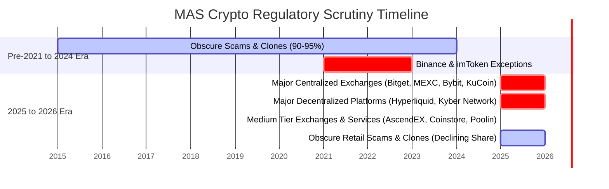

# MAS Investor Alert List: Crypto Firm Categorization & Analysis

This analysis validates the user's hunch regarding the profile of crypto/blockchain-related firms added to the Monetary Authority of Singapore (MAS) Investor Alert List (IAL). The data reveals a **clear and dramatic shift** in regulatory targeting starting in 2025 and accelerating in 2026.

Historically, MAS focused primarily on obscure retail scams, fraudulent schemes, or localized clone websites. However, recently, MAS has shifted to targeting **major global cryptocurrency brands** and decentralized finance (DeFi) platforms.

---

## 📊 Summary of Findings

* **The User's Hunch is 100% Correct:** In **2026**, **100%** of the crypto listings are Tier-1 global platforms (**Hyperliquid, Bybit, KuCoin**).
* **The 2025 Shift:** In **2025**, major and medium-known platforms (Tiers 1 & 2) combined made up **52.6%** (10 out of 19 listings), representing a massive rise from previous years.
* **Historical Context:** Prior to 2025, major global brands and established platforms accounted for only **4.7%** (4 out of 85 listings) of all crypto warnings. The alert list was almost entirely occupied by outright scams/Ponzis (e.g., OneCoin, Cloud Token, USFIA/Gemcoin) or phishing clones.

---

## 🏷️ The Categorization Framework

To properly evaluate this trend, we categorized all **107 crypto-related listings** on the IAL into four distinct profiles:

1. **Tier-1: Major Global Brands / Established Platforms**  
   Globally prominent cryptocurrency exchanges, DeFi ecosystems, VC funds, or wallet services with massive transaction volumes, millions of users, and high sector notoriety.
2. **Tier-2: Minor / Medium-Known Platforms**  
   Legitimately operating (or formerly operating) small-to-medium digital asset services, smaller exchanges, or specialized blockchain networks.
3. **Clones / Impersonations**  
   Phishing websites, groups, or apps falsely claiming affiliation with MAS-regulated financial institutions, MAS initiatives (like Project Guardian), or known brands.
4. **Scams / Fraudulent / Obscure Schemes**  
   Retail Ponzis, fake mining pools, "pig butchering" platforms, high-yield investment programs (HYIPs), and highly suspicious, short-lived websites with no industry standing.

---

## 📈 Yearly Breakdown (Category Distribution)

The table below shows the distribution of crypto-related alerts across these four categories by year.

| Year | Total Crypto Alerts | Tier-1 (Major) | Tier-2 (Medium) | Clones / Impers. | Scams / Fraud | T1+T2 Share (%) |
| :--- | :---: | :---: | :---: | :---: | :---: | :---: |
| **2026** (to Jun) | **3** | 3 (100.0%) | 0 (0.0%) | 0 (0.0%) | 0 (0.0%) | **100.0%** |
| **2025** | **19** | 3 (15.8%) | 7 (36.8%) | 2 (10.5%) | 7 (36.8%) | **52.6%** |
| **2024** | **10** | 0 (0.0%) | 1 (10.0%) | 5 (50.0%) | 4 (40.0%) | **10.0%** |
| **2023** | **2** | 1 (50.0%) | 0 (0.0%) | 0 (0.0%) | 1 (50.0%) | **50.0%** |
| **2022** | **10** | 1 (10.0%) | 0 (0.0%) | 3 (30.0%) | 6 (60.0%) | **10.0%** |
| **2021** | **16** | 1 (6.2%) | 0 (0.0%) | 0 (0.0%) | 15 (93.8%) | **6.2%** |
| **Pre-2021** | **47** | 1 (2.1%) | 2 (4.3%) | 1 (2.1%) | 43 (91.5%) | **6.4%** |
| **Total** | **107** | **10 (9.3%)** | **10 (9.3%)** | **11 (10.3%)** | **76 (71.0%)** | **18.7%** |

---

## 🗺️ Visualizing the Shift: Scams vs. Established Brands

The following chart illustrates the dramatic transition of MAS alerts away from obscure scams and clones, moving directly towards Tier-1 & Tier-2 established platforms in the last two years:

---

## 🔍 Directory of Listings by Category (Recent & Notable)

Below are selected notable listings in each category to illustrate the distinction between these groups.

### 🌟 Tier-1: Major Global Brands / Established Platforms (10 Listings Total)

These represent major entities that are highly recognized globally in the crypto space:
* **Hyperliquid** (Added: 26 Jun 2026) - The leading decentralized perpetual exchange (DEX) by volume.
* **Bybit** (Added: 17 Jun 2026) - A top-3 global centralized exchange.
* **KuCoin** (Added: 11 Feb 2026) - One of the largest global centralized exchanges.
* **Bitget** (Added: 08 Sep 2025) - Major global exchange prominent in derivatives and copy trading.
* **Kyber Network** (Added: 14 May 2025) - High-profile Singapore-founded DeFi protocol and aggregator (KyberSwap).
* **MEXC** (Added: 18 Mar 2025) - Leading global centralized exchange for long-tail token listings.
* **imToken** (Added: 05 Dec 2023) - One of the world's most widely used mobile Ethereum wallets.
* **DeFiance Capital** (Added: 18 Mar 2022) - Famous Web3-focused venture fund.
* **Binance.com** (Added: 02 Sep 2021) - The world's largest cryptocurrency exchange.
* **CoinEx** (Added: 22 Oct 2020) - Established global centralized exchange.

### 📈 Tier-2: Minor / Medium-Known Platforms (10 Listings Total)

Smaller, legitimately operating platforms or services that have since shut down or scaled back:
* **AscendEX** (Added: 27 May 2025) - Medium centralized exchange.
* **Coinstore** (Added: 25 Apr 2025) - Singapore-headquartered emerging markets exchange.
* **ZB.com** (Added: 25 Mar 2025) - Long-standing centralized exchange.
* **Poolin** (Added: 21 Mar 2025) - Major global Bitcoin mining pool/wallet service.
* **Bityard** (Added: 18 Mar 2025) - Medium derivative exchange.
* **CoinBene** (Added: 07 Mar 2025) - Formerly popular centralized exchange.
* **Bitforex** (Added: 28 Jan 2025) - Defunct exchange that halted withdrawals.
* **BitData Exchange Global** (Added: 30 Dec 2024) - Small local exchange.
* **CoinTiger** (Added: 22 Oct 2020) - Defunct medium exchange.
* **BiteBTC** (Added: 26 Feb 2019) - Defunct exchange.

### 👥 Clones / Impersonations (11 Listings Total)
Phishing links or chats impersonating reputable financial institutions or official MAS initiatives:
* **ICHAM / Yide Singapore** (Added: 07 Jul 2025) - Impersonating MAS-licensed ICHAM Pte Ltd.
* **Cygnus Investment Impersonation** (Added: 27 May 2025) - Impersonating Cygnus Investment Management Pte Ltd.
* **Doo Financial / Crypto Ai TradeGpt** (Added: 22 Jul 2024) - Impersonating Doo Capital Markets SG.
* **Project Guardian Scams** (Added: 30 May 2024) - Impersonating MAS's asset tokenization initiative.
* **StellarMAS / masofficialchannel** (Added: 30 May 2024) - Impersonating MAS official social accounts.
* **Neo Global Capital / MetaPlayer** (Added: 03 Nov 2022) - Impersonating NGC Ventures.
* **ShopeePay Phishing links (spp655.com, anewwayoffriday.com)** (Added: 10 Jan 2022) - Redirect sites impersonating ShopeePay.

### 💀 Scams / Fraudulent / Obscure Schemes (76 Listings Total)
Local retail schemes or generic websites with no sector reputation or legitimate operations:
* **Crypto Aman Management** (Added: 03 Dec 2025)
* **Kncoine Exchange** (Added: 23 Sep 2025)
* **SFTIMO Blockchain Markets** (Added: 28 Mar 2025)
* **UUEX Exchange** (Added: 24 Mar 2025)
* **Brainwave Crypto** (Added: 27 Dec 2024)
* **OneCoin** (Added: 21 Oct 2016) - Infamous multi-billion dollar Ponzi scheme.
* **Cloud Token** (Added: 30 Jun 2020) - Notorious crypto wallet Ponzi scheme.
* **USFIA/Gemcoin** (Added: 01 Sep 2021) - Famous early SEC-prosecuted MLM Ponzi scheme.

---

## 💡 Strategic Takeaways: Why the Shift?

1. **Focus on Retail Access to Major Offshore Exchanges:**  
   Historically, MAS allowed Singaporeans to access offshore exchanges at their own risk under a "caveat emptor" model, only warning against obvious local frauds. The listings of **Bybit (2026)**, **KuCoin (2026)**, **Bitget (2025)**, and **MEXC (2025)** signal a policy shift where MAS is actively discouraging Singapore-based retail traders from using large, unregulated offshore exchanges that offer leveraged derivatives.
2. **Scrutiny of DeFi and Decentralized Exchanges (DEXs):**  
   The addition of **Hyperliquid (2026)** is particularly significant. Hyperliquid is a fully decentralized perpetual exchange operating on-chain. This marks one of the first times MAS has targeted a decentralized protocol and front-end interface, rather than a centralized legal entity, highlighting that MAS is expanding its regulatory perimeter to decentralized finance.
3. **Closing Regulatory Loopholes:**  
   Under the Payment Services Act (PSA) of Singapore, entities must be licensed to offer Digital Payment Token (DPT) services. Offshore exchanges that continue to solicit Singaporean users (or allow them to trade without strict geo-blocking) are now systematically being added to the IAL to signal non-compliance.
