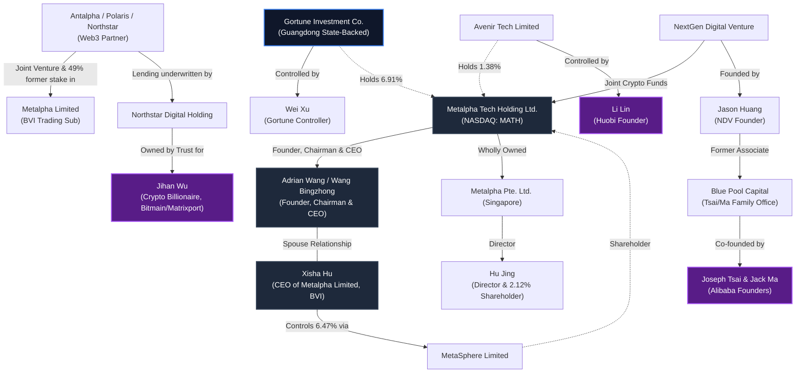

# Metalpha: Network and Corporate Connections to Chinese Companies and Elite Figures

Metalpha Technology Holding Limited (NASDAQ: MATH), originally incorporated as Dragon Victory International Limited, has evolved into a prominent digital asset wealth management platform. The company's regulatory filings (such as its June 2026 Form F-3) and corporate registry data (like Singapore ACRA records) reveal a complex web of connections linking its founders and key shareholders to state-backed institutions, prominent Web3 billionaires, and traditional Chinese tech elites.

Below is a detailed mapping of how Metalpha, its core figures, and its corporate entities connect to other powerful companies and individuals in China.

---

## 1. Network Mapping (Visual Relationship Diagram)

---

## 2. Core Metalpha Figures & Spousal Network

### **Adrian Wang (Wang Bingzhong) — Founder, Chairman & CEO**
*   **Background & Credentials:** Adrian Wang holds an undergraduate degree from Nanjing University and an MBA from the Hong Kong University of Science and Technology (HKUST). He also attended the Tsinghua University PBC School of Finance (a prestigious school for China's financial elites).
*   **Institutional Ties:** Before building Metalpha, Adrian worked at **CCB International (Holdings) Limited** (the investment banking arm of China Construction Bank, one of China's "Big Four" state-owned commercial banks). He also served as Co-CEO and Executive Director of HK-listed **Crypto Flow Technology Limited** (formerly Loto Interactive, which was acquired by BIT Mining / 500.com).

### **Xisha Hu — Related Party & MetaSphere Owner**
*   **Relationship & Role:** Xisha Hu is the spouse of Adrian Wang. She was appointed CEO of Metalpha's wholly-owned trading subsidiary, **Metalpha Limited (BVI)**, in April 2025.
*   **Shareholding Power:** She is the sole voting and control person of **MetaSphere Limited**, which owns **6.47%** of Metalpha's outstanding shares (3,049,912 shares) received from Xianqun Hu as a gift in March 2026.

### **Hu Jing — Singapore Representative**
*   **Registry Presence:** According to Singapore ACRA registration profile [trustBar_I260701006392.oa](file:///C:/Users/matth/Obsidian/ai-test/2026-07-01-Metalpha/trustBar_I260701006392.oa), she serves as the sole Chinese Director of **METALPHA PTE. LTD.** (Singapore entity, UEN 202426648D).
*   **Share Ownership:** Hu Jing personally owns **2.12%** of Metalpha Technology Holding Limited.

---

## 3. Key Chinese Corporate and Billionaire Connections

### **A. The Guangdong Provincial Government Backing (Gortune Investment)**
*   **Entity:** **Gortune International Investment Limited Partnership** (holds **6.91%** of Metalpha).
*   **Government Link:** This partnership is a subsidiary of **Gortune Investment Co., Ltd.**, a major Chinese investment firm established in 2016 in Guangzhou with direct backing and support from the **Guangdong provincial government**. It manages industrial assets, M&A restructuring, and Web3 investments with RMB 16 billion in registered capital.
*   **Key Figure:** **Wei Xu** has sole voting and dispositive power over Gortune's stake in Metalpha.

### **B. Jihan Wu (Bitmain / Matrixport) & Antalpha**
*   **Entity:** **Antalpha Group** (formerly Polaris Technologies Group Limited / Northstar Digital Holding Limited).
*   **Strategic Relationship:** Antalpha was a joint-venture partner and held a **49% stake** in Metalpha Limited. Together, Metalpha and Antalpha have launched Bitcoin mining index funds and structured products.
*   **Jihan Wu Link:** Jihan Wu is one of China’s most prominent cryptocurrency billionaires (co-founder of **Bitmain** and founder of **Matrixport**). Much of Antalpha's lending business is underwritten by **Northstar**, which is held in a trust of which Jihan Wu is the sole beneficiary.

### **C. Li Lin (Huobi Founder) & Avenir Tech**
*   **Entity:** **Avenir Tech Limited** (holds **1.38%** of Metalpha).
*   **Li Lin Link:** Avenir Tech Limited is controlled by **Li Lin**, the billionaire founder of **Huobi** (historically one of China's largest cryptocurrency exchanges). Avenir Tech Limited is also noted in filings as Asia's largest institutional Bitcoin ETF holder.

### **D. Joseph Tsai / Jack Ma (Alibaba Family Office) & NextGen Digital Venture**
*   **Partnership:** Metalpha partnered with **NextGen Digital Venture (NDV)** to launch digital asset funds targeting U.S. cryptocurrency equities.
*   **Alibaba Link:** NDV was founded by **Jason Huang**, who previously served as an investment professional at **Blue Pool Capital**, the multi-billion-dollar family office established by Alibaba co-founders **Joseph Tsai** and **Jack Ma** to manage their personal fortunes.

---

> [!NOTE]
> Metalpha's structure highlights how institutional Web3 players (Huobi, Bitmain) and state-aligned capital (Guangdong's Gortune) intersect with traditional Chinese financial elites (CCB International alumni, Alibaba family office network) to build regulated channels for digital asset wealth management.
