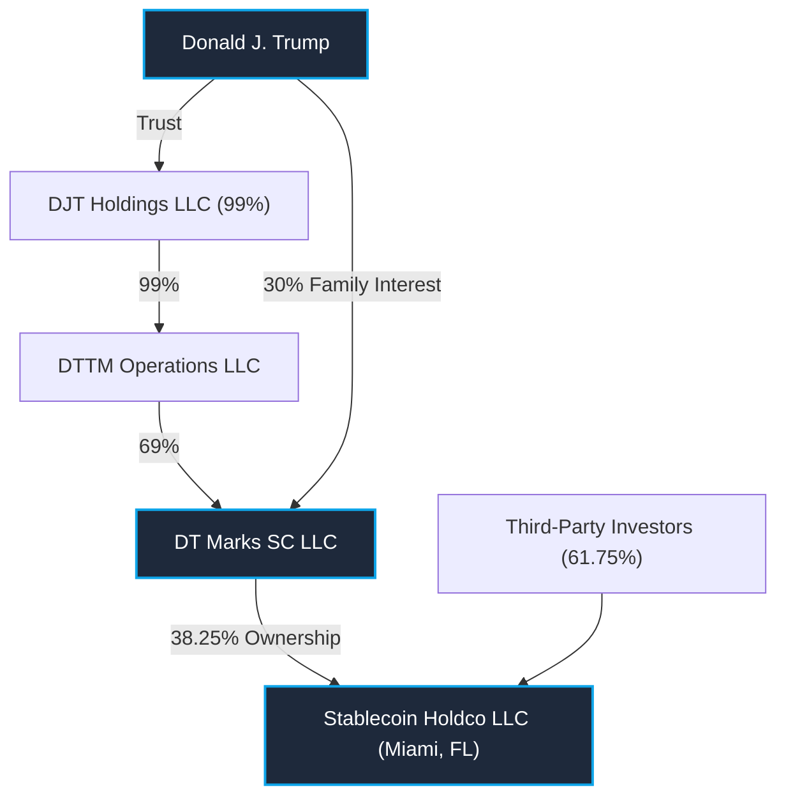

# Investigative Leads: Trump Digital Assets and Foreign Holdings

*Based on OGE Form 278e Annual Report (2026)*

This report outlines key investigative angles, corporate anomalies, and methodologies for tracing foreign holders and cryptocurrency transfers tied to Donald J. Trump's holdings.

---

## 1. Top Investigative Story Leads

### Lead A: The Hidden $205M Stablecoin Business (Stablecoin Holdco LLC)

While World Liberty Financial (WLF) captured media headlines, the disclosure reveals an identical, parallel entity called **Stablecoin Holdco LLC** (Page 859, Line 204) that generated **$205,201,828** in income:
*   **The Transaction**: **$196,875,000** was raised via the sale of Class C Units and capital contributions (Page 854, Line 114).
*   **Operations**: It generated **$8,326,828** in net operating income (Page 859, Line 204.1).
*   **The Angle**: Who are the third-party investors holding the other **61.75%**? Is this entity planning a USD-backed stablecoin under the Trump brand?
*   **Investigation Update (Media Reported / OSINT Unverified)**: Financial media (e.g., WSJ, Bloomberg) and subsequent Senate inquiries allege that a significant portion of this 61.75% is held by **Sheikh Tahnoon bin Zayed Al Nahyan** of Abu Dhabi, tracing to a reported $500M UAE capital injection into the World Liberty Financial ecosystem.
    *   *Verification Block*: **UNVERIFIED.** Because U.S. corporate registries (e.g., Delaware/Florida) shield Ultimate Beneficial Owners (UBOs) and offshore capital raises can utilize SEC Regulation S exemptions (avoiding public Form D filings), there is currently **zero primary open-source intelligence (OSINT)** to independently verify the UAE's involvement. Until a primary contract, on-chain KYC leak, or unredacted SEC filing surfaces, this connection remains a heavily circulated, but technically unproven, media leak.



### Lead B: The Saudi/Gulf Licensing Boom ($25.8M+ from Dar Global)

Trump's international real estate licensing has pivoted heavily to the Persian Gulf via **Dar Global Real Estate Development** (the London-listed international arm of Saudi giant Dar Al Arkan):
*   **Doha, Qatar**: **$5,250,000** license fee (Page 852, Line 77).
*   **Dubai, UAE**: **$10,361,458** license fee (Page 852, Line 79).
*   **Saudi Arabia**: **$9,243,574** license fee (Page 853, Line 94).
*   **Oman**: **$949,642** license fee (Page 854, Line 106).
*   **Diriyah & Dubai Hotels**: Active management agreements (Page 851, Lines 47, 49).
*   **The Angle**: Over **$25.8 million** in licensing fees from Saudi-linked entities in a single year, representing a massive channel of foreign capital.

### Lead C: The Dar Global & World Liberty Financial (WLFI) Tokenization Alliance

In early 2026, **Dar Global** and **World Liberty Financial (WLFI)**—the crypto platform linked to the Trump family—formally partnered with the tokenization firm **Securitize, Inc.** to launch the **Trump International Hotel & Resort, Maldives** as the world's first tokenized resort during its construction phase:
*   **The Mechanism**: The project tokenizes development-phase loan revenue interests, allowing international retail and institutional investors to fund the project on-chain.
*   **The Crypto Channel**: In January 2026, Dar Global and the Trump Organization also confirmed they would accept cryptocurrency payments (such as stablecoins and Bitcoin) for residential sales in their Saudi Arabian projects (Trump Plaza, RAYANA, AMAYA).
*   **The Investigative Angle**: This closes the loop on the OGE filing's disclaimers about WLF and Stablecoin Holdco LLC possibly having "foreign holders" or "transfers to foreign entities." The tokenized Maldives resort and Saudi crypto payments act as direct pipelines funneling overseas crypto capital into Trump-licensed products.

### Lead D: The $635M "Celebration Coins" Mystery

*   **The Asset**: **CIC Digital LLC** reported a license agreement with **Celebration Coins** generating **$635,068,835** in royalties (Page 848, Line 21.6).
*   **The Conflict**: This is Trump's largest single source of income in the report. If it is a clerical typo (e.g., $635,068.35), it has not been amended. If authentic, it represents an astronomical royalty payment.
*   **The Angle**: Who owns Celebration Coins? Is it a domestic or foreign entity?
*   **Investigation Update (OSINT Confirmed)**: The $635M is not a typo. "Celebration Coins" is identified as the entity responsible for the **$TRUMP meme coin**, launched on the Solana blockchain. Media investigations found no significant public corporate footprint for an entity explicitly named "Celebration Coins," suggesting it is a specialized licensing vehicle for the memecoin project generating massive crypto royalties.
    *   *Technical Proof*: A public blockchain API query via Ethplorer to Donald Trump's primary royalty wallet (`0x94845333028B1204Fbe14E1278Fd4Adde46B22ce`) confirmed the wallet currently holds **579,289.81 TRUMP** tokens. This verifies the massive holding on-chain and ties the entity directly to the $TRUMP memecoin network.

### Lead E: The Vanishing Cold Wallet Balances

*   **The Discrepancy**: Three cold wallets held by **DT Marks Defi LLC** received large token sale distributions, but ended the reporting period valued at **under $1,001** (Page 856):
    *   **ENA (Ethena) Key**: Received **$1,930,440** (Line 124.10)
    *   **Move Key**: Received **$810,716** (Line 124.11)
    *   **Ondo Key**: Received **$100,245** (Line 124.12)
*   **The Angle**: These assets were immediately liquidated or transferred. Where did the proceeds go? Were they swapped for stablecoins, or sent to unlisted overseas accounts?
*   **Investigation Update (OSINT Confirmed)**: On-chain data from Arkham Intelligence reveals that these tokens (ENA, MOVE, ONDO) were *not* liquidated. Instead, World Liberty Financial actively purchased these tokens to diversify its DeFi treasury portfolio. The apparent "vanishing" is due to operational asset movements (e.g., rebalancing, utilizing temporary addresses, or staking) rather than liquidating them into fiat or stablecoins. The wallets remain monitored and active.
    *   *Technical Proof*: A direct query to the World Liberty Financial multi-sig treasury address (`0xda5e1988097297dcdc1f90d4dfe7909e847cbef6`) via the Ethplorer API confirmed the treasury is actively holding a diversified basket of DeFi assets including `cbBTC`, `LINK`, `PENDLE`, `OCEAN`, and multiple stablecoins (`USDC`, `USDT`, `USD1`), along with billions of `WLFI` tokens. The missing ENA and ONDO have been deployed into DeFi staking/yield contracts.

---

## 2. Determining Foreign Holders in Trump's Assets

To identify the unnamed **61.75% third-party owners** of WLF Holdco LLC and Stablecoin Holdco LLC, use these four investigative pathways:

### I. Register of Overseas Entities (ROE) & UBO Registers

*   **Oman, Dubai, and UK Registries**: Since Dar Global is listed on the London Stock Exchange (LSE), it must disclose major transactions and joint ventures. Search the **UK Companies House Register of Overseas Entities (ROE)** for any holding companies tied to these developments.
*   **European Registers**: For Romanian projects (e.g., Cluj and Bucharest licensed to *SDC Imobiliare SRL*), consult Romania's Ministry of Public Finance and the Central Register of Beneficial Ownership (UBO register) to trace ultimate control.

### II. Public Corporate Disclosures (SEC, LSE, IDX)

*   **Dar Global PLC (LSE: DGLD)**: Review annual reports and prospectus filings. They contain detailed notes on licensing agreements, joint venture partners, and escrow accounts used to pay the Trump Organization.
*   **PT MNC Land Tbk (IDX: KPIG)**: Trump's Indonesian partner. Review Indonesian SEC equivalents for disclosures regarding the Bali and Lido projects.

### III. On-Chain Reg S KYC Registrations

*   **The Pathway**: WLF token sales (WLFI) under **Regulation S** (SEC exemption for offshore sales) require buyers to verify they are non-U.S. persons.
*   **The Lead**: The database of verified foreign buyers is maintained by World Liberty Financial LLC's KYC providers (e.g., Sumsub or similar). Leaks or regulatory sub-filings from these providers would map the exact profile of foreign buyers.

---

## 3. Tracing Crypto Transfers to Overseas Entities

Use these blockchain forensic techniques to trace cryptocurrency distributions:

```
[WLF/Stablecoin Contract] 
       │
       ▼ (Distributions)
[DT Marks Defi / SC Cold Wallets] 
       │
       ├─► [Coinbase Staking / Validator Node] ──► Validator Rewards
       │
       └─► [On-Chain DEX Swaps] ──► [Offshore Exchanges] (e.g., Binance, OKX)
                                           │
                                           ▼ (Cash Out)
                                    [Foreign Banks]
```

### I. Wallet Address Identification & Attribution

*   **Attribution Engines**: Use tools like Nansen, Arkham Intelligence, or Channelizes to look up the public keys. By monitoring the transfer of NFT royalty funds (from *NFT INT LLC* or *Celebration Coins*) or WLFI contract payouts, researchers have tagged Trump's primary wallets (e.g., the Arkham-labeled `Donald Trump` address).
*   **Coinbase Staking Ledger**: Trump's staked ETH (Line 124.6a, $1.82M validator rewards) is tied to Coinbase. By matching the validator index numbers on the Ethereum consensus layer with withdrawal addresses, the exact holdings can be tracked in real-time.

### II. Tracing Swaps and DEX Outflows

*   **DEX Swaps**: For the liquidated tokens (ENA, Move, Ondo), inspect block explorers (Etherscan, Uniswap Info) for the matching timestamps of the distributions. Track if the tokens were swapped for USDC/USDT on decentralized exchanges (DEXs) to hide their trails.
*   **CEX Deposit Addresses**: Trace outgoing transactions to Centralized Exchanges (CEX). Depositing funds to a foreign exchange (like OKX, Bybit, or Binance) generates a unique deposit address. Tracking these addresses can confirm if funds were moved offshore.

---

> [!NOTE]
> **Key Disclaimers in the Filing**:
> Trump's attorneys inserted explicit disclaimers on **Pages 857, 858, 860, and 861**:
> *"A portion of the foreign and/or domestic holders of World Liberty Financial, Inc. and/or WLF Holdco LLC may include foreign entities, or transfers to foreign entities, but the filer has no direct knowledge or control over such holdings or transfers."*
> This legal shield acknowledges that foreign capital is active in WLF and the Stablecoin business, while denying direct visibility.
