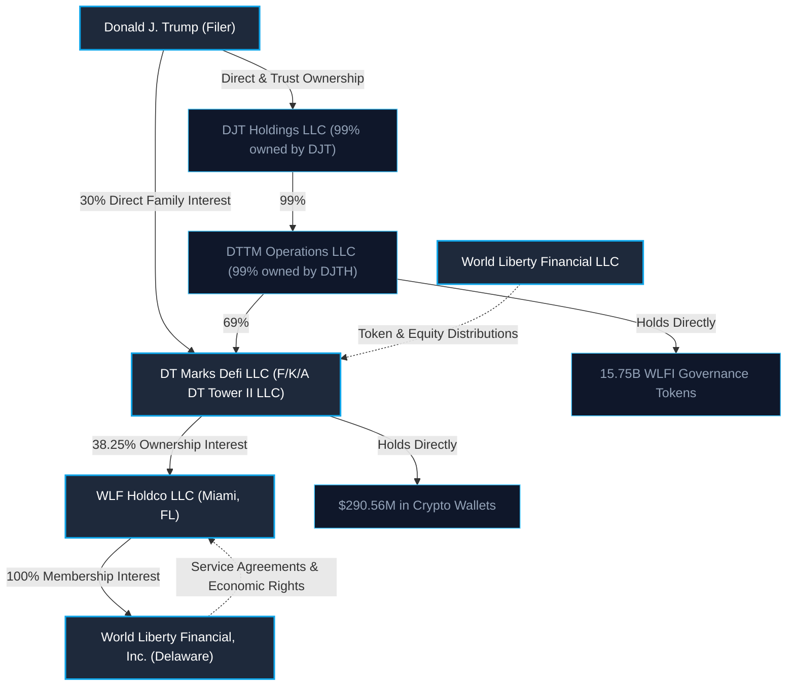

# Analysis of World Liberty Financial Assets and Transactions

*Based on the OGE Form 278e Annual Report for Donald J. Trump (2026)*

This document provides a detailed financial and structural breakdown of the transactions, asset distributions, and holdings related to **World Liberty Financial (WLF)** as disclosed in [Donald-J-Trump-2026-278ANNUAL.pdf](file:///C:/Users/matth/Downloads/prez-finance/Donald-J-Trump-2026-278ANNUAL.pdf).

---

## 1. Executive Summary of Financial Distributions

According to the disclosure, WLF-related activities generated a grand total of **$592,435,321** in net proceeds and distributed assets to Donald J. Trump's entity, **DT Marks Defi LLC**. This revenue is divided into three primary categories:

1. **Equity Sale Proceeds**: **$65,625,000** from the sale of equity in WLF Holdco LLC.
2. **Direct Token Sale Distributions**: **$236,250,000** in net proceeds from token sales distributed directly by World Liberty Financial LLC.
3. **Cryptocurrency Wallet Balances (Token Sale proceeds)**: **$290,560,321** held across various cold wallets.

In addition to these distributions, Trump's entity **DTTM Operations LLC** holds a massive reserve of **15,750,000,000 WLFI Governance Tokens**, valued in the report at **Over $50,000,000** (with no direct income reported yet).

---

## 2. Corporate Architecture and Flow of Funds

The World Liberty Financial assets are held and managed through a multi-tiered corporate structure, linking Trump's primary holding companies to the operational cryptocurrency entities.

### Structural Flow Diagram

### Key Corporate Entities Defined

*   **WLF Holdco LLC (Line 405)**: Located in Miami, FL. It holds the sole membership interest in *World Liberty Financial, Inc.* (a Delaware nonstock corporation). It has been assigned certain economic rights to non-token sale revenues under service agreements between World Liberty Financial, Inc. and its founders.
    *   **Ownership**: DT Marks Defi LLC owns **38.25%**; Third Parties own **61.75%**.
*   **DT Marks Defi LLC (Line 124)**: Formerly known as *DT Tower II LLC*. Located in Jupiter, FL. This is the primary holding company used to receive equity and token proceeds.
    *   **Ownership**: DTTM Operations LLC owns **69%**, Trump Family Members own **30%**, and DT Marks Defi Member Corp owns **1%** (which is 100% controlled by DTTM Operations).
*   **DTTM Operations LLC (Line 133)**: This entity is owned 99% by *DJT Holdings LLC* and 1% by *DTTM Operations Managing Member Corp*. It directly holds the governance token reserves.

---

## 3. Detailed Financial Breakdown

### A. Direct Revenue & Sales Distributions
These transactions represent the direct liquid proceeds routed to **DT Marks Defi LLC**:

| Line # | Asset/Transaction Description | Type of Income | Value | Income Amount |
| :--- | :--- | :--- | :--- | :--- |
| **124.2** | Sale of Equity in WLF Holdco LLC (Line 405) | Net proceeds from Equity Sale | See Line 405 | **$65,625,000** |
| **124.3** | Token Sales (distributed by World Liberty Financial LLC) | Net proceeds from Token Sales | See Line 405 | **$236,250,000** |
| **Total** | **Direct Sales Revenues** | | | **$301,875,000** |

---

### B. Cryptocurrency Wallet Holdings (Distributed Proceeds)
The report lists nine separate cryptocurrency wallet keys held in cold storage by **DT Marks Defi LLC**. These represent proceeds from token sales distributed by World Liberty Financial LLC:

| Line # | Cryptocurrency Wallet Key | Reported Asset Value | Income Amount (Proceeds) |
| :--- | :--- | :--- | :--- |
| **124.4** | Virtual USD Key | $100,001 to $250,000 | **$42,250,000** |
| **124.5** | Virtual USDC Key | $1,001 to $15,000 | **$56,036,445** |
| **124.6** | Virtual Ethereum (ETH) Key | Over $50,000,000 | **$150,606,931** |
| **124.7** | Virtual Bitcoin (BTC) Key | Over $50,000,000 | **$33,462,160** |
| **124.8** | Virtual Chainlink (LINK) Key | $500,001 to $1,000,000 | **$2,754,611** |
| **124.9** | Virtual Aave (AAVE) Key | $1,000,001 to $5,000,000 | **$2,608,773** |
| **124.10**| Virtual Ethena (ENA) Key | None (or less than $1,001) | **$1,930,440** |
| **124.11**| Virtual Move (Move) Key | None (or less than $1,001) | **$810,716** |
| **124.12**| Virtual Ondo (Ondo) Key | None (or less than $1,001) | **$100,245** |
| **Total** | **Crypto Wallet Balances** | | **$290,560,321** |

> [!NOTE]
> Several cold wallets holding crypto proceeds (such as ENA, Move, and Ondo) are reported with negligible current asset value (under $1,001) despite having received significant distribution income. This suggests the assets were either liquidated, transferred, or experienced significant valuation drops.

---

### C. Governance Tokens & Staking Income
Two other crypto assets are listed which represent long-term holdings and staking activities:

*   **WLFI Governance Tokens (Line 133)**: Held by **DTTM Operations LLC**.
    *   **Quantity**: 15,750,000,000 Governance tokens.
    *   **Value**: **Over $50,000,000**.
    *   **Income**: None (or less than $201) (indicating these are held and have not been sold or distributed).
*   **Staked Ethereum (Line 124.6a)**: Held through a Coinbase staking agreement under **DT Marks Defi LLC**.
    *   **Income Type**: Validator rewards.
    *   **Income Amount**: **$1,821,628**.
*   **USDC Interest (Line 124.5a)**:
    *   **Income Type**: Interest income.
    *   **Income Amount**: **$6,995**.

---

## 4. Key Analytical Insights

1.  **Trump Family Ownership & Control**: Donald J. Trump and his family retain a **38.25%** interest in WLF Holdco LLC through DT Marks Defi LLC. The remaining **61.75%** is owned by unnamed third-party founders and partners.
2.  **Asset Distribution Strategy**: WLF distributes its revenues in both fiat-equivalent terms (such as the $236.25M in direct token sales) and directly in cryptocurrency assets to the cold wallets of DT Marks Defi LLC.
3.  **Heavy Ethereum Exposure**: Outside of stablecoin/USD distributions, the single largest asset distributed was Ethereum (ETH), with **$150,606,931** in income, currently valued at "Over $50,000,000" in cold storage, plus an additional Coinbase staking contract that generated **$1.82M** in validator rewards.
4.  **Comparison to Vice President JD Vance**: By comparison, [JD-Vance-2026-278ANNUAL.pdf](file:///C:/Users/matth/Downloads/prez-finance/JD-Vance-2026-278ANNUAL.pdf) (Page 10) lists only a single Coinbase account holding Bitcoin valued between **$250,001 and $500,000** with no income. Vance has no ownership or distributions associated with World Liberty Financial, confirming WLF is entirely unique to the Trump family's financial profile.
