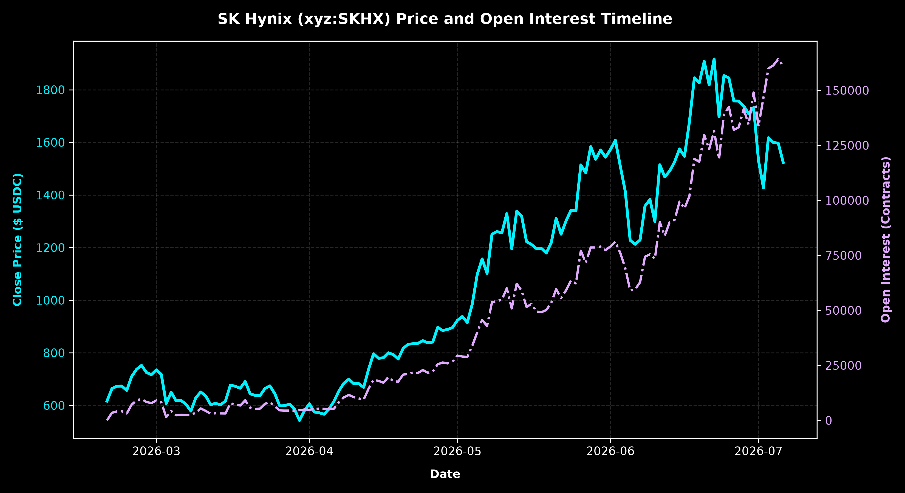
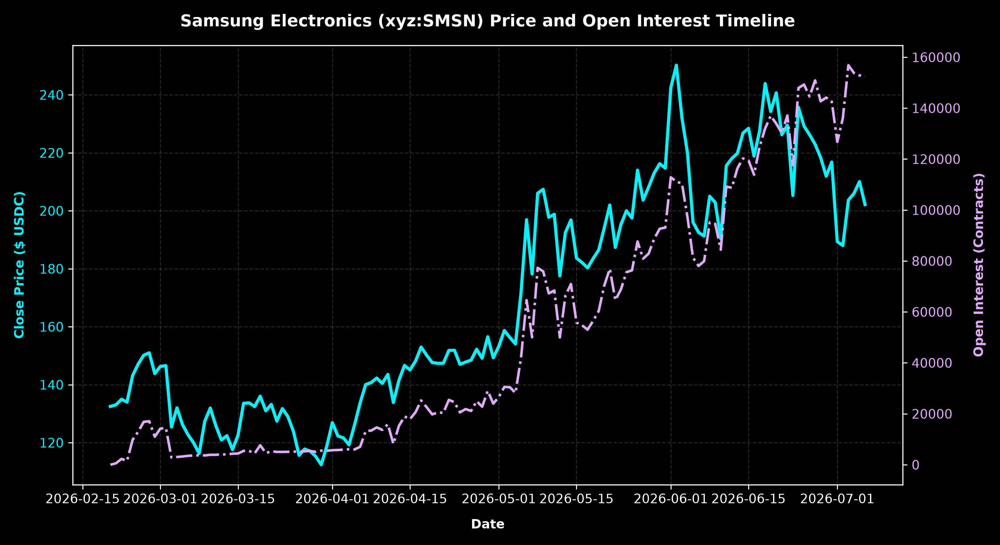
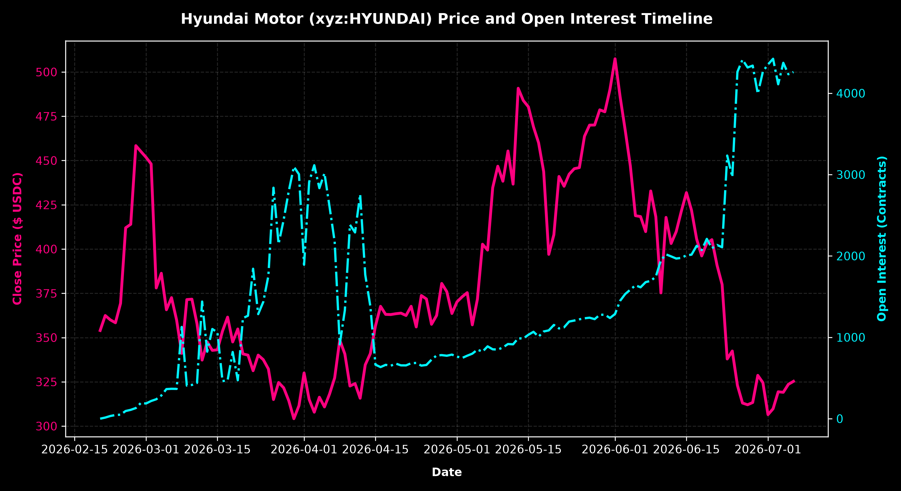
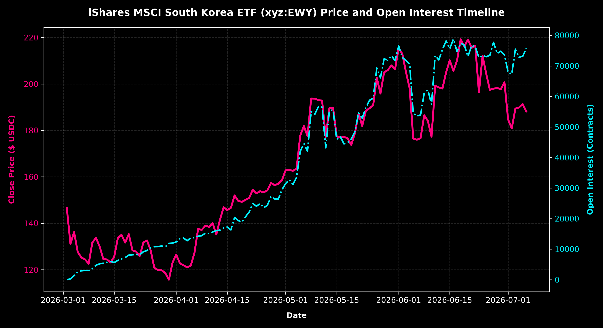
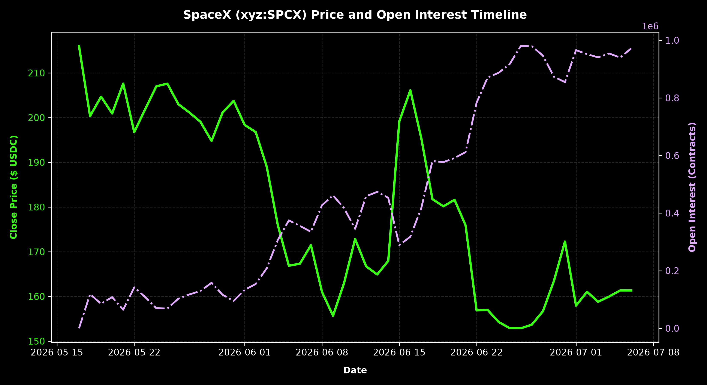
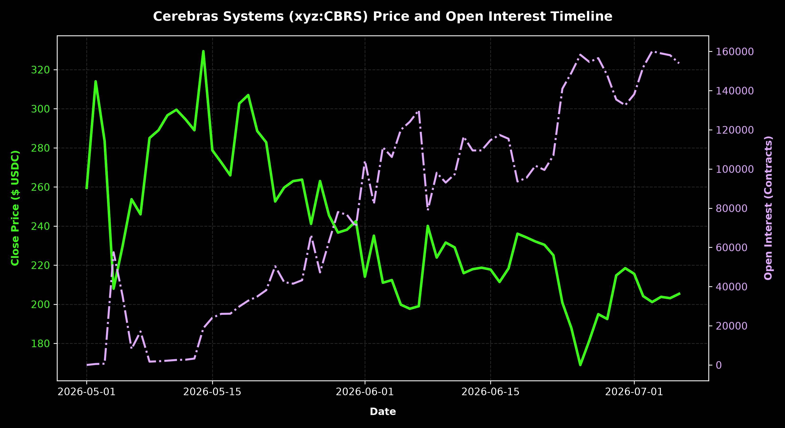

#+TITLE: Hyperliquid Traditional Equity & ETF Perpetual Markets Report
#+AUTHOR: Antigravity AI Coding Assistant
#+DATE: 2026-07-06
#+DESCRIPTION: Comprehensive analysis of stock and ETF perpetual markets traded via Hyperliquid's HIP-3 builder DEX.

* Executive Summary
This report compiles historical and real-time market data across a range of traditional equity and ETF synthetic perpetual futures contracts trading on the Hyperliquid decentralized exchange.
These contracts are deployed using Hyperliquid's *HIP-3 builder framework* (primarily via trade.xyz), settling in USDC and tracking underlying global equity assets, ETFs, and pre-IPO valuations.

* SK Hynix (xyz:SKHX)
Synthetic perpetual contract tracking the major South Korean semiconductor and memory manufacturer (KRX: 000660). A key player in the AI memory boom (HBM).

- **Asset Type:** Stock Perp
- **Current Price:** $1,523.40 USDC
- **Current Open Interest:** 160,936.01 contracts (Equivalent to **$245,169,920.68 USDC**)
- **Implied Valuation / Market Cap:** **$1,109,038,802,841.00 USD** (Based on 728,002,365 outstanding shares)
- **All-Time High (ATH) Close:** $1,916.80 USDC (2026-06-22)
- **All-Time Low (ATL) Close:** $543.10 USDC (2026-03-30)
- **Average 30-Day Daily Volume:** $48,717,469.43 USDC

** Timeline Chart

** Market Data Table
| Date | Open | High | Low | Close | Volume (Shares) | Volume (USD) | Open Interest (Contracts) | OI Value (USD) | Implied Market Cap ($) |
|------+------+------+------+-------+-----------------+--------------+---------------------------+----------------+------------------------|
| 2026-07-06 | 1,595.80 | 1,630.30 | 1,522.60 | 1,523.70 | 77,236.630 | 117,685,453.13 | 160,936.01 | 245,218,201.48 | 1,109,257,203,550.50 |
| 2026-07-05 | 1,599.00 | 1,637.80 | 1,583.30 | 1,596.90 | 60,984.925 | 97,386,826.73 | 164,225.11 | 262,251,072.14 | 1,162,546,976,668.50 |
| 2026-07-04 | 1,617.40 | 1,617.70 | 1,586.60 | 1,599.40 | 23,330.982 | 37,315,572.61 | 161,337.92 | 258,043,863.03 | 1,164,366,982,581.00 |
| 2026-07-03 | 1,428.10 | 1,619.00 | 1,342.60 | 1,617.60 | 373,198.050 | 603,685,165.68 | 159,929.10 | 258,701,316.50 | 1,177,616,625,624.00 |
| 2026-07-02 | 1,530.80 | 1,578.80 | 1,350.00 | 1,427.00 | 528,774.796 | 754,561,633.89 | 146,661.79 | 209,286,368.94 | 1,038,859,374,855.00 |
| 2026-07-01 | 1,732.50 | 1,759.00 | 1,525.00 | 1,530.50 | 337,311.004 | 516,254,491.62 | 133,758.07 | 204,716,727.84 | 1,114,207,619,632.50 |
| 2026-06-30 | 1,708.90 | 1,777.00 | 1,650.60 | 1,732.50 | 199,797.714 | 346,149,539.50 | 149,015.23 | 258,168,888.97 | 1,261,264,097,362.50 |
| 2026-06-29 | 1,739.60 | 1,749.10 | 1,629.00 | 1,708.70 | 195,914.713 | 334,759,470.10 | 134,380.56 | 229,616,070.56 | 1,243,937,641,075.50 |
| 2026-06-28 | 1,757.00 | 1,808.40 | 1,731.10 | 1,738.30 | 56,047.642 | 97,427,616.09 | 141,487.42 | 245,947,585.77 | 1,265,486,511,079.50 |
| 2026-06-27 | 1,757.80 | 1,770.00 | 1,744.50 | 1,756.90 | 9,386.987 | 16,491,997.46 | 133,252.31 | 234,110,977.64 | 1,279,027,355,068.50 |
| 2026-06-26 | 1,843.20 | 1,871.30 | 1,691.00 | 1,757.20 | 190,936.334 | 335,513,326.10 | 131,969.09 | 231,896,077.58 | 1,279,245,755,778.00 |
| 2026-06-25 | 1,854.40 | 1,933.70 | 1,783.30 | 1,844.60 | 182,225.240 | 336,132,677.70 | 142,399.81 | 262,670,698.64 | 1,342,873,162,479.00 |
| 2026-06-24 | 1,696.70 | 1,882.50 | 1,600.10 | 1,853.70 | 252,097.504 | 467,313,143.16 | 139,211.62 | 258,056,586.40 | 1,349,497,984,000.50 |
| 2026-06-23 | 1,920.20 | 1,926.10 | 1,628.90 | 1,696.70 | 203,762.377 | 345,723,625.06 | 118,719.80 | 201,431,888.43 | 1,235,201,612,695.50 |
| 2026-06-22 | 1,819.70 | 1,974.90 | 1,794.30 | 1,916.80 | 95,148.950 | 182,381,507.36 | 131,487.63 | 252,035,493.73 | 1,395,434,933,232.00 |
| 2026-06-21 | 1,908.00 | 1,933.40 | 1,793.20 | 1,818.20 | 43,411.800 | 78,931,334.76 | 123,265.74 | 224,121,767.57 | 1,323,653,900,043.00 |
| 2026-06-20 | 1,826.00 | 1,925.00 | 1,822.20 | 1,908.00 | 24,946.293 | 47,597,527.04 | 129,686.73 | 247,442,274.87 | 1,389,028,512,420.00 |
| 2026-06-19 | 1,845.20 | 1,887.90 | 1,753.40 | 1,826.30 | 68,940.328 | 125,905,721.03 | 117,545.19 | 214,672,779.30 | 1,329,550,719,199.50 |
| 2026-06-18 | 1,678.20 | 1,874.70 | 1,676.30 | 1,845.20 | 77,472.513 | 142,952,280.99 | 118,787.67 | 219,187,011.91 | 1,343,309,963,898.00 |
| 2026-06-17 | 1,546.80 | 1,741.60 | 1,546.80 | 1,678.20 | 71,807.315 | 120,507,036.03 | 101,917.35 | 171,037,695.45 | 1,221,733,568,943.00 |
| 2026-06-16 | 1,574.90 | 1,628.00 | 1,510.30 | 1,546.80 | 42,610.814 | 65,910,407.10 | 96,318.11 | 148,984,852.87 | 1,126,074,058,182.00 |
| 2026-06-15 | 1,525.80 | 1,594.90 | 1,504.20 | 1,575.00 | 40,700.515 | 64,103,311.12 | 99,411.04 | 156,572,380.77 | 1,146,603,724,875.00 |
| 2026-06-14 | 1,490.80 | 1,563.60 | 1,485.60 | 1,525.90 | 25,727.450 | 39,257,515.96 | 91,127.22 | 139,051,027.11 | 1,110,858,808,753.50 |
| 2026-06-13 | 1,468.80 | 1,499.70 | 1,450.60 | 1,491.10 | 6,008.085 | 8,958,655.54 | 90,146.90 | 134,418,041.01 | 1,085,524,326,451.50 |
| 2026-06-12 | 1,515.10 | 1,523.00 | 1,391.70 | 1,468.70 | 60,308.195 | 88,574,646.00 | 83,920.52 | 123,254,066.57 | 1,069,217,073,475.50 |
| 2026-06-11 | 1,299.10 | 1,536.30 | 1,288.90 | 1,514.90 | 90,505.584 | 137,106,909.20 | 90,097.03 | 136,487,997.52 | 1,102,850,782,738.50 |
| 2026-06-10 | 1,383.20 | 1,438.60 | 1,265.40 | 1,299.00 | 87,154.164 | 113,213,259.04 | 73,479.36 | 95,449,688.94 | 945,675,072,135.00 |
| 2026-06-09 | 1,358.30 | 1,498.00 | 1,316.30 | 1,382.90 | 92,710.555 | 128,209,426.51 | 75,451.97 | 104,342,529.08 | 1,006,754,470,558.50 |
| 2026-06-08 | 1,228.70 | 1,366.00 | 1,210.00 | 1,357.90 | 94,980.508 | 128,974,031.81 | 74,392.68 | 101,017,819.61 | 988,554,411,433.50 |
| 2026-06-07 | 1,212.60 | 1,315.60 | 1,200.00 | 1,228.80 | 66,386.760 | 81,576,050.69 | 62,754.30 | 77,112,478.10 | 894,569,306,112.00 |
| 2026-06-06 | 1,227.50 | 1,236.40 | 1,212.60 | 1,212.60 | 3,689.027 | 4,473,314.14 | 59,536.11 | 72,193,481.43 | 882,775,667,799.00 |
| 2026-06-05 | 1,413.90 | 1,420.70 | 1,221.10 | 1,227.50 | 58,048.310 | 71,254,300.52 | 59,079.06 | 72,519,541.13 | 893,622,903,037.50 |
| 2026-06-04 | 1,507.70 | 1,546.90 | 1,412.70 | 1,413.90 | 36,503.824 | 51,612,756.75 | 69,231.50 | 97,886,416.24 | 1,029,322,543,873.50 |
| 2026-06-03 | 1,608.00 | 1,649.20 | 1,493.50 | 1,509.00 | 17,764.036 | 26,805,930.32 | 76,034.65 | 114,736,284.89 | 1,098,555,568,785.00 |
| 2026-06-02 | 1,567.70 | 1,630.00 | 1,492.00 | 1,608.00 | 22,702.076 | 36,504,938.21 | 81,278.10 | 130,695,188.43 | 1,170,627,802,920.00 |
| 2026-06-01 | 1,543.80 | 1,693.10 | 1,526.50 | 1,572.70 | 24,776.110 | 38,965,388.20 | 79,036.08 | 124,300,039.87 | 1,144,929,319,435.50 |
| 2026-05-31 | 1,569.20 | 1,616.60 | 1,517.90 | 1,543.80 | 9,426.465 | 14,552,576.67 | 77,378.54 | 119,456,994.03 | 1,123,890,051,087.00 |
| 2026-05-30 | 1,535.60 | 1,571.80 | 1,518.30 | 1,570.90 | 2,113.269 | 3,319,734.27 | 78,993.87 | 124,091,464.74 | 1,143,618,915,178.50 |
| 2026-05-29 | 1,583.90 | 1,587.60 | 1,517.90 | 1,535.60 | 8,631.737 | 13,254,895.34 | 78,576.75 | 120,662,458.94 | 1,117,920,431,694.00 |
| 2026-05-28 | 1,482.70 | 1,612.00 | 1,433.00 | 1,583.90 | 18,028.573 | 28,555,456.77 | 78,585.25 | 124,471,182.09 | 1,153,082,945,923.50 |
| 2026-05-27 | 1,514.30 | 1,621.10 | 1,466.40 | 1,484.00 | 26,821.655 | 39,803,336.02 | 71,612.30 | 106,272,653.47 | 1,080,355,509,660.00 |
| 2026-05-26 | 1,336.80 | 1,530.40 | 1,332.70 | 1,514.20 | 16,827.872 | 25,480,763.78 | 77,093.13 | 116,734,414.42 | 1,102,341,181,083.00 |
| 2026-05-25 | 1,341.60 | 1,374.10 | 1,326.40 | 1,339.60 | 7,361.809 | 9,861,879.34 | 62,266.26 | 83,411,886.10 | 975,231,968,154.00 |
| 2026-05-24 | 1,298.00 | 1,352.90 | 1,270.50 | 1,341.30 | 3,291.043 | 4,414,275.98 | 63,585.01 | 85,286,578.05 | 976,469,572,174.50 |
| 2026-05-23 | 1,251.00 | 1,306.80 | 1,193.30 | 1,301.60 | 3,456.894 | 4,499,493.23 | 59,116.69 | 76,946,286.08 | 947,567,878,284.00 |
| 2026-05-22 | 1,310.50 | 1,310.50 | 1,251.00 | 1,251.00 | 4,658.746 | 5,828,091.25 | 55,621.89 | 69,582,978.46 | 910,730,958,615.00 |
| 2026-05-21 | 1,218.20 | 1,343.40 | 1,208.70 | 1,310.90 | 11,494.113 | 15,067,632.73 | 59,647.19 | 78,191,498.02 | 954,338,300,278.50 |
| 2026-05-20 | 1,175.90 | 1,231.00 | 1,126.30 | 1,218.20 | 10,443.114 | 12,721,801.47 | 53,389.75 | 65,039,388.23 | 886,852,481,043.00 |
| 2026-05-19 | 1,197.20 | 1,218.00 | 1,125.60 | 1,179.30 | 8,027.368 | 9,466,675.08 | 50,157.12 | 59,150,289.70 | 858,533,189,044.50 |
| 2026-05-18 | 1,197.70 | 1,260.60 | 1,157.20 | 1,197.20 | 9,335.801 | 11,176,820.96 | 49,145.86 | 58,837,426.75 | 871,564,431,378.00 |
| 2026-05-17 | 1,212.20 | 1,275.70 | 1,184.20 | 1,196.30 | 2,583.196 | 3,090,277.37 | 49,502.21 | 59,219,495.62 | 870,909,229,249.50 |
| 2026-05-16 | 1,222.60 | 1,237.00 | 1,160.00 | 1,211.70 | 1,818.790 | 2,203,827.84 | 52,897.10 | 64,095,420.43 | 882,120,465,670.50 |
| 2026-05-15 | 1,317.50 | 1,336.40 | 1,190.00 | 1,222.70 | 10,197.265 | 12,468,195.92 | 51,561.54 | 63,044,293.93 | 890,128,491,685.50 |
| 2026-05-14 | 1,338.00 | 1,348.40 | 1,233.00 | 1,319.90 | 7,320.834 | 9,662,768.80 | 58,977.27 | 77,844,103.72 | 960,890,321,563.50 |
| 2026-05-13 | 1,195.30 | 1,388.00 | 1,190.00 | 1,338.00 | 12,298.170 | 16,454,951.46 | 62,083.91 | 83,068,275.21 | 974,067,164,370.00 |
| 2026-05-12 | 1,329.00 | 1,344.40 | 1,147.40 | 1,195.20 | 19,443.698 | 23,239,107.85 | 50,882.61 | 60,814,901.32 | 870,108,426,648.00 |
| 2026-05-11 | 1,268.20 | 1,362.80 | 1,252.00 | 1,329.00 | 11,984.955 | 15,928,005.20 | 60,033.71 | 79,784,804.36 | 967,515,143,085.00 |
| 2026-05-10 | 1,260.90 | 1,274.10 | 1,235.90 | 1,256.00 | 3,025.565 | 3,800,109.64 | 54,802.61 | 68,832,079.92 | 914,370,970,440.00 |
| 2026-05-09 | 1,250.60 | 1,260.90 | 1,243.20 | 1,260.90 | 2,902.334 | 3,659,552.94 | 54,238.49 | 68,389,306.96 | 917,938,182,028.50 |
| 2026-05-08 | 1,093.50 | 1,260.00 | 1,060.80 | 1,250.70 | 5,968.206 | 7,464,435.24 | 53,688.37 | 67,148,044.83 | 910,512,557,905.50 |
| 2026-05-07 | 1,156.20 | 1,158.00 | 1,019.80 | 1,102.00 | 11,030.531 | 12,155,645.16 | 42,896.67 | 47,272,130.85 | 802,258,606,230.00 |
| 2026-05-06 | 1,097.10 | 1,199.00 | 1,080.00 | 1,156.80 | 10,305.023 | 11,920,850.61 | 45,680.43 | 52,843,121.38 | 842,153,135,832.00 |
| 2026-05-05 | 984.99 | 1,146.60 | 984.99 | 1,097.00 | 6,375.884 | 6,994,344.75 | 39,951.12 | 43,826,375.63 | 798,618,594,405.00 |
| 2026-05-04 | 917.40 | 1,020.00 | 915.09 | 984.99 | 4,083.230 | 4,021,940.72 | 33,879.48 | 33,370,950.38 | 717,075,049,501.35 |
| 2026-05-03 | 938.09 | 961.20 | 905.11 | 915.00 | 2,221.291 | 2,032,481.27 | 28,812.73 | 26,363,650.64 | 666,122,163,975.00 |
| 2026-05-02 | 923.99 | 945.40 | 917.00 | 938.09 | 600.967 | 563,761.13 | 29,020.53 | 27,223,871.69 | 682,931,738,582.85 |
| 2026-05-01 | 897.49 | 938.00 | 881.33 | 923.40 | 1,813.331 | 1,674,429.85 | 29,441.47 | 27,186,254.14 | 672,237,383,841.00 |
| 2026-04-30 | 888.60 | 898.98 | 859.59 | 896.00 | 3,498.749 | 3,134,879.10 | 26,700.97 | 23,924,067.87 | 652,290,119,040.00 |
| 2026-04-29 | 884.88 | 904.00 | 860.61 | 888.60 | 3,384.683 | 3,007,629.31 | 25,904.68 | 23,018,899.34 | 646,902,901,539.00 |
| 2026-04-28 | 893.94 | 908.00 | 860.61 | 884.88 | 3,242.264 | 2,869,014.57 | 26,305.40 | 23,277,122.96 | 644,194,732,741.20 |
| 2026-04-27 | 840.76 | 902.50 | 840.76 | 896.80 | 2,750.811 | 2,466,927.30 | 25,492.33 | 22,861,524.11 | 652,872,520,932.00 |
| 2026-04-26 | 836.00 | 863.47 | 824.80 | 840.76 | 948.614 | 797,556.71 | 22,198.85 | 18,663,905.30 | 612,075,268,397.40 |
| 2026-04-25 | 845.96 | 850.00 | 818.00 | 837.90 | 532.618 | 446,280.62 | 21,622.46 | 18,117,458.67 | 609,993,181,633.50 |
| 2026-04-24 | 836.01 | 848.15 | 815.00 | 845.97 | 1,316.651 | 1,113,847.25 | 22,904.10 | 19,376,178.23 | 615,868,160,719.05 |
| 2026-04-23 | 834.40 | 856.32 | 794.16 | 836.01 | 2,613.632 | 2,185,022.49 | 21,530.43 | 17,999,650.71 | 608,617,257,163.65 |
| 2026-04-22 | 832.49 | 876.14 | 809.12 | 834.34 | 2,720.762 | 2,270,040.57 | 21,801.40 | 18,189,781.91 | 607,401,493,214.10 |
| 2026-04-21 | 816.56 | 861.29 | 807.91 | 832.50 | 1,936.307 | 1,611,975.58 | 21,127.54 | 17,588,675.09 | 606,061,968,862.50 |
| 2026-04-20 | 780.54 | 837.00 | 774.27 | 816.62 | 2,022.252 | 1,651,411.43 | 20,793.94 | 16,980,745.60 | 594,501,291,306.30 |
| 2026-04-19 | 796.39 | 799.19 | 762.12 | 776.53 | 649.437 | 504,307.31 | 17,605.54 | 13,671,231.25 | 565,315,676,493.45 |
| 2026-04-18 | 798.49 | 809.72 | 776.17 | 793.50 | 188.815 | 149,824.70 | 17,788.81 | 14,115,422.70 | 577,669,876,627.50 |
| 2026-04-17 | 778.76 | 830.00 | 764.40 | 800.00 | 1,588.277 | 1,270,621.60 | 19,670.44 | 15,736,352.29 | 582,401,892,000.00 |
| 2026-04-16 | 779.38 | 792.49 | 765.81 | 781.25 | 856.430 | 669,085.94 | 17,112.81 | 13,369,379.55 | 568,751,847,656.25 |
| 2026-04-15 | 795.93 | 797.99 | 757.27 | 779.10 | 2,421.773 | 1,886,803.34 | 17,972.62 | 14,002,467.68 | 567,186,642,571.50 |
| 2026-04-14 | 734.00 | 798.90 | 724.67 | 796.50 | 3,254.828 | 2,592,470.50 | 18,426.59 | 14,676,779.79 | 579,853,883,722.50 |
| 2026-04-13 | 668.39 | 741.17 | 663.02 | 737.46 | 2,379.500 | 1,754,786.07 | 14,436.44 | 10,646,298.91 | 536,872,624,092.90 |
| 2026-04-12 | 676.03 | 688.98 | 630.31 | 668.49 | 1,907.122 | 1,274,891.99 | 9,413.20 | 6,292,632.25 | 486,662,300,978.85 |
| 2026-04-11 | 682.26 | 697.05 | 664.40 | 682.90 | 256.773 | 175,350.28 | 9,998.23 | 6,827,789.18 | 497,152,815,058.50 |
| 2026-04-10 | 700.00 | 703.95 | 673.50 | 682.26 | 1,391.826 | 949,587.21 | 10,571.78 | 7,212,705.40 | 496,686,893,544.90 |
| 2026-04-09 | 684.53 | 707.50 | 663.88 | 700.00 | 3,407.820 | 2,385,474.00 | 11,549.59 | 8,084,711.40 | 509,601,655,500.00 |
| 2026-04-08 | 662.01 | 720.00 | 642.50 | 684.53 | 11,581.974 | 7,928,208.66 | 10,456.91 | 7,158,065.52 | 498,339,458,913.45 |
| 2026-04-07 | 609.84 | 680.00 | 590.00 | 655.60 | 3,458.737 | 2,267,547.98 | 8,259.16 | 5,414,703.28 | 477,278,350,494.00 |
| 2026-04-06 | 589.98 | 616.53 | 584.00 | 616.08 | 1,826.133 | 1,125,044.02 | 5,354.61 | 3,298,865.85 | 448,507,697,029.20 |
| 2026-04-05 | 566.90 | 595.00 | 557.10 | 587.27 | 554.987 | 325,927.22 | 5,020.41 | 2,948,333.35 | 427,533,948,893.55 |
| 2026-04-04 | 577.37 | 584.51 | 560.01 | 566.39 | 340.429 | 192,815.58 | 5,236.29 | 2,965,780.53 | 412,333,259,512.35 |
| 2026-04-03 | 580.13 | 594.43 | 560.92 | 572.02 | 2,139.734 | 1,223,970.64 | 5,347.08 | 3,058,638.86 | 416,431,912,827.30 |
| 2026-04-02 | 606.50 | 607.69 | 523.43 | 575.01 | 6,159.164 | 3,541,580.89 | 5,156.88 | 2,965,257.49 | 418,608,639,898.65 |
| 2026-04-01 | 579.80 | 615.06 | 573.08 | 606.50 | 4,614.877 | 2,798,922.90 | 4,791.46 | 2,906,019.93 | 441,533,434,372.50 |
| 2026-03-31 | 540.02 | 579.80 | 524.14 | 579.80 | 7,291.026 | 4,227,336.87 | 4,940.29 | 2,864,382.94 | 422,095,771,227.00 |
| 2026-03-30 | 585.00 | 593.06 | 526.00 | 543.10 | 6,047.593 | 3,284,447.76 | 4,625.56 | 2,512,142.20 | 395,378,084,431.50 |
| 2026-03-29 | 599.22 | 604.31 | 584.85 | 585.00 | 1,153.852 | 675,003.42 | 4,450.01 | 2,603,256.88 | 425,881,383,525.00 |
| 2026-03-28 | 599.00 | 605.43 | 588.50 | 604.98 | 167.108 | 101,097.00 | 4,460.37 | 2,698,432.47 | 440,426,870,777.70 |
| 2026-03-27 | 598.20 | 619.29 | 583.76 | 599.00 | 2,608.238 | 1,562,334.56 | 4,454.36 | 2,668,164.02 | 436,073,416,635.00 |
| 2026-03-26 | 644.60 | 647.96 | 590.80 | 598.24 | 6,942.650 | 4,153,370.94 | 4,565.01 | 2,730,969.26 | 435,520,134,837.60 |
| 2026-03-25 | 674.36 | 702.00 | 641.42 | 644.60 | 4,681.455 | 3,017,665.89 | 6,323.31 | 4,076,007.09 | 469,270,324,479.00 |
| 2026-03-24 | 663.11 | 676.30 | 629.71 | 674.36 | 7,310.273 | 4,929,755.70 | 8,220.62 | 5,543,656.20 | 490,935,674,861.40 |
| 2026-03-23 | 635.33 | 671.40 | 613.30 | 664.06 | 10,419.297 | 6,919,038.37 | 7,548.93 | 5,012,942.84 | 483,437,250,501.90 |
| 2026-03-22 | 638.09 | 644.99 | 612.42 | 637.00 | 3,707.590 | 2,361,734.83 | 5,366.64 | 3,418,548.21 | 463,737,506,505.00 |
| 2026-03-21 | 644.48 | 649.72 | 638.01 | 638.10 | 957.263 | 610,829.52 | 5,183.47 | 3,307,570.23 | 464,538,309,106.50 |
| 2026-03-20 | 691.42 | 692.11 | 624.17 | 644.26 | 4,373.645 | 2,817,764.53 | 5,781.14 | 3,724,555.36 | 469,022,803,674.90 |
| 2026-03-19 | 663.92 | 725.98 | 651.57 | 691.00 | 4,670.554 | 3,227,352.81 | 9,126.04 | 6,306,091.96 | 503,049,634,215.00 |
| 2026-03-18 | 672.77 | 719.10 | 659.00 | 665.26 | 7,508.311 | 4,994,978.98 | 6,762.80 | 4,499,021.30 | 484,310,853,339.90 |
| 2026-03-17 | 675.70 | 679.06 | 642.00 | 672.77 | 3,530.166 | 2,374,989.78 | 7,156.18 | 4,814,463.79 | 489,778,151,101.05 |
| 2026-03-16 | 618.79 | 679.99 | 618.40 | 677.09 | 4,664.445 | 3,158,249.07 | 7,848.90 | 5,314,414.32 | 492,923,121,317.85 |
| 2026-03-15 | 602.29 | 623.80 | 600.01 | 616.62 | 1,024.695 | 631,847.43 | 3,149.15 | 1,941,831.78 | 448,900,818,306.30 |
| 2026-03-14 | 609.96 | 609.96 | 594.69 | 602.29 | 551.131 | 331,940.69 | 3,169.61 | 1,909,024.42 | 438,468,544,415.85 |
| 2026-03-13 | 602.84 | 624.80 | 600.00 | 607.82 | 1,914.353 | 1,163,582.04 | 3,218.21 | 1,956,091.88 | 442,494,397,494.30 |
| 2026-03-12 | 637.96 | 650.00 | 602.45 | 602.84 | 5,592.626 | 3,371,458.66 | 3,028.59 | 1,825,753.11 | 438,868,945,716.60 |
| 2026-03-11 | 649.16 | 670.65 | 625.01 | 635.80 | 4,386.702 | 2,789,065.13 | 4,311.12 | 2,741,007.22 | 462,863,903,667.00 |
| 2026-03-10 | 626.82 | 670.00 | 608.46 | 651.13 | 11,326.586 | 7,375,079.94 | 5,429.55 | 3,535,341.29 | 474,024,179,922.45 |
| 2026-03-09 | 578.50 | 630.00 | 543.02 | 629.72 | 7,800.994 | 4,912,441.94 | 3,538.19 | 2,228,067.69 | 458,437,649,287.80 |
| 2026-03-08 | 604.73 | 614.00 | 578.50 | 578.51 | 1,906.083 | 1,102,688.08 | 2,448.81 | 1,416,659.27 | 421,156,648,176.15 |
| 2026-03-07 | 615.09 | 618.67 | 601.84 | 604.74 | 391.946 | 237,025.42 | 2,454.52 | 1,484,345.34 | 440,252,150,210.10 |
| 2026-03-06 | 617.79 | 635.41 | 602.00 | 618.67 | 6,797.938 | 4,205,680.30 | 2,520.96 | 1,559,639.51 | 450,393,223,154.55 |
| 2026-03-05 | 651.50 | 688.00 | 593.31 | 617.80 | 19,848.087 | 12,262,148.15 | 2,325.77 | 1,436,859.03 | 449,759,861,097.00 |
| 2026-03-04 | 606.28 | 663.37 | 578.73 | 650.00 | 15,102.441 | 9,816,586.65 | 4,301.24 | 2,795,808.43 | 473,201,537,250.00 |
| 2026-03-03 | 719.02 | 727.55 | 557.17 | 607.20 | 27,206.845 | 16,519,996.28 | 1,471.25 | 893,342.52 | 442,043,036,028.00 |
| 2026-03-02 | 735.61 | 797.20 | 711.00 | 718.00 | 10,177.552 | 7,307,482.34 | 8,185.93 | 5,877,494.30 | 522,705,698,070.00 |
| 2026-03-01 | 709.77 | 761.40 | 709.77 | 735.10 | 742.836 | 546,058.74 | 9,065.91 | 6,664,349.29 | 535,154,538,511.50 |
| 2026-02-28 | 724.99 | 744.36 | 700.00 | 717.01 | 2,934.976 | 2,104,407.14 | 7,854.38 | 5,631,670.69 | 521,984,975,728.65 |
| 2026-02-27 | 748.78 | 765.77 | 706.00 | 724.99 | 7,112.973 | 5,156,834.30 | 8,361.40 | 6,061,929.57 | 527,794,434,601.35 |
| 2026-02-26 | 733.12 | 812.40 | 725.00 | 752.08 | 6,374.992 | 4,794,503.98 | 9,716.85 | 7,307,849.10 | 547,516,018,669.20 |
| 2026-02-25 | 709.82 | 753.58 | 700.00 | 737.43 | 4,026.025 | 2,968,911.62 | 9,130.84 | 6,733,353.70 | 536,850,784,021.95 |
| 2026-02-24 | 662.16 | 734.93 | 657.50 | 710.10 | 2,999.076 | 2,129,643.87 | 7,152.22 | 5,078,787.91 | 516,954,479,386.50 |
| 2026-02-23 | 676.89 | 681.08 | 657.00 | 657.00 | 2,420.637 | 1,590,358.51 | 3,143.94 | 2,065,571.38 | 478,297,553,805.00 |
| 2026-02-22 | 673.08 | 691.82 | 650.27 | 673.53 | 1,801.657 | 1,213,470.04 | 4,163.99 | 2,804,575.37 | 490,331,432,898.45 |
| 2026-02-21 | 662.13 | 674.46 | 660.00 | 672.76 | 383.993 | 258,335.13 | 4,075.54 | 2,741,856.99 | 489,770,871,077.40 |
| 2026-02-20 | 613.27 | 683.19 | 610.34 | 663.99 | 2,582.100 | 1,714,488.58 | 3,446.23 | 2,288,264.30 | 483,386,290,336.35 |
| 2026-02-19 | 600.00 | 629.99 | 600.00 | 616.30 | 6.628 | 4,084.84 | 0.00 | 0.00 | 448,667,857,549.50 |

* Samsung Electronics (xyz:SMSN)
Synthetic perpetual contract tracking South Korea's largest technology conglomerate and semiconductor giant (KRX: 005930).

- **Asset Type:** Stock Perp
- **Current Price:** $201.99 USDC
- **Current Open Interest:** 152,426.11 contracts (Equivalent to **$30,788,549.96 USDC**)
- **Implied Valuation / Market Cap:** **$1,205,836,377,274.50 USD** (Based on 5,969,782,550 outstanding shares)
- **All-Time High (ATH) Close:** $250.22 USDC (2026-06-02)
- **All-Time Low (ATL) Close:** $112.39 USDC (2026-03-30)
- **Average 30-Day Daily Volume:** $7,673,969.52 USDC

** Timeline Chart

** Market Data Table
| Date | Open | High | Low | Close | Volume (Shares) | Volume (USD) | Open Interest (Contracts) | OI Value (USD) | Implied Market Cap ($) |
|------+------+------+------+-------+-----------------+--------------+---------------------------+----------------+------------------------|
| 2026-07-06 | 209.86 | 212.22 | 201.62 | 202.15 | 63,661.087 | 12,869,088.74 | 152,426.11 | 30,812,938.14 | 1,206,791,542,482.50 |
| 2026-07-05 | 205.97 | 212.22 | 205.38 | 210.06 | 70,001.412 | 14,704,496.60 | 152,857.39 | 32,109,222.87 | 1,254,012,522,453.00 |
| 2026-07-04 | 203.82 | 206.31 | 202.60 | 205.96 | 13,670.633 | 2,815,603.57 | 153,824.78 | 31,681,751.15 | 1,229,536,413,998.00 |
| 2026-07-03 | 188.11 | 205.95 | 184.26 | 203.69 | 241,261.050 | 49,142,463.27 | 156,848.01 | 31,948,371.63 | 1,215,985,007,609.50 |
| 2026-07-02 | 189.51 | 200.28 | 175.38 | 188.03 | 355,762.342 | 66,893,993.17 | 136,095.78 | 25,590,089.35 | 1,122,498,212,876.50 |
| 2026-07-01 | 216.80 | 218.43 | 188.88 | 189.36 | 230,962.118 | 43,734,986.66 | 126,747.94 | 24,000,990.14 | 1,130,438,023,668.00 |
| 2026-06-30 | 211.83 | 221.77 | 207.90 | 216.80 | 152,800.997 | 33,127,256.15 | 142,526.87 | 30,899,824.40 | 1,294,248,856,840.00 |
| 2026-06-29 | 218.39 | 218.39 | 202.43 | 211.95 | 215,458.421 | 45,666,412.33 | 144,161.41 | 30,555,010.44 | 1,265,295,411,472.50 |
| 2026-06-28 | 222.91 | 227.86 | 218.13 | 218.34 | 54,131.164 | 11,818,998.35 | 142,686.16 | 31,154,096.68 | 1,303,442,321,967.00 |
| 2026-06-27 | 226.25 | 227.03 | 222.33 | 222.98 | 15,011.093 | 3,347,173.52 | 150,892.09 | 33,645,918.34 | 1,331,142,112,999.00 |
| 2026-06-26 | 229.57 | 230.14 | 207.77 | 226.26 | 168,153.901 | 38,046,501.64 | 144,580.83 | 32,712,857.60 | 1,350,722,999,763.00 |
| 2026-06-25 | 235.70 | 235.80 | 218.70 | 229.25 | 209,830.150 | 48,103,561.89 | 149,267.86 | 34,219,657.53 | 1,368,572,649,587.50 |
| 2026-06-24 | 205.30 | 238.73 | 205.30 | 235.70 | 258,872.742 | 61,016,305.29 | 147,905.32 | 34,861,283.83 | 1,407,077,747,035.00 |
| 2026-06-23 | 229.31 | 230.89 | 198.29 | 205.29 | 241,518.207 | 49,581,272.72 | 117,580.42 | 24,138,085.33 | 1,225,536,659,689.50 |
| 2026-06-22 | 226.26 | 238.28 | 224.61 | 229.50 | 120,360.559 | 27,622,748.29 | 137,114.39 | 31,467,752.82 | 1,370,065,095,225.00 |
| 2026-06-21 | 240.62 | 242.40 | 223.62 | 226.26 | 40,760.248 | 9,222,413.71 | 130,222.80 | 29,464,211.57 | 1,350,722,999,763.00 |
| 2026-06-20 | 234.27 | 242.70 | 233.37 | 240.70 | 34,530.886 | 8,311,584.26 | 133,920.24 | 32,234,601.66 | 1,436,926,659,785.00 |
| 2026-06-19 | 243.94 | 245.61 | 224.47 | 234.27 | 116,656.243 | 27,329,058.05 | 137,011.43 | 32,097,668.00 | 1,398,540,957,988.50 |
| 2026-06-18 | 227.59 | 247.83 | 227.13 | 243.87 | 125,251.802 | 30,545,156.95 | 132,060.12 | 32,205,502.19 | 1,455,850,870,468.50 |
| 2026-06-17 | 218.89 | 230.85 | 218.71 | 227.55 | 96,379.599 | 21,931,177.75 | 124,926.51 | 28,427,026.97 | 1,358,424,019,252.50 |
| 2026-06-16 | 228.43 | 229.84 | 215.90 | 218.87 | 114,187.257 | 24,992,164.94 | 113,886.76 | 24,926,394.52 | 1,306,606,306,718.50 |
| 2026-06-15 | 227.27 | 230.79 | 220.82 | 228.45 | 78,030.410 | 17,826,047.16 | 119,464.79 | 27,291,730.34 | 1,363,796,823,547.50 |
| 2026-06-14 | 219.87 | 228.99 | 218.92 | 226.81 | 29,628.578 | 6,720,057.78 | 120,260.90 | 27,276,374.25 | 1,354,006,380,165.50 |
| 2026-06-13 | 218.07 | 220.57 | 216.11 | 219.82 | 12,878.427 | 2,830,935.82 | 116,378.05 | 25,582,223.63 | 1,312,277,600,141.00 |
| 2026-06-12 | 215.43 | 223.80 | 207.42 | 218.07 | 111,986.543 | 24,420,905.43 | 108,736.33 | 23,712,131.38 | 1,301,830,480,678.50 |
| 2026-06-11 | 190.38 | 216.31 | 188.71 | 215.56 | 133,198.608 | 28,712,291.94 | 109,203.92 | 23,539,995.96 | 1,286,846,326,478.00 |
| 2026-06-10 | 202.88 | 208.61 | 188.00 | 190.38 | 122,191.595 | 23,262,835.86 | 84,440.86 | 16,075,851.19 | 1,136,527,201,869.00 |
| 2026-06-09 | 205.00 | 217.47 | 194.00 | 202.89 | 116,271.669 | 23,590,358.92 | 94,576.98 | 19,188,724.06 | 1,211,209,181,569.50 |
| 2026-06-08 | 191.24 | 209.68 | 190.30 | 205.00 | 106,623.013 | 21,857,717.67 | 95,148.18 | 19,505,377.41 | 1,223,805,422,750.00 |
| 2026-06-07 | 192.54 | 201.49 | 190.42 | 191.29 | 59,675.347 | 11,415,297.13 | 79,943.70 | 15,292,431.05 | 1,141,959,703,989.50 |
| 2026-06-06 | 195.98 | 196.14 | 192.54 | 192.54 | 9,906.051 | 1,907,311.06 | 78,034.76 | 15,024,812.69 | 1,149,421,932,177.00 |
| 2026-06-05 | 219.90 | 222.25 | 194.45 | 196.06 | 116,892.515 | 22,917,946.49 | 81,262.69 | 15,932,362.65 | 1,170,435,566,753.00 |
| 2026-06-04 | 231.99 | 242.81 | 218.86 | 220.01 | 86,023.765 | 18,926,088.54 | 97,182.60 | 21,381,143.60 | 1,313,411,858,825.50 |
| 2026-06-03 | 250.21 | 256.74 | 231.12 | 232.16 | 57,339.905 | 13,312,032.34 | 110,435.52 | 25,638,709.73 | 1,385,944,716,808.00 |
| 2026-06-02 | 242.51 | 252.21 | 228.59 | 250.22 | 60,884.472 | 15,234,512.58 | 111,138.51 | 27,809,079.01 | 1,493,758,989,661.00 |
| 2026-06-01 | 214.46 | 249.99 | 213.52 | 242.50 | 42,429.534 | 10,289,161.99 | 112,860.96 | 27,368,781.97 | 1,447,672,268,375.00 |
| 2026-05-31 | 215.88 | 220.71 | 209.93 | 214.70 | 8,403.506 | 1,804,232.74 | 93,103.38 | 19,989,294.84 | 1,281,712,313,485.00 |
| 2026-05-30 | 212.68 | 218.48 | 212.60 | 216.24 | 1,921.441 | 415,492.40 | 92,661.44 | 20,037,110.33 | 1,290,905,778,612.00 |
| 2026-05-29 | 208.13 | 215.00 | 204.27 | 213.05 | 20,167.755 | 4,296,740.20 | 88,734.99 | 18,904,989.34 | 1,271,862,172,277.50 |
| 2026-05-28 | 203.62 | 214.56 | 192.00 | 208.18 | 33,843.885 | 7,045,619.98 | 82,891.49 | 17,256,350.27 | 1,242,789,331,259.00 |
| 2026-05-27 | 214.02 | 214.28 | 200.00 | 203.70 | 28,721.407 | 5,850,550.61 | 80,903.86 | 16,480,115.49 | 1,216,044,705,435.00 |
| 2026-05-26 | 197.20 | 214.32 | 196.89 | 214.01 | 22,666.814 | 4,850,924.86 | 87,635.02 | 18,754,771.20 | 1,277,593,163,525.50 |
| 2026-05-25 | 199.51 | 203.97 | 165.18 | 197.50 | 40,428.942 | 7,984,716.05 | 76,322.85 | 15,073,762.27 | 1,179,032,053,625.00 |
| 2026-05-24 | 194.96 | 202.67 | 194.56 | 200.00 | 12,499.464 | 2,499,892.80 | 75,597.00 | 15,119,399.95 | 1,193,956,510,000.00 |
| 2026-05-23 | 187.30 | 197.70 | 180.61 | 195.20 | 7,475.371 | 1,459,192.42 | 68,794.74 | 13,428,732.31 | 1,165,301,553,760.00 |
| 2026-05-22 | 200.90 | 201.80 | 186.52 | 187.38 | 17,190.896 | 3,221,230.09 | 64,585.98 | 12,102,120.65 | 1,118,617,854,219.00 |
| 2026-05-21 | 193.97 | 207.00 | 192.58 | 201.99 | 21,147.555 | 4,271,594.63 | 76,955.13 | 15,544,167.61 | 1,205,836,377,274.50 |
| 2026-05-20 | 186.50 | 199.43 | 172.72 | 194.06 | 48,328.848 | 9,378,696.24 | 70,315.00 | 13,645,328.62 | 1,158,496,001,653.00 |
| 2026-05-19 | 183.59 | 193.20 | 176.04 | 186.46 | 23,947.571 | 4,465,264.09 | 60,328.77 | 11,248,902.92 | 1,113,125,654,273.00 |
| 2026-05-18 | 179.70 | 193.45 | 170.99 | 183.53 | 51,609.334 | 9,471,861.07 | 56,517.78 | 10,372,708.03 | 1,095,634,191,401.50 |
| 2026-05-17 | 182.15 | 190.53 | 179.00 | 180.30 | 5,248.862 | 946,369.82 | 53,035.51 | 9,562,302.77 | 1,076,351,793,765.00 |
| 2026-05-16 | 183.24 | 185.79 | 179.10 | 182.15 | 1,953.418 | 355,815.09 | 54,749.20 | 9,972,567.46 | 1,087,395,891,482.50 |
| 2026-05-15 | 196.08 | 198.63 | 178.00 | 183.67 | 26,083.329 | 4,790,725.04 | 55,801.95 | 10,249,144.43 | 1,096,469,960,958.50 |
| 2026-05-14 | 192.50 | 202.09 | 191.55 | 196.83 | 18,362.884 | 3,614,366.46 | 70,940.61 | 13,963,239.44 | 1,175,032,299,316.50 |
| 2026-05-13 | 177.55 | 198.62 | 175.50 | 192.50 | 50,446.005 | 9,710,855.96 | 66,313.50 | 12,765,349.24 | 1,149,183,140,875.00 |
| 2026-05-12 | 199.00 | 199.37 | 174.62 | 177.56 | 33,503.465 | 5,948,875.25 | 49,985.56 | 8,875,436.44 | 1,059,994,589,578.00 |
| 2026-05-11 | 197.77 | 205.51 | 191.32 | 198.80 | 16,178.761 | 3,216,337.69 | 68,403.76 | 13,598,668.34 | 1,186,792,770,940.00 |
| 2026-05-10 | 207.40 | 207.40 | 195.52 | 197.77 | 4,452.462 | 880,563.41 | 67,280.83 | 13,306,129.39 | 1,180,643,894,913.50 |
| 2026-05-09 | 206.40 | 207.40 | 203.09 | 207.40 | 1,014.523 | 210,412.07 | 75,906.56 | 15,743,020.12 | 1,238,132,900,870.00 |
| 2026-05-08 | 176.78 | 207.40 | 176.78 | 206.05 | 12,606.996 | 2,597,671.53 | 77,311.70 | 15,930,076.68 | 1,230,073,694,427.50 |
| 2026-05-07 | 194.76 | 194.76 | 174.43 | 178.19 | 23,102.225 | 4,116,585.47 | 50,040.83 | 8,916,775.51 | 1,063,755,552,584.50 |
| 2026-05-06 | 171.59 | 200.05 | 171.59 | 196.91 | 21,387.552 | 4,211,422.86 | 64,613.76 | 12,723,095.59 | 1,175,509,881,920.50 |
| 2026-05-05 | 154.95 | 171.70 | 152.90 | 171.59 | 9,438.468 | 1,619,546.72 | 41,894.94 | 7,188,753.33 | 1,024,354,987,754.50 |
| 2026-05-04 | 156.90 | 162.22 | 152.50 | 154.07 | 8,044.168 | 1,239,364.96 | 28,167.21 | 4,339,722.49 | 919,764,397,478.50 |
| 2026-05-03 | 157.31 | 159.65 | 152.20 | 156.26 | 1,547.453 | 241,805.01 | 30,419.65 | 4,753,374.55 | 932,838,221,263.00 |
| 2026-05-02 | 153.26 | 158.78 | 153.26 | 158.70 | 714.417 | 113,377.98 | 30,543.08 | 4,847,186.03 | 947,404,490,685.00 |
| 2026-05-01 | 149.30 | 155.35 | 147.72 | 153.26 | 2,241.118 | 343,473.74 | 26,602.03 | 4,077,027.04 | 914,928,873,613.00 |
| 2026-04-30 | 156.19 | 156.82 | 145.78 | 149.30 | 9,615.077 | 1,435,531.00 | 23,992.46 | 3,582,074.11 | 891,288,534,715.00 |
| 2026-04-29 | 149.12 | 158.30 | 148.03 | 156.52 | 14,497.703 | 2,269,180.47 | 29,014.08 | 4,541,283.32 | 934,390,364,726.00 |
| 2026-04-28 | 152.61 | 153.89 | 140.20 | 149.14 | 10,463.485 | 1,560,524.15 | 22,772.57 | 3,396,301.26 | 890,333,369,507.00 |
| 2026-04-27 | 148.47 | 155.44 | 148.47 | 152.22 | 6,010.811 | 914,965.65 | 24,969.23 | 3,800,816.49 | 908,720,299,761.00 |
| 2026-04-26 | 147.11 | 149.95 | 147.10 | 148.47 | 886.239 | 131,579.90 | 21,120.19 | 3,135,713.99 | 886,333,615,198.50 |
| 2026-04-25 | 147.66 | 149.90 | 146.06 | 147.80 | 503.588 | 74,430.31 | 21,855.12 | 3,230,186.04 | 882,333,860,890.00 |
| 2026-04-24 | 151.01 | 151.01 | 146.00 | 147.03 | 3,869.900 | 568,991.40 | 20,548.46 | 3,021,240.00 | 877,737,128,326.50 |
| 2026-04-23 | 152.30 | 158.00 | 146.40 | 151.88 | 7,598.407 | 1,154,046.06 | 24,543.29 | 3,727,634.45 | 906,690,573,694.00 |
| 2026-04-22 | 147.50 | 161.67 | 146.00 | 151.83 | 7,237.680 | 1,098,896.95 | 25,458.56 | 3,865,372.73 | 906,392,084,566.50 |
| 2026-04-21 | 148.22 | 154.89 | 145.07 | 147.39 | 10,572.548 | 1,558,287.85 | 20,363.92 | 3,001,438.73 | 879,886,250,044.50 |
| 2026-04-20 | 147.01 | 149.80 | 145.11 | 147.39 | 2,239.097 | 330,020.51 | 20,552.04 | 3,029,165.52 | 879,886,250,044.50 |
| 2026-04-19 | 150.14 | 151.95 | 145.37 | 147.64 | 1,226.966 | 181,149.26 | 19,767.14 | 2,918,419.97 | 881,378,695,682.00 |
| 2026-04-18 | 151.73 | 155.06 | 147.08 | 150.14 | 350.279 | 52,590.89 | 22,558.14 | 3,386,879.15 | 896,303,152,057.00 |
| 2026-04-17 | 147.31 | 154.65 | 142.85 | 152.98 | 4,075.644 | 623,492.02 | 25,231.13 | 3,859,858.73 | 913,257,334,499.00 |
| 2026-04-16 | 144.87 | 149.82 | 142.89 | 148.16 | 7,713.427 | 1,142,821.34 | 20,646.65 | 3,059,007.29 | 884,482,982,608.00 |
| 2026-04-15 | 146.24 | 147.02 | 141.50 | 145.10 | 2,799.003 | 406,135.34 | 17,944.31 | 2,603,719.66 | 866,215,448,005.00 |
| 2026-04-14 | 141.34 | 148.29 | 138.24 | 146.64 | 4,684.439 | 686,926.13 | 18,935.41 | 2,776,689.19 | 875,408,913,132.00 |
| 2026-04-13 | 134.12 | 148.64 | 131.87 | 141.50 | 11,039.669 | 1,562,113.16 | 15,259.90 | 2,159,276.45 | 844,724,230,825.00 |
| 2026-04-12 | 142.97 | 142.98 | 132.12 | 133.85 | 6,504.212 | 870,588.78 | 8,159.63 | 1,092,165.98 | 799,055,394,317.50 |
| 2026-04-11 | 139.08 | 145.82 | 137.62 | 143.55 | 316.883 | 45,488.55 | 15,888.73 | 2,280,827.77 | 856,962,285,052.50 |
| 2026-04-10 | 142.30 | 142.40 | 135.35 | 140.46 | 1,888.507 | 265,259.69 | 13,678.40 | 1,921,267.76 | 838,515,656,973.00 |
| 2026-04-09 | 140.18 | 145.00 | 135.73 | 142.30 | 2,806.921 | 399,424.86 | 14,655.95 | 2,085,541.55 | 849,500,056,865.00 |
| 2026-04-08 | 140.02 | 147.90 | 135.10 | 140.74 | 11,557.105 | 1,626,546.96 | 13,408.77 | 1,887,150.15 | 840,187,196,087.00 |
| 2026-04-07 | 133.67 | 141.65 | 124.74 | 140.03 | 10,818.041 | 1,514,850.28 | 13,208.67 | 1,849,609.62 | 835,948,650,476.50 |
| 2026-04-06 | 126.11 | 135.93 | 125.16 | 133.67 | 5,654.290 | 755,808.94 | 7,038.64 | 940,854.85 | 797,980,833,458.50 |
| 2026-04-05 | 119.47 | 129.72 | 118.32 | 126.11 | 3,740.709 | 471,740.81 | 5,988.98 | 755,270.37 | 752,849,277,380.50 |
| 2026-04-04 | 121.18 | 121.39 | 118.00 | 119.25 | 1,105.460 | 131,826.11 | 6,076.27 | 724,595.24 | 711,896,569,087.50 |
| 2026-04-03 | 122.30 | 123.96 | 121.18 | 121.64 | 2,715.238 | 330,281.55 | 5,942.11 | 722,798.05 | 726,164,349,382.00 |
| 2026-04-02 | 126.99 | 127.90 | 114.28 | 122.30 | 8,335.677 | 1,019,453.30 | 5,780.94 | 707,008.96 | 730,104,405,865.00 |
| 2026-04-01 | 118.80 | 128.44 | 118.65 | 126.91 | 10,074.253 | 1,278,523.45 | 5,711.72 | 724,874.40 | 757,625,103,420.50 |
| 2026-03-31 | 112.58 | 119.26 | 108.37 | 118.81 | 8,092.520 | 961,472.30 | 5,485.97 | 651,787.93 | 709,269,864,765.50 |
| 2026-03-30 | 115.32 | 120.20 | 109.00 | 112.39 | 8,279.102 | 930,488.27 | 5,542.53 | 622,925.42 | 670,943,860,794.50 |
| 2026-03-29 | 117.11 | 118.28 | 115.25 | 115.25 | 1,444.365 | 166,463.07 | 5,081.82 | 585,679.52 | 688,017,438,887.50 |
| 2026-03-28 | 117.35 | 117.79 | 116.83 | 117.08 | 259.421 | 30,373.01 | 5,388.23 | 630,854.55 | 698,942,140,954.00 |
| 2026-03-27 | 115.64 | 119.38 | 114.60 | 117.78 | 2,382.669 | 280,630.75 | 5,264.39 | 620,039.83 | 703,120,988,739.00 |
| 2026-03-26 | 123.80 | 124.19 | 115.64 | 115.64 | 4,033.909 | 466,481.24 | 5,102.30 | 590,029.83 | 690,345,654,082.00 |
| 2026-03-25 | 129.42 | 131.94 | 123.80 | 123.80 | 3,949.980 | 489,007.52 | 5,147.68 | 637,283.16 | 739,059,079,690.00 |
| 2026-03-24 | 131.76 | 131.76 | 123.56 | 128.96 | 2,956.017 | 381,207.95 | 5,071.98 | 654,082.39 | 769,863,157,648.00 |
| 2026-03-23 | 126.98 | 134.40 | 121.46 | 131.76 | 7,143.423 | 941,217.41 | 5,030.12 | 662,768.40 | 786,578,548,788.00 |
| 2026-03-22 | 132.52 | 132.52 | 120.59 | 127.43 | 3,713.585 | 473,222.14 | 5,035.25 | 641,641.36 | 760,729,390,346.50 |
| 2026-03-21 | 131.02 | 133.20 | 127.57 | 133.18 | 2,333.069 | 310,718.13 | 5,267.34 | 701,504.29 | 795,055,640,009.00 |
| 2026-03-20 | 136.03 | 136.03 | 129.08 | 131.00 | 2,842.868 | 372,415.71 | 4,572.96 | 599,057.56 | 782,041,514,050.00 |
| 2026-03-19 | 132.46 | 137.81 | 128.20 | 136.04 | 5,171.507 | 703,531.81 | 7,647.33 | 1,040,342.88 | 812,129,218,102.00 |
| 2026-03-18 | 134.99 | 141.18 | 131.00 | 132.46 | 8,159.446 | 1,080,800.22 | 4,467.72 | 591,794.37 | 790,757,396,573.00 |
| 2026-03-17 | 133.01 | 134.56 | 128.84 | 133.72 | 7,040.692 | 941,481.33 | 5,427.16 | 725,719.55 | 798,279,322,586.00 |
| 2026-03-16 | 122.95 | 138.10 | 122.61 | 133.57 | 5,654.208 | 755,232.56 | 5,429.94 | 725,277.16 | 797,383,855,203.50 |
| 2026-03-15 | 118.59 | 122.57 | 115.97 | 122.53 | 2,453.417 | 300,617.19 | 4,391.93 | 538,143.44 | 731,477,455,851.50 |
| 2026-03-14 | 122.40 | 122.42 | 117.00 | 117.62 | 1,362.244 | 160,227.14 | 4,310.69 | 507,023.55 | 702,165,823,531.00 |
| 2026-03-13 | 121.14 | 124.32 | 120.50 | 122.40 | 3,522.063 | 431,100.51 | 4,030.11 | 493,285.21 | 730,701,384,120.00 |
| 2026-03-12 | 126.40 | 128.06 | 116.72 | 120.94 | 7,285.703 | 881,132.92 | 4,078.04 | 493,197.99 | 721,985,501,597.00 |
| 2026-03-11 | 131.53 | 133.23 | 121.87 | 125.85 | 6,594.002 | 829,855.15 | 3,890.41 | 489,608.38 | 751,297,133,917.50 |
| 2026-03-10 | 127.33 | 132.88 | 124.42 | 131.95 | 6,513.209 | 859,417.93 | 3,892.59 | 513,627.88 | 787,712,807,472.50 |
| 2026-03-09 | 116.02 | 128.59 | 112.25 | 127.32 | 9,728.922 | 1,238,686.35 | 3,648.94 | 464,583.18 | 760,072,714,266.00 |
| 2026-03-08 | 120.50 | 121.99 | 112.75 | 116.29 | 3,286.788 | 382,220.58 | 3,697.05 | 429,930.20 | 694,226,012,739.50 |
| 2026-03-07 | 122.30 | 123.68 | 119.91 | 119.91 | 622.026 | 74,587.14 | 3,632.47 | 435,569.39 | 715,836,625,570.50 |
| 2026-03-06 | 126.19 | 129.21 | 118.26 | 122.70 | 8,199.200 | 1,006,041.84 | 3,490.81 | 428,322.07 | 732,492,318,885.00 |
| 2026-03-05 | 132.00 | 136.83 | 119.90 | 126.19 | 13,508.168 | 1,704,595.72 | 3,235.76 | 408,320.09 | 753,326,859,984.50 |
| 2026-03-04 | 125.23 | 134.53 | 117.47 | 132.00 | 18,174.750 | 2,399,067.00 | 3,035.32 | 400,662.68 | 788,011,296,600.00 |
| 2026-03-03 | 146.96 | 146.96 | 116.76 | 125.41 | 37,389.184 | 4,688,977.57 | 2,847.39 | 357,091.20 | 748,670,429,595.50 |
| 2026-03-02 | 146.31 | 151.00 | 141.52 | 146.58 | 12,786.852 | 1,874,296.77 | 14,445.51 | 2,117,423.45 | 875,050,726,179.00 |
| 2026-03-01 | 143.57 | 150.15 | 141.00 | 146.31 | 22,461.694 | 3,286,370.45 | 14,191.71 | 2,076,389.39 | 873,438,884,890.50 |
| 2026-02-28 | 151.00 | 151.99 | 136.09 | 143.83 | 25,689.011 | 3,694,850.45 | 11,010.16 | 1,583,590.88 | 858,633,824,166.50 |
| 2026-02-27 | 149.56 | 155.51 | 147.83 | 151.00 | 13,928.881 | 2,103,261.03 | 17,058.71 | 2,575,865.14 | 901,437,165,050.00 |
| 2026-02-26 | 147.10 | 161.13 | 146.98 | 150.15 | 16,993.453 | 2,551,566.97 | 16,840.72 | 2,528,634.78 | 896,362,849,882.50 |
| 2026-02-25 | 142.80 | 152.39 | 140.22 | 147.10 | 8,534.287 | 1,255,393.62 | 12,944.72 | 1,904,168.48 | 878,155,013,105.00 |
| 2026-02-24 | 133.75 | 144.29 | 133.74 | 143.13 | 7,978.927 | 1,142,023.82 | 9,775.83 | 1,399,213.91 | 854,454,976,381.50 |
| 2026-02-23 | 135.56 | 136.55 | 132.75 | 134.00 | 3,423.344 | 458,728.10 | 1,520.23 | 203,710.29 | 799,950,861,700.00 |
| 2026-02-22 | 133.33 | 136.39 | 133.02 | 134.96 | 3,043.914 | 410,806.63 | 2,288.07 | 308,798.57 | 805,681,852,948.00 |
| 2026-02-21 | 132.59 | 133.33 | 132.02 | 133.06 | 1,281.201 | 170,476.61 | 564.65 | 75,132.06 | 794,339,266,103.00 |
| 2026-02-20 | 130.67 | 137.80 | 130.50 | 132.50 | 3,500.434 | 463,807.51 | 0.00 | 0.00 | 790,996,187,875.00 |

* Hyundai Motor (xyz:HYUNDAI)
Synthetic perpetual contract tracking South Korea's leading automotive manufacturer (KRX: 005380).

- **Asset Type:** Stock Perp
- **Current Price:** $324.71 USDC
- **Current Open Interest:** 4,260.83 contracts (Equivalent to **$1,383,534.76 USDC**)
- **Implied Valuation / Market Cap:** **$69,163,230,000.00 USD** (Based on 213,000,000 outstanding shares)
- **All-Time High (ATH) Close:** $507.46 USDC (2026-06-01)
- **All-Time Low (ATL) Close:** $304.19 USDC (2026-03-30)
- **Average 30-Day Daily Volume:** $690,236.35 USDC

** Timeline Chart

** Market Data Table
| Date | Open | High | Low | Close | Volume (Shares) | Volume (USD) | Open Interest (Contracts) | OI Value (USD) | Implied Market Cap ($) |
|------+------+------+------+-------+-----------------+--------------+---------------------------+----------------+------------------------|
| 2026-07-06 | 323.82 | 335.00 | 318.11 | 325.29 | 1,999.369 | 650,374.74 | 4,260.83 | 1,386,006.04 | 69,286,770,000.00 |
| 2026-07-05 | 319.54 | 325.00 | 316.74 | 323.60 | 834.437 | 270,023.81 | 4,233.52 | 1,369,966.43 | 68,926,800,000.00 |
| 2026-07-04 | 318.88 | 319.68 | 316.77 | 319.09 | 68.915 | 21,990.09 | 4,373.77 | 1,395,627.14 | 67,966,170,000.00 |
| 2026-07-03 | 309.79 | 323.23 | 298.75 | 319.38 | 2,337.112 | 746,426.83 | 4,110.25 | 1,312,730.67 | 68,027,940,000.00 |
| 2026-07-02 | 306.80 | 323.46 | 295.81 | 309.79 | 3,650.818 | 1,130,986.91 | 4,423.53 | 1,370,364.03 | 65,985,270,000.00 |
| 2026-07-01 | 324.80 | 331.12 | 300.54 | 306.49 | 2,305.185 | 706,516.15 | 4,353.80 | 1,334,395.96 | 65,282,370,000.00 |
| 2026-06-30 | 328.64 | 328.64 | 314.72 | 324.55 | 1,862.822 | 604,578.88 | 4,266.48 | 1,384,687.25 | 69,129,150,000.00 |
| 2026-06-29 | 313.27 | 333.52 | 302.98 | 328.65 | 4,393.660 | 1,443,976.36 | 3,994.09 | 1,312,658.77 | 70,002,450,000.00 |
| 2026-06-28 | 311.99 | 318.30 | 309.63 | 313.33 | 476.788 | 149,391.98 | 4,339.41 | 1,359,667.56 | 66,739,290,000.00 |
| 2026-06-27 | 313.54 | 318.30 | 311.11 | 312.05 | 251.342 | 78,431.27 | 4,316.70 | 1,347,025.70 | 66,466,650,000.00 |
| 2026-06-26 | 322.43 | 325.82 | 298.97 | 313.02 | 2,680.543 | 839,063.57 | 4,412.87 | 1,381,317.59 | 66,673,260,000.00 |
| 2026-06-25 | 341.52 | 341.52 | 316.06 | 323.06 | 2,620.325 | 846,522.19 | 4,262.53 | 1,377,051.48 | 68,811,780,000.00 |
| 2026-06-24 | 337.92 | 342.40 | 322.36 | 342.40 | 2,993.035 | 1,024,815.18 | 2,969.98 | 1,016,921.44 | 72,931,200,000.00 |
| 2026-06-23 | 379.97 | 379.97 | 322.50 | 337.92 | 7,779.620 | 2,628,889.19 | 3,233.85 | 1,092,781.38 | 71,976,960,000.00 |
| 2026-06-22 | 390.51 | 390.83 | 374.93 | 379.97 | 2,293.504 | 871,462.71 | 2,107.24 | 800,687.13 | 80,933,610,000.00 |
| 2026-06-21 | 404.22 | 405.52 | 388.77 | 390.91 | 370.607 | 144,873.98 | 2,135.29 | 834,705.10 | 83,263,830,000.00 |
| 2026-06-20 | 405.12 | 406.94 | 402.65 | 405.29 | 159.696 | 64,723.19 | 2,094.95 | 849,062.93 | 86,326,770,000.00 |
| 2026-06-19 | 397.07 | 408.91 | 383.12 | 403.31 | 3,272.967 | 1,320,020.32 | 2,209.79 | 891,231.76 | 85,905,030,000.00 |
| 2026-06-18 | 403.81 | 405.65 | 390.76 | 396.12 | 2,755.984 | 1,091,700.38 | 2,072.30 | 820,879.51 | 84,373,560,000.00 |
| 2026-06-17 | 419.01 | 419.51 | 400.81 | 405.69 | 3,402.705 | 1,380,443.39 | 2,124.21 | 861,768.92 | 86,411,970,000.00 |
| 2026-06-16 | 430.76 | 432.24 | 402.94 | 421.90 | 3,488.353 | 1,471,736.13 | 2,015.84 | 850,481.09 | 89,864,700,000.00 |
| 2026-06-15 | 421.15 | 438.49 | 420.30 | 431.87 | 2,018.062 | 871,540.44 | 2,007.73 | 867,076.68 | 91,988,310,000.00 |
| 2026-06-14 | 409.45 | 425.51 | 408.13 | 421.35 | 733.932 | 309,242.25 | 1,976.22 | 832,680.52 | 89,747,550,000.00 |
| 2026-06-13 | 404.09 | 410.18 | 402.56 | 409.87 | 237.332 | 97,275.27 | 1,968.30 | 806,748.08 | 87,302,310,000.00 |
| 2026-06-12 | 418.60 | 425.99 | 388.89 | 403.13 | 2,585.277 | 1,042,202.72 | 1,994.51 | 804,047.33 | 85,866,690,000.00 |
| 2026-06-11 | 375.95 | 440.41 | 367.78 | 417.86 | 4,783.041 | 1,998,641.51 | 2,019.53 | 843,879.73 | 89,004,180,000.00 |
| 2026-06-10 | 417.10 | 425.77 | 371.65 | 375.24 | 13,656.746 | 5,124,557.37 | 1,948.36 | 731,102.37 | 79,926,120,000.00 |
| 2026-06-09 | 433.80 | 434.00 | 402.90 | 418.18 | 3,769.332 | 1,576,259.26 | 1,745.65 | 729,997.53 | 89,072,340,000.00 |
| 2026-06-08 | 411.45 | 439.90 | 405.15 | 432.80 | 4,974.947 | 2,153,157.06 | 1,694.34 | 733,309.29 | 92,186,400,000.00 |
| 2026-06-07 | 416.20 | 432.33 | 406.00 | 409.85 | 2,468.766 | 1,011,823.75 | 1,677.95 | 687,707.01 | 87,298,050,000.00 |
| 2026-06-06 | 418.28 | 426.46 | 410.99 | 418.34 | 595.834 | 249,261.20 | 1,614.69 | 675,488.44 | 89,106,420,000.00 |
| 2026-06-05 | 445.34 | 472.57 | 416.50 | 418.84 | 6,144.886 | 2,573,724.05 | 1,639.48 | 686,680.61 | 89,212,920,000.00 |
| 2026-06-04 | 467.00 | 476.59 | 433.06 | 446.90 | 7,982.241 | 3,567,263.50 | 1,585.88 | 708,729.96 | 95,189,700,000.00 |
| 2026-06-03 | 485.78 | 518.00 | 460.07 | 467.00 | 7,416.709 | 3,463,603.10 | 1,532.31 | 715,589.88 | 99,471,000,000.00 |
| 2026-06-02 | 508.02 | 511.70 | 451.50 | 485.90 | 12,065.163 | 5,862,462.70 | 1,449.63 | 704,373.49 | 103,496,700,000.00 |
| 2026-06-01 | 489.82 | 530.50 | 484.09 | 507.46 | 2,096.854 | 1,064,069.53 | 1,286.63 | 652,912.28 | 108,088,980,000.00 |
| 2026-05-31 | 480.14 | 493.31 | 472.50 | 490.15 | 968.946 | 474,928.88 | 1,237.55 | 606,583.90 | 104,401,950,000.00 |
| 2026-05-30 | 478.63 | 481.80 | 476.50 | 477.51 | 68.524 | 32,720.90 | 1,278.32 | 610,409.81 | 101,709,630,000.00 |
| 2026-05-29 | 469.00 | 489.37 | 467.70 | 478.63 | 1,039.684 | 497,623.95 | 1,276.61 | 611,021.75 | 101,948,190,000.00 |
| 2026-05-28 | 466.84 | 480.33 | 431.07 | 470.04 | 1,679.356 | 789,364.49 | 1,223.52 | 575,103.15 | 100,118,520,000.00 |
| 2026-05-27 | 461.50 | 474.87 | 444.33 | 469.99 | 1,498.833 | 704,436.52 | 1,241.00 | 583,256.62 | 100,107,870,000.00 |
| 2026-05-26 | 444.97 | 482.98 | 438.27 | 463.68 | 1,078.959 | 500,291.71 | 1,233.81 | 572,091.46 | 98,763,840,000.00 |
| 2026-05-25 | 447.00 | 464.12 | 439.00 | 446.00 | 1,338.404 | 596,928.18 | 1,221.08 | 544,601.21 | 94,998,000,000.00 |
| 2026-05-24 | 443.22 | 455.33 | 433.22 | 445.38 | 252.708 | 112,551.09 | 1,206.08 | 537,163.44 | 94,865,940,000.00 |
| 2026-05-23 | 439.80 | 454.98 | 431.00 | 442.27 | 200.057 | 88,479.21 | 1,193.95 | 528,050.10 | 94,203,510,000.00 |
| 2026-05-22 | 443.85 | 452.30 | 425.93 | 435.46 | 692.667 | 301,628.77 | 1,122.94 | 488,996.51 | 92,752,980,000.00 |
| 2026-05-21 | 408.01 | 456.00 | 407.00 | 440.99 | 2,215.456 | 976,993.94 | 1,109.14 | 489,121.11 | 93,930,870,000.00 |
| 2026-05-20 | 396.07 | 418.06 | 375.03 | 408.10 | 2,396.742 | 978,110.41 | 1,151.88 | 470,080.83 | 86,925,300,000.00 |
| 2026-05-19 | 444.07 | 444.08 | 386.54 | 397.00 | 3,043.813 | 1,208,393.76 | 1,085.17 | 430,811.08 | 84,561,000,000.00 |
| 2026-05-18 | 462.80 | 466.08 | 423.00 | 443.71 | 1,940.031 | 860,811.16 | 1,071.51 | 475,439.66 | 94,510,230,000.00 |
| 2026-05-17 | 471.43 | 492.00 | 454.44 | 460.02 | 1,485.738 | 683,469.19 | 1,008.25 | 463,814.76 | 97,984,260,000.00 |
| 2026-05-16 | 480.40 | 484.90 | 456.50 | 469.01 | 626.519 | 293,843.68 | 1,067.82 | 500,820.34 | 99,899,130,000.00 |
| 2026-05-15 | 483.55 | 509.76 | 450.06 | 480.33 | 3,472.929 | 1,668,151.99 | 1,031.00 | 495,217.85 | 102,310,290,000.00 |
| 2026-05-14 | 490.79 | 505.00 | 461.90 | 483.90 | 3,398.257 | 1,644,416.56 | 985.81 | 477,033.41 | 103,070,700,000.00 |
| 2026-05-13 | 439.78 | 498.97 | 436.68 | 490.80 | 2,232.563 | 1,095,741.92 | 987.76 | 484,792.82 | 104,540,400,000.00 |
| 2026-05-12 | 455.39 | 475.19 | 404.02 | 436.66 | 2,888.952 | 1,261,489.78 | 914.02 | 399,114.96 | 93,008,580,000.00 |
| 2026-05-11 | 433.01 | 458.10 | 407.72 | 455.38 | 1,031.705 | 469,817.82 | 917.51 | 417,815.66 | 96,995,940,000.00 |
| 2026-05-10 | 435.58 | 463.40 | 427.20 | 438.30 | 517.593 | 226,861.01 | 875.36 | 383,669.29 | 93,357,900,000.00 |
| 2026-05-09 | 441.08 | 447.22 | 426.10 | 446.77 | 133.340 | 59,572.31 | 848.97 | 379,293.18 | 95,162,010,000.00 |
| 2026-05-08 | 400.67 | 449.66 | 400.67 | 434.64 | 2,344.126 | 1,018,850.92 | 852.78 | 370,654.13 | 92,578,320,000.00 |
| 2026-05-07 | 402.71 | 410.44 | 382.95 | 399.41 | 1,026.278 | 409,905.70 | 888.78 | 354,986.25 | 85,074,330,000.00 |
| 2026-05-06 | 370.16 | 405.16 | 367.22 | 402.73 | 2,235.992 | 900,501.06 | 823.81 | 331,773.16 | 85,781,490,000.00 |
| 2026-05-05 | 354.19 | 375.34 | 346.18 | 371.67 | 1,640.011 | 609,542.89 | 848.80 | 315,474.26 | 79,165,710,000.00 |
| 2026-05-04 | 375.04 | 375.04 | 337.60 | 357.19 | 3,092.062 | 1,104,453.63 | 799.07 | 285,419.37 | 76,081,470,000.00 |
| 2026-05-03 | 376.13 | 385.67 | 371.81 | 375.36 | 255.428 | 95,877.45 | 773.93 | 290,501.63 | 79,951,680,000.00 |
| 2026-05-02 | 370.36 | 381.90 | 370.00 | 373.01 | 206.852 | 77,157.86 | 745.93 | 278,237.82 | 79,451,130,000.00 |
| 2026-05-01 | 363.60 | 375.42 | 362.66 | 370.20 | 413.654 | 153,134.71 | 762.86 | 282,411.80 | 78,852,600,000.00 |
| 2026-04-30 | 375.92 | 375.92 | 355.01 | 363.60 | 199.072 | 72,382.58 | 787.39 | 286,295.60 | 77,446,800,000.00 |
| 2026-04-29 | 383.70 | 383.70 | 368.27 | 375.92 | 353.601 | 132,925.69 | 773.71 | 290,851.37 | 80,070,960,000.00 |
| 2026-04-28 | 361.41 | 386.77 | 360.00 | 380.57 | 389.347 | 148,173.79 | 781.36 | 297,363.41 | 81,061,410,000.00 |
| 2026-04-27 | 357.50 | 366.51 | 347.86 | 362.50 | 593.996 | 215,323.55 | 777.00 | 281,663.37 | 77,212,500,000.00 |
| 2026-04-26 | 371.81 | 382.96 | 353.89 | 357.50 | 6,111.189 | 2,184,750.07 | 725.93 | 259,518.38 | 76,147,500,000.00 |
| 2026-04-25 | 371.26 | 377.51 | 360.06 | 371.80 | 505.087 | 187,791.35 | 660.35 | 245,518.56 | 79,193,400,000.00 |
| 2026-04-24 | 356.01 | 379.94 | 344.02 | 373.74 | 748.459 | 279,729.07 | 652.13 | 243,726.48 | 79,606,620,000.00 |
| 2026-04-23 | 369.40 | 370.99 | 353.62 | 356.01 | 367.043 | 130,670.98 | 685.12 | 243,910.97 | 75,830,130,000.00 |
| 2026-04-22 | 362.59 | 378.90 | 361.32 | 367.66 | 203.290 | 74,741.60 | 681.26 | 250,473.28 | 78,311,580,000.00 |
| 2026-04-21 | 364.60 | 389.99 | 359.69 | 362.47 | 416.406 | 150,934.68 | 654.85 | 237,363.53 | 77,206,110,000.00 |
| 2026-04-20 | 359.21 | 366.00 | 352.53 | 363.80 | 183.415 | 66,726.38 | 655.36 | 238,418.70 | 77,489,400,000.00 |
| 2026-04-19 | 362.45 | 377.10 | 350.94 | 363.47 | 701.489 | 254,970.21 | 676.64 | 245,937.24 | 77,419,110,000.00 |
| 2026-04-18 | 363.08 | 372.25 | 362.09 | 363.00 | 112.719 | 40,917.00 | 650.68 | 236,195.71 | 77,319,000,000.00 |
| 2026-04-17 | 365.22 | 376.46 | 360.00 | 363.09 | 167.764 | 60,913.43 | 661.62 | 240,228.72 | 77,338,170,000.00 |
| 2026-04-16 | 355.72 | 367.99 | 355.72 | 367.65 | 92.217 | 33,903.58 | 634.19 | 233,158.47 | 78,309,450,000.00 |
| 2026-04-15 | 342.93 | 356.53 | 342.52 | 356.53 | 152.841 | 54,492.40 | 663.89 | 236,697.67 | 75,940,890,000.00 |
| 2026-04-14 | 334.59 | 341.00 | 330.81 | 340.96 | 191.039 | 65,136.66 | 1,381.93 | 471,182.53 | 72,624,480,000.00 |
| 2026-04-13 | 319.94 | 343.30 | 319.94 | 334.61 | 130.079 | 43,525.73 | 1,768.79 | 591,854.90 | 71,271,930,000.00 |
| 2026-04-12 | 324.03 | 335.17 | 313.34 | 315.75 | 128.042 | 40,429.26 | 2,756.22 | 870,276.43 | 67,254,750,000.00 |
| 2026-04-11 | 322.29 | 337.42 | 322.00 | 324.03 | 355.477 | 115,185.21 | 2,289.05 | 741,719.95 | 69,018,390,000.00 |
| 2026-04-10 | 337.35 | 337.36 | 320.00 | 322.62 | 1,945.922 | 627,793.36 | 2,382.92 | 768,778.43 | 68,718,060,000.00 |
| 2026-04-09 | 341.81 | 348.05 | 330.00 | 340.73 | 214.819 | 73,195.28 | 1,332.74 | 454,106.02 | 72,575,490,000.00 |
| 2026-04-08 | 331.98 | 364.98 | 328.63 | 348.64 | 513.239 | 178,935.64 | 914.23 | 318,738.87 | 74,260,320,000.00 |
| 2026-04-07 | 319.98 | 332.08 | 305.54 | 327.24 | 360.836 | 118,079.97 | 2,175.40 | 711,876.61 | 69,702,120,000.00 |
| 2026-04-06 | 314.75 | 320.94 | 309.67 | 318.13 | 29.915 | 9,516.86 | 2,604.21 | 828,477.53 | 67,761,690,000.00 |
| 2026-04-05 | 316.31 | 321.65 | 305.53 | 310.82 | 120.213 | 37,364.60 | 3,016.43 | 937,566.18 | 66,204,660,000.00 |
| 2026-04-04 | 304.66 | 323.26 | 303.81 | 316.31 | 23.855 | 7,545.58 | 2,833.41 | 896,236.77 | 67,374,030,000.00 |
| 2026-04-03 | 315.03 | 323.51 | 307.61 | 307.86 | 65.024 | 20,018.29 | 3,114.85 | 958,938.10 | 65,574,180,000.00 |
| 2026-04-02 | 330.00 | 330.00 | 299.84 | 315.01 | 4,904.392 | 1,544,932.52 | 2,910.42 | 916,811.00 | 67,097,130,000.00 |
| 2026-04-01 | 311.57 | 330.00 | 311.57 | 330.00 | 550.539 | 181,677.87 | 1,891.91 | 624,330.88 | 70,290,000,000.00 |
| 2026-03-31 | 304.35 | 312.78 | 288.96 | 311.58 | 1,258.502 | 392,124.05 | 3,003.90 | 935,955.31 | 66,366,540,000.00 |
| 2026-03-30 | 312.91 | 327.69 | 303.50 | 304.19 | 1,076.541 | 327,473.01 | 3,096.72 | 941,991.85 | 64,792,470,000.00 |
| 2026-03-29 | 321.62 | 324.98 | 314.33 | 314.33 | 31.665 | 9,953.26 | 2,797.42 | 879,313.40 | 66,952,290,000.00 |
| 2026-03-28 | 319.90 | 324.64 | 316.56 | 321.62 | 10.314 | 3,317.19 | 2,445.34 | 786,470.40 | 68,505,060,000.00 |
| 2026-03-27 | 315.01 | 327.90 | 312.34 | 324.63 | 340.734 | 110,612.48 | 2,147.52 | 697,149.90 | 69,146,190,000.00 |
| 2026-03-26 | 331.51 | 331.51 | 315.01 | 315.01 | 432.749 | 136,320.26 | 2,838.62 | 894,194.36 | 67,097,130,000.00 |
| 2026-03-25 | 337.50 | 344.23 | 331.36 | 332.29 | 54.531 | 18,120.11 | 1,755.97 | 583,491.86 | 70,777,770,000.00 |
| 2026-03-24 | 340.09 | 340.09 | 322.57 | 337.54 | 393.560 | 132,842.24 | 1,435.34 | 484,485.98 | 71,896,020,000.00 |
| 2026-03-23 | 330.98 | 349.26 | 319.10 | 340.09 | 1,130.750 | 384,556.77 | 1,285.37 | 437,142.16 | 72,439,170,000.00 |
| 2026-03-22 | 338.18 | 344.80 | 331.28 | 331.28 | 327.028 | 108,337.84 | 1,842.81 | 610,486.23 | 70,562,640,000.00 |
| 2026-03-21 | 339.54 | 340.77 | 335.40 | 340.08 | 21.289 | 7,239.96 | 1,265.58 | 430,399.92 | 72,437,040,000.00 |
| 2026-03-20 | 354.86 | 354.86 | 335.01 | 340.77 | 397.498 | 135,455.39 | 1,235.40 | 420,987.11 | 72,584,010,000.00 |
| 2026-03-19 | 349.58 | 356.87 | 340.07 | 354.86 | 446.577 | 158,472.31 | 472.31 | 167,605.61 | 75,585,180,000.00 |
| 2026-03-18 | 361.38 | 370.73 | 346.30 | 347.53 | 594.179 | 206,495.03 | 819.53 | 284,812.41 | 74,023,890,000.00 |
| 2026-03-17 | 352.54 | 361.56 | 348.86 | 361.55 | 964.733 | 348,799.22 | 472.04 | 170,666.79 | 77,010,150,000.00 |
| 2026-03-16 | 344.62 | 356.69 | 332.21 | 353.67 | 874.359 | 309,234.55 | 461.69 | 163,285.83 | 75,331,710,000.00 |
| 2026-03-15 | 350.91 | 355.39 | 342.55 | 343.10 | 144.831 | 49,691.52 | 1,061.35 | 364,147.61 | 73,080,300,000.00 |
| 2026-03-14 | 344.33 | 352.81 | 342.47 | 342.77 | 86.771 | 29,742.50 | 1,102.21 | 377,803.78 | 73,010,010,000.00 |
| 2026-03-13 | 338.29 | 355.10 | 338.28 | 347.50 | 403.686 | 140,280.88 | 823.54 | 286,179.66 | 74,017,500,000.00 |
| 2026-03-12 | 354.60 | 356.73 | 337.15 | 337.29 | 972.183 | 327,907.60 | 1,439.57 | 485,551.36 | 71,842,770,000.00 |
| 2026-03-11 | 373.22 | 379.45 | 352.00 | 357.80 | 1,227.424 | 439,172.31 | 440.41 | 157,578.02 | 76,211,400,000.00 |
| 2026-03-10 | 369.58 | 371.68 | 352.00 | 371.68 | 1,595.589 | 593,048.52 | 414.72 | 154,142.05 | 79,167,840,000.00 |
| 2026-03-09 | 340.75 | 376.82 | 330.62 | 371.45 | 1,509.390 | 560,662.92 | 406.36 | 150,941.79 | 79,118,850,000.00 |
| 2026-03-08 | 364.43 | 364.43 | 333.90 | 341.08 | 966.944 | 329,805.26 | 1,127.36 | 384,520.06 | 72,650,040,000.00 |
| 2026-03-07 | 370.45 | 370.45 | 354.52 | 359.86 | 195.875 | 70,487.58 | 366.25 | 131,798.02 | 76,650,180,000.00 |
| 2026-03-06 | 365.70 | 384.60 | 356.43 | 372.55 | 1,168.213 | 435,217.75 | 367.19 | 136,796.09 | 79,353,150,000.00 |
| 2026-03-05 | 386.31 | 396.15 | 356.93 | 365.72 | 6,255.864 | 2,287,894.58 | 363.65 | 132,992.99 | 77,898,360,000.00 |
| 2026-03-04 | 379.03 | 401.00 | 342.80 | 386.31 | 4,928.962 | 1,904,107.31 | 284.86 | 110,042.54 | 82,284,030,000.00 |
| 2026-03-03 | 447.85 | 448.58 | 349.88 | 378.03 | 2,263.599 | 855,708.33 | 238.70 | 90,236.56 | 80,520,390,000.00 |
| 2026-03-02 | 459.69 | 471.75 | 439.00 | 448.06 | 2,005.172 | 898,437.37 | 217.45 | 97,429.97 | 95,436,780,000.00 |
| 2026-03-01 | 445.27 | 470.91 | 445.26 | 451.82 | 39.051 | 17,644.02 | 186.72 | 84,365.66 | 96,237,660,000.00 |
| 2026-02-28 | 458.39 | 471.75 | 437.51 | 455.06 | 5,929.083 | 2,698,088.51 | 194.24 | 88,390.39 | 96,927,780,000.00 |
| 2026-02-27 | 416.89 | 477.06 | 414.96 | 458.39 | 1,393.393 | 638,717.42 | 130.55 | 59,841.23 | 97,637,070,000.00 |
| 2026-02-26 | 408.80 | 450.00 | 399.36 | 413.99 | 1,282.752 | 531,046.50 | 108.67 | 44,987.48 | 88,179,870,000.00 |
| 2026-02-25 | 370.59 | 427.97 | 370.59 | 411.99 | 4,357.494 | 1,795,243.95 | 94.17 | 38,797.56 | 87,753,870,000.00 |
| 2026-02-24 | 355.64 | 369.32 | 354.31 | 369.32 | 378.363 | 139,737.02 | 49.12 | 18,139.39 | 78,665,160,000.00 |
| 2026-02-23 | 361.29 | 373.95 | 352.14 | 358.36 | 1,216.986 | 436,119.10 | 45.13 | 16,173.26 | 76,330,680,000.00 |
| 2026-02-22 | 362.45 | 372.54 | 360.00 | 360.00 | 1,827.711 | 657,975.96 | 32.85 | 11,825.44 | 76,680,000,000.00 |
| 2026-02-21 | 355.00 | 362.45 | 355.00 | 362.45 | 376.616 | 136,504.47 | 13.64 | 4,943.17 | 77,201,850,000.00 |
| 2026-02-20 | 352.48 | 355.67 | 347.00 | 354.00 | 844.689 | 299,019.91 | 0.00 | 0.00 | 75,402,000,000.00 |

* iShares MSCI South Korea ETF (xyz:EWY)
Synthetic perpetual contract tracking the NYSE-listed ETF that provides exposure to large and mid-sized companies in South Korea.

- **Asset Type:** ETF Perp
- **Current Price:** $188.28 USDC
- **Current Open Interest:** 75,764.37 contracts (Equivalent to **$14,264,915.96 USDC**)
- **All-Time High (ATH) Close:** $219.24 USDC (2026-06-18)
- **All-Time Low (ATL) Close:** $115.71 USDC (2026-03-30)
- **Average 30-Day Daily Volume:** $14,556,409.50 USDC

** Timeline Chart

** Market Data Table
| Date | Open | High | Low | Close | Volume (Units) | Volume (USD) | Open Interest (Contracts) | OI Value (USD) |
|------+------+------+------+-------+----------------+--------------+---------------------------+----------------|
| 2026-07-06 | 191.30 | 196.58 | 187.97 | 188.13 | 73,426.278 | 13,813,685.68 | 75,764.37 | 14,253,551.30 |
| 2026-07-05 | 189.86 | 192.39 | 189.14 | 191.30 | 52,557.956 | 10,054,336.98 | 73,105.55 | 13,985,091.62 |
| 2026-07-04 | 189.45 | 190.23 | 188.83 | 189.89 | 9,392.772 | 1,783,593.48 | 72,894.18 | 13,841,876.48 |
| 2026-07-03 | 181.15 | 190.23 | 177.92 | 189.38 | 182,154.883 | 34,496,491.74 | 75,480.44 | 14,294,485.14 |
| 2026-07-02 | 184.73 | 190.29 | 174.45 | 180.88 | 355,463.827 | 64,296,297.03 | 67,299.69 | 12,173,167.29 |
| 2026-07-01 | 200.44 | 200.87 | 184.58 | 184.73 | 141,570.936 | 26,152,399.01 | 67,947.12 | 12,551,871.95 |
| 2026-06-30 | 197.66 | 202.72 | 192.39 | 200.72 | 85,955.541 | 17,252,996.19 | 73,636.19 | 14,780,256.77 |
| 2026-06-29 | 198.23 | 200.39 | 188.81 | 197.77 | 97,058.685 | 19,195,296.13 | 74,810.43 | 14,795,258.77 |
| 2026-06-28 | 197.93 | 202.34 | 195.41 | 198.25 | 44,622.507 | 8,846,412.01 | 74,082.42 | 14,686,839.08 |
| 2026-06-27 | 197.37 | 199.79 | 197.13 | 197.97 | 14,343.344 | 2,839,551.81 | 77,716.70 | 15,385,575.66 |
| 2026-06-26 | 204.59 | 205.49 | 190.00 | 197.45 | 141,392.410 | 27,917,931.35 | 73,471.61 | 14,506,969.42 |
| 2026-06-25 | 212.29 | 212.39 | 199.09 | 204.40 | 130,175.209 | 26,607,812.72 | 72,992.01 | 14,919,566.70 |
| 2026-06-24 | 196.23 | 214.19 | 190.49 | 212.10 | 294,716.899 | 62,509,454.28 | 73,392.41 | 15,566,530.25 |
| 2026-06-23 | 216.21 | 216.77 | 192.10 | 196.40 | 229,008.686 | 44,977,305.93 | 72,688.08 | 14,275,937.93 |
| 2026-06-22 | 215.53 | 220.44 | 211.44 | 216.44 | 85,653.626 | 18,538,870.81 | 76,277.40 | 16,509,480.91 |
| 2026-06-21 | 219.05 | 219.96 | 214.32 | 215.53 | 30,881.666 | 6,655,925.47 | 76,672.74 | 16,525,275.90 |
| 2026-06-20 | 216.16 | 219.27 | 215.05 | 219.15 | 24,434.002 | 5,354,711.54 | 73,060.38 | 16,011,181.76 |
| 2026-06-19 | 219.07 | 220.00 | 212.06 | 216.13 | 52,732.500 | 11,397,075.22 | 76,782.58 | 16,595,018.72 |
| 2026-06-18 | 210.08 | 220.80 | 209.84 | 219.24 | 70,318.312 | 15,416,586.72 | 77,418.27 | 16,973,182.44 |
| 2026-06-17 | 205.82 | 213.35 | 204.78 | 210.08 | 102,457.128 | 21,524,193.45 | 74,689.27 | 15,690,722.49 |
| 2026-06-16 | 210.07 | 213.76 | 204.40 | 205.63 | 78,624.313 | 16,167,517.48 | 78,721.38 | 16,187,478.17 |
| 2026-06-15 | 204.98 | 211.68 | 204.07 | 210.17 | 66,118.045 | 13,896,029.52 | 75,662.85 | 15,902,061.97 |
| 2026-06-14 | 197.89 | 206.20 | 197.62 | 204.98 | 49,442.081 | 10,134,637.76 | 78,156.24 | 16,020,465.53 |
| 2026-06-13 | 198.67 | 198.86 | 196.33 | 198.03 | 20,744.718 | 4,108,076.51 | 75,382.05 | 14,927,906.96 |
| 2026-06-12 | 199.11 | 200.95 | 191.68 | 198.50 | 85,529.432 | 16,977,592.25 | 71,959.63 | 14,283,986.87 |
| 2026-06-11 | 177.53 | 202.59 | 175.76 | 199.23 | 172,170.440 | 34,301,516.76 | 73,344.31 | 14,612,386.72 |
| 2026-06-10 | 184.21 | 190.46 | 173.99 | 177.31 | 185,891.179 | 32,960,364.95 | 57,367.66 | 10,171,859.30 |
| 2026-06-09 | 186.58 | 195.80 | 175.12 | 184.10 | 222,905.103 | 41,036,829.46 | 62,175.73 | 11,446,551.91 |
| 2026-06-08 | 176.56 | 189.04 | 175.64 | 186.52 | 193,992.570 | 36,183,494.16 | 61,077.54 | 11,392,183.33 |
| 2026-06-07 | 175.98 | 183.78 | 173.97 | 176.66 | 85,688.025 | 15,137,646.50 | 53,941.60 | 9,529,323.05 |
| 2026-06-06 | 176.48 | 179.26 | 171.32 | 175.98 | 42,347.237 | 7,452,266.77 | 53,575.09 | 9,428,144.38 |
| 2026-06-05 | 198.00 | 198.00 | 174.00 | 176.49 | 212,868.727 | 37,569,201.63 | 54,430.06 | 9,606,360.99 |
| 2026-06-04 | 205.01 | 208.00 | 196.53 | 198.16 | 91,697.124 | 18,170,702.09 | 70,592.42 | 13,988,593.32 |
| 2026-06-03 | 213.29 | 214.95 | 204.82 | 205.13 | 60,633.822 | 12,437,815.91 | 71,749.82 | 14,718,040.77 |
| 2026-06-02 | 215.81 | 215.83 | 204.00 | 212.90 | 105,383.813 | 22,436,213.79 | 72,767.16 | 15,492,129.36 |
| 2026-06-01 | 206.28 | 218.00 | 205.46 | 215.56 | 135,102.938 | 29,122,789.32 | 76,492.44 | 16,488,709.37 |
| 2026-05-31 | 207.81 | 210.38 | 205.98 | 206.26 | 25,296.806 | 5,217,719.21 | 71,736.94 | 14,796,460.56 |
| 2026-05-30 | 205.88 | 209.71 | 205.57 | 207.97 | 10,133.721 | 2,107,509.96 | 73,339.16 | 15,252,345.20 |
| 2026-05-29 | 204.95 | 207.88 | 201.09 | 205.93 | 49,531.876 | 10,200,099.22 | 71,937.00 | 14,813,985.93 |
| 2026-05-28 | 195.80 | 206.71 | 188.51 | 205.00 | 137,707.055 | 28,229,946.27 | 72,295.52 | 14,820,582.29 |
| 2026-05-27 | 202.72 | 205.60 | 194.76 | 195.87 | 136,087.750 | 26,655,507.59 | 66,090.70 | 12,945,185.16 |
| 2026-05-26 | 190.74 | 203.63 | 189.39 | 202.61 | 117,255.684 | 23,757,174.14 | 69,311.39 | 14,043,180.30 |
| 2026-05-25 | 189.53 | 190.75 | 188.03 | 190.75 | 26,963.006 | 5,143,193.39 | 59,373.34 | 11,325,464.58 |
| 2026-05-24 | 188.25 | 190.45 | 185.65 | 189.56 | 52,265.909 | 9,907,525.71 | 58,753.07 | 11,137,231.63 |
| 2026-05-23 | 181.89 | 189.16 | 177.71 | 188.40 | 43,647.839 | 8,223,252.87 | 56,313.07 | 10,609,383.23 |
| 2026-05-22 | 187.22 | 187.44 | 181.64 | 181.89 | 35,302.201 | 6,421,117.34 | 52,879.61 | 9,618,272.10 |
| 2026-05-21 | 178.90 | 187.41 | 178.86 | 187.20 | 104,020.391 | 19,472,617.20 | 54,600.19 | 10,221,156.30 |
| 2026-05-20 | 173.71 | 180.37 | 166.59 | 178.79 | 184,324.431 | 32,955,365.02 | 48,490.35 | 8,669,589.66 |
| 2026-05-19 | 176.75 | 178.22 | 167.13 | 173.74 | 135,260.907 | 23,500,229.98 | 46,103.39 | 8,010,002.44 |
| 2026-05-18 | 177.18 | 183.38 | 170.12 | 176.64 | 170,081.266 | 30,043,154.83 | 44,908.94 | 7,932,715.20 |
| 2026-05-17 | 176.85 | 182.46 | 176.00 | 177.19 | 29,547.860 | 5,235,585.31 | 44,466.03 | 7,878,935.67 |
| 2026-05-16 | 177.61 | 177.88 | 175.90 | 176.92 | 5,270.358 | 932,431.74 | 46,825.48 | 8,284,363.74 |
| 2026-05-15 | 189.74 | 191.88 | 175.17 | 177.42 | 117,993.351 | 20,934,380.33 | 45,978.56 | 8,157,515.42 |
| 2026-05-14 | 189.27 | 192.00 | 187.32 | 189.86 | 65,691.424 | 12,472,173.76 | 55,564.39 | 10,549,454.38 |
| 2026-05-13 | 177.10 | 191.91 | 176.31 | 189.56 | 81,107.280 | 15,374,696.00 | 55,373.03 | 10,496,510.71 |
| 2026-05-12 | 192.78 | 193.25 | 173.64 | 177.20 | 132,051.758 | 23,399,571.52 | 43,180.25 | 7,651,540.40 |
| 2026-05-11 | 193.17 | 194.68 | 186.75 | 192.84 | 137,667.990 | 26,547,895.19 | 56,479.04 | 10,891,417.86 |
| 2026-05-10 | 193.59 | 196.98 | 191.00 | 193.01 | 27,155.629 | 5,241,307.95 | 56,676.83 | 10,939,194.85 |
| 2026-05-09 | 193.75 | 195.01 | 192.51 | 193.66 | 16,349.489 | 3,166,242.04 | 54,162.35 | 10,489,081.12 |
| 2026-05-08 | 177.79 | 194.36 | 176.97 | 193.71 | 106,919.402 | 20,711,357.36 | 55,030.40 | 10,659,938.53 |
| 2026-05-07 | 181.82 | 184.41 | 175.10 | 177.57 | 83,186.951 | 14,771,506.89 | 42,043.48 | 7,465,660.40 |
| 2026-05-06 | 177.84 | 184.95 | 174.65 | 181.87 | 71,392.220 | 12,984,103.05 | 44,600.87 | 8,111,560.59 |
| 2026-05-05 | 163.62 | 179.96 | 163.27 | 177.68 | 45,481.555 | 8,081,162.69 | 41,996.20 | 7,461,884.93 |
| 2026-05-04 | 162.54 | 167.93 | 160.97 | 163.51 | 59,694.885 | 9,760,710.65 | 33,535.58 | 5,483,402.08 |
| 2026-05-03 | 162.98 | 165.40 | 162.53 | 162.59 | 15,861.393 | 2,578,903.89 | 31,206.21 | 5,073,817.72 |
| 2026-05-02 | 162.82 | 163.03 | 162.33 | 162.98 | 2,812.491 | 458,379.78 | 32,716.30 | 5,332,102.45 |
| 2026-05-01 | 158.63 | 164.37 | 158.63 | 162.79 | 30,785.969 | 5,011,647.89 | 31,491.96 | 5,126,576.11 |
| 2026-04-30 | 157.43 | 161.57 | 154.91 | 158.63 | 32,775.375 | 5,199,157.74 | 29,474.89 | 4,675,601.55 |
| 2026-04-29 | 156.49 | 158.38 | 152.99 | 157.04 | 45,576.696 | 7,157,364.34 | 26,389.35 | 4,144,182.97 |
| 2026-04-28 | 157.64 | 159.41 | 152.54 | 156.41 | 42,973.988 | 6,721,561.46 | 26,433.44 | 4,134,454.80 |
| 2026-04-27 | 154.26 | 158.47 | 153.79 | 157.33 | 28,033.948 | 4,410,581.04 | 27,214.95 | 4,281,728.60 |
| 2026-04-26 | 153.38 | 155.39 | 153.07 | 154.18 | 6,097.877 | 940,170.68 | 24,383.79 | 3,759,492.25 |
| 2026-04-25 | 153.86 | 153.86 | 153.11 | 153.31 | 4,500.192 | 689,924.44 | 23,541.70 | 3,609,177.69 |
| 2026-04-24 | 152.99 | 155.52 | 150.70 | 153.81 | 44,076.916 | 6,779,470.45 | 24,968.76 | 3,840,445.00 |
| 2026-04-23 | 154.50 | 155.64 | 148.06 | 152.91 | 92,787.569 | 14,188,147.18 | 24,034.12 | 3,675,056.60 |
| 2026-04-22 | 151.00 | 155.92 | 149.62 | 154.49 | 35,940.210 | 5,552,403.04 | 24,992.57 | 3,861,102.16 |
| 2026-04-21 | 150.13 | 153.72 | 146.51 | 150.92 | 216,085.648 | 32,611,646.00 | 22,139.74 | 3,341,328.85 |
| 2026-04-20 | 149.22 | 151.10 | 146.84 | 150.09 | 39,766.149 | 5,968,501.30 | 20,601.86 | 3,092,133.47 |
| 2026-04-19 | 149.76 | 151.47 | 147.82 | 149.22 | 20,791.421 | 3,102,495.84 | 18,818.75 | 2,808,133.44 |
| 2026-04-18 | 151.93 | 152.13 | 149.43 | 149.65 | 12,341.809 | 1,846,951.72 | 19,373.19 | 2,899,197.58 |
| 2026-04-17 | 146.66 | 155.04 | 145.38 | 151.99 | 69,913.225 | 10,626,111.07 | 20,395.81 | 3,099,959.48 |
| 2026-04-16 | 145.61 | 148.58 | 145.32 | 146.67 | 44,199.659 | 6,482,763.99 | 16,301.60 | 2,390,955.22 |
| 2026-04-15 | 146.89 | 147.33 | 143.15 | 145.68 | 45,542.588 | 6,634,644.22 | 17,223.44 | 2,509,110.09 |
| 2026-04-14 | 141.26 | 147.48 | 140.09 | 146.92 | 43,574.942 | 6,402,030.48 | 16,929.50 | 2,487,282.17 |
| 2026-04-13 | 135.11 | 142.25 | 133.00 | 141.55 | 108,194.072 | 15,314,870.89 | 16,232.66 | 2,297,733.02 |
| 2026-04-12 | 140.07 | 140.18 | 134.55 | 135.21 | 67,363.701 | 9,108,246.01 | 16,074.09 | 2,173,377.12 |
| 2026-04-11 | 138.36 | 141.27 | 138.01 | 140.03 | 21,847.243 | 3,059,269.44 | 15,624.61 | 2,187,913.68 |
| 2026-04-10 | 138.78 | 139.65 | 136.97 | 138.46 | 37,933.520 | 5,252,275.18 | 15,105.82 | 2,091,552.51 |
| 2026-04-09 | 137.53 | 140.10 | 134.53 | 138.95 | 89,222.876 | 12,397,518.62 | 15,260.76 | 2,120,482.43 |
| 2026-04-08 | 137.46 | 140.99 | 134.99 | 137.15 | 156,345.911 | 21,442,841.69 | 14,397.32 | 1,974,592.03 |
| 2026-04-07 | 127.30 | 137.60 | 122.35 | 137.55 | 153,035.687 | 21,050,058.75 | 14,236.20 | 1,958,189.58 |
| 2026-04-06 | 121.63 | 127.88 | 121.38 | 127.21 | 85,365.849 | 10,859,389.65 | 13,734.80 | 1,747,204.21 |
| 2026-04-05 | 121.03 | 121.79 | 120.25 | 121.79 | 22,417.562 | 2,730,234.88 | 13,777.50 | 1,677,961.58 |
| 2026-04-04 | 121.87 | 121.87 | 120.89 | 121.02 | 9,347.109 | 1,131,187.13 | 12,737.06 | 1,541,439.04 |
| 2026-04-03 | 122.90 | 123.00 | 121.20 | 121.90 | 16,411.972 | 2,000,619.39 | 13,692.10 | 1,669,066.51 |
| 2026-04-02 | 126.49 | 127.37 | 116.69 | 122.79 | 118,698.521 | 14,574,991.39 | 13,498.75 | 1,657,511.01 |
| 2026-04-01 | 123.26 | 128.52 | 121.03 | 126.49 | 104,428.298 | 13,209,135.41 | 12,376.88 | 1,565,551.37 |
| 2026-03-31 | 115.69 | 123.60 | 112.92 | 123.13 | 172,599.918 | 21,252,227.90 | 11,976.78 | 1,474,701.12 |
| 2026-03-30 | 118.52 | 121.64 | 115.05 | 115.71 | 68,275.721 | 7,900,183.68 | 11,897.85 | 1,376,700.37 |
| 2026-03-29 | 119.78 | 120.16 | 118.38 | 118.56 | 17,334.413 | 2,055,168.01 | 10,760.22 | 1,275,731.64 |
| 2026-03-28 | 119.92 | 120.35 | 119.35 | 119.78 | 6,017.181 | 720,737.94 | 11,022.76 | 1,320,305.69 |
| 2026-03-27 | 120.81 | 125.32 | 119.45 | 119.90 | 130,690.259 | 15,669,762.05 | 10,841.67 | 1,299,915.95 |
| 2026-03-26 | 128.23 | 128.82 | 119.48 | 120.81 | 115,552.661 | 13,959,916.98 | 10,784.59 | 1,302,885.84 |
| 2026-03-25 | 132.37 | 133.66 | 127.16 | 128.29 | 84,304.258 | 10,815,393.26 | 10,495.49 | 1,346,465.98 |
| 2026-03-24 | 131.88 | 132.63 | 125.31 | 132.62 | 159,139.121 | 21,105,030.23 | 9,535.91 | 1,264,652.98 |
| 2026-03-23 | 125.94 | 134.55 | 121.74 | 131.74 | 197,385.531 | 26,003,569.85 | 9,174.75 | 1,208,681.57 |
| 2026-03-22 | 127.92 | 128.00 | 124.95 | 125.96 | 34,140.850 | 4,300,381.47 | 8,090.89 | 1,019,129.12 |
| 2026-03-21 | 128.45 | 129.87 | 127.11 | 127.78 | 25,583.680 | 3,269,082.63 | 8,247.92 | 1,053,918.59 |
| 2026-03-20 | 135.34 | 135.71 | 125.64 | 128.37 | 75,042.355 | 9,633,187.11 | 8,151.51 | 1,046,409.80 |
| 2026-03-19 | 131.70 | 136.05 | 126.85 | 135.32 | 126,568.419 | 17,127,238.46 | 8,034.50 | 1,087,228.55 |
| 2026-03-18 | 134.97 | 139.68 | 129.74 | 131.68 | 129,334.438 | 17,030,758.80 | 7,239.88 | 953,346.80 |
| 2026-03-17 | 133.53 | 136.00 | 130.23 | 135.04 | 106,044.970 | 14,320,312.75 | 6,809.12 | 919,504.03 |
| 2026-03-16 | 125.46 | 135.09 | 125.46 | 133.64 | 99,535.179 | 13,301,881.32 | 6,314.46 | 843,864.47 |
| 2026-03-15 | 123.05 | 126.03 | 123.05 | 125.62 | 17,327.829 | 2,176,721.88 | 5,624.98 | 706,609.83 |
| 2026-03-14 | 124.34 | 124.63 | 123.00 | 123.13 | 15,073.760 | 1,856,032.07 | 5,973.58 | 735,527.19 |
| 2026-03-13 | 124.72 | 129.34 | 123.68 | 124.40 | 66,705.569 | 8,298,172.78 | 5,704.27 | 709,610.89 |
| 2026-03-12 | 130.03 | 132.19 | 123.28 | 124.63 | 98,536.593 | 12,280,615.59 | 5,410.45 | 674,304.49 |
| 2026-03-11 | 133.75 | 135.97 | 129.66 | 130.03 | 71,633.339 | 9,314,483.07 | 5,189.16 | 674,746.47 |
| 2026-03-10 | 132.10 | 141.53 | 128.17 | 133.74 | 262,595.829 | 35,119,566.17 | 4,733.06 | 632,999.84 |
| 2026-03-09 | 122.50 | 134.55 | 119.13 | 131.68 | 155,015.592 | 20,412,453.15 | 3,608.18 | 475,124.83 |
| 2026-03-08 | 123.89 | 124.44 | 122.40 | 122.60 | 11,456.380 | 1,404,552.19 | 3,028.41 | 371,283.59 |
| 2026-03-07 | 125.13 | 125.48 | 123.65 | 124.45 | 5,805.428 | 722,485.51 | 3,027.69 | 376,796.43 |
| 2026-03-06 | 127.71 | 132.04 | 121.60 | 125.25 | 123,990.069 | 15,529,756.14 | 2,908.16 | 364,247.40 |
| 2026-03-05 | 136.18 | 138.12 | 122.82 | 127.62 | 265,567.452 | 33,891,718.22 | 2,532.55 | 323,204.02 |
| 2026-03-04 | 130.81 | 140.90 | 120.82 | 136.20 | 266,874.859 | 36,348,355.80 | 1,301.71 | 177,292.90 |
| 2026-03-03 | 146.30 | 148.24 | 125.75 | 131.14 | 55,785.184 | 7,315,669.03 | 259.96 | 34,090.53 |
| 2026-03-02 | 146.74 | 149.24 | 143.82 | 146.57 | 5,894.371 | 863,937.96 | 0.00 | 0.00 |

* SpaceX (xyz:SPCX)
Synthetic perpetual contract tracking the private aerospace and satellite communications giant. Originally launched as a pre-IPO contract, transitioning post-IPO.

- **Asset Type:** Private/Pre-IPO Stock Perp
- **Current Price:** $161.35 USDC
- **Current Open Interest:** 971,803.20 contracts (Equivalent to **$156,800,446.32 USDC**)
- **Implied Valuation / Market Cap:** **$1,915,224,500,000.00 USD** (Based on 11,870,000,000 outstanding shares)
- **All-Time High (ATH) Close:** $216.00 USDC (2026-05-17)
- **All-Time Low (ATL) Close:** $152.87 USDC (2026-06-26)
- **Average 30-Day Daily Volume:** $207,955,870.05 USDC

** Timeline Chart

** Market Data Table
| Date | Open | High | Low | Close | Volume (Shares) | Volume (USD) | Open Interest (Contracts) | OI Value (USD) | Implied Market Cap ($) |
|------+------+------+------+-------+-----------------+--------------+---------------------------+----------------+------------------------|
| 2026-07-06 | 161.36 | 163.47 | 161.19 | 161.33 | 52,762.400 | 8,512,157.99 | 971,803.20 | 156,781,010.26 | 1,914,987,100,000.00 |
| 2026-07-05 | 160.00 | 161.61 | 159.96 | 161.34 | 83,829.140 | 13,524,993.45 | 939,978.64 | 151,656,154.22 | 1,915,105,800,000.00 |
| 2026-07-04 | 158.82 | 160.24 | 158.81 | 159.98 | 67,103.140 | 10,735,160.34 | 954,133.78 | 152,642,321.34 | 1,898,962,600,000.00 |
| 2026-07-03 | 160.95 | 161.09 | 158.69 | 158.80 | 217,400.530 | 34,523,204.16 | 940,636.87 | 149,373,135.50 | 1,884,956,000,000.00 |
| 2026-07-02 | 158.04 | 162.14 | 155.33 | 161.03 | 1,368,990.980 | 220,448,617.51 | 951,793.49 | 153,267,305.92 | 1,911,426,100,000.00 |
| 2026-07-01 | 172.21 | 176.04 | 156.28 | 157.94 | 2,057,560.470 | 324,971,100.63 | 965,697.28 | 152,522,228.05 | 1,874,747,800,000.00 |
| 2026-06-30 | 163.44 | 173.20 | 160.43 | 172.28 | 1,513,935.630 | 260,820,830.34 | 854,601.34 | 147,230,719.43 | 2,044,963,600,000.00 |
| 2026-06-29 | 156.66 | 166.15 | 152.05 | 163.45 | 1,490,792.500 | 243,670,034.12 | 873,215.00 | 142,726,991.31 | 1,940,151,500,000.00 |
| 2026-06-28 | 153.68 | 157.91 | 153.44 | 156.66 | 145,164.620 | 22,741,489.37 | 946,878.27 | 148,337,949.86 | 1,859,554,200,000.00 |
| 2026-06-27 | 152.85 | 154.93 | 152.49 | 153.68 | 168,294.330 | 25,863,472.63 | 979,294.55 | 150,497,985.79 | 1,824,181,600,000.00 |
| 2026-06-26 | 152.89 | 158.48 | 148.07 | 152.87 | 1,971,946.240 | 301,451,421.71 | 979,735.53 | 149,772,170.27 | 1,814,566,900,000.00 |
| 2026-06-25 | 154.23 | 163.80 | 150.23 | 152.90 | 1,635,130.960 | 250,011,523.78 | 917,662.08 | 140,310,532.30 | 1,814,923,000,000.00 |
| 2026-06-24 | 156.99 | 159.89 | 150.88 | 154.27 | 2,245,737.510 | 346,449,925.67 | 887,172.46 | 136,864,095.51 | 1,831,184,900,000.00 |
| 2026-06-23 | 156.87 | 165.00 | 147.00 | 156.98 | 6,803,801.860 | 1,068,060,815.98 | 870,820.90 | 136,701,464.19 | 1,863,352,600,000.00 |
| 2026-06-22 | 175.91 | 181.32 | 153.00 | 156.87 | 5,699,121.580 | 894,021,202.25 | 783,324.45 | 122,880,106.90 | 1,862,046,900,000.00 |
| 2026-06-21 | 181.57 | 181.95 | 175.32 | 175.91 | 242,241.340 | 42,612,674.12 | 611,655.90 | 107,596,388.89 | 2,088,051,700,000.00 |
| 2026-06-20 | 180.13 | 181.90 | 178.83 | 181.62 | 220,418.600 | 40,032,426.13 | 591,039.71 | 107,344,633.02 | 2,155,829,400,000.00 |
| 2026-06-19 | 181.79 | 184.00 | 176.30 | 180.15 | 764,460.730 | 137,717,600.51 | 576,929.12 | 103,933,780.43 | 2,138,380,500,000.00 |
| 2026-06-18 | 195.27 | 195.56 | 172.44 | 181.76 | 4,827,108.590 | 877,375,257.32 | 580,735.26 | 105,554,440.06 | 2,157,491,200,000.00 |
| 2026-06-17 | 206.10 | 213.98 | 187.46 | 195.29 | 4,538,982.030 | 886,417,800.64 | 418,699.80 | 81,767,883.19 | 2,318,092,300,000.00 |
| 2026-06-16 | 199.27 | 228.74 | 195.26 | 206.11 | 7,878,578.690 | 1,623,853,853.80 | 318,031.08 | 65,549,385.82 | 2,446,525,700,000.00 |
| 2026-06-15 | 168.01 | 202.17 | 166.94 | 199.18 | 3,479,392.950 | 693,025,487.78 | 288,755.03 | 57,514,225.93 | 2,364,266,600,000.00 |
| 2026-06-14 | 165.03 | 169.60 | 164.69 | 167.94 | 264,351.120 | 44,395,127.09 | 452,939.69 | 76,066,691.74 | 1,993,447,800,000.00 |
| 2026-06-13 | 166.71 | 166.79 | 162.27 | 164.91 | 382,977.310 | 63,156,788.19 | 473,667.35 | 78,112,482.16 | 1,957,481,700,000.00 |
| 2026-06-12 | 172.85 | 185.00 | 152.34 | 166.72 | 8,226,943.500 | 1,371,596,020.32 | 458,659.49 | 76,467,710.51 | 1,978,966,400,000.00 |
| 2026-06-11 | 162.99 | 174.66 | 159.13 | 172.84 | 760,923.850 | 131,518,078.23 | 345,359.80 | 59,691,987.69 | 2,051,610,800,000.00 |
| 2026-06-10 | 155.69 | 166.18 | 155.05 | 163.00 | 418,957.200 | 68,290,023.60 | 417,021.00 | 67,974,423.14 | 1,934,810,000,000.00 |
| 2026-06-09 | 161.01 | 161.07 | 153.33 | 155.67 | 453,203.210 | 70,550,143.70 | 461,479.47 | 71,838,508.46 | 1,847,802,900,000.00 |
| 2026-06-08 | 171.33 | 173.33 | 155.68 | 161.02 | 572,385.110 | 92,165,450.41 | 427,190.87 | 68,786,273.89 | 1,911,307,400,000.00 |
| 2026-06-07 | 167.30 | 179.82 | 165.64 | 171.45 | 122,351.130 | 20,977,101.24 | 334,987.19 | 57,433,553.67 | 2,035,111,500,000.00 |
| 2026-06-06 | 166.83 | 169.03 | 162.19 | 167.32 | 69,573.840 | 11,641,094.91 | 355,493.82 | 59,481,226.60 | 1,986,088,400,000.00 |
| 2026-06-05 | 176.11 | 179.44 | 161.20 | 166.87 | 184,041.400 | 30,710,988.42 | 374,834.09 | 62,548,564.70 | 1,980,746,900,000.00 |
| 2026-06-04 | 188.89 | 189.87 | 167.50 | 175.96 | 227,638.410 | 40,055,254.62 | 306,671.91 | 53,961,989.45 | 2,088,645,200,000.00 |
| 2026-06-03 | 196.72 | 197.00 | 182.01 | 189.00 | 270,249.810 | 51,077,214.09 | 208,386.82 | 39,385,109.74 | 2,243,430,000,000.00 |
| 2026-06-02 | 198.38 | 202.82 | 195.80 | 196.76 | 67,485.190 | 13,278,385.98 | 153,910.75 | 30,283,478.44 | 2,335,541,200,000.00 |
| 2026-06-01 | 203.75 | 206.09 | 195.15 | 198.36 | 120,483.460 | 23,899,099.13 | 133,477.87 | 26,476,670.70 | 2,354,533,200,000.00 |
| 2026-05-31 | 201.18 | 204.93 | 200.24 | 203.75 | 29,028.670 | 5,914,591.51 | 94,922.23 | 19,340,405.06 | 2,418,512,500,000.00 |
| 2026-05-30 | 194.75 | 203.79 | 193.52 | 201.14 | 41,036.620 | 8,254,105.75 | 116,270.27 | 23,386,601.95 | 2,387,531,800,000.00 |
| 2026-05-29 | 199.07 | 199.92 | 190.80 | 194.79 | 109,527.280 | 21,334,818.87 | 157,958.25 | 30,768,688.07 | 2,312,157,300,000.00 |
| 2026-05-28 | 201.21 | 201.80 | 196.58 | 199.06 | 51,279.440 | 10,207,685.33 | 129,514.53 | 25,781,161.89 | 2,362,842,200,000.00 |
| 2026-05-27 | 202.99 | 205.14 | 200.85 | 201.13 | 40,374.820 | 8,120,587.55 | 117,636.43 | 23,660,215.73 | 2,387,413,100,000.00 |
| 2026-05-26 | 207.69 | 207.90 | 200.18 | 202.99 | 74,441.640 | 15,110,908.50 | 102,836.77 | 20,874,835.74 | 2,409,491,300,000.00 |
| 2026-05-25 | 207.00 | 208.71 | 206.11 | 207.60 | 27,302.230 | 5,667,942.95 | 68,783.11 | 14,279,373.66 | 2,464,212,000,000.00 |
| 2026-05-24 | 201.78 | 209.20 | 201.72 | 207.00 | 109,750.540 | 22,718,361.78 | 69,777.32 | 14,443,905.39 | 2,457,090,000,000.00 |
| 2026-05-23 | 196.77 | 202.15 | 195.16 | 201.92 | 67,359.680 | 13,601,266.59 | 108,089.30 | 21,825,392.16 | 2,396,790,400,000.00 |
| 2026-05-22 | 207.61 | 212.00 | 194.42 | 196.75 | 107,831.130 | 21,215,774.83 | 142,244.03 | 27,986,513.08 | 2,335,422,500,000.00 |
| 2026-05-21 | 200.91 | 219.80 | 194.96 | 207.62 | 172,989.810 | 35,916,144.35 | 64,424.60 | 13,375,835.67 | 2,464,449,400,000.00 |
| 2026-05-20 | 204.68 | 208.93 | 194.00 | 200.92 | 54,642.960 | 10,978,863.52 | 108,189.06 | 21,737,345.08 | 2,384,920,400,000.00 |
| 2026-05-19 | 200.39 | 205.00 | 195.00 | 204.68 | 33,860.030 | 6,930,470.94 | 85,169.37 | 17,432,466.22 | 2,429,551,600,000.00 |
| 2026-05-18 | 216.00 | 230.00 | 193.11 | 200.35 | 269,702.240 | 54,034,843.78 | 118,338.83 | 23,709,185.06 | 2,378,154,500,000.00 |
| 2026-05-17 | 180.00 | 216.00 | 179.90 | 216.00 | 25,885.120 | 5,591,185.92 | 0.00 | 0.00 | 2,563,920,000,000.00 |

* Cerebras Systems (xyz:CBRS)
Synthetic perpetual contract tracking the high-performance AI chip startup. Originally launched as a pre-IPO contract, transitioning post-IPO.

- **Asset Type:** Private/Pre-IPO Stock Perp
- **Current Price:** $205.34 USDC
- **Current Open Interest:** 153,940.10 contracts (Equivalent to **$31,610,060.13 USDC**)
- **Implied Valuation / Market Cap:** **$45,585,480,000.00 USD** (Based on 222,000,000 outstanding shares)
- **All-Time High (ATH) Close:** $329.40 USDC (2026-05-14)
- **All-Time Low (ATL) Close:** $168.95 USDC (2026-06-25)
- **Average 30-Day Daily Volume:** $18,090,042.58 USDC

** Timeline Chart

** Market Data Table
| Date | Open | High | Low | Close | Volume (Shares) | Volume (USD) | Open Interest (Contracts) | OI Value (USD) | Implied Market Cap ($) |
|------+------+------+------+-------+-----------------+--------------+---------------------------+----------------+------------------------|
| 2026-07-06 | 203.28 | 210.37 | 202.91 | 205.33 | 5,013.590 | 1,029,440.43 | 153,940.10 | 31,608,520.73 | 45,583,260,000.00 |
| 2026-07-05 | 203.81 | 205.41 | 202.13 | 203.10 | 5,746.810 | 1,167,177.11 | 158,071.05 | 32,104,230.57 | 45,088,200,000.00 |
| 2026-07-04 | 201.02 | 203.98 | 200.35 | 203.79 | 4,763.960 | 970,847.41 | 158,990.64 | 32,400,701.61 | 45,241,380,000.00 |
| 2026-07-03 | 204.59 | 205.26 | 199.74 | 201.13 | 13,954.810 | 2,806,730.94 | 160,093.85 | 32,199,676.42 | 44,650,860,000.00 |
| 2026-07-02 | 215.62 | 224.21 | 203.66 | 204.15 | 63,287.370 | 12,920,116.59 | 151,931.58 | 31,016,831.33 | 45,321,300,000.00 |
| 2026-07-01 | 218.45 | 228.27 | 207.34 | 215.56 | 76,554.860 | 16,502,165.62 | 138,120.64 | 29,773,284.54 | 47,854,320,000.00 |
| 2026-06-30 | 214.54 | 223.74 | 201.90 | 218.45 | 78,307.160 | 17,106,199.10 | 132,541.75 | 28,953,744.58 | 48,495,900,000.00 |
| 2026-06-29 | 192.31 | 220.32 | 182.34 | 214.74 | 127,131.750 | 27,300,272.00 | 135,458.74 | 29,088,410.40 | 47,672,280,000.00 |
| 2026-06-28 | 194.81 | 196.37 | 189.90 | 192.45 | 19,050.140 | 3,666,199.44 | 147,842.56 | 28,452,300.40 | 42,723,900,000.00 |
| 2026-06-27 | 181.39 | 199.63 | 179.82 | 194.92 | 81,881.800 | 15,960,400.46 | 156,569.30 | 30,518,487.02 | 43,272,240,000.00 |
| 2026-06-26 | 168.93 | 183.81 | 160.76 | 181.43 | 109,974.660 | 19,952,702.56 | 154,635.80 | 28,055,573.06 | 40,277,460,000.00 |
| 2026-06-25 | 187.83 | 192.83 | 161.49 | 168.95 | 138,070.290 | 23,326,975.50 | 158,312.38 | 26,746,877.38 | 37,506,900,000.00 |
| 2026-06-24 | 201.09 | 210.92 | 181.44 | 187.86 | 168,547.380 | 31,663,310.81 | 149,081.13 | 28,006,380.36 | 41,704,920,000.00 |
| 2026-06-23 | 224.91 | 236.47 | 199.33 | 200.80 | 247,093.020 | 49,616,278.42 | 140,988.31 | 28,310,452.63 | 44,577,600,000.00 |
| 2026-06-22 | 230.78 | 241.24 | 223.89 | 225.05 | 87,443.220 | 19,679,096.66 | 106,956.00 | 24,070,447.17 | 49,961,100,000.00 |
| 2026-06-21 | 232.09 | 239.99 | 230.00 | 230.40 | 10,352.990 | 2,385,328.90 | 99,523.14 | 22,930,130.72 | 51,148,800,000.00 |
| 2026-06-20 | 234.19 | 234.61 | 229.71 | 232.08 | 2,422.240 | 562,153.46 | 101,677.91 | 23,597,408.97 | 51,521,760,000.00 |
| 2026-06-19 | 236.21 | 238.02 | 230.94 | 234.17 | 7,650.150 | 1,791,435.63 | 95,466.46 | 22,355,381.36 | 51,985,740,000.00 |
| 2026-06-18 | 218.46 | 244.88 | 214.61 | 236.08 | 73,328.280 | 17,311,340.34 | 93,635.40 | 22,105,444.90 | 52,409,760,000.00 |
| 2026-06-17 | 211.46 | 230.42 | 209.92 | 218.32 | 30,726.130 | 6,708,128.70 | 115,426.69 | 25,199,954.03 | 48,467,040,000.00 |
| 2026-06-16 | 217.95 | 221.42 | 202.24 | 211.40 | 40,100.280 | 8,477,199.19 | 117,392.77 | 24,816,832.32 | 46,930,800,000.00 |
| 2026-06-15 | 218.50 | 225.66 | 211.63 | 217.75 | 48,611.900 | 10,585,241.22 | 114,767.36 | 24,990,593.36 | 48,340,500,000.00 |
| 2026-06-14 | 217.93 | 219.55 | 214.25 | 218.70 | 4,480.460 | 979,876.60 | 109,468.91 | 23,940,849.96 | 48,551,400,000.00 |
| 2026-06-13 | 216.09 | 218.16 | 214.13 | 217.94 | 3,724.940 | 811,813.42 | 109,468.32 | 23,857,526.73 | 48,382,680,000.00 |
| 2026-06-12 | 229.26 | 231.11 | 208.16 | 215.91 | 69,572.720 | 15,021,445.98 | 116,528.53 | 25,159,675.47 | 47,932,020,000.00 |
| 2026-06-11 | 231.33 | 248.11 | 220.58 | 229.06 | 53,608.550 | 12,279,574.46 | 97,307.45 | 22,289,245.18 | 50,851,320,000.00 |
| 2026-06-10 | 224.19 | 253.64 | 217.17 | 231.56 | 115,625.060 | 26,774,138.89 | 93,079.08 | 21,553,392.42 | 51,406,320,000.00 |
| 2026-06-09 | 239.86 | 248.47 | 214.83 | 223.89 | 72,144.750 | 16,152,488.08 | 98,071.85 | 21,957,306.24 | 49,703,580,000.00 |
| 2026-06-08 | 198.98 | 249.35 | 198.66 | 240.07 | 82,157.420 | 19,723,531.82 | 78,904.71 | 18,942,653.34 | 53,295,540,000.00 |
| 2026-06-07 | 197.70 | 207.68 | 194.47 | 198.99 | 9,026.380 | 1,796,159.36 | 129,997.45 | 25,868,193.39 | 44,175,780,000.00 |
| 2026-06-06 | 199.73 | 200.79 | 182.51 | 197.70 | 28,696.190 | 5,673,236.76 | 124,085.13 | 24,531,630.97 | 43,889,400,000.00 |
| 2026-06-05 | 212.21 | 222.35 | 196.60 | 199.79 | 39,379.020 | 7,867,534.41 | 119,994.29 | 23,973,659.10 | 44,353,380,000.00 |
| 2026-06-04 | 210.80 | 219.12 | 205.27 | 212.35 | 40,150.140 | 8,525,882.23 | 106,124.52 | 22,535,542.18 | 47,141,700,000.00 |
| 2026-06-03 | 235.40 | 240.32 | 210.72 | 211.01 | 45,281.280 | 9,554,802.89 | 111,091.97 | 23,441,517.04 | 46,844,220,000.00 |
| 2026-06-02 | 214.05 | 241.25 | 209.33 | 235.06 | 88,864.930 | 20,888,590.45 | 82,228.75 | 19,328,689.67 | 52,183,320,000.00 |
| 2026-06-01 | 242.30 | 242.75 | 212.10 | 214.09 | 52,675.170 | 11,277,227.15 | 104,215.72 | 22,311,542.51 | 47,527,980,000.00 |
| 2026-05-31 | 237.88 | 242.50 | 237.60 | 242.50 | 2,944.090 | 713,941.83 | 70,489.12 | 17,093,610.63 | 53,835,000,000.00 |
| 2026-05-30 | 236.67 | 238.69 | 233.15 | 238.12 | 4,666.760 | 1,111,248.89 | 76,622.14 | 18,245,265.01 | 52,862,640,000.00 |
| 2026-05-29 | 245.38 | 250.00 | 232.55 | 236.65 | 70,192.040 | 16,610,946.27 | 78,048.52 | 18,470,183.32 | 52,536,300,000.00 |
| 2026-05-28 | 263.24 | 268.66 | 241.40 | 245.48 | 107,357.450 | 26,354,106.83 | 63,031.73 | 15,473,028.31 | 54,496,560,000.00 |
| 2026-05-27 | 241.09 | 270.56 | 236.32 | 263.01 | 138,590.710 | 36,450,742.64 | 47,242.76 | 12,425,317.38 | 58,388,220,000.00 |
| 2026-05-26 | 263.55 | 263.57 | 236.24 | 241.09 | 135,099.320 | 32,571,095.06 | 66,312.33 | 15,987,239.91 | 53,521,980,000.00 |
| 2026-05-25 | 262.94 | 269.75 | 258.57 | 263.73 | 6,463.120 | 1,704,518.64 | 43,248.69 | 11,405,976.64 | 58,548,060,000.00 |
| 2026-05-24 | 259.89 | 264.95 | 255.00 | 262.97 | 13,952.210 | 3,669,012.66 | 41,480.89 | 10,908,229.76 | 58,379,340,000.00 |
| 2026-05-23 | 252.40 | 262.57 | 245.00 | 259.66 | 23,181.090 | 6,019,201.83 | 42,284.71 | 10,979,647.26 | 57,644,520,000.00 |
| 2026-05-22 | 283.25 | 288.87 | 250.18 | 252.55 | 172,295.140 | 43,513,137.61 | 50,385.08 | 12,724,751.80 | 56,066,100,000.00 |
| 2026-05-21 | 288.89 | 296.65 | 275.74 | 282.83 | 81,685.010 | 23,102,971.38 | 38,145.42 | 10,788,670.39 | 62,788,260,000.00 |
| 2026-05-20 | 307.05 | 337.00 | 284.44 | 288.62 | 129,121.050 | 37,266,917.45 | 34,912.25 | 10,076,373.97 | 64,073,640,000.00 |
| 2026-05-19 | 302.65 | 333.38 | 286.00 | 306.99 | 181,623.070 | 55,756,466.26 | 32,814.51 | 10,073,725.39 | 68,151,780,000.00 |
| 2026-05-18 | 265.18 | 305.43 | 260.00 | 302.65 | 185,749.390 | 56,217,052.88 | 29,813.60 | 9,023,087.27 | 67,188,300,000.00 |
| 2026-05-17 | 272.51 | 286.38 | 262.00 | 265.93 | 39,665.340 | 10,548,203.87 | 26,149.03 | 6,953,811.67 | 59,036,460,000.00 |
| 2026-05-16 | 279.26 | 282.11 | 265.86 | 272.49 | 35,249.050 | 9,605,013.63 | 26,083.11 | 7,107,385.92 | 60,492,780,000.00 |
| 2026-05-15 | 329.77 | 338.00 | 275.43 | 278.77 | 286,453.290 | 79,854,583.65 | 24,114.08 | 6,722,281.23 | 61,886,940,000.00 |
| 2026-05-14 | 289.68 | 392.42 | 278.85 | 329.40 | 834,135.480 | 274,764,227.11 | 18,773.71 | 6,184,059.05 | 73,126,800,000.00 |
| 2026-05-13 | 294.69 | 323.18 | 281.71 | 289.00 | 32,106.350 | 9,278,735.15 | 3,258.27 | 941,639.53 | 64,158,000,000.00 |
| 2026-05-12 | 298.01 | 309.76 | 276.00 | 294.64 | 10,952.130 | 3,226,935.58 | 2,674.99 | 788,158.73 | 65,410,080,000.00 |
| 2026-05-11 | 300.99 | 316.90 | 269.49 | 299.49 | 22,771.000 | 6,819,686.79 | 2,551.40 | 764,119.99 | 66,486,780,000.00 |
| 2026-05-10 | 287.03 | 314.93 | 274.86 | 296.65 | 13,101.510 | 3,886,562.94 | 2,189.14 | 649,408.71 | 65,856,300,000.00 |
| 2026-05-09 | 285.00 | 297.97 | 273.00 | 288.99 | 5,257.700 | 1,519,422.72 | 1,898.60 | 548,677.77 | 64,155,780,000.00 |
| 2026-05-08 | 245.01 | 291.31 | 236.81 | 285.00 | 8,288.640 | 2,362,262.40 | 1,691.39 | 482,045.48 | 63,270,000,000.00 |
| 2026-05-07 | 257.50 | 270.07 | 227.00 | 246.00 | 2,603.570 | 640,478.22 | 17,082.73 | 4,202,352.05 | 54,612,000,000.00 |
| 2026-05-06 | 229.69 | 270.00 | 224.47 | 253.70 | 6,067.820 | 1,539,405.93 | 8,197.69 | 2,079,755.04 | 56,321,400,000.00 |
| 2026-05-05 | 208.59 | 282.86 | 202.60 | 229.69 | 13,496.820 | 3,100,084.59 | 35,253.43 | 8,097,361.42 | 50,991,180,000.00 |
| 2026-05-04 | 283.42 | 305.00 | 200.00 | 207.97 | 26,776.870 | 5,568,785.65 | 57,535.53 | 11,965,664.73 | 46,169,340,000.00 |
| 2026-05-03 | 312.00 | 320.00 | 275.00 | 283.42 | 8,425.020 | 2,387,819.17 | 650.35 | 184,323.22 | 62,919,240,000.00 |
| 2026-05-02 | 256.54 | 317.40 | 252.59 | 313.99 | 10,640.610 | 3,341,045.13 | 489.81 | 153,794.55 | 69,705,780,000.00 |
| 2026-05-01 | 190.00 | 314.14 | 178.57 | 259.54 | 14,306.840 | 3,713,197.25 | 0.00 | 0.00 | 57,617,880,000.00 |

