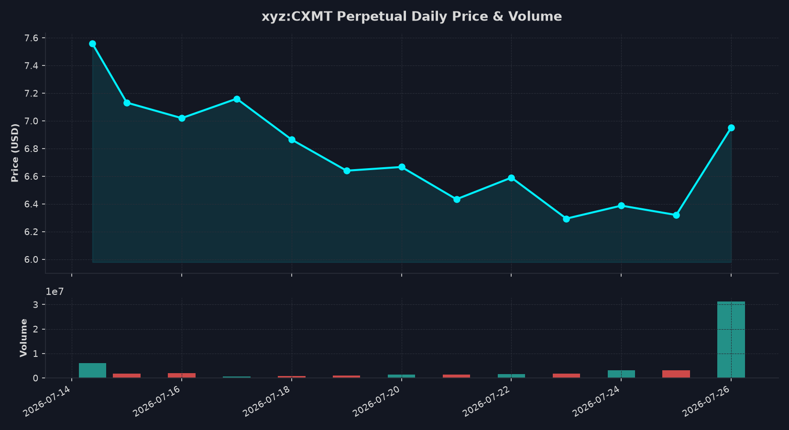

#+TITLE: ChangXin Memory Technologies (CXMT) Perpetual Future Tracker
#+AUTHOR: Antigravity Pairing Assistant
#+DATE: 2026-07-27
#+OPTIONS: toc:nil num:nil

* Overview
This document tracks the Hyperliquid perpetual future contract =xyz:CXMT=, which represents the pre-IPO valuation of *ChangXin Memory Technologies (CXMT)*, a leading Chinese semiconductor company specializing in DRAM memory chips.

All daily and intraday figures are calculated using **GMT+8 (Asia/Shanghai)** time zone calendar boundaries.

** Valuation Methodology
According to the IPO prospectus for ChangXin Memory Technologies (STAR Market STAR-board IPO):
- *IPO Offering Shares*: 6,688,000,000 shares (new shares issued, representing 10% of total shares).
- *Total Share Capital*: 66,880,000,000 shares (post-issuance total).
- *USD/CNY Exchange Rate*: Assumed to be *7.25* for valuation conversion.

Based on these figures, we calculate two implied valuations:
1. *Implied IPO Offering Valuation* = =Perp Price * 6.688 Billion=
2. *Implied Fully Diluted Valuation (Total Market Cap)* = =Perp Price * 66.88 Billion=

* Live Tracking
You can execute the python scripts =track_cxmt.py= (1-minute intraday) and =track_cxmt_daily.py= (daily history in GMT+8) to refresh real-time and historical data.

#+TITLE: Hyperliquid xyz:CXMT Tracker
#+DATE: 2026-07-27 13:19:02 (UTC+8)

* Real-Time Market Context
This table shows the latest real-time market data and calculated implied valuations based on the current mark price.

#+CAPTION: CXMT Real-Time Market Context
| Metric | Value | Description |
|--------+-------+-------------|
| Mark Price | $7.3116 | Current fair value price used for liquidations |
| Mid Price | $7.3152 | Midpoint of the current order book bid-ask spread |
| 24h Volume (USD) | $194,789,741.92 | Cumulative dollar trading volume in the last 24h |
| 24h Volume (CXMT) | 28,248,446.3 | Cumulative contract trading volume in the last 24h |
| Open Interest | 14,195,233.8 | Outstanding active perpetual positions |
| Funding Rate | -0.378285% / hr | Hourly premium rate (APR: -3313.78%) |
| Spot Oracle Premium | -6.51% | Premium of perp price relative to index oracle |
| Implied IPO Offering Valuation | $48.900B (RMB 354.525B) | Valuation of the 6.688B new shares offered |
| Implied Fully Diluted Valuation | $489.000B (RMB 3.545T) | Total company valuation based on 66.88B shares |

* Price Chart
Visual representation of today's intraday price movement and trading volume.

[[file:cxmt_price_chart.png]]

* Today's Pricing Data (1-Minute Candles)
Showing all granular 1-minute historical data for today (July 15, 2026). In total, 800 minutes of trading data are available.

#+CAPTION: CXMT 1-Minute Candlestick Data
| Time (Local) | Open (USD) | High (USD) | Low (USD) | Close (USD) | Volume (CXMT) | Notional (USD) | Fully Diluted Val (USD) | Fully Diluted Val (RMB) |
|--------------+------------+------------+-----------+-------------+---------------+----------------+-------------------------+-------------------------|
| 2026-07-27 00:00 |     6.3266 |     6.3390 |    6.3140 |      6.3140 |        3505.4 | $     22133.10 | $422.280B               | RMB 3.062T              |
| 2026-07-27 00:01 |     6.3227 |     6.3771 |    6.3120 |      6.3517 |        5582.8 | $     35460.27 | $424.802B               | RMB 3.080T              |
| 2026-07-27 00:02 |     6.3574 |     6.3620 |    6.3346 |      6.3412 |        3765.7 | $     23879.06 | $424.099B               | RMB 3.075T              |
| 2026-07-27 00:03 |     6.3469 |     6.3504 |    6.3193 |      6.3335 |        2199.6 | $     13931.17 | $423.584B               | RMB 3.071T              |
| 2026-07-27 00:04 |     6.3335 |     6.3487 |    6.3195 |      6.3445 |        3367.6 | $     21365.74 | $424.320B               | RMB 3.076T              |
| 2026-07-27 00:05 |     6.3417 |     6.3574 |    6.3400 |      6.3486 |        4135.4 | $     26254.00 | $424.594B               | RMB 3.078T              |
| 2026-07-27 00:06 |     6.3562 |     6.3695 |    6.3120 |      6.3336 |        4733.8 | $     29982.00 | $423.591B               | RMB 3.071T              |
| 2026-07-27 00:07 |     6.3412 |     6.3412 |    6.3000 |      6.3157 |        5733.1 | $     36208.54 | $422.394B               | RMB 3.062T              |
| 2026-07-27 00:08 |     6.3154 |     6.3184 |    6.3000 |      6.3000 |        6048.8 | $     38107.44 | $421.344B               | RMB 3.055T              |
| 2026-07-27 00:09 |     6.3076 |     6.3108 |    6.3000 |      6.3095 |        2391.3 | $     15087.91 | $421.979B               | RMB 3.059T              |
| 2026-07-27 00:10 |     6.3096 |     6.3099 |    6.3000 |      6.3064 |        2243.3 | $     14147.15 | $421.772B               | RMB 3.058T              |
| 2026-07-27 00:11 |     6.3059 |     6.3157 |    6.2940 |      6.2947 |        3799.3 | $     23915.45 | $420.990B               | RMB 3.052T              |
| 2026-07-27 00:12 |     6.2990 |     6.3064 |    6.2909 |      6.3041 |        1842.4 | $     11614.67 | $421.618B               | RMB 3.057T              |
| 2026-07-27 00:13 |     6.2989 |     6.3030 |    6.2888 |      6.2894 |        1537.0 | $      9666.81 | $420.635B               | RMB 3.050T              |
| 2026-07-27 00:14 |     6.2969 |     6.3128 |    6.2888 |      6.2980 |        2573.9 | $     16210.42 | $421.210B               | RMB 3.054T              |
| 2026-07-27 00:15 |     6.2993 |     6.2993 |    6.2888 |      6.2964 |        2642.6 | $     16638.87 | $421.103B               | RMB 3.053T              |
| 2026-07-27 00:16 |     6.2962 |     6.2998 |    6.2888 |      6.2896 |        1812.8 | $     11401.79 | $420.648B               | RMB 3.050T              |
| 2026-07-27 00:17 |     6.2950 |     6.2989 |    6.2888 |      6.2908 |        1748.4 | $     10998.83 | $420.729B               | RMB 3.050T              |
| 2026-07-27 00:18 |     6.2963 |     6.2963 |    6.2616 |      6.2686 |       16486.8 | $    103349.15 | $419.244B               | RMB 3.040T              |
| 2026-07-27 00:19 |     6.2727 |     6.2741 |    6.2616 |      6.2628 |        2092.4 | $     13104.28 | $418.856B               | RMB 3.037T              |
| 2026-07-27 00:20 |     6.2630 |     6.2687 |    6.2616 |      6.2616 |        4062.6 | $     25438.38 | $418.776B               | RMB 3.036T              |
| 2026-07-27 00:21 |     6.2649 |     6.2649 |    6.2520 |      6.2615 |       11069.3 | $     69310.42 | $418.769B               | RMB 3.036T              |
| 2026-07-27 00:22 |     6.2612 |     6.2701 |    6.2542 |      6.2542 |        2940.3 | $     18389.22 | $418.281B               | RMB 3.033T              |
| 2026-07-27 00:23 |     6.2585 |     6.2650 |    6.2520 |      6.2521 |        1713.9 | $     10715.47 | $418.140B               | RMB 3.032T              |
| 2026-07-27 00:24 |     6.2557 |     6.2802 |    6.2500 |      6.2800 |        6793.0 | $     42660.04 | $420.006B               | RMB 3.045T              |
| 2026-07-27 00:25 |     6.2801 |     6.2890 |    6.2800 |      6.2816 |        2864.4 | $     17993.02 | $420.113B               | RMB 3.046T              |
| 2026-07-27 00:26 |     6.2849 |     6.2884 |    6.2800 |      6.2824 |        1679.0 | $     10548.15 | $420.167B               | RMB 3.046T              |
| 2026-07-27 00:27 |     6.2839 |     6.3000 |    6.2832 |      6.2999 |       11927.4 | $     75141.43 | $421.337B               | RMB 3.055T              |
| 2026-07-27 00:28 |     6.2999 |     6.3172 |    6.2832 |      6.2955 |        4842.4 | $     30485.33 | $421.043B               | RMB 3.053T              |
| 2026-07-27 00:29 |     6.2955 |     6.3001 |    6.2800 |      6.2837 |        3090.1 | $     19417.26 | $420.254B               | RMB 3.047T              |
| 2026-07-27 00:30 |     6.2890 |     6.3017 |    6.2801 |      6.2941 |        2091.3 | $     13162.85 | $420.949B               | RMB 3.052T              |
| 2026-07-27 00:31 |     6.2936 |     6.3082 |    6.2820 |      6.3008 |        2780.2 | $     17517.48 | $421.398B               | RMB 3.055T              |
| 2026-07-27 00:32 |     6.3008 |     6.3082 |    6.2801 |      6.2940 |        3387.6 | $     21321.55 | $420.943B               | RMB 3.052T              |
| 2026-07-27 00:33 |     6.2940 |     6.3365 |    6.2846 |      6.3320 |       13163.5 | $     83351.28 | $423.484B               | RMB 3.070T              |
| 2026-07-27 00:34 |     6.3352 |     6.3455 |    6.3300 |      6.3300 |        8009.3 | $     50698.87 | $423.350B               | RMB 3.069T              |
| 2026-07-27 00:35 |     6.3303 |     6.3403 |    6.3300 |      6.3300 |        1861.8 | $     11785.19 | $423.350B               | RMB 3.069T              |
| 2026-07-27 00:36 |     6.3333 |     6.3419 |    6.3196 |      6.3261 |        1662.1 | $     10514.61 | $423.090B               | RMB 3.067T              |
| 2026-07-27 00:37 |     6.3324 |     6.3407 |    6.3063 |      6.3297 |        3064.1 | $     19394.83 | $423.330B               | RMB 3.069T              |
| 2026-07-27 00:38 |     6.3297 |     6.3330 |    6.3020 |      6.3090 |        5677.6 | $     35819.98 | $421.946B               | RMB 3.059T              |
| 2026-07-27 00:39 |     6.3090 |     6.3199 |    6.3057 |      6.3084 |        1732.2 | $     10927.41 | $421.906B               | RMB 3.059T              |
| 2026-07-27 00:40 |     6.3166 |     6.3166 |    6.3020 |      6.3097 |        1991.9 | $     12568.29 | $421.993B               | RMB 3.059T              |
| 2026-07-27 00:41 |     6.3149 |     6.3200 |    6.3081 |      6.3106 |         480.5 | $      3032.24 | $422.053B               | RMB 3.060T              |
| 2026-07-27 00:42 |     6.3171 |     6.3171 |    6.3060 |      6.3064 |         501.4 | $      3162.03 | $421.772B               | RMB 3.058T              |
| 2026-07-27 00:43 |     6.3125 |     6.3183 |    6.3040 |      6.3051 |         449.3 | $      2832.88 | $421.685B               | RMB 3.057T              |
| 2026-07-27 00:44 |     6.3130 |     6.3161 |    6.3040 |      6.3040 |         515.4 | $      3249.08 | $421.612B               | RMB 3.057T              |
| 2026-07-27 00:45 |     6.3021 |     6.3098 |    6.3020 |      6.3035 |        2764.2 | $     17424.13 | $421.578B               | RMB 3.056T              |
| 2026-07-27 00:46 |     6.3094 |     6.3145 |    6.3000 |      6.3067 |        5420.4 | $     34184.84 | $421.792B               | RMB 3.058T              |
| 2026-07-27 00:47 |     6.3085 |     6.3144 |    6.3000 |      6.3001 |         848.6 | $      5346.26 | $421.351B               | RMB 3.055T              |
| 2026-07-27 00:48 |     6.3034 |     6.3061 |    6.2980 |      6.3033 |         780.5 | $      4919.73 | $421.565B               | RMB 3.056T              |
| 2026-07-27 00:49 |     6.3059 |     6.3062 |    6.2997 |      6.2997 |         540.0 | $      3401.84 | $421.324B               | RMB 3.055T              |
| 2026-07-27 00:50 |     6.3016 |     6.3170 |    6.2970 |      6.3136 |        4559.8 | $     28788.75 | $422.254B               | RMB 3.061T              |
| 2026-07-27 00:51 |     6.3147 |     6.3155 |    6.2971 |      6.3007 |         642.7 | $      4049.46 | $421.391B               | RMB 3.055T              |
| 2026-07-27 00:52 |     6.3040 |     6.3065 |    6.2900 |      6.2900 |        6834.0 | $     42985.86 | $420.675B               | RMB 3.050T              |
| 2026-07-27 00:53 |     6.2943 |     6.3246 |    6.2943 |      6.3069 |       11641.7 | $     73423.04 | $421.805B               | RMB 3.058T              |
| 2026-07-27 00:54 |     6.3121 |     6.3139 |    6.2951 |      6.3127 |         712.6 | $      4498.43 | $422.193B               | RMB 3.061T              |
| 2026-07-27 00:55 |     6.3133 |     6.3182 |    6.3100 |      6.3119 |         530.1 | $      3345.94 | $422.140B               | RMB 3.061T              |
| 2026-07-27 00:56 |     6.3161 |     6.3180 |    6.3001 |      6.3063 |        2603.7 | $     16419.71 | $421.765B               | RMB 3.058T              |
| 2026-07-27 00:57 |     6.3053 |     6.3121 |    6.3005 |      6.3066 |         545.6 | $      3440.88 | $421.785B               | RMB 3.058T              |
| 2026-07-27 00:58 |     6.3061 |     6.3098 |    6.2955 |      6.3001 |        1299.9 | $      8189.50 | $421.351B               | RMB 3.055T              |
| 2026-07-27 00:59 |     6.3026 |     6.3100 |    6.2940 |      6.2978 |         634.0 | $      3992.81 | $421.197B               | RMB 3.054T              |
| 2026-07-27 01:00 |     6.3028 |     6.3065 |    6.2940 |      6.3011 |         644.2 | $      4059.17 | $421.418B               | RMB 3.055T              |
| 2026-07-27 01:01 |     6.3013 |     6.3087 |    6.2941 |      6.2955 |         781.0 | $      4916.79 | $421.043B               | RMB 3.053T              |
| 2026-07-27 01:02 |     6.2982 |     6.3100 |    6.2000 |      6.3100 |      113198.4 | $    714281.90 | $422.013B               | RMB 3.060T              |
| 2026-07-27 01:03 |     6.2859 |     6.2897 |    6.1682 |      6.2103 |       35220.8 | $    218731.73 | $415.345B               | RMB 3.011T              |
| 2026-07-27 01:04 |     6.2106 |     6.3558 |    6.1998 |      6.3251 |       52468.1 | $    331865.98 | $423.023B               | RMB 3.067T              |
| 2026-07-27 01:05 |     6.3501 |     6.3860 |    6.3256 |      6.3589 |       14168.7 | $     90097.35 | $425.283B               | RMB 3.083T              |
| 2026-07-27 01:06 |     6.3589 |     6.4273 |    6.3586 |      6.4129 |       11575.7 | $     74233.81 | $428.895B               | RMB 3.109T              |
| 2026-07-27 01:07 |     6.4160 |     6.4321 |    6.4031 |      6.4105 |        1937.4 | $     12419.70 | $428.734B               | RMB 3.108T              |
| 2026-07-27 01:08 |     6.4106 |     6.4262 |    6.4105 |      6.4185 |        1058.0 | $      6790.77 | $429.269B               | RMB 3.112T              |
| 2026-07-27 01:09 |     6.4249 |     6.4383 |    6.4175 |      6.4218 |        1304.6 | $      8377.88 | $429.490B               | RMB 3.114T              |
| 2026-07-27 01:10 |     6.4218 |     6.4218 |    6.3823 |      6.3869 |        4632.1 | $     29584.76 | $427.156B               | RMB 3.097T              |
| 2026-07-27 01:11 |     6.3900 |     6.4001 |    6.3761 |      6.3797 |        2761.2 | $     17615.63 | $426.674B               | RMB 3.093T              |
| 2026-07-27 01:12 |     6.3832 |     6.3886 |    6.3760 |      6.3760 |        2014.3 | $     12843.18 | $426.427B               | RMB 3.092T              |
| 2026-07-27 01:13 |     6.3760 |     6.3890 |    6.3760 |      6.3799 |         894.5 | $      5706.82 | $426.688B               | RMB 3.093T              |
| 2026-07-27 01:14 |     6.3800 |     6.3899 |    6.3690 |      6.3692 |        2233.3 | $     14224.33 | $425.972B               | RMB 3.088T              |
| 2026-07-27 01:15 |     6.3739 |     6.3740 |    6.3691 |      6.3697 |         404.7 | $      2577.82 | $426.006B               | RMB 3.089T              |
| 2026-07-27 01:16 |     6.3737 |     6.3916 |    6.3691 |      6.3700 |        1391.3 | $      8862.58 | $426.026B               | RMB 3.089T              |
| 2026-07-27 01:17 |     6.3703 |     6.3958 |    6.3619 |      6.3619 |        1874.4 | $     11924.75 | $425.484B               | RMB 3.085T              |
| 2026-07-27 01:18 |     6.3669 |     6.3690 |    6.3469 |      6.3480 |        1105.5 | $      7017.71 | $424.554B               | RMB 3.078T              |
| 2026-07-27 01:19 |     6.3520 |     6.4000 |    6.3439 |      6.3820 |        4448.6 | $     28390.97 | $426.828B               | RMB 3.095T              |
| 2026-07-27 01:20 |     6.3873 |     6.3934 |    6.3756 |      6.3790 |         788.6 | $      5030.48 | $426.628B               | RMB 3.093T              |
| 2026-07-27 01:21 |     6.3836 |     6.3893 |    6.3749 |      6.3759 |         703.0 | $      4482.26 | $426.420B               | RMB 3.092T              |
| 2026-07-27 01:22 |     6.3728 |     6.3798 |    6.3464 |      6.3464 |         661.9 | $      4200.68 | $424.447B               | RMB 3.077T              |
| 2026-07-27 01:23 |     6.3464 |     6.3614 |    6.3408 |      6.3548 |         913.9 | $      5807.65 | $425.009B               | RMB 3.081T              |
| 2026-07-27 01:24 |     6.3558 |     6.3634 |    6.3524 |      6.3550 |         986.3 | $      6267.94 | $425.022B               | RMB 3.081T              |
| 2026-07-27 01:25 |     6.3578 |     6.3615 |    6.3507 |      6.3560 |         474.2 | $      3014.02 | $425.089B               | RMB 3.082T              |
| 2026-07-27 01:26 |     6.3627 |     6.3627 |    6.3567 |      6.3582 |         360.0 | $      2288.95 | $425.236B               | RMB 3.083T              |
| 2026-07-27 01:27 |     6.3584 |     6.3584 |    6.3421 |      6.3525 |        1286.9 | $      8175.03 | $424.855B               | RMB 3.080T              |
| 2026-07-27 01:28 |     6.3539 |     6.3849 |    6.3473 |      6.3700 |        2689.1 | $     17129.57 | $426.026B               | RMB 3.089T              |
| 2026-07-27 01:29 |     6.3758 |     6.3758 |    6.3454 |      6.3462 |         630.9 | $      4003.82 | $424.434B               | RMB 3.077T              |
| 2026-07-27 01:30 |     6.3509 |     6.3583 |    6.3500 |      6.3509 |         533.0 | $      3385.03 | $424.748B               | RMB 3.079T              |
| 2026-07-27 01:31 |     6.3563 |     6.3628 |    6.3514 |      6.3580 |         810.7 | $      5154.43 | $425.223B               | RMB 3.083T              |
| 2026-07-27 01:32 |     6.3609 |     6.3609 |    6.3391 |      6.3448 |        3643.7 | $     23118.55 | $424.340B               | RMB 3.076T              |
| 2026-07-27 01:33 |     6.3418 |     6.3524 |    6.3393 |      6.3455 |         903.3 | $      5731.89 | $424.387B               | RMB 3.077T              |
| 2026-07-27 01:34 |     6.3492 |     6.3503 |    6.3224 |      6.3249 |        1248.3 | $      7895.37 | $423.009B               | RMB 3.067T              |
| 2026-07-27 01:35 |     6.3272 |     6.3300 |    6.3168 |      6.3254 |        1232.7 | $      7797.32 | $423.043B               | RMB 3.067T              |
| 2026-07-27 01:36 |     6.3254 |     6.3299 |    6.3186 |      6.3219 |        1188.5 | $      7513.58 | $422.809B               | RMB 3.065T              |
| 2026-07-27 01:37 |     6.3238 |     6.3310 |    6.3075 |      6.3187 |        2812.2 | $     17769.45 | $422.595B               | RMB 3.064T              |
| 2026-07-27 01:38 |     6.3151 |     6.3240 |    6.3040 |      6.3174 |        1669.6 | $     10547.53 | $422.508B               | RMB 3.063T              |
| 2026-07-27 01:39 |     6.3097 |     6.3190 |    6.3060 |      6.3113 |        1754.1 | $     11070.65 | $422.100B               | RMB 3.060T              |
| 2026-07-27 01:40 |     6.3132 |     6.3190 |    6.3020 |      6.3080 |        2988.6 | $     18852.09 | $421.879B               | RMB 3.059T              |
| 2026-07-27 01:41 |     6.3079 |     6.3148 |    6.2998 |      6.3035 |        1371.1 | $      8642.73 | $421.578B               | RMB 3.056T              |
| 2026-07-27 01:42 |     6.3020 |     6.3040 |    6.2933 |      6.2938 |        1003.3 | $      6314.57 | $420.929B               | RMB 3.052T              |
| 2026-07-27 01:43 |     6.2967 |     6.3000 |    6.2930 |      6.2954 |        1048.9 | $      6603.25 | $421.036B               | RMB 3.053T              |
| 2026-07-27 01:44 |     6.2982 |     6.2999 |    6.2950 |      6.2968 |         708.1 | $      4458.76 | $421.130B               | RMB 3.053T              |
| 2026-07-27 01:45 |     6.2978 |     6.3000 |    6.2929 |      6.2969 |         974.5 | $      6136.33 | $421.137B               | RMB 3.053T              |
| 2026-07-27 01:46 |     6.2993 |     6.3000 |    6.2930 |      6.2954 |         516.1 | $      3249.06 | $421.036B               | RMB 3.053T              |
| 2026-07-27 01:47 |     6.2971 |     6.2999 |    6.2929 |      6.2961 |         582.8 | $      3669.37 | $421.083B               | RMB 3.053T              |
| 2026-07-27 01:48 |     6.2963 |     6.2999 |    6.2929 |      6.2974 |         709.2 | $      4466.12 | $421.170B               | RMB 3.053T              |
| 2026-07-27 01:49 |     6.2998 |     6.2999 |    6.2958 |      6.2979 |         663.1 | $      4176.14 | $421.204B               | RMB 3.054T              |
| 2026-07-27 01:50 |     6.2996 |     6.2999 |    6.2958 |      6.2979 |         765.0 | $      4817.89 | $421.204B               | RMB 3.054T              |
| 2026-07-27 01:51 |     6.2996 |     6.2999 |    6.2958 |      6.2968 |         583.1 | $      3671.66 | $421.130B               | RMB 3.053T              |
| 2026-07-27 01:52 |     6.2995 |     6.2998 |    6.2943 |      6.2964 |        1325.7 | $      8347.14 | $421.103B               | RMB 3.053T              |
| 2026-07-27 01:53 |     6.2940 |     6.2999 |    6.2931 |      6.2966 |         610.8 | $      3845.96 | $421.117B               | RMB 3.053T              |
| 2026-07-27 01:54 |     6.2981 |     6.2998 |    6.2925 |      6.2927 |        1380.1 | $      8684.56 | $420.856B               | RMB 3.051T              |
| 2026-07-27 01:55 |     6.2949 |     6.3000 |    6.2918 |      6.2961 |        3410.6 | $     21473.48 | $421.083B               | RMB 3.053T              |
| 2026-07-27 01:56 |     6.2970 |     6.3000 |    6.2915 |      6.2976 |         597.0 | $      3759.67 | $421.183B               | RMB 3.054T              |
| 2026-07-27 01:57 |     6.2993 |     6.3000 |    6.2911 |      6.2932 |         694.2 | $      4368.74 | $420.889B               | RMB 3.051T              |
| 2026-07-27 01:58 |     6.2961 |     6.3000 |    6.2911 |      6.2972 |         593.8 | $      3739.28 | $421.157B               | RMB 3.053T              |
| 2026-07-27 01:59 |     6.2995 |     6.2996 |    6.2921 |      6.2929 |        2338.8 | $     14717.83 | $420.869B               | RMB 3.051T              |
| 2026-07-27 02:00 |     6.2955 |     6.2981 |    6.2906 |      6.2941 |         492.8 | $      3101.73 | $420.949B               | RMB 3.052T              |
| 2026-07-27 02:01 |     6.2956 |     6.2981 |    6.2900 |      6.2928 |         440.6 | $      2772.61 | $420.862B               | RMB 3.051T              |
| 2026-07-27 02:02 |     6.2941 |     6.2981 |    6.2888 |      6.2932 |         606.4 | $      3816.20 | $420.889B               | RMB 3.051T              |
| 2026-07-27 02:03 |     6.2959 |     6.2982 |    6.2888 |      6.2899 |         587.7 | $      3696.57 | $420.669B               | RMB 3.050T              |
| 2026-07-27 02:04 |     6.2927 |     6.2974 |    6.2888 |      6.2897 |         656.8 | $      4131.07 | $420.655B               | RMB 3.050T              |
| 2026-07-27 02:05 |     6.2925 |     6.3010 |    6.2888 |      6.2986 |         996.3 | $      6275.30 | $421.250B               | RMB 3.054T              |
| 2026-07-27 02:06 |     6.3009 |     6.3029 |    6.2921 |      6.2986 |         877.2 | $      5525.13 | $421.250B               | RMB 3.054T              |
| 2026-07-27 02:07 |     6.3023 |     6.3030 |    6.2901 |      6.2975 |         999.9 | $      6296.87 | $421.177B               | RMB 3.054T              |
| 2026-07-27 02:08 |     6.3000 |     6.3090 |    6.2900 |      6.3042 |        1775.1 | $     11190.59 | $421.625B               | RMB 3.057T              |
| 2026-07-27 02:09 |     6.3086 |     6.3086 |    6.3037 |      6.3037 |         750.5 | $      4730.93 | $421.591B               | RMB 3.057T              |
| 2026-07-27 02:10 |     6.3066 |     6.3087 |    6.2880 |      6.2933 |        1040.2 | $      6546.29 | $420.896B               | RMB 3.051T              |
| 2026-07-27 02:11 |     6.3000 |     6.3049 |    6.2885 |      6.2890 |         622.3 | $      3913.64 | $420.608B               | RMB 3.049T              |
| 2026-07-27 02:12 |     6.2933 |     6.2974 |    6.2880 |      6.2921 |         688.6 | $      4332.74 | $420.816B               | RMB 3.051T              |
| 2026-07-27 02:13 |     6.2931 |     6.2951 |    6.2818 |      6.2840 |        1351.5 | $      8492.83 | $420.274B               | RMB 3.047T              |
| 2026-07-27 02:14 |     6.2872 |     6.2888 |    6.2801 |      6.2858 |        1152.5 | $      7244.38 | $420.394B               | RMB 3.048T              |
| 2026-07-27 02:15 |     6.2868 |     6.2914 |    6.2801 |      6.2867 |         709.1 | $      4457.90 | $420.454B               | RMB 3.048T              |
| 2026-07-27 02:16 |     6.2885 |     6.2988 |    6.2801 |      6.2955 |         884.3 | $      5567.11 | $421.043B               | RMB 3.053T              |
| 2026-07-27 02:17 |     6.2950 |     6.3000 |    6.2802 |      6.2923 |        1701.3 | $     10705.09 | $420.829B               | RMB 3.051T              |
| 2026-07-27 02:18 |     6.2932 |     6.2979 |    6.2860 |      6.2866 |         734.2 | $      4615.62 | $420.448B               | RMB 3.048T              |
| 2026-07-27 02:19 |     6.2888 |     6.2944 |    6.2673 |      6.2751 |        2746.6 | $     17235.19 | $419.679B               | RMB 3.043T              |
| 2026-07-27 02:20 |     6.2687 |     6.2705 |    6.2286 |      6.2531 |        4647.2 | $     29059.41 | $418.207B               | RMB 3.032T              |
| 2026-07-27 02:21 |     6.2576 |     6.2603 |    6.2342 |      6.2446 |        1355.1 | $      8462.06 | $417.639B               | RMB 3.028T              |
| 2026-07-27 02:22 |     6.2398 |     6.2462 |    6.2200 |      6.2254 |        4242.8 | $     26413.13 | $416.355B               | RMB 3.019T              |
| 2026-07-27 02:23 |     6.2254 |     6.2254 |    6.2000 |      6.2093 |        9885.0 | $     61378.93 | $415.278B               | RMB 3.011T              |
| 2026-07-27 02:24 |     6.2089 |     6.2089 |    6.1800 |      6.1814 |        9589.1 | $     59274.06 | $413.412B               | RMB 2.997T              |
| 2026-07-27 02:25 |     6.1800 |     6.1800 |    6.1592 |      6.1667 |        6774.3 | $     41775.08 | $412.429B               | RMB 2.990T              |
| 2026-07-27 02:26 |     6.1705 |     6.1776 |    6.1568 |      6.1600 |        1952.8 | $     12029.25 | $411.981B               | RMB 2.987T              |
| 2026-07-27 02:27 |     6.1626 |     6.1677 |    6.1569 |      6.1620 |        1041.8 | $      6419.57 | $412.115B               | RMB 2.988T              |
| 2026-07-27 02:28 |     6.1662 |     6.1775 |    6.1642 |      6.1706 |        1104.8 | $      6817.28 | $412.690B               | RMB 2.992T              |
| 2026-07-27 02:29 |     6.1742 |     6.1758 |    6.1701 |      6.1710 |         836.1 | $      5159.57 | $412.716B               | RMB 2.992T              |
| 2026-07-27 02:30 |     6.1736 |     6.1760 |    6.1702 |      6.1743 |        1131.9 | $      6988.69 | $412.937B               | RMB 2.994T              |
| 2026-07-27 02:31 |     6.1755 |     6.1795 |    6.1701 |      6.1732 |         673.9 | $      4160.12 | $412.864B               | RMB 2.993T              |
| 2026-07-27 02:32 |     6.1745 |     6.1960 |    6.1700 |      6.1960 |        3922.0 | $     24300.71 | $414.388B               | RMB 3.004T              |
| 2026-07-27 02:33 |     6.1955 |     6.2260 |    6.1948 |      6.2169 |        9034.1 | $     56164.10 | $415.786B               | RMB 3.014T              |
| 2026-07-27 02:34 |     6.2154 |     6.2909 |    6.2150 |      6.2908 |       12876.5 | $     81003.49 | $420.729B               | RMB 3.050T              |
| 2026-07-27 02:35 |     6.2845 |     6.2909 |    6.2750 |      6.2830 |        4728.9 | $     29711.68 | $420.207B               | RMB 3.047T              |
| 2026-07-27 02:36 |     6.2840 |     6.3000 |    6.2286 |      6.2830 |        7254.8 | $     45581.91 | $420.207B               | RMB 3.047T              |
| 2026-07-27 02:37 |     6.2860 |     6.3000 |    6.2854 |      6.2938 |        1619.3 | $     10191.55 | $420.929B               | RMB 3.052T              |
| 2026-07-27 02:38 |     6.2989 |     6.3199 |    6.2946 |      6.3106 |        5865.1 | $     37012.30 | $422.053B               | RMB 3.060T              |
| 2026-07-27 02:39 |     6.3158 |     6.3499 |    6.3135 |      6.3499 |        4075.2 | $     25877.11 | $424.681B               | RMB 3.079T              |
| 2026-07-27 02:40 |     6.3459 |     6.3500 |    6.3416 |      6.3444 |        3140.8 | $     19926.49 | $424.313B               | RMB 3.076T              |
| 2026-07-27 02:41 |     6.3453 |     6.3500 |    6.3329 |      6.3396 |        2926.9 | $     18555.38 | $423.992B               | RMB 3.074T              |
| 2026-07-27 02:42 |     6.3440 |     6.3750 |    6.3395 |      6.3590 |        6663.5 | $     42373.20 | $425.290B               | RMB 3.083T              |
| 2026-07-27 02:43 |     6.3643 |     6.3657 |    6.3403 |      6.3654 |        2871.9 | $     18280.79 | $425.718B               | RMB 3.086T              |
| 2026-07-27 02:44 |     6.3652 |     6.3727 |    6.3541 |      6.3631 |        3154.8 | $     20074.31 | $425.564B               | RMB 3.085T              |
| 2026-07-27 02:45 |     6.3633 |     6.3750 |    6.3602 |      6.3724 |        2806.7 | $     17885.42 | $426.186B               | RMB 3.090T              |
| 2026-07-27 02:46 |     6.3706 |     6.3810 |    6.3658 |      6.3758 |        2682.6 | $     17103.72 | $426.414B               | RMB 3.091T              |
| 2026-07-27 02:47 |     6.3797 |     6.3868 |    6.3768 |      6.3820 |        7955.3 | $     50770.72 | $426.828B               | RMB 3.095T              |
| 2026-07-27 02:48 |     6.3816 |     6.3873 |    6.3600 |      6.3862 |        3855.1 | $     24619.44 | $427.109B               | RMB 3.097T              |
| 2026-07-27 02:49 |     6.3859 |     6.3966 |    6.3702 |      6.3861 |        2907.9 | $     18570.14 | $427.102B               | RMB 3.096T              |
| 2026-07-27 02:50 |     6.3855 |     6.3933 |    6.3741 |      6.3879 |        1190.6 | $      7605.43 | $427.223B               | RMB 3.097T              |
| 2026-07-27 02:51 |     6.3876 |     6.3941 |    6.3765 |      6.3765 |        1738.9 | $     11088.10 | $426.460B               | RMB 3.092T              |
| 2026-07-27 02:52 |     6.3822 |     6.3822 |    6.3443 |      6.3661 |        4176.7 | $     26589.29 | $425.765B               | RMB 3.087T              |
| 2026-07-27 02:53 |     6.3619 |     6.3700 |    6.3461 |      6.3607 |        2540.1 | $     16156.81 | $425.404B               | RMB 3.084T              |
| 2026-07-27 02:54 |     6.3642 |     6.3852 |    6.3621 |      6.3683 |        3200.0 | $     20378.56 | $425.912B               | RMB 3.088T              |
| 2026-07-27 02:55 |     6.3698 |     6.3945 |    6.3649 |      6.3722 |        1251.6 | $      7975.45 | $426.173B               | RMB 3.090T              |
| 2026-07-27 02:56 |     6.3743 |     6.3881 |    6.3690 |      6.3818 |         778.4 | $      4967.59 | $426.815B               | RMB 3.094T              |
| 2026-07-27 02:57 |     6.3818 |     6.3996 |    6.3756 |      6.3929 |        1637.6 | $     10469.01 | $427.557B               | RMB 3.100T              |
| 2026-07-27 02:58 |     6.3930 |     6.3996 |    6.3814 |      6.3866 |        1529.8 | $      9770.22 | $427.136B               | RMB 3.097T              |
| 2026-07-27 02:59 |     6.3845 |     6.3942 |    6.3711 |      6.3920 |        2123.7 | $     13574.69 | $427.497B               | RMB 3.099T              |
| 2026-07-27 03:00 |     6.3780 |     6.3992 |    6.3780 |      6.3925 |        4062.9 | $     25972.09 | $427.530B               | RMB 3.100T              |
| 2026-07-27 03:01 |     6.3925 |     6.3956 |    6.3748 |      6.3760 |        1793.8 | $     11437.27 | $426.427B               | RMB 3.092T              |
| 2026-07-27 03:02 |     6.3833 |     6.3833 |    6.3499 |      6.3612 |        1852.9 | $     11786.67 | $425.437B               | RMB 3.084T              |
| 2026-07-27 03:03 |     6.3600 |     6.3661 |    6.3488 |      6.3544 |        1213.4 | $      7710.43 | $424.982B               | RMB 3.081T              |
| 2026-07-27 03:04 |     6.3615 |     6.3700 |    6.3300 |      6.3348 |        3301.2 | $     20912.44 | $423.671B               | RMB 3.072T              |
| 2026-07-27 03:05 |     6.3377 |     6.3505 |    6.3377 |      6.3423 |        1792.7 | $     11369.84 | $424.173B               | RMB 3.075T              |
| 2026-07-27 03:06 |     6.3472 |     6.3505 |    6.3411 |      6.3433 |         761.3 | $      4829.15 | $424.240B               | RMB 3.076T              |
| 2026-07-27 03:07 |     6.3426 |     6.3433 |    6.3093 |      6.3161 |        3553.6 | $     22444.89 | $422.421B               | RMB 3.063T              |
| 2026-07-27 03:08 |     6.3250 |     6.3259 |    6.2948 |      6.3001 |        3993.0 | $     25156.30 | $421.351B               | RMB 3.055T              |
| 2026-07-27 03:09 |     6.3010 |     6.3090 |    6.2945 |      6.2969 |        1500.8 | $      9450.39 | $421.137B               | RMB 3.053T              |
| 2026-07-27 03:10 |     6.2933 |     6.3203 |    6.2800 |      6.2909 |        3946.1 | $     24824.52 | $420.735B               | RMB 3.050T              |
| 2026-07-27 03:11 |     6.2956 |     6.3203 |    6.2880 |      6.2959 |        2442.8 | $     15379.62 | $421.070B               | RMB 3.053T              |
| 2026-07-27 03:12 |     6.2948 |     6.3098 |    6.2879 |      6.2991 |        1236.7 | $      7790.10 | $421.284B               | RMB 3.054T              |
| 2026-07-27 03:13 |     6.2993 |     6.3097 |    6.2851 |      6.3040 |        1842.0 | $     11611.97 | $421.612B               | RMB 3.057T              |
| 2026-07-27 03:14 |     6.3051 |     6.3052 |    6.2707 |      6.2786 |        4742.6 | $     29776.89 | $419.913B               | RMB 3.044T              |
| 2026-07-27 03:15 |     6.2818 |     6.3099 |    6.2777 |      6.3061 |        2137.0 | $     13476.14 | $421.752B               | RMB 3.058T              |
| 2026-07-27 03:16 |     6.3095 |     6.3152 |    6.2844 |      6.2858 |        1421.9 | $      8937.78 | $420.394B               | RMB 3.048T              |
| 2026-07-27 03:17 |     6.2887 |     6.2977 |    6.2200 |      6.2351 |        5549.5 | $     34601.69 | $417.003B               | RMB 3.023T              |
| 2026-07-27 03:18 |     6.2351 |     6.2604 |    6.2351 |      6.2572 |        1314.6 | $      8225.72 | $418.482B               | RMB 3.034T              |
| 2026-07-27 03:19 |     6.2589 |     6.2590 |    6.2382 |      6.2397 |        1121.9 | $      7000.32 | $417.311B               | RMB 3.026T              |
| 2026-07-27 03:20 |     6.2428 |     6.2485 |    6.2200 |      6.2424 |        2306.1 | $     14395.60 | $417.492B               | RMB 3.027T              |
| 2026-07-27 03:21 |     6.2424 |     6.2473 |    6.2290 |      6.2384 |        1886.4 | $     11768.12 | $417.224B               | RMB 3.025T              |
| 2026-07-27 03:22 |     6.2421 |     6.2473 |    6.2396 |      6.2436 |         767.1 | $      4789.47 | $417.572B               | RMB 3.027T              |
| 2026-07-27 03:23 |     6.2467 |     6.2531 |    6.2351 |      6.2410 |         941.3 | $      5874.65 | $417.398B               | RMB 3.026T              |
| 2026-07-27 03:24 |     6.2462 |     6.2503 |    6.2367 |      6.2431 |         870.3 | $      5433.37 | $417.539B               | RMB 3.027T              |
| 2026-07-27 03:25 |     6.2451 |     6.2486 |    6.2200 |      6.2402 |        1738.1 | $     10846.09 | $417.345B               | RMB 3.026T              |
| 2026-07-27 03:26 |     6.2405 |     6.2451 |    6.2100 |      6.2261 |        2735.6 | $     17032.12 | $416.402B               | RMB 3.019T              |
| 2026-07-27 03:27 |     6.2308 |     6.2367 |    6.2213 |      6.2273 |        1143.9 | $      7123.41 | $416.482B               | RMB 3.019T              |
| 2026-07-27 03:28 |     6.2320 |     6.2336 |    6.2171 |      6.2336 |         949.2 | $      5916.93 | $416.903B               | RMB 3.023T              |
| 2026-07-27 03:29 |     6.2348 |     6.2418 |    6.2262 |      6.2273 |         865.4 | $      5389.11 | $416.482B               | RMB 3.019T              |
| 2026-07-27 03:30 |     6.2278 |     6.2419 |    6.2222 |      6.2329 |         785.9 | $      4898.44 | $416.856B               | RMB 3.022T              |
| 2026-07-27 03:31 |     6.2407 |     6.2521 |    6.2383 |      6.2470 |        1106.8 | $      6914.18 | $417.799B               | RMB 3.029T              |
| 2026-07-27 03:32 |     6.2515 |     6.2742 |    6.2469 |      6.2614 |        1307.0 | $      8183.65 | $418.762B               | RMB 3.036T              |
| 2026-07-27 03:33 |     6.2650 |     6.2670 |    6.2444 |      6.2444 |         772.1 | $      4821.30 | $417.625B               | RMB 3.028T              |
| 2026-07-27 03:34 |     6.2489 |     6.2551 |    6.2384 |      6.2385 |        2304.6 | $     14377.25 | $417.231B               | RMB 3.025T              |
| 2026-07-27 03:35 |     6.2411 |     6.3001 |    6.2241 |      6.2644 |        5119.3 | $     32069.34 | $418.963B               | RMB 3.037T              |
| 2026-07-27 03:36 |     6.2766 |     6.3013 |    6.2732 |      6.2950 |        1524.1 | $      9594.21 | $421.010B               | RMB 3.052T              |
| 2026-07-27 03:37 |     6.3008 |     6.3153 |    6.2958 |      6.3099 |        1396.3 | $      8810.51 | $422.006B               | RMB 3.060T              |
| 2026-07-27 03:38 |     6.3135 |     6.3153 |    6.3064 |      6.3091 |         865.0 | $      5457.37 | $421.953B               | RMB 3.059T              |
| 2026-07-27 03:39 |     6.3117 |     6.3218 |    6.3095 |      6.3218 |        1520.3 | $      9611.03 | $422.802B               | RMB 3.065T              |
| 2026-07-27 03:40 |     6.3218 |     6.3354 |    6.3101 |      6.3175 |        1760.6 | $     11122.59 | $422.514B               | RMB 3.063T              |
| 2026-07-27 03:41 |     6.3282 |     6.3348 |    6.3110 |      6.3274 |         975.2 | $      6170.48 | $423.177B               | RMB 3.068T              |
| 2026-07-27 03:42 |     6.3274 |     6.3362 |    6.3148 |      6.3237 |        1197.2 | $      7570.73 | $422.929B               | RMB 3.066T              |
| 2026-07-27 03:43 |     6.3236 |     6.3812 |    6.3226 |      6.3812 |        8069.9 | $     51495.65 | $426.775B               | RMB 3.094T              |
| 2026-07-27 03:44 |     6.3512 |     6.3614 |    6.3414 |      6.3500 |        1688.1 | $     10719.43 | $424.688B               | RMB 3.079T              |
| 2026-07-27 03:45 |     6.3535 |     6.3600 |    6.3441 |      6.3523 |         928.1 | $      5895.57 | $424.842B               | RMB 3.080T              |
| 2026-07-27 03:46 |     6.3596 |     6.3655 |    6.3300 |      6.3300 |        2013.3 | $     12744.19 | $423.350B               | RMB 3.069T              |
| 2026-07-27 03:47 |     6.3320 |     6.3468 |    6.3123 |      6.3156 |        2231.1 | $     14090.74 | $422.387B               | RMB 3.062T              |
| 2026-07-27 03:48 |     6.3171 |     6.3194 |    6.3104 |      6.3153 |         824.5 | $      5206.96 | $422.367B               | RMB 3.062T              |
| 2026-07-27 03:49 |     6.3190 |     6.3200 |    6.3137 |      6.3163 |        2745.0 | $     17338.24 | $422.434B               | RMB 3.063T              |
| 2026-07-27 03:50 |     6.3198 |     6.3200 |    6.3114 |      6.3150 |         806.6 | $      5093.68 | $422.347B               | RMB 3.062T              |
| 2026-07-27 03:51 |     6.3191 |     6.3200 |    6.3107 |      6.3147 |        1364.7 | $      8617.67 | $422.327B               | RMB 3.062T              |
| 2026-07-27 03:52 |     6.3154 |     6.3200 |    6.3129 |      6.3153 |         844.6 | $      5333.90 | $422.367B               | RMB 3.062T              |
| 2026-07-27 03:53 |     6.3191 |     6.3200 |    6.2929 |      6.2974 |        3022.5 | $     19033.89 | $421.170B               | RMB 3.053T              |
| 2026-07-27 03:54 |     6.2994 |     6.3000 |    6.2939 |      6.2969 |        1561.7 | $      9833.87 | $421.137B               | RMB 3.053T              |
| 2026-07-27 03:55 |     6.2983 |     6.3000 |    6.2939 |      6.2963 |        1135.1 | $      7146.93 | $421.097B               | RMB 3.053T              |
| 2026-07-27 03:56 |     6.2987 |     6.2990 |    6.2938 |      6.2960 |         725.4 | $      4567.12 | $421.076B               | RMB 3.053T              |
| 2026-07-27 03:57 |     6.2984 |     6.2990 |    6.2948 |      6.2968 |         800.8 | $      5042.48 | $421.130B               | RMB 3.053T              |
| 2026-07-27 03:58 |     6.2988 |     6.2990 |    6.2705 |      6.2760 |        1427.9 | $      8961.50 | $419.739B               | RMB 3.043T              |
| 2026-07-27 03:59 |     6.2749 |     6.2969 |    6.2697 |      6.2921 |        1096.7 | $      6900.55 | $420.816B               | RMB 3.051T              |
| 2026-07-27 04:00 |     6.2969 |     6.2970 |    6.2758 |      6.2758 |         844.5 | $      5299.91 | $419.726B               | RMB 3.043T              |
| 2026-07-27 04:01 |     6.2720 |     6.2806 |    6.2632 |      6.2788 |        1639.7 | $     10295.35 | $419.926B               | RMB 3.044T              |
| 2026-07-27 04:02 |     6.2770 |     6.2803 |    6.2663 |      6.2741 |         912.7 | $      5726.37 | $419.612B               | RMB 3.042T              |
| 2026-07-27 04:03 |     6.2752 |     6.2813 |    6.2687 |      6.2787 |         827.9 | $      5198.14 | $419.919B               | RMB 3.044T              |
| 2026-07-27 04:04 |     6.2807 |     6.2818 |    6.2685 |      6.2685 |        1421.2 | $      8908.79 | $419.237B               | RMB 3.039T              |
| 2026-07-27 04:05 |     6.2694 |     6.2818 |    6.2643 |      6.2818 |        1090.9 | $      6852.82 | $420.127B               | RMB 3.046T              |
| 2026-07-27 04:06 |     6.2790 |     6.2818 |    6.2643 |      6.2645 |         978.4 | $      6129.19 | $418.970B               | RMB 3.038T              |
| 2026-07-27 04:07 |     6.2677 |     6.2706 |    6.2633 |      6.2706 |        2972.6 | $     18639.99 | $419.378B               | RMB 3.040T              |
| 2026-07-27 04:08 |     6.2696 |     6.2740 |    6.2633 |      6.2674 |        2472.0 | $     15493.01 | $419.164B               | RMB 3.039T              |
| 2026-07-27 04:09 |     6.2682 |     6.2802 |    6.2682 |      6.2738 |        1006.4 | $      6313.95 | $419.592B               | RMB 3.042T              |
| 2026-07-27 04:10 |     6.2768 |     6.4721 |    6.2768 |      6.4450 |       70368.5 | $    453524.98 | $431.042B               | RMB 3.125T              |
| 2026-07-27 04:11 |     6.4421 |     6.4554 |    6.4159 |      6.4405 |        2124.4 | $     13682.20 | $430.741B               | RMB 3.123T              |
| 2026-07-27 04:12 |     6.4384 |     6.4482 |    6.4379 |      6.4408 |        1226.8 | $      7901.57 | $430.761B               | RMB 3.123T              |
| 2026-07-27 04:13 |     6.4475 |     6.4700 |    6.4430 |      6.4530 |        2054.4 | $     13257.04 | $431.577B               | RMB 3.129T              |
| 2026-07-27 04:14 |     6.4494 |     6.4701 |    6.4356 |      6.4356 |        1872.4 | $     12050.02 | $430.413B               | RMB 3.120T              |
| 2026-07-27 04:15 |     6.4356 |     6.4459 |    6.4127 |      6.4306 |        2571.3 | $     16535.00 | $430.079B               | RMB 3.118T              |
| 2026-07-27 04:16 |     6.4339 |     6.4710 |    6.4339 |      6.4621 |        2105.6 | $     13606.60 | $432.185B               | RMB 3.133T              |
| 2026-07-27 04:17 |     6.4626 |     6.4700 |    6.4377 |      6.4380 |        1821.8 | $     11728.75 | $430.573B               | RMB 3.122T              |
| 2026-07-27 04:18 |     6.4425 |     6.4536 |    6.4344 |      6.4383 |        1286.9 | $      8285.45 | $430.594B               | RMB 3.122T              |
| 2026-07-27 04:19 |     6.4363 |     6.4637 |    6.4356 |      6.4542 |        1235.8 | $      7976.10 | $431.657B               | RMB 3.130T              |
| 2026-07-27 04:20 |     6.4604 |     6.4604 |    6.4400 |      6.4456 |         677.4 | $      4366.25 | $431.082B               | RMB 3.125T              |
| 2026-07-27 04:21 |     6.4427 |     6.4628 |    6.4350 |      6.4510 |        1121.0 | $      7231.57 | $431.443B               | RMB 3.128T              |
| 2026-07-27 04:22 |     6.4448 |     6.4448 |    6.4282 |      6.4382 |         984.0 | $      6335.19 | $430.587B               | RMB 3.122T              |
| 2026-07-27 04:23 |     6.4385 |     6.4472 |    6.4308 |      6.4390 |         689.4 | $      4439.05 | $430.640B               | RMB 3.122T              |
| 2026-07-27 04:24 |     6.4453 |     6.4489 |    6.4255 |      6.4275 |        1029.7 | $      6618.40 | $429.871B               | RMB 3.117T              |
| 2026-07-27 04:25 |     6.4318 |     6.4399 |    6.4262 |      6.4325 |         520.0 | $      3344.90 | $430.206B               | RMB 3.119T              |
| 2026-07-27 04:26 |     6.4332 |     6.4393 |    6.4278 |      6.4341 |         837.7 | $      5389.85 | $430.313B               | RMB 3.120T              |
| 2026-07-27 04:27 |     6.4390 |     6.4430 |    6.4146 |      6.4293 |        1255.6 | $      8072.63 | $429.992B               | RMB 3.117T              |
| 2026-07-27 04:28 |     6.4259 |     6.4382 |    6.4063 |      6.4307 |        1598.4 | $     10278.83 | $430.085B               | RMB 3.118T              |
| 2026-07-27 04:29 |     6.4310 |     6.4364 |    6.4126 |      6.4166 |        1153.7 | $      7402.83 | $429.142B               | RMB 3.111T              |
| 2026-07-27 04:30 |     6.4139 |     6.4354 |    6.4139 |      6.4200 |        1004.7 | $      6450.17 | $429.370B               | RMB 3.113T              |
| 2026-07-27 04:31 |     6.4218 |     6.4385 |    6.4178 |      6.4287 |         876.6 | $      5635.40 | $429.951B               | RMB 3.117T              |
| 2026-07-27 04:32 |     6.4296 |     6.4446 |    6.4198 |      6.4389 |        1214.2 | $      7818.11 | $430.634B               | RMB 3.122T              |
| 2026-07-27 04:33 |     6.4419 |     6.4590 |    6.4254 |      6.4272 |        1430.2 | $      9192.18 | $429.851B               | RMB 3.116T              |
| 2026-07-27 04:34 |     6.4430 |     6.4488 |    6.4272 |      6.4272 |         753.5 | $      4842.90 | $429.851B               | RMB 3.116T              |
| 2026-07-27 04:35 |     6.4394 |     6.4734 |    6.4063 |      6.4650 |        3165.4 | $     20464.31 | $432.379B               | RMB 3.135T              |
| 2026-07-27 04:36 |     6.4652 |     6.4692 |    6.4345 |      6.4382 |         908.5 | $      5849.10 | $430.587B               | RMB 3.122T              |
| 2026-07-27 04:37 |     6.4415 |     6.4596 |    6.4285 |      6.4410 |        1347.7 | $      8680.54 | $430.774B               | RMB 3.123T              |
| 2026-07-27 04:38 |     6.4379 |     6.4551 |    6.3600 |      6.3994 |        4458.8 | $     28533.64 | $427.992B               | RMB 3.103T              |
| 2026-07-27 04:39 |     6.4099 |     6.4321 |    6.4020 |      6.4219 |        1324.4 | $      8505.16 | $429.497B               | RMB 3.114T              |
| 2026-07-27 04:40 |     6.4226 |     6.4833 |    6.4122 |      6.4491 |        3636.8 | $     23454.09 | $431.316B               | RMB 3.127T              |
| 2026-07-27 04:41 |     6.4491 |     6.4582 |    6.4008 |      6.4154 |        2436.3 | $     15629.84 | $429.062B               | RMB 3.111T              |
| 2026-07-27 04:42 |     6.4170 |     6.4338 |    6.4170 |      6.4243 |        1038.6 | $      6672.28 | $429.657B               | RMB 3.115T              |
| 2026-07-27 04:43 |     6.4248 |     6.4338 |    6.4200 |      6.4202 |        1827.5 | $     11732.92 | $429.383B               | RMB 3.113T              |
| 2026-07-27 04:44 |     6.4274 |     6.4344 |    6.4177 |      6.4212 |         800.5 | $      5140.17 | $429.450B               | RMB 3.114T              |
| 2026-07-27 04:45 |     6.4219 |     6.4574 |    6.4219 |      6.4536 |        3056.6 | $     19726.07 | $431.617B               | RMB 3.129T              |
| 2026-07-27 04:46 |     6.4494 |     6.4770 |    6.4485 |      6.4733 |        2452.7 | $     15877.06 | $432.934B               | RMB 3.139T              |
| 2026-07-27 04:47 |     6.4742 |     6.4856 |    6.4720 |      6.4807 |        2637.8 | $     17094.79 | $433.429B               | RMB 3.142T              |
| 2026-07-27 04:48 |     6.4807 |     6.4850 |    6.4642 |      6.4813 |        4985.2 | $     32310.58 | $433.469B               | RMB 3.143T              |
| 2026-07-27 04:49 |     6.4800 |     6.4856 |    6.4699 |      6.4770 |        1648.8 | $     10679.28 | $433.182B               | RMB 3.141T              |
| 2026-07-27 04:50 |     6.4790 |     6.4856 |    6.4790 |      6.4800 |        1273.6 | $      8252.93 | $433.382B               | RMB 3.142T              |
| 2026-07-27 04:51 |     6.4797 |     6.4951 |    6.4749 |      6.4939 |        3150.8 | $     20460.98 | $434.312B               | RMB 3.149T              |
| 2026-07-27 04:52 |     6.4953 |     6.5000 |    6.4609 |      6.4746 |        4112.5 | $     26626.79 | $433.021B               | RMB 3.139T              |
| 2026-07-27 04:53 |     6.4760 |     6.4885 |    6.4760 |      6.4765 |        1136.6 | $      7361.19 | $433.148B               | RMB 3.140T              |
| 2026-07-27 04:54 |     6.4766 |     6.4886 |    6.4659 |      6.4706 |        1414.4 | $      9152.02 | $432.754B               | RMB 3.137T              |
| 2026-07-27 04:55 |     6.4744 |     6.4800 |    6.4600 |      6.4663 |        3275.3 | $     21179.07 | $432.466B               | RMB 3.135T              |
| 2026-07-27 04:56 |     6.4663 |     6.4669 |    6.4600 |      6.4616 |        1125.2 | $      7270.59 | $432.152B               | RMB 3.133T              |
| 2026-07-27 04:57 |     6.4616 |     6.4673 |    6.4616 |      6.4642 |         755.9 | $      4886.29 | $432.326B               | RMB 3.134T              |
| 2026-07-27 04:58 |     6.4645 |     6.4763 |    6.4644 |      6.4703 |        1158.6 | $      7496.49 | $432.734B               | RMB 3.137T              |
| 2026-07-27 04:59 |     6.4703 |     6.4763 |    6.4425 |      6.4556 |        5704.0 | $     36822.74 | $431.751B               | RMB 3.130T              |
| 2026-07-27 05:00 |     6.4636 |     6.4700 |    6.4475 |      6.4495 |        2436.9 | $     15716.79 | $431.343B               | RMB 3.127T              |
| 2026-07-27 05:01 |     6.4466 |     6.4700 |    6.4440 |      6.4519 |        1702.4 | $     10983.71 | $431.503B               | RMB 3.128T              |
| 2026-07-27 05:02 |     6.4476 |     6.4575 |    6.4371 |      6.4530 |        1287.5 | $      8308.24 | $431.577B               | RMB 3.129T              |
| 2026-07-27 05:03 |     6.4521 |     6.4669 |    6.4502 |      6.4557 |         887.8 | $      5731.37 | $431.757B               | RMB 3.130T              |
| 2026-07-27 05:04 |     6.4548 |     6.4653 |    6.4350 |      6.4647 |        1205.7 | $      7794.49 | $432.359B               | RMB 3.135T              |
| 2026-07-27 05:05 |     6.4614 |     6.4692 |    6.4463 |      6.4605 |        1190.5 | $      7691.23 | $432.078B               | RMB 3.133T              |
| 2026-07-27 05:06 |     6.4606 |     6.4657 |    6.4555 |      6.4557 |         860.9 | $      5557.71 | $431.757B               | RMB 3.130T              |
| 2026-07-27 05:07 |     6.4559 |     6.4591 |    6.4337 |      6.4545 |        1710.2 | $     11038.49 | $431.677B               | RMB 3.130T              |
| 2026-07-27 05:08 |     6.4469 |     6.4498 |    6.4243 |      6.4380 |        1202.0 | $      7738.48 | $430.573B               | RMB 3.122T              |
| 2026-07-27 05:09 |     6.4337 |     6.4564 |    6.4297 |      6.4512 |        1745.5 | $     11260.57 | $431.456B               | RMB 3.128T              |
| 2026-07-27 05:10 |     6.4526 |     6.4580 |    6.4218 |      6.4320 |        2138.4 | $     13754.19 | $430.172B               | RMB 3.119T              |
| 2026-07-27 05:11 |     6.4354 |     6.4561 |    6.4307 |      6.4307 |        2355.1 | $     15144.94 | $430.085B               | RMB 3.118T              |
| 2026-07-27 05:12 |     6.4340 |     6.4570 |    6.4340 |      6.4525 |        1357.7 | $      8760.56 | $431.543B               | RMB 3.129T              |
| 2026-07-27 05:13 |     6.4570 |     6.4657 |    6.4543 |      6.4608 |        1870.5 | $     12084.93 | $432.098B               | RMB 3.133T              |
| 2026-07-27 05:14 |     6.4608 |     6.4763 |    6.4608 |      6.4707 |        3337.7 | $     21597.26 | $432.760B               | RMB 3.138T              |
| 2026-07-27 05:15 |     6.4707 |     6.4763 |    6.4470 |      6.4635 |        7674.2 | $     49602.19 | $432.279B               | RMB 3.134T              |
| 2026-07-27 05:16 |     6.4642 |     6.4763 |    6.4641 |      6.4732 |        2555.3 | $     16540.97 | $432.928B               | RMB 3.139T              |
| 2026-07-27 05:17 |     6.4735 |     6.4763 |    6.4720 |      6.4720 |        1388.5 | $      8986.37 | $432.847B               | RMB 3.138T              |
| 2026-07-27 05:18 |     6.4721 |     6.4763 |    6.4666 |      6.4666 |        6537.3 | $     42274.10 | $432.486B               | RMB 3.136T              |
| 2026-07-27 05:19 |     6.4637 |     6.4763 |    6.4419 |      6.4461 |        4641.8 | $     29921.51 | $431.115B               | RMB 3.126T              |
| 2026-07-27 05:20 |     6.4403 |     6.4691 |    6.4347 |      6.4626 |        1366.7 | $      8832.44 | $432.219B               | RMB 3.134T              |
| 2026-07-27 05:21 |     6.4696 |     6.4751 |    6.4602 |      6.4751 |        1650.3 | $     10685.86 | $433.055B               | RMB 3.140T              |
| 2026-07-27 05:22 |     6.4751 |     6.4763 |    6.4751 |      6.4751 |         975.4 | $      6315.81 | $433.055B               | RMB 3.140T              |
| 2026-07-27 05:23 |     6.4751 |     6.4763 |    6.4750 |      6.4750 |        2581.3 | $     16713.92 | $433.048B               | RMB 3.140T              |
| 2026-07-27 05:24 |     6.4751 |     6.4763 |    6.4750 |      6.4750 |        1962.2 | $     12705.24 | $433.048B               | RMB 3.140T              |
| 2026-07-27 05:25 |     6.4750 |     6.5000 |    6.4600 |      6.4807 |        6128.3 | $     39715.67 | $433.429B               | RMB 3.142T              |
| 2026-07-27 05:26 |     6.4885 |     6.4958 |    6.4682 |      6.4682 |         923.5 | $      5973.38 | $432.593B               | RMB 3.136T              |
| 2026-07-27 05:27 |     6.4683 |     6.4829 |    6.4630 |      6.4772 |         984.5 | $      6376.80 | $433.195B               | RMB 3.141T              |
| 2026-07-27 05:28 |     6.4762 |     6.4990 |    6.4669 |      6.4846 |        1728.2 | $     11206.69 | $433.690B               | RMB 3.144T              |
| 2026-07-27 05:29 |     6.4846 |     6.4978 |    6.4774 |      6.4897 |        1442.9 | $      9363.99 | $434.031B               | RMB 3.147T              |
| 2026-07-27 05:30 |     6.4897 |     6.4980 |    6.4647 |      6.4650 |        1343.5 | $      8685.73 | $432.379B               | RMB 3.135T              |
| 2026-07-27 05:31 |     6.4662 |     6.4726 |    6.4528 |      6.4528 |        2043.4 | $     13185.65 | $431.563B               | RMB 3.129T              |
| 2026-07-27 05:32 |     6.4577 |     6.4671 |    6.4530 |      6.4553 |        1793.6 | $     11578.23 | $431.730B               | RMB 3.130T              |
| 2026-07-27 05:33 |     6.4558 |     6.4670 |    6.4530 |      6.4587 |         747.4 | $      4827.23 | $431.958B               | RMB 3.132T              |
| 2026-07-27 05:34 |     6.4541 |     6.4647 |    6.3300 |      6.3724 |       14922.3 | $     95090.86 | $426.186B               | RMB 3.090T              |
| 2026-07-27 05:35 |     6.3723 |     6.3791 |    6.3452 |      6.3701 |        1866.6 | $     11890.43 | $426.032B               | RMB 3.089T              |
| 2026-07-27 05:36 |     6.3701 |     6.3832 |    6.3479 |      6.3758 |        1599.2 | $     10196.18 | $426.414B               | RMB 3.091T              |
| 2026-07-27 05:37 |     6.3759 |     6.3978 |    6.3646 |      6.3922 |        1121.2 | $      7166.93 | $427.510B               | RMB 3.099T              |
| 2026-07-27 05:38 |     6.3910 |     6.3963 |    6.3723 |      6.3900 |        1123.1 | $      7176.61 | $427.363B               | RMB 3.098T              |
| 2026-07-27 05:39 |     6.3820 |     6.3852 |    6.3602 |      6.3800 |        1036.2 | $      6610.96 | $426.694B               | RMB 3.094T              |
| 2026-07-27 05:40 |     6.3762 |     6.3854 |    6.3042 |      6.3042 |        1715.7 | $     10816.12 | $421.625B               | RMB 3.057T              |
| 2026-07-27 05:41 |     6.3122 |     6.3400 |    6.2929 |      6.2943 |        1853.0 | $     11663.34 | $420.963B               | RMB 3.052T              |
| 2026-07-27 05:42 |     6.3111 |     6.3160 |    6.2833 |      6.2940 |        1619.1 | $     10190.62 | $420.943B               | RMB 3.052T              |
| 2026-07-27 05:43 |     6.2934 |     6.2961 |    6.2106 |      6.2547 |        4466.3 | $     27935.37 | $418.314B               | RMB 3.033T              |
| 2026-07-27 05:44 |     6.2503 |     6.2739 |    6.2384 |      6.2451 |        2767.0 | $     17280.19 | $417.672B               | RMB 3.028T              |
| 2026-07-27 05:45 |     6.2476 |     6.2654 |    6.2244 |      6.2440 |        1172.6 | $      7321.71 | $417.599B               | RMB 3.028T              |
| 2026-07-27 05:46 |     6.2404 |     6.2450 |    6.2100 |      6.2450 |        5860.0 | $     36595.70 | $417.666B               | RMB 3.028T              |
| 2026-07-27 05:47 |     6.2463 |     6.2801 |    6.2461 |      6.2543 |        2207.4 | $     13805.74 | $418.288B               | RMB 3.033T              |
| 2026-07-27 05:48 |     6.2529 |     6.4172 |    6.2525 |      6.3700 |        7087.6 | $     45148.01 | $426.026B               | RMB 3.089T              |
| 2026-07-27 05:49 |     6.3770 |     6.4090 |    6.3700 |      6.3894 |         947.5 | $      6053.96 | $427.323B               | RMB 3.098T              |
| 2026-07-27 05:50 |     6.3726 |     6.3997 |    6.3714 |      6.3894 |        1530.1 | $      9776.42 | $427.323B               | RMB 3.098T              |
| 2026-07-27 05:51 |     6.3760 |     6.3800 |    6.3461 |      6.3700 |        1086.7 | $      6922.28 | $426.026B               | RMB 3.089T              |
| 2026-07-27 05:52 |     6.3800 |     6.3800 |    6.3700 |      6.3700 |        1662.2 | $     10588.21 | $426.026B               | RMB 3.089T              |
| 2026-07-27 05:53 |     6.3700 |     6.3883 |    6.3700 |      6.3729 |        1373.1 | $      8750.63 | $426.220B               | RMB 3.090T              |
| 2026-07-27 05:54 |     6.3715 |     6.3839 |    6.3715 |      6.3715 |         879.2 | $      5601.82 | $426.126B               | RMB 3.089T              |
| 2026-07-27 05:55 |     6.3716 |     6.3829 |    6.3715 |      6.3731 |        1526.6 | $      9729.17 | $426.233B               | RMB 3.090T              |
| 2026-07-27 05:56 |     6.3716 |     6.3828 |    6.3715 |      6.3747 |         983.5 | $      6269.52 | $426.340B               | RMB 3.091T              |
| 2026-07-27 05:57 |     6.3760 |     6.3833 |    6.3715 |      6.3818 |        1187.2 | $      7576.47 | $426.815B               | RMB 3.094T              |
| 2026-07-27 05:58 |     6.3725 |     6.3833 |    6.3700 |      6.3701 |        2014.3 | $     12831.29 | $426.032B               | RMB 3.089T              |
| 2026-07-27 05:59 |     6.3707 |     6.3710 |    6.3200 |      6.3200 |        4807.5 | $     30383.40 | $422.682B               | RMB 3.064T              |
| 2026-07-27 06:00 |     6.3114 |     6.3114 |    6.2652 |      6.2850 |        1842.9 | $     11582.63 | $420.341B               | RMB 3.047T              |
| 2026-07-27 06:01 |     6.3098 |     6.3100 |    6.2900 |      6.3006 |         941.6 | $      5932.64 | $421.384B               | RMB 3.055T              |
| 2026-07-27 06:02 |     6.3062 |     6.3183 |    6.2797 |      6.3036 |        1016.3 | $      6406.35 | $421.585B               | RMB 3.056T              |
| 2026-07-27 06:03 |     6.3034 |     6.3036 |    6.2873 |      6.2922 |        1346.7 | $      8473.71 | $420.822B               | RMB 3.051T              |
| 2026-07-27 06:04 |     6.2982 |     6.3054 |    6.2911 |      6.2974 |        1669.1 | $     10510.99 | $421.170B               | RMB 3.053T              |
| 2026-07-27 06:05 |     6.2985 |     6.3235 |    6.2985 |      6.3101 |        3533.6 | $     22297.37 | $422.019B               | RMB 3.060T              |
| 2026-07-27 06:06 |     6.3113 |     6.3282 |    6.3113 |      6.3242 |        1156.3 | $      7312.67 | $422.962B               | RMB 3.066T              |
| 2026-07-27 06:07 |     6.3241 |     6.3650 |    6.3208 |      6.3555 |        2569.4 | $     16329.82 | $425.056B               | RMB 3.082T              |
| 2026-07-27 06:08 |     6.3561 |     6.3893 |    6.3436 |      6.3589 |        2620.0 | $     16660.32 | $425.283B               | RMB 3.083T              |
| 2026-07-27 06:09 |     6.3657 |     6.4856 |    6.3639 |      6.4626 |       15506.6 | $    100212.95 | $432.219B               | RMB 3.134T              |
| 2026-07-27 06:10 |     6.4601 |     6.4601 |    6.4234 |      6.4329 |        3630.8 | $     23356.57 | $430.232B               | RMB 3.119T              |
| 2026-07-27 06:11 |     6.4252 |     6.4492 |    6.4252 |      6.4394 |        1265.9 | $      8151.64 | $430.667B               | RMB 3.122T              |
| 2026-07-27 06:12 |     6.4301 |     6.4700 |    6.4301 |      6.4301 |        2956.2 | $     19008.66 | $430.045B               | RMB 3.118T              |
| 2026-07-27 06:13 |     6.4390 |     6.4390 |    6.3959 |      6.4027 |        3311.1 | $     21199.98 | $428.213B               | RMB 3.105T              |
| 2026-07-27 06:14 |     6.4027 |     6.4499 |    6.3939 |      6.4397 |        4716.5 | $     30372.85 | $430.687B               | RMB 3.122T              |
| 2026-07-27 06:15 |     6.4375 |     6.4449 |    6.3933 |      6.4071 |        3350.0 | $     21463.78 | $428.507B               | RMB 3.107T              |
| 2026-07-27 06:16 |     6.4179 |     6.5023 |    6.4179 |      6.4537 |       16687.3 | $    107694.83 | $431.623B               | RMB 3.129T              |
| 2026-07-27 06:17 |     6.4538 |     6.4800 |    6.4509 |      6.4602 |        2936.1 | $     18967.79 | $432.058B               | RMB 3.132T              |
| 2026-07-27 06:18 |     6.4603 |     6.4737 |    6.4345 |      6.4355 |        1745.3 | $     11231.88 | $430.406B               | RMB 3.120T              |
| 2026-07-27 06:19 |     6.4357 |     6.4434 |    6.4150 |      6.4268 |        1936.9 | $     12448.07 | $429.824B               | RMB 3.116T              |
| 2026-07-27 06:20 |     6.4285 |     6.4382 |    6.4015 |      6.4055 |        1203.8 | $      7710.94 | $428.400B               | RMB 3.106T              |
| 2026-07-27 06:21 |     6.4056 |     6.4091 |    6.3808 |      6.3935 |        2000.8 | $     12792.11 | $427.597B               | RMB 3.100T              |
| 2026-07-27 06:22 |     6.3900 |     6.4268 |    6.3783 |      6.3869 |        1828.8 | $     11680.36 | $427.156B               | RMB 3.097T              |
| 2026-07-27 06:23 |     6.3823 |     6.4207 |    6.3634 |      6.3875 |        6753.0 | $     43134.79 | $427.196B               | RMB 3.097T              |
| 2026-07-27 06:24 |     6.3900 |     6.4000 |    6.3830 |      6.3931 |        1300.8 | $      8316.14 | $427.571B               | RMB 3.100T              |
| 2026-07-27 06:25 |     6.3935 |     6.4000 |    6.3678 |      6.3802 |        3059.9 | $     19522.77 | $426.708B               | RMB 3.094T              |
| 2026-07-27 06:26 |     6.3835 |     6.3889 |    6.2698 |      6.3361 |        8394.4 | $     53187.76 | $423.758B               | RMB 3.072T              |
| 2026-07-27 06:27 |     6.3332 |     6.3896 |    6.3236 |      6.3703 |        3688.6 | $     23497.49 | $426.046B               | RMB 3.089T              |
| 2026-07-27 06:28 |     6.3755 |     6.3900 |    6.2593 |      6.3002 |       12790.5 | $     80582.71 | $421.357B               | RMB 3.055T              |
| 2026-07-27 06:29 |     6.2960 |     6.3066 |    6.2597 |      6.2846 |        4031.0 | $     25333.22 | $420.314B               | RMB 3.047T              |
| 2026-07-27 06:30 |     6.2813 |     6.2900 |    6.2500 |      6.2650 |        3170.0 | $     19860.05 | $419.003B               | RMB 3.038T              |
| 2026-07-27 06:31 |     6.2650 |     6.2717 |    6.2600 |      6.2613 |         833.3 | $      5217.54 | $418.756B               | RMB 3.036T              |
| 2026-07-27 06:32 |     6.2691 |     6.2813 |    6.2610 |      6.2718 |        1373.7 | $      8615.57 | $419.458B               | RMB 3.041T              |
| 2026-07-27 06:33 |     6.2783 |     6.2828 |    6.2678 |      6.2678 |         823.3 | $      5160.28 | $419.190B               | RMB 3.039T              |
| 2026-07-27 06:34 |     6.2684 |     6.3375 |    6.2684 |      6.3040 |        1901.2 | $     11985.16 | $421.612B               | RMB 3.057T              |
| 2026-07-27 06:35 |     6.3147 |     6.3163 |    6.2720 |      6.2895 |        1397.4 | $      8788.95 | $420.642B               | RMB 3.050T              |
| 2026-07-27 06:36 |     6.2918 |     6.3197 |    6.2700 |      6.3004 |        6986.4 | $     44017.11 | $421.371B               | RMB 3.055T              |
| 2026-07-27 06:37 |     6.3200 |     6.3321 |    6.2915 |      6.3240 |        1959.0 | $     12388.72 | $422.949B               | RMB 3.066T              |
| 2026-07-27 06:38 |     6.3205 |     6.3558 |    6.3185 |      6.3460 |        1728.2 | $     10967.16 | $424.420B               | RMB 3.077T              |
| 2026-07-27 06:39 |     6.3503 |     6.3545 |    6.3235 |      6.3295 |        1431.4 | $      9060.05 | $423.317B               | RMB 3.069T              |
| 2026-07-27 06:40 |     6.3377 |     6.3554 |    6.3314 |      6.3351 |        1445.2 | $      9155.49 | $423.691B               | RMB 3.072T              |
| 2026-07-27 06:41 |     6.3348 |     6.3495 |    6.3300 |      6.3300 |        1383.6 | $      8758.19 | $423.350B               | RMB 3.069T              |
| 2026-07-27 06:42 |     6.3365 |     6.3406 |    6.3235 |      6.3238 |        4183.7 | $     26456.88 | $422.936B               | RMB 3.066T              |
| 2026-07-27 06:43 |     6.3267 |     6.3417 |    6.2821 |      6.3244 |        4050.3 | $     25615.72 | $422.976B               | RMB 3.067T              |
| 2026-07-27 06:44 |     6.3258 |     6.3441 |    6.3007 |      6.3120 |        2613.5 | $     16496.41 | $422.147B               | RMB 3.061T              |
| 2026-07-27 06:45 |     6.3082 |     6.3500 |    6.3000 |      6.3146 |        2121.5 | $     13396.42 | $422.320B               | RMB 3.062T              |
| 2026-07-27 06:46 |     6.3159 |     6.3400 |    6.3000 |      6.3282 |        2572.5 | $     16279.29 | $423.230B               | RMB 3.068T              |
| 2026-07-27 06:47 |     6.3351 |     6.3500 |    6.3113 |      6.3228 |        4147.7 | $     26225.08 | $422.869B               | RMB 3.066T              |
| 2026-07-27 06:48 |     6.3385 |     6.3500 |    6.3250 |      6.3411 |        5425.2 | $     34401.74 | $424.093B               | RMB 3.075T              |
| 2026-07-27 06:49 |     6.3409 |     6.3500 |    6.3385 |      6.3500 |        1154.9 | $      7333.61 | $424.688B               | RMB 3.079T              |
| 2026-07-27 06:50 |     6.3495 |     6.3749 |    6.3377 |      6.3629 |        4224.3 | $     26878.80 | $425.551B               | RMB 3.085T              |
| 2026-07-27 06:51 |     6.3628 |     6.3900 |    6.3472 |      6.3472 |        3889.0 | $     24684.26 | $424.501B               | RMB 3.078T              |
| 2026-07-27 06:52 |     6.3552 |     6.4450 |    6.3532 |      6.4100 |        7017.7 | $     44983.46 | $428.701B               | RMB 3.108T              |
| 2026-07-27 06:53 |     6.4019 |     6.4160 |    6.3090 |      6.3474 |        8304.9 | $     52714.52 | $424.514B               | RMB 3.078T              |
| 2026-07-27 06:54 |     6.3481 |     6.4000 |    6.3481 |      6.4000 |        1916.6 | $     12266.24 | $428.032B               | RMB 3.103T              |
| 2026-07-27 06:55 |     6.4022 |     6.4089 |    6.3800 |      6.3871 |         907.7 | $      5797.57 | $427.169B               | RMB 3.097T              |
| 2026-07-27 06:56 |     6.3865 |     6.4002 |    6.3724 |      6.3990 |         642.6 | $      4112.00 | $427.965B               | RMB 3.103T              |
| 2026-07-27 06:57 |     6.3999 |     6.3999 |    6.3856 |      6.3930 |         861.0 | $      5504.37 | $427.564B               | RMB 3.100T              |
| 2026-07-27 06:58 |     6.4000 |     6.4077 |    6.3961 |      6.3973 |         829.5 | $      5306.56 | $427.851B               | RMB 3.102T              |
| 2026-07-27 06:59 |     6.3900 |     6.3900 |    6.3587 |      6.3784 |        1144.2 | $      7298.17 | $426.587B               | RMB 3.093T              |
| 2026-07-27 07:00 |     6.3847 |     6.4207 |    6.3803 |      6.3826 |        1884.5 | $     12028.01 | $426.868B               | RMB 3.095T              |
| 2026-07-27 07:01 |     6.3902 |     6.4215 |    6.3834 |      6.4139 |        2168.8 | $     13910.47 | $428.962B               | RMB 3.110T              |
| 2026-07-27 07:02 |     6.4140 |     6.4388 |    6.3959 |      6.4320 |        2712.4 | $     17446.16 | $430.172B               | RMB 3.119T              |
| 2026-07-27 07:03 |     6.4368 |     6.4600 |    6.4281 |      6.4399 |        2470.0 | $     15906.55 | $430.701B               | RMB 3.123T              |
| 2026-07-27 07:04 |     6.4398 |     6.4439 |    6.4216 |      6.4288 |        1027.8 | $      6607.52 | $429.958B               | RMB 3.117T              |
| 2026-07-27 07:05 |     6.4316 |     6.5098 |    6.4316 |      6.4615 |       13406.0 | $     86622.87 | $432.145B               | RMB 3.133T              |
| 2026-07-27 07:06 |     6.4616 |     6.4723 |    6.4519 |      6.4535 |        1601.4 | $     10334.63 | $431.610B               | RMB 3.129T              |
| 2026-07-27 07:07 |     6.4518 |     6.4587 |    6.4401 |      6.4401 |        1159.2 | $      7465.36 | $430.714B               | RMB 3.123T              |
| 2026-07-27 07:08 |     6.4469 |     6.4535 |    6.4329 |      6.4360 |        1009.7 | $      6498.43 | $430.440B               | RMB 3.121T              |
| 2026-07-27 07:09 |     6.4445 |     6.4756 |    6.4328 |      6.4600 |        2150.6 | $     13892.88 | $432.045B               | RMB 3.132T              |
| 2026-07-27 07:10 |     6.4600 |     6.4659 |    6.4280 |      6.4536 |        2103.5 | $     13575.15 | $431.617B               | RMB 3.129T              |
| 2026-07-27 07:11 |     6.4464 |     6.4673 |    6.4320 |      6.4552 |        1094.9 | $      7067.80 | $431.724B               | RMB 3.130T              |
| 2026-07-27 07:12 |     6.4552 |     6.4666 |    6.4335 |      6.4607 |        2363.6 | $     15270.51 | $432.092B               | RMB 3.133T              |
| 2026-07-27 07:13 |     6.4608 |     6.5000 |    6.4548 |      6.4665 |        7563.3 | $     48908.08 | $432.480B               | RMB 3.135T              |
| 2026-07-27 07:14 |     6.4605 |     6.4740 |    6.4559 |      6.4623 |        2043.2 | $     13203.77 | $432.199B               | RMB 3.133T              |
| 2026-07-27 07:15 |     6.4686 |     6.4723 |    6.4521 |      6.4657 |        1290.8 | $      8345.93 | $432.426B               | RMB 3.135T              |
| 2026-07-27 07:16 |     6.4696 |     6.4820 |    6.4601 |      6.4746 |        1291.4 | $      8361.30 | $433.021B               | RMB 3.139T              |
| 2026-07-27 07:17 |     6.4742 |     6.4864 |    6.4603 |      6.4670 |        1412.0 | $      9131.40 | $432.513B               | RMB 3.136T              |
| 2026-07-27 07:18 |     6.4692 |     6.4765 |    6.4596 |      6.4625 |        1112.0 | $      7186.30 | $432.212B               | RMB 3.134T              |
| 2026-07-27 07:19 |     6.4716 |     6.4780 |    6.4560 |      6.4741 |        1700.7 | $     11010.50 | $432.988B               | RMB 3.139T              |
| 2026-07-27 07:20 |     6.4740 |     6.5200 |    6.4535 |      6.4609 |       14835.8 | $     95852.62 | $432.105B               | RMB 3.133T              |
| 2026-07-27 07:21 |     6.4705 |     6.5034 |    6.4520 |      6.4521 |        2143.8 | $     13832.01 | $431.516B               | RMB 3.128T              |
| 2026-07-27 07:22 |     6.4660 |     6.4786 |    6.4545 |      6.4635 |        1906.8 | $     12324.60 | $432.279B               | RMB 3.134T              |
| 2026-07-27 07:23 |     6.4642 |     6.4942 |    6.4414 |      6.4438 |        2435.0 | $     15690.65 | $430.961B               | RMB 3.124T              |
| 2026-07-27 07:24 |     6.4448 |     6.4600 |    6.4414 |      6.4593 |         932.2 | $      6021.36 | $431.998B               | RMB 3.132T              |
| 2026-07-27 07:25 |     6.4593 |     6.4600 |    6.4520 |      6.4597 |        1139.3 | $      7359.54 | $432.025B               | RMB 3.132T              |
| 2026-07-27 07:26 |     6.4599 |     6.4600 |    6.4554 |      6.4586 |        2395.9 | $     15474.16 | $431.951B               | RMB 3.132T              |
| 2026-07-27 07:27 |     6.4585 |     6.4600 |    6.4280 |      6.4600 |        5725.4 | $     36986.08 | $432.045B               | RMB 3.132T              |
| 2026-07-27 07:28 |     6.4600 |     6.4600 |    6.4214 |      6.4600 |        2752.0 | $     17777.92 | $432.045B               | RMB 3.132T              |
| 2026-07-27 07:29 |     6.4565 |     6.4940 |    6.4547 |      6.4671 |        4761.7 | $     30794.39 | $432.520B               | RMB 3.136T              |
| 2026-07-27 07:30 |     6.4674 |     6.4884 |    6.4432 |      6.4618 |        2693.2 | $     17402.92 | $432.165B               | RMB 3.133T              |
| 2026-07-27 07:31 |     6.4589 |     6.4589 |    6.4399 |      6.4460 |        1055.1 | $      6801.17 | $431.108B               | RMB 3.126T              |
| 2026-07-27 07:32 |     6.4484 |     6.4857 |    6.4408 |      6.4761 |        1490.1 | $      9650.04 | $433.122B               | RMB 3.140T              |
| 2026-07-27 07:33 |     6.4783 |     6.4859 |    6.4592 |      6.4639 |        1733.7 | $     11206.46 | $432.306B               | RMB 3.134T              |
| 2026-07-27 07:34 |     6.4715 |     6.4944 |    6.4558 |      6.4944 |        2140.1 | $     13898.67 | $434.345B               | RMB 3.149T              |
| 2026-07-27 07:35 |     6.4880 |     6.4916 |    6.4647 |      6.4773 |        1465.1 | $      9489.89 | $433.202B               | RMB 3.141T              |
| 2026-07-27 07:36 |     6.4782 |     6.4869 |    6.4667 |      6.4744 |        1330.9 | $      8616.78 | $433.008B               | RMB 3.139T              |
| 2026-07-27 07:37 |     6.4783 |     6.4916 |    6.4598 |      6.4599 |        1436.6 | $      9280.29 | $432.038B               | RMB 3.132T              |
| 2026-07-27 07:38 |     6.4662 |     6.4877 |    6.4617 |      6.4754 |        1080.1 | $      6994.08 | $433.075B               | RMB 3.140T              |
| 2026-07-27 07:39 |     6.4742 |     6.4917 |    6.4623 |      6.4843 |        2093.5 | $     13574.88 | $433.670B               | RMB 3.144T              |
| 2026-07-27 07:40 |     6.4809 |     6.4913 |    6.4599 |      6.4693 |        1648.8 | $     10666.58 | $432.667B               | RMB 3.137T              |
| 2026-07-27 07:41 |     6.4625 |     6.5200 |    6.4625 |      6.5068 |        2592.7 | $     16870.18 | $435.175B               | RMB 3.155T              |
| 2026-07-27 07:42 |     6.5069 |     6.5272 |    6.4910 |      6.5272 |        2688.5 | $     17548.38 | $436.539B               | RMB 3.165T              |
| 2026-07-27 07:43 |     6.5164 |     6.5840 |    6.5058 |      6.5391 |       14267.3 | $     93295.30 | $437.335B               | RMB 3.171T              |
| 2026-07-27 07:44 |     6.5331 |     6.5885 |    6.5060 |      6.5554 |       11622.0 | $     76186.86 | $438.425B               | RMB 3.179T              |
| 2026-07-27 07:45 |     6.5553 |     6.5768 |    6.5280 |      6.5280 |        2189.9 | $     14295.67 | $436.593B               | RMB 3.165T              |
| 2026-07-27 07:46 |     6.5443 |     6.5571 |    6.5040 |      6.5293 |        3938.3 | $     25714.34 | $436.680B               | RMB 3.166T              |
| 2026-07-27 07:47 |     6.5310 |     6.5500 |    6.5223 |      6.5243 |        4229.8 | $     27596.48 | $436.345B               | RMB 3.164T              |
| 2026-07-27 07:48 |     6.5395 |     6.5420 |    6.5225 |      6.5326 |        1294.6 | $      8457.10 | $436.900B               | RMB 3.168T              |
| 2026-07-27 07:49 |     6.5353 |     6.5613 |    6.5300 |      6.5540 |        1895.1 | $     12420.49 | $438.332B               | RMB 3.178T              |
| 2026-07-27 07:50 |     6.5512 |     6.5638 |    6.5500 |      6.5549 |        1490.7 | $      9771.39 | $438.392B               | RMB 3.178T              |
| 2026-07-27 07:51 |     6.5552 |     6.5593 |    6.5102 |      6.5400 |        1839.8 | $     12032.29 | $437.395B               | RMB 3.171T              |
| 2026-07-27 07:52 |     6.5383 |     6.5500 |    6.5321 |      6.5401 |        1393.5 | $      9113.63 | $437.402B               | RMB 3.171T              |
| 2026-07-27 07:53 |     6.5472 |     6.5798 |    6.5472 |      6.5679 |        3462.3 | $     22740.04 | $439.261B               | RMB 3.185T              |
| 2026-07-27 07:54 |     6.5689 |     6.5798 |    6.5000 |      6.5624 |       11861.8 | $     77841.88 | $438.893B               | RMB 3.182T              |
| 2026-07-27 07:55 |     6.5625 |     6.5780 |    6.5460 |      6.5563 |        3214.3 | $     21073.92 | $438.485B               | RMB 3.179T              |
| 2026-07-27 07:56 |     6.5631 |     6.5798 |    6.5562 |      6.5704 |        2488.6 | $     16351.10 | $439.428B               | RMB 3.186T              |
| 2026-07-27 07:57 |     6.5758 |     6.5798 |    6.5280 |      6.5342 |        8156.3 | $     53294.90 | $437.007B               | RMB 3.168T              |
| 2026-07-27 07:58 |     6.5409 |     6.5574 |    6.5260 |      6.5435 |        2720.8 | $     17803.55 | $437.629B               | RMB 3.173T              |
| 2026-07-27 07:59 |     6.5442 |     6.5644 |    6.5320 |      6.5320 |        2850.2 | $     18617.51 | $436.860B               | RMB 3.167T              |
| 2026-07-27 08:00 |     6.5320 |     6.5409 |    6.5200 |      6.5271 |        4291.7 | $     28012.36 | $436.532B               | RMB 3.165T              |
| 2026-07-27 08:01 |     6.5266 |     6.5354 |    6.5219 |      6.5315 |        2892.7 | $     18893.67 | $436.827B               | RMB 3.167T              |
| 2026-07-27 08:02 |     6.5315 |     6.5356 |    6.5207 |      6.5312 |        1793.6 | $     11714.36 | $436.807B               | RMB 3.167T              |
| 2026-07-27 08:03 |     6.5314 |     6.5409 |    6.5239 |      6.5267 |        2583.1 | $     16859.12 | $436.506B               | RMB 3.165T              |
| 2026-07-27 08:04 |     6.5303 |     6.5689 |    6.5204 |      6.5633 |        3359.2 | $     22047.44 | $438.954B               | RMB 3.182T              |
| 2026-07-27 08:05 |     6.5644 |     6.5798 |    6.5352 |      6.5432 |        6065.3 | $     39686.47 | $437.609B               | RMB 3.173T              |
| 2026-07-27 08:06 |     6.5438 |     6.5698 |    6.5287 |      6.5650 |        4323.8 | $     28385.75 | $439.067B               | RMB 3.183T              |
| 2026-07-27 08:07 |     6.5674 |     6.5750 |    6.5556 |      6.5727 |        4084.3 | $     26844.88 | $439.582B               | RMB 3.187T              |
| 2026-07-27 08:08 |     6.5726 |     6.5798 |    6.5663 |      6.5762 |        2422.8 | $     15932.82 | $439.816B               | RMB 3.189T              |
| 2026-07-27 08:09 |     6.5762 |     6.5798 |    6.5600 |      6.5700 |        8838.6 | $     58069.60 | $439.402B               | RMB 3.186T              |
| 2026-07-27 08:10 |     6.5790 |     6.5798 |    6.5560 |      6.5600 |        2233.4 | $     14651.10 | $438.733B               | RMB 3.181T              |
| 2026-07-27 08:11 |     6.5689 |     6.5800 |    6.5520 |      6.5692 |        3615.6 | $     23751.60 | $439.348B               | RMB 3.185T              |
| 2026-07-27 08:12 |     6.5689 |     6.5848 |    6.5664 |      6.5804 |        2586.8 | $     17022.18 | $440.097B               | RMB 3.191T              |
| 2026-07-27 08:13 |     6.5779 |     6.5900 |    6.5640 |      6.5748 |       12244.0 | $     80501.85 | $439.723B               | RMB 3.188T              |
| 2026-07-27 08:14 |     6.5742 |     6.6270 |    6.5655 |      6.6203 |       23288.9 | $    154179.50 | $442.766B               | RMB 3.210T              |
| 2026-07-27 08:15 |     6.6239 |     6.7100 |    6.6036 |      6.6360 |       75733.8 | $    502569.50 | $443.816B               | RMB 3.218T              |
| 2026-07-27 08:16 |     6.6425 |     7.0180 |    6.6360 |      6.9637 |      424353.7 | $   2955071.86 | $465.732B               | RMB 3.377T              |
| 2026-07-27 08:17 |     6.9695 |     7.0058 |    6.8500 |      6.9700 |       71790.9 | $    500382.57 | $466.154B               | RMB 3.380T              |
| 2026-07-27 08:18 |     6.9700 |     7.1204 |    6.9631 |      7.0122 |       93616.7 | $    656459.02 | $468.976B               | RMB 3.400T              |
| 2026-07-27 08:19 |     7.0122 |     7.1769 |    7.0000 |      7.0365 |      136450.5 | $    960133.94 | $470.601B               | RMB 3.412T              |
| 2026-07-27 08:20 |     7.0541 |     7.0680 |    6.8782 |      6.9020 |       54550.3 | $    376506.17 | $461.606B               | RMB 3.347T              |
| 2026-07-27 08:21 |     6.9331 |     6.9415 |    6.8660 |      6.9310 |       30916.5 | $    214282.26 | $463.545B               | RMB 3.361T              |
| 2026-07-27 08:22 |     6.9314 |     6.9500 |    6.8702 |      6.8868 |       39918.8 | $    274912.79 | $460.589B               | RMB 3.339T              |
| 2026-07-27 08:23 |     6.8868 |     6.8920 |    6.6700 |      6.7293 |       41960.8 | $    282366.81 | $450.056B               | RMB 3.263T              |
| 2026-07-27 08:24 |     6.7290 |     6.7454 |    6.6396 |      6.7000 |       32687.1 | $    219003.57 | $448.096B               | RMB 3.249T              |
| 2026-07-27 08:25 |     6.6997 |     6.7301 |    6.6500 |      6.6965 |       24816.7 | $    166185.03 | $447.862B               | RMB 3.247T              |
| 2026-07-27 08:26 |     6.6924 |     6.7159 |    6.6815 |      6.6994 |       17980.8 | $    120460.57 | $448.056B               | RMB 3.248T              |
| 2026-07-27 08:27 |     6.6850 |     6.6968 |    6.5933 |      6.6782 |       37254.0 | $    248789.66 | $446.638B               | RMB 3.238T              |
| 2026-07-27 08:28 |     6.6800 |     6.7211 |    6.6424 |      6.6944 |       14231.2 | $     95269.35 | $447.721B               | RMB 3.246T              |
| 2026-07-27 08:29 |     6.6944 |     6.8640 |    6.6944 |      6.8224 |       33365.2 | $    227630.74 | $456.282B               | RMB 3.308T              |
| 2026-07-27 08:30 |     6.8142 |     6.8298 |    6.6679 |      6.7167 |       14825.7 | $     99579.78 | $449.213B               | RMB 3.257T              |
| 2026-07-27 08:31 |     6.7038 |     6.7885 |    6.7000 |      6.7000 |       22888.4 | $    153352.28 | $448.096B               | RMB 3.249T              |
| 2026-07-27 08:32 |     6.6998 |     6.7202 |    6.6600 |      6.6861 |       25167.0 | $    168269.08 | $447.166B               | RMB 3.242T              |
| 2026-07-27 08:33 |     6.6871 |     6.7800 |    6.6871 |      6.7273 |       17033.5 | $    114589.46 | $449.922B               | RMB 3.262T              |
| 2026-07-27 08:34 |     6.7286 |     6.7409 |    6.6621 |      6.6801 |        5435.3 | $     36308.35 | $446.765B               | RMB 3.239T              |
| 2026-07-27 08:35 |     6.6663 |     6.6961 |    6.6101 |      6.6500 |       24039.0 | $    159859.35 | $444.752B               | RMB 3.224T              |
| 2026-07-27 08:36 |     6.6463 |     6.6700 |    6.6000 |      6.6226 |       10972.0 | $     72663.17 | $442.919B               | RMB 3.211T              |
| 2026-07-27 08:37 |     6.6225 |     6.6305 |    6.5900 |      6.6305 |       15502.6 | $    102789.99 | $443.448B               | RMB 3.215T              |
| 2026-07-27 08:38 |     6.6241 |     6.6618 |    6.5850 |      6.5850 |       35255.4 | $    232156.81 | $440.405B               | RMB 3.193T              |
| 2026-07-27 08:39 |     6.5850 |     6.6239 |    6.5627 |      6.5866 |       17496.2 | $    115240.47 | $440.512B               | RMB 3.194T              |
| 2026-07-27 08:40 |     6.5974 |     6.7467 |    6.5902 |      6.6758 |       15951.8 | $    106491.03 | $446.478B               | RMB 3.237T              |
| 2026-07-27 08:41 |     6.6751 |     6.6918 |    6.6143 |      6.6653 |       21952.1 | $    146317.33 | $445.775B               | RMB 3.232T              |
| 2026-07-27 08:42 |     6.6660 |     6.6797 |    6.6012 |      6.6268 |       11716.8 | $     77644.89 | $443.200B               | RMB 3.213T              |
| 2026-07-27 08:43 |     6.6268 |     6.6409 |    6.6212 |      6.6302 |        2529.6 | $     16771.75 | $443.428B               | RMB 3.215T              |
| 2026-07-27 08:44 |     6.6303 |     6.6798 |    6.6239 |      6.6630 |       22520.9 | $    150056.76 | $445.621B               | RMB 3.231T              |
| 2026-07-27 08:45 |     6.6633 |     6.6804 |    6.6200 |      6.6386 |        8108.8 | $     53831.08 | $443.990B               | RMB 3.219T              |
| 2026-07-27 08:46 |     6.6349 |     6.6369 |    6.5760 |      6.5941 |       11790.8 | $     77749.71 | $441.013B               | RMB 3.197T              |
| 2026-07-27 08:47 |     6.5926 |     6.6089 |    6.5725 |      6.6015 |       17067.8 | $    112673.08 | $441.508B               | RMB 3.201T              |
| 2026-07-27 08:48 |     6.5994 |     6.6353 |    6.5762 |      6.5895 |        7919.6 | $     52186.20 | $440.706B               | RMB 3.195T              |
| 2026-07-27 08:49 |     6.5895 |     6.6240 |    6.5762 |      6.5969 |       13605.7 | $     89755.44 | $441.201B               | RMB 3.199T              |
| 2026-07-27 08:50 |     6.5952 |     6.6000 |    6.5739 |      6.5798 |        8684.4 | $     57141.62 | $440.057B               | RMB 3.190T              |
| 2026-07-27 08:51 |     6.5797 |     6.5803 |    6.5547 |      6.5640 |       21072.3 | $    138318.58 | $439.000B               | RMB 3.183T              |
| 2026-07-27 08:52 |     6.5641 |     6.5760 |    6.5001 |      6.5136 |       39321.2 | $    256122.57 | $435.630B               | RMB 3.158T              |
| 2026-07-27 08:53 |     6.5112 |     6.5788 |    6.4517 |      6.5788 |       47054.7 | $    309563.46 | $439.990B               | RMB 3.190T              |
| 2026-07-27 08:54 |     6.5788 |     6.6000 |    6.4957 |      6.5308 |        9178.7 | $     59944.25 | $436.780B               | RMB 3.167T              |
| 2026-07-27 08:55 |     6.5142 |     6.6721 |    6.5041 |      6.6543 |       14343.5 | $     95445.95 | $445.040B               | RMB 3.227T              |
| 2026-07-27 08:56 |     6.6554 |     6.6880 |    6.6166 |      6.6360 |        8024.4 | $     53249.92 | $443.816B               | RMB 3.218T              |
| 2026-07-27 08:57 |     6.6434 |     6.6512 |    6.5520 |      6.5806 |       11208.1 | $     73756.02 | $440.111B               | RMB 3.191T              |
| 2026-07-27 08:58 |     6.5769 |     6.6345 |    6.5560 |      6.6119 |       13692.2 | $     90531.46 | $442.204B               | RMB 3.206T              |
| 2026-07-27 08:59 |     6.6206 |     6.6345 |    6.6085 |      6.6321 |        1551.5 | $     10289.70 | $443.555B               | RMB 3.216T              |
| 2026-07-27 09:00 |     6.6231 |     6.6316 |    6.5732 |      6.5884 |       15695.0 | $    103404.94 | $440.632B               | RMB 3.195T              |
| 2026-07-27 09:01 |     6.6053 |     6.7914 |    6.5890 |      6.7478 |       28258.8 | $    190684.73 | $451.293B               | RMB 3.272T              |
| 2026-07-27 09:02 |     6.7361 |     6.8103 |    6.7255 |      6.7588 |       12687.9 | $     85754.98 | $452.029B               | RMB 3.277T              |
| 2026-07-27 09:03 |     6.7624 |     6.8123 |    6.7589 |      6.8099 |       16876.9 | $    114930.00 | $455.446B               | RMB 3.302T              |
| 2026-07-27 09:04 |     6.8001 |     6.8001 |    6.7151 |      6.7528 |       18131.7 | $    122439.74 | $451.627B               | RMB 3.274T              |
| 2026-07-27 09:05 |     6.7530 |     6.7843 |    6.7335 |      6.7527 |        5369.5 | $     36258.62 | $451.621B               | RMB 3.274T              |
| 2026-07-27 09:06 |     6.7369 |     6.7534 |    6.7138 |      6.7343 |        5124.8 | $     34511.94 | $450.390B               | RMB 3.265T              |
| 2026-07-27 09:07 |     6.7321 |     6.7500 |    6.7040 |      6.7200 |       15498.6 | $    104150.59 | $449.434B               | RMB 3.258T              |
| 2026-07-27 09:08 |     6.7287 |     6.7500 |    6.6725 |      6.7161 |       23168.5 | $    155601.96 | $449.173B               | RMB 3.257T              |
| 2026-07-27 09:09 |     6.7044 |     6.7200 |    6.5748 |      6.6431 |       20006.4 | $    132904.52 | $444.291B               | RMB 3.221T              |
| 2026-07-27 09:10 |     6.6376 |     6.6500 |    6.5061 |      6.5820 |       41278.9 | $    271697.72 | $440.204B               | RMB 3.191T              |
| 2026-07-27 09:11 |     6.5608 |     6.5846 |    6.4100 |      6.4596 |       66786.8 | $    431416.01 | $432.018B               | RMB 3.132T              |
| 2026-07-27 09:12 |     6.4546 |     6.6339 |    6.4120 |      6.5009 |       50146.0 | $    325994.13 | $434.780B               | RMB 3.152T              |
| 2026-07-27 09:13 |     6.5007 |     6.5219 |    6.3174 |      6.3848 |       39708.4 | $    253530.19 | $427.015B               | RMB 3.096T              |
| 2026-07-27 09:14 |     6.3847 |     6.4298 |    6.3581 |      6.3983 |       28917.2 | $    185020.92 | $427.918B               | RMB 3.102T              |
| 2026-07-27 09:15 |     6.3983 |     6.9900 |    6.3778 |      6.6230 |      250068.1 | $   1656201.03 | $442.946B               | RMB 3.211T              |
| 2026-07-27 09:16 |     6.6358 |     6.8003 |    6.5934 |      6.7236 |       90841.4 | $    610781.24 | $449.674B               | RMB 3.260T              |
| 2026-07-27 09:17 |     6.7001 |     6.7750 |    6.6333 |      6.7181 |       31395.9 | $    210920.80 | $449.307B               | RMB 3.257T              |
| 2026-07-27 09:18 |     6.7008 |     6.8500 |    6.6896 |      6.8500 |       35420.0 | $    242627.00 | $458.128B               | RMB 3.321T              |
| 2026-07-27 09:19 |     6.8500 |     7.0700 |    6.8299 |      6.9500 |      149697.9 | $   1040400.41 | $464.816B               | RMB 3.370T              |
| 2026-07-27 09:20 |     6.9469 |     7.0850 |    6.8714 |      7.0850 |      106246.8 | $    752758.58 | $473.845B               | RMB 3.435T              |
| 2026-07-27 09:21 |     7.0689 |     7.2200 |    7.0290 |      7.1160 |      195439.5 | $   1390747.48 | $475.918B               | RMB 3.450T              |
| 2026-07-27 09:22 |     7.1200 |     7.2000 |    7.0993 |      7.1470 |      136480.5 | $    975426.13 | $477.991B               | RMB 3.465T              |
| 2026-07-27 09:23 |     7.1600 |     7.2702 |    7.1403 |      7.2000 |      165031.2 | $   1188224.64 | $481.536B               | RMB 3.491T              |
| 2026-07-27 09:24 |     7.2000 |     7.2392 |    7.0300 |      7.1221 |      111400.5 | $    793405.50 | $476.326B               | RMB 3.453T              |
| 2026-07-27 09:25 |     7.1003 |     7.1333 |    7.0412 |      7.1082 |      166673.3 | $   1184747.15 | $475.396B               | RMB 3.447T              |
| 2026-07-27 09:26 |     7.1124 |     7.1298 |    7.0000 |      7.0000 |      174012.6 | $   1218088.20 | $468.160B               | RMB 3.394T              |
| 2026-07-27 09:27 |     7.0000 |     7.0900 |    6.9370 |      7.0391 |      118083.7 | $    831202.97 | $470.775B               | RMB 3.413T              |
| 2026-07-27 09:28 |     7.0392 |     7.1500 |    7.0391 |      7.1147 |      108272.5 | $    770326.36 | $475.831B               | RMB 3.450T              |
| 2026-07-27 09:29 |     7.1150 |     7.1745 |    7.1037 |      7.1400 |      111577.1 | $    796660.49 | $477.523B               | RMB 3.462T              |
| 2026-07-27 09:30 |     7.1230 |     7.1546 |    6.8602 |      6.9477 |      342765.5 | $   2381431.86 | $464.662B               | RMB 3.369T              |
| 2026-07-27 09:31 |     6.9477 |     7.0083 |    6.8802 |      6.9102 |      154876.2 | $   1070225.52 | $462.154B               | RMB 3.351T              |
| 2026-07-27 09:32 |     6.9102 |     6.9154 |    6.7000 |      6.8275 |      116086.1 | $    792577.85 | $456.623B               | RMB 3.311T              |
| 2026-07-27 09:33 |     6.8275 |     6.8598 |    6.6400 |      6.6858 |      187378.7 | $   1252776.51 | $447.146B               | RMB 3.242T              |
| 2026-07-27 09:34 |     6.6858 |     6.7819 |    6.6440 |      6.7203 |      202058.8 | $   1357895.75 | $449.454B               | RMB 3.259T              |
| 2026-07-27 09:35 |     6.7203 |     6.7290 |    6.6222 |      6.6252 |      143865.3 | $    953136.39 | $443.093B               | RMB 3.212T              |
| 2026-07-27 09:36 |     6.6252 |     6.6482 |    6.5000 |      6.6000 |      229375.1 | $   1513875.66 | $441.408B               | RMB 3.200T              |
| 2026-07-27 09:37 |     6.6000 |     6.6000 |    6.5198 |      6.5198 |       78612.5 | $    512537.78 | $436.044B               | RMB 3.161T              |
| 2026-07-27 09:38 |     6.5199 |     6.6922 |    6.4583 |      6.6394 |      301843.7 | $   2004061.06 | $444.043B               | RMB 3.219T              |
| 2026-07-27 09:39 |     6.6394 |     6.7000 |    6.3943 |      6.4319 |      330428.1 | $   2125280.50 | $430.165B               | RMB 3.119T              |
| 2026-07-27 09:40 |     6.4503 |     6.4980 |    6.2860 |      6.3259 |      390246.2 | $   2468658.44 | $423.076B               | RMB 3.067T              |
| 2026-07-27 09:41 |     6.3227 |     6.3556 |    6.1535 |      6.1535 |      411736.1 | $   2533618.09 | $411.546B               | RMB 2.984T              |
| 2026-07-27 09:42 |     6.1648 |     6.1719 |    6.0800 |      6.0951 |      585589.5 | $   3569226.56 | $407.640B               | RMB 2.955T              |
| 2026-07-27 09:43 |     6.1032 |     6.1237 |    5.9823 |      6.0000 |      634916.5 | $   3809499.00 | $401.280B               | RMB 2.909T              |
| 2026-07-27 09:44 |     6.0000 |     6.4122 |    5.9640 |      6.2060 |      791095.4 | $   4909538.05 | $415.057B               | RMB 3.009T              |
| 2026-07-27 09:45 |     6.2184 |     6.3958 |    6.2000 |      6.3822 |      629693.7 | $   4018831.13 | $426.842B               | RMB 3.095T              |
| 2026-07-27 09:46 |     6.3703 |     6.5506 |    6.3592 |      6.5266 |      360279.7 | $   2351401.49 | $436.499B               | RMB 3.165T              |
| 2026-07-27 09:47 |     6.5266 |     6.9500 |    6.5000 |      6.8400 |      317265.7 | $   2170097.39 | $457.459B               | RMB 3.317T              |
| 2026-07-27 09:48 |     6.8400 |     6.8400 |    6.4045 |      6.5406 |      296243.4 | $   1937609.58 | $437.435B               | RMB 3.171T              |
| 2026-07-27 09:49 |     6.5418 |     6.6739 |    6.2392 |      6.3180 |      243006.6 | $   1535315.70 | $422.548B               | RMB 3.063T              |
| 2026-07-27 09:50 |     6.3180 |     6.5699 |    6.2581 |      6.5458 |      177244.3 | $   1160205.74 | $437.783B               | RMB 3.174T              |
| 2026-07-27 09:51 |     6.5250 |     6.7288 |    6.4952 |      6.6584 |       91532.0 | $    609456.67 | $445.314B               | RMB 3.229T              |
| 2026-07-27 09:52 |     6.6496 |     6.6637 |    6.4781 |      6.6253 |       77600.9 | $    514129.24 | $443.100B               | RMB 3.212T              |
| 2026-07-27 09:53 |     6.6282 |     6.6351 |    6.4300 |      6.5479 |       74969.9 | $    490895.41 | $437.924B               | RMB 3.175T              |
| 2026-07-27 09:54 |     6.5526 |     6.5540 |    6.4214 |      6.5500 |       94961.9 | $    622000.44 | $438.064B               | RMB 3.176T              |
| 2026-07-27 09:55 |     6.5332 |     6.6698 |    6.5329 |      6.6698 |       92488.4 | $    616879.13 | $446.076B               | RMB 3.234T              |
| 2026-07-27 09:56 |     6.6488 |     6.7270 |    6.6270 |      6.6640 |       60291.2 | $    401780.56 | $445.688B               | RMB 3.231T              |
| 2026-07-27 09:57 |     6.6509 |     6.7500 |    6.5915 |      6.7031 |      175699.2 | $   1177729.31 | $448.303B               | RMB 3.250T              |
| 2026-07-27 09:58 |     6.7031 |     6.8000 |    6.7031 |      6.7986 |      112540.7 | $    765119.20 | $454.690B               | RMB 3.297T              |
| 2026-07-27 09:59 |     6.8000 |     6.8532 |    6.7946 |      6.8100 |      138344.1 | $    942123.32 | $455.453B               | RMB 3.302T              |
| 2026-07-27 10:00 |     6.8100 |     6.9909 |    6.7617 |      6.9909 |      255987.1 | $   1789580.22 | $467.551B               | RMB 3.390T              |
| 2026-07-27 10:01 |     6.9189 |     7.1000 |    6.9040 |      6.9300 |      251605.4 | $   1743625.42 | $463.478B               | RMB 3.360T              |
| 2026-07-27 10:02 |     6.9322 |     6.9700 |    6.6219 |      6.7931 |      129321.0 | $    878490.49 | $454.323B               | RMB 3.294T              |
| 2026-07-27 10:03 |     6.7931 |     6.8261 |    6.6300 |      6.7998 |      133833.7 | $    910042.39 | $454.771B               | RMB 3.297T              |
| 2026-07-27 10:04 |     6.7871 |     6.8094 |    6.6764 |      6.7999 |       93657.9 | $    636864.35 | $454.777B               | RMB 3.297T              |
| 2026-07-27 10:05 |     6.7999 |     6.9097 |    6.7964 |      6.8040 |       70768.6 | $    481509.55 | $455.052B               | RMB 3.299T              |
| 2026-07-27 10:06 |     6.8068 |     6.9299 |    6.7429 |      6.8880 |       61690.9 | $    424926.92 | $460.669B               | RMB 3.340T              |
| 2026-07-27 10:07 |     6.9076 |     6.9900 |    6.8714 |      6.9544 |      107385.1 | $    746798.94 | $465.110B               | RMB 3.372T              |
| 2026-07-27 10:08 |     6.9700 |     7.0795 |    6.9509 |      7.0399 |      158784.0 | $   1117823.48 | $470.829B               | RMB 3.414T              |
| 2026-07-27 10:09 |     7.0399 |     7.0594 |    6.9250 |      6.9800 |       60931.1 | $    425299.08 | $466.822B               | RMB 3.384T              |
| 2026-07-27 10:10 |     6.9799 |     7.0650 |    6.9700 |      6.9927 |      107672.6 | $    752922.19 | $467.672B               | RMB 3.391T              |
| 2026-07-27 10:11 |     6.9927 |     7.0000 |    6.8717 |      6.9187 |      127215.9 | $    880168.65 | $462.723B               | RMB 3.355T              |
| 2026-07-27 10:12 |     6.9210 |     6.9357 |    6.8149 |      6.9229 |       85754.2 | $    593667.75 | $463.004B               | RMB 3.357T              |
| 2026-07-27 10:13 |     6.9229 |     6.9691 |    6.8100 |      6.8229 |       51299.0 | $    350007.95 | $456.316B               | RMB 3.308T              |
| 2026-07-27 10:14 |     6.8227 |     6.9480 |    6.8102 |      6.9303 |       39161.1 | $    271398.17 | $463.498B               | RMB 3.360T              |
| 2026-07-27 10:15 |     6.9414 |     6.9883 |    6.9000 |      6.9173 |       69854.0 | $    483201.07 | $462.629B               | RMB 3.354T              |
| 2026-07-27 10:16 |     6.9016 |     6.9312 |    6.8149 |      6.8987 |       73780.7 | $    508990.92 | $461.385B               | RMB 3.345T              |
| 2026-07-27 10:17 |     6.8734 |     6.9400 |    6.8734 |      6.9300 |       18503.2 | $    128227.18 | $463.478B               | RMB 3.360T              |
| 2026-07-27 10:18 |     6.9144 |     7.0481 |    6.8910 |      7.0129 |      121654.0 | $    853147.34 | $469.023B               | RMB 3.400T              |
| 2026-07-27 10:19 |     7.0130 |     7.0556 |    6.9210 |      7.0275 |       63292.3 | $    444786.64 | $469.999B               | RMB 3.407T              |
| 2026-07-27 10:20 |     7.0300 |     7.0600 |    6.9160 |      6.9161 |       79613.5 | $    550614.93 | $462.549B               | RMB 3.353T              |
| 2026-07-27 10:21 |     6.9160 |     7.0000 |    6.8636 |      6.9517 |      111554.2 | $    775491.33 | $464.930B               | RMB 3.371T              |
| 2026-07-27 10:22 |     6.9517 |     6.9749 |    6.9040 |      6.9500 |       52291.5 | $    363425.92 | $464.816B               | RMB 3.370T              |
| 2026-07-27 10:23 |     6.9500 |     6.9600 |    6.9000 |      6.9013 |       48853.0 | $    337149.21 | $461.559B               | RMB 3.346T              |
| 2026-07-27 10:24 |     6.9125 |     7.0300 |    6.9000 |      6.9337 |       57822.8 | $    400925.95 | $463.726B               | RMB 3.362T              |
| 2026-07-27 10:25 |     6.9338 |     6.9644 |    6.9101 |      6.9267 |       42827.2 | $    296651.17 | $463.258B               | RMB 3.359T              |
| 2026-07-27 10:26 |     6.9134 |     6.9264 |    6.8434 |      6.8434 |      121405.6 | $    830827.08 | $457.687B               | RMB 3.318T              |
| 2026-07-27 10:27 |     6.8679 |     6.9509 |    6.8452 |      6.9308 |       49714.2 | $    344559.18 | $463.532B               | RMB 3.361T              |
| 2026-07-27 10:28 |     6.9464 |     6.9509 |    6.9082 |      6.9428 |       18458.3 | $    128152.29 | $464.334B               | RMB 3.366T              |
| 2026-07-27 10:29 |     6.9480 |     6.9748 |    6.9346 |      6.9650 |       23792.6 | $    165715.46 | $465.819B               | RMB 3.377T              |
| 2026-07-27 10:30 |     6.9650 |     6.9801 |    6.9241 |      6.9241 |       24897.2 | $    172390.70 | $463.084B               | RMB 3.357T              |
| 2026-07-27 10:31 |     6.9461 |     6.9461 |    6.8400 |      6.8655 |       49422.2 | $    339308.11 | $459.165B               | RMB 3.329T              |
| 2026-07-27 10:32 |     6.8615 |     6.8685 |    6.7000 |      6.8070 |      117337.3 | $    798715.00 | $455.252B               | RMB 3.301T              |
| 2026-07-27 10:33 |     6.7970 |     6.8100 |    6.7472 |      6.7699 |       47755.1 | $    323297.25 | $452.771B               | RMB 3.283T              |
| 2026-07-27 10:34 |     6.7774 |     6.8444 |    6.7207 |      6.8000 |       78516.1 | $    533909.48 | $454.784B               | RMB 3.297T              |
| 2026-07-27 10:35 |     6.8116 |     6.8400 |    6.7639 |      6.8277 |       25935.9 | $    177082.54 | $456.637B               | RMB 3.311T              |
| 2026-07-27 10:36 |     6.8310 |     6.8500 |    6.7747 |      6.8185 |       46458.1 | $    316774.55 | $456.021B               | RMB 3.306T              |
| 2026-07-27 10:37 |     6.8288 |     6.9184 |    6.8288 |      6.9021 |       61768.0 | $    426328.91 | $461.612B               | RMB 3.347T              |
| 2026-07-27 10:38 |     6.9116 |     6.9778 |    6.9000 |      6.9374 |       85858.9 | $    595637.53 | $463.973B               | RMB 3.364T              |
| 2026-07-27 10:39 |     6.9449 |     6.9773 |    6.8441 |      6.9217 |       82551.8 | $    571398.79 | $462.923B               | RMB 3.356T              |
| 2026-07-27 10:40 |     6.9216 |     6.9406 |    6.8395 |      6.9401 |       68632.0 | $    476312.94 | $464.154B               | RMB 3.365T              |
| 2026-07-27 10:41 |     6.9401 |     6.9500 |    6.8820 |      6.9384 |       81007.9 | $    562065.21 | $464.040B               | RMB 3.364T              |
| 2026-07-27 10:42 |     6.9393 |     6.9500 |    6.8774 |      6.9373 |       31532.7 | $    218751.80 | $463.967B               | RMB 3.364T              |
| 2026-07-27 10:43 |     6.9257 |     7.0181 |    6.8459 |      7.0181 |      122351.2 | $    858672.96 | $469.371B               | RMB 3.403T              |
| 2026-07-27 10:44 |     7.0038 |     7.0500 |    6.9594 |      7.0500 |       79645.1 | $    561497.96 | $471.504B               | RMB 3.418T              |
| 2026-07-27 10:45 |     7.0448 |     7.1450 |    7.0448 |      7.1295 |      196754.5 | $   1402761.21 | $476.821B               | RMB 3.457T              |
| 2026-07-27 10:46 |     7.1303 |     7.1450 |    7.0300 |      7.0838 |       54487.1 | $    385975.72 | $473.765B               | RMB 3.435T              |
| 2026-07-27 10:47 |     7.0905 |     7.1800 |    7.0500 |      7.1501 |      251474.4 | $   1798067.11 | $478.199B               | RMB 3.467T              |
| 2026-07-27 10:48 |     7.1501 |     7.2500 |    6.9594 |      7.0990 |      241267.8 | $   1712760.11 | $474.781B               | RMB 3.442T              |
| 2026-07-27 10:49 |     7.1197 |     7.1357 |    7.0631 |      7.1100 |       56678.0 | $    402980.58 | $475.517B               | RMB 3.447T              |
| 2026-07-27 10:50 |     7.1100 |     7.1242 |    7.0100 |      7.0322 |      110008.9 | $    773604.59 | $470.314B               | RMB 3.410T              |
| 2026-07-27 10:51 |     7.0281 |     7.1999 |    7.0281 |      7.1288 |      192233.2 | $   1370392.04 | $476.774B               | RMB 3.457T              |
| 2026-07-27 10:52 |     7.1288 |     7.1599 |    7.0911 |      7.1072 |       13649.1 | $     97006.88 | $475.330B               | RMB 3.446T              |
| 2026-07-27 10:53 |     7.0913 |     7.1600 |    7.0911 |      7.1162 |       74816.6 | $    532409.89 | $475.931B               | RMB 3.451T              |
| 2026-07-27 10:54 |     7.1366 |     7.1386 |    7.0360 |      7.0662 |       20101.4 | $    142040.51 | $472.587B               | RMB 3.426T              |
| 2026-07-27 10:55 |     7.0661 |     7.1500 |    7.0360 |      7.1272 |       63415.3 | $    451973.53 | $476.667B               | RMB 3.456T              |
| 2026-07-27 10:56 |     7.1203 |     7.1700 |    7.0000 |      7.0780 |       56011.3 | $    396447.98 | $473.377B               | RMB 3.432T              |
| 2026-07-27 10:57 |     7.0781 |     7.1120 |    7.0000 |      7.0596 |       47693.4 | $    336696.33 | $472.146B               | RMB 3.423T              |
| 2026-07-27 10:58 |     7.0596 |     7.1187 |    7.0300 |      7.0872 |      107532.4 | $    762103.63 | $473.992B               | RMB 3.436T              |
| 2026-07-27 10:59 |     7.0800 |     7.1280 |    7.0520 |      7.1047 |       65821.9 | $    467644.85 | $475.162B               | RMB 3.445T              |
| 2026-07-27 11:00 |     7.1047 |     7.1162 |    7.0200 |      7.0919 |       38579.9 | $    273604.79 | $474.306B               | RMB 3.439T              |
| 2026-07-27 11:01 |     7.1144 |     7.1145 |    7.0735 |      7.0998 |       17003.6 | $    120722.16 | $474.835B               | RMB 3.443T              |
| 2026-07-27 11:02 |     7.0999 |     7.1151 |    7.0787 |      7.1020 |       16680.5 | $    118464.91 | $474.982B               | RMB 3.444T              |
| 2026-07-27 11:03 |     7.1092 |     7.1400 |    7.1000 |      7.1245 |       28572.1 | $    203561.93 | $476.487B               | RMB 3.455T              |
| 2026-07-27 11:04 |     7.1170 |     7.2041 |    7.1155 |      7.2002 |      114067.1 | $    821305.93 | $481.549B               | RMB 3.491T              |
| 2026-07-27 11:05 |     7.2002 |     7.2200 |    7.1681 |      7.2082 |       79668.8 | $    574268.64 | $482.084B               | RMB 3.495T              |
| 2026-07-27 11:06 |     7.2082 |     7.2699 |    7.2023 |      7.2625 |       79204.2 | $    575220.50 | $485.716B               | RMB 3.521T              |
| 2026-07-27 11:07 |     7.2627 |     7.3450 |    7.2625 |      7.2670 |      205946.2 | $   1496611.04 | $486.017B               | RMB 3.524T              |
| 2026-07-27 11:08 |     7.2780 |     7.3880 |    7.2612 |      7.3600 |      190906.3 | $   1405070.37 | $492.237B               | RMB 3.569T              |
| 2026-07-27 11:09 |     7.3559 |     7.3888 |    7.3368 |      7.3765 |      107072.2 | $    789818.08 | $493.340B               | RMB 3.577T              |
| 2026-07-27 11:10 |     7.3765 |     7.4550 |    7.3465 |      7.4081 |      156408.9 | $   1158692.77 | $495.454B               | RMB 3.592T              |
| 2026-07-27 11:11 |     7.4084 |     7.4490 |    7.3434 |      7.3733 |      123716.7 | $    912200.34 | $493.126B               | RMB 3.575T              |
| 2026-07-27 11:12 |     7.3733 |     7.4080 |    7.3440 |      7.3990 |       94480.0 | $    699057.52 | $494.845B               | RMB 3.588T              |
| 2026-07-27 11:13 |     7.3990 |     7.4800 |    7.3000 |      7.3950 |      213051.9 | $   1575518.80 | $494.578B               | RMB 3.586T              |
| 2026-07-27 11:14 |     7.3950 |     7.4600 |    7.3470 |      7.4572 |       62703.2 | $    467590.30 | $498.738B               | RMB 3.616T              |
| 2026-07-27 11:15 |     7.4600 |     7.5517 |    7.4434 |      7.5458 |      260356.2 | $   1964595.81 | $504.663B               | RMB 3.659T              |
| 2026-07-27 11:16 |     7.5517 |     7.5889 |    7.3010 |      7.3408 |      188609.6 | $   1384545.35 | $490.953B               | RMB 3.559T              |
| 2026-07-27 11:17 |     7.3454 |     7.3937 |    7.2300 |      7.2300 |      193089.6 | $   1396037.81 | $483.542B               | RMB 3.506T              |
| 2026-07-27 11:18 |     7.2300 |     7.2900 |    7.1389 |      7.2284 |      127015.0 | $    918115.23 | $483.435B               | RMB 3.505T              |
| 2026-07-27 11:19 |     7.2601 |     7.3828 |    7.1929 |      7.3828 |       58687.2 | $    433275.86 | $493.762B               | RMB 3.580T              |
| 2026-07-27 11:20 |     7.3799 |     7.3937 |    7.3174 |      7.3536 |       57138.2 | $    420171.47 | $491.809B               | RMB 3.566T              |
| 2026-07-27 11:21 |     7.3566 |     7.3670 |    7.2062 |      7.2330 |       84475.6 | $    611012.01 | $483.743B               | RMB 3.507T              |
| 2026-07-27 11:22 |     7.2330 |     7.3251 |    7.2300 |      7.3000 |       79246.9 | $    578502.37 | $488.224B               | RMB 3.540T              |
| 2026-07-27 11:23 |     7.3000 |     7.3799 |    7.2836 |      7.3600 |       43413.4 | $    319522.62 | $492.237B               | RMB 3.569T              |
| 2026-07-27 11:24 |     7.3359 |     7.3937 |    7.2884 |      7.3935 |       36719.4 | $    271484.88 | $494.477B               | RMB 3.585T              |
| 2026-07-27 11:25 |     7.3936 |     7.5000 |    7.3796 |      7.4977 |       58312.1 | $    437206.63 | $501.446B               | RMB 3.635T              |
| 2026-07-27 11:26 |     7.4820 |     7.5293 |    7.4400 |      7.4655 |       79051.2 | $    590156.73 | $499.293B               | RMB 3.620T              |
| 2026-07-27 11:27 |     7.4616 |     7.4873 |    7.4000 |      7.4148 |       35961.6 | $    266648.07 | $495.902B               | RMB 3.595T              |
| 2026-07-27 11:28 |     7.4151 |     7.4153 |    7.3520 |      7.3990 |       72117.4 | $    533596.64 | $494.845B               | RMB 3.588T              |
| 2026-07-27 11:29 |     7.3887 |     7.4927 |    7.3768 |      7.4458 |       57084.5 | $    425039.77 | $497.975B               | RMB 3.610T              |
| 2026-07-27 11:30 |     7.4458 |     7.5100 |    7.4306 |      7.4500 |       29798.8 | $    222001.06 | $498.256B               | RMB 3.612T              |
| 2026-07-27 11:31 |     7.4500 |     7.4944 |    7.4500 |      7.4915 |        9123.2 | $     68346.45 | $501.032B               | RMB 3.632T              |
| 2026-07-27 11:32 |     7.4723 |     7.5500 |    7.4723 |      7.5118 |       35698.1 | $    268156.99 | $502.389B               | RMB 3.642T              |
| 2026-07-27 11:33 |     7.5118 |     7.5696 |    7.5085 |      7.5426 |       30788.5 | $    232225.34 | $504.449B               | RMB 3.657T              |
| 2026-07-27 11:34 |     7.5424 |     7.5900 |    7.5424 |      7.5887 |       50629.3 | $    384210.57 | $507.532B               | RMB 3.680T              |
| 2026-07-27 11:35 |     7.5793 |     7.6464 |    7.5763 |      7.6428 |       57046.0 | $    435991.17 | $511.150B               | RMB 3.706T              |
| 2026-07-27 11:36 |     7.6336 |     7.6900 |    7.6222 |      7.6734 |       78336.3 | $    601105.76 | $513.197B               | RMB 3.721T              |
| 2026-07-27 11:37 |     7.6728 |     7.6896 |    7.5900 |      7.5988 |       68224.0 | $    518420.53 | $508.208B               | RMB 3.685T              |
| 2026-07-27 11:38 |     7.5943 |     7.6000 |    7.5700 |      7.5857 |       21669.3 | $    164376.81 | $507.332B               | RMB 3.678T              |
| 2026-07-27 11:39 |     7.5807 |     7.5999 |    7.5651 |      7.5888 |       27379.8 | $    207779.83 | $507.539B               | RMB 3.680T              |
| 2026-07-27 11:40 |     7.5871 |     7.6300 |    7.5870 |      7.6284 |       79224.0 | $    604352.36 | $510.187B               | RMB 3.699T              |
| 2026-07-27 11:41 |     7.6284 |     7.6400 |    7.6000 |      7.6258 |       34224.8 | $    260991.48 | $510.014B               | RMB 3.698T              |
| 2026-07-27 11:42 |     7.6319 |     7.6319 |    7.5500 |      7.5697 |       58270.8 | $    441092.47 | $506.262B               | RMB 3.670T              |
| 2026-07-27 11:43 |     7.5689 |     7.5808 |    7.5046 |      7.5189 |       79754.7 | $    599667.61 | $502.864B               | RMB 3.646T              |
| 2026-07-27 11:44 |     7.5217 |     7.5488 |    7.4723 |      7.4731 |       77962.4 | $    582620.81 | $499.801B               | RMB 3.624T              |
| 2026-07-27 11:45 |     7.4733 |     7.4955 |    7.4561 |      7.4955 |       54254.5 | $    406664.60 | $501.299B               | RMB 3.634T              |
| 2026-07-27 11:46 |     7.4897 |     7.4994 |    7.4765 |      7.4994 |       31358.1 | $    235166.94 | $501.560B               | RMB 3.636T              |
| 2026-07-27 11:47 |     7.4964 |     7.5722 |    7.4902 |      7.5207 |       62329.9 | $    468764.48 | $502.984B               | RMB 3.647T              |
| 2026-07-27 11:48 |     7.5207 |     7.5461 |    7.4251 |      7.4369 |       49058.0 | $    364839.44 | $497.380B               | RMB 3.606T              |
| 2026-07-27 11:49 |     7.4369 |     7.4836 |    7.4035 |      7.4808 |       18231.7 | $    136387.70 | $500.316B               | RMB 3.627T              |
| 2026-07-27 11:50 |     7.4732 |     7.4852 |    7.4094 |      7.4389 |       33059.7 | $    245927.80 | $497.514B               | RMB 3.607T              |
| 2026-07-27 11:51 |     7.4497 |     7.4944 |    7.4373 |      7.4722 |       10596.1 | $     79176.18 | $499.741B               | RMB 3.623T              |
| 2026-07-27 11:52 |     7.4722 |     7.5368 |    7.4504 |      7.4900 |       30551.1 | $    228827.74 | $500.931B               | RMB 3.632T              |
| 2026-07-27 11:53 |     7.4876 |     7.5132 |    7.4717 |      7.5001 |       12332.7 | $     92496.48 | $501.607B               | RMB 3.637T              |
| 2026-07-27 11:54 |     7.5073 |     7.5425 |    7.5017 |      7.5175 |        9568.2 | $     71928.94 | $502.770B               | RMB 3.645T              |
| 2026-07-27 11:55 |     7.5129 |     7.5556 |    7.4900 |      7.5556 |       16097.5 | $    121626.27 | $505.319B               | RMB 3.664T              |
| 2026-07-27 11:56 |     7.5464 |     7.5811 |    7.5197 |      7.5732 |       18765.2 | $    142112.61 | $506.496B               | RMB 3.672T              |
| 2026-07-27 11:57 |     7.5727 |     7.5990 |    7.5523 |      7.5876 |       20025.5 | $    151945.48 | $507.459B               | RMB 3.679T              |
| 2026-07-27 11:58 |     7.5851 |     7.6176 |    7.5637 |      7.6000 |       20548.7 | $    156170.12 | $508.288B               | RMB 3.685T              |
| 2026-07-27 11:59 |     7.6033 |     7.6400 |    7.5635 |      7.6017 |       62167.3 | $    472577.16 | $508.402B               | RMB 3.686T              |
| 2026-07-27 12:00 |     7.5969 |     7.6163 |    7.5141 |      7.5270 |       76614.4 | $    576676.59 | $503.406B               | RMB 3.650T              |
| 2026-07-27 12:01 |     7.5145 |     7.5648 |    7.5000 |      7.5648 |       22349.6 | $    169070.25 | $505.934B               | RMB 3.668T              |
| 2026-07-27 12:02 |     7.5409 |     7.5800 |    7.4510 |      7.5005 |       41376.4 | $    310343.69 | $501.633B               | RMB 3.637T              |
| 2026-07-27 12:03 |     7.5005 |     7.6000 |    7.4799 |      7.5600 |       32015.0 | $    242033.40 | $505.613B               | RMB 3.666T              |
| 2026-07-27 12:04 |     7.5613 |     7.5809 |    7.5100 |      7.5252 |       14407.8 | $    108421.58 | $503.285B               | RMB 3.649T              |
| 2026-07-27 12:05 |     7.5257 |     7.5800 |    7.5000 |      7.5030 |       24794.9 | $    186036.13 | $501.801B               | RMB 3.638T              |
| 2026-07-27 12:06 |     7.5000 |     7.5700 |    7.5000 |      7.5700 |       12467.9 | $     94382.00 | $506.282B               | RMB 3.671T              |
| 2026-07-27 12:07 |     7.5587 |     7.5840 |    7.5272 |      7.5840 |       14814.5 | $    112353.17 | $507.218B               | RMB 3.677T              |
| 2026-07-27 12:08 |     7.5715 |     7.5800 |    7.5461 |      7.5800 |        9819.7 | $     74433.33 | $506.950B               | RMB 3.675T              |
| 2026-07-27 12:09 |     7.5789 |     7.6100 |    7.5676 |      7.5990 |       11613.7 | $     88252.51 | $508.221B               | RMB 3.685T              |
| 2026-07-27 12:10 |     7.5990 |     7.6070 |    7.5200 |      7.5669 |       19308.6 | $    146106.25 | $506.074B               | RMB 3.669T              |
| 2026-07-27 12:11 |     7.5717 |     7.6200 |    7.5686 |      7.6009 |       29741.5 | $    226062.17 | $508.348B               | RMB 3.686T              |
| 2026-07-27 12:12 |     7.5944 |     7.6200 |    7.5944 |      7.6154 |       11117.1 | $     84661.16 | $509.318B               | RMB 3.693T              |
| 2026-07-27 12:13 |     7.6154 |     7.6389 |    7.6063 |      7.6347 |       19809.5 | $    151239.59 | $510.609B               | RMB 3.702T              |
| 2026-07-27 12:14 |     7.6303 |     7.6370 |    7.5800 |      7.6217 |       12098.0 | $     92207.33 | $509.739B               | RMB 3.696T              |
| 2026-07-27 12:15 |     7.6292 |     7.6400 |    7.5903 |      7.6300 |       14268.1 | $    108865.60 | $510.294B               | RMB 3.700T              |
| 2026-07-27 12:16 |     7.6293 |     7.6355 |    7.5919 |      7.6074 |        6536.9 | $     49728.81 | $508.783B               | RMB 3.689T              |
| 2026-07-27 12:17 |     7.6089 |     7.6400 |    7.5985 |      7.6264 |       19420.0 | $    148104.69 | $510.054B               | RMB 3.698T              |
| 2026-07-27 12:18 |     7.6264 |     7.6500 |    7.5300 |      7.6500 |       60624.7 | $    463778.96 | $511.632B               | RMB 3.709T              |
| 2026-07-27 12:19 |     7.6500 |     7.6640 |    7.6352 |      7.6532 |       13433.3 | $    102807.73 | $511.846B               | RMB 3.711T              |
| 2026-07-27 12:20 |     7.6558 |     7.6640 |    7.6300 |      7.6500 |        7475.5 | $     57187.58 | $511.632B               | RMB 3.709T              |
| 2026-07-27 12:21 |     7.6500 |     7.6600 |    7.5516 |      7.6286 |       12815.4 | $     97763.56 | $510.201B               | RMB 3.699T              |
| 2026-07-27 12:22 |     7.6313 |     7.6360 |    7.5010 |      7.5772 |       41720.0 | $    316120.78 | $506.763B               | RMB 3.674T              |
| 2026-07-27 12:23 |     7.5767 |     7.5894 |    7.5010 |      7.5264 |       17461.6 | $    131422.99 | $503.366B               | RMB 3.649T              |
| 2026-07-27 12:24 |     7.5264 |     7.5682 |    7.5010 |      7.5400 |       18493.9 | $    139444.01 | $504.275B               | RMB 3.656T              |
| 2026-07-27 12:25 |     7.5400 |     7.5504 |    7.5100 |      7.5363 |       13261.4 | $     99941.89 | $504.028B               | RMB 3.654T              |
| 2026-07-27 12:26 |     7.5504 |     7.5504 |    7.5100 |      7.5346 |        7354.8 | $     55415.48 | $503.914B               | RMB 3.653T              |
| 2026-07-27 12:27 |     7.5255 |     7.5298 |    7.4575 |      7.4870 |       48610.4 | $    363946.06 | $500.731B               | RMB 3.630T              |
| 2026-07-27 12:28 |     7.4937 |     7.5055 |    7.4732 |      7.5055 |       28229.7 | $    211878.01 | $501.968B               | RMB 3.639T              |
| 2026-07-27 12:29 |     7.5055 |     7.5095 |    7.4500 |      7.4618 |       21649.0 | $    161540.51 | $499.045B               | RMB 3.618T              |
| 2026-07-27 12:30 |     7.4552 |     7.5000 |    7.4500 |      7.5000 |       27962.3 | $    209717.25 | $501.600B               | RMB 3.637T              |
| 2026-07-27 12:31 |     7.4914 |     7.5452 |    7.4745 |      7.5015 |      134994.9 | $   1012664.24 | $501.700B               | RMB 3.637T              |
| 2026-07-27 12:32 |     7.5060 |     7.5499 |    7.5030 |      7.5308 |       24723.9 | $    186190.75 | $503.660B               | RMB 3.652T              |
| 2026-07-27 12:33 |     7.5308 |     7.5599 |    7.5000 |      7.5335 |      128392.7 | $    967246.41 | $503.840B               | RMB 3.653T              |
| 2026-07-27 12:34 |     7.5334 |     7.5430 |    7.5300 |      7.5375 |       17789.0 | $    134084.59 | $504.108B               | RMB 3.655T              |
| 2026-07-27 12:35 |     7.5375 |     7.5599 |    7.5375 |      7.5524 |       10114.0 | $     76384.97 | $505.105B               | RMB 3.662T              |
| 2026-07-27 12:36 |     7.5524 |     7.5561 |    7.5375 |      7.5445 |       11744.6 | $     88607.13 | $504.576B               | RMB 3.658T              |
| 2026-07-27 12:37 |     7.5439 |     7.5500 |    7.5375 |      7.5400 |      110987.6 | $    836846.50 | $504.275B               | RMB 3.656T              |
| 2026-07-27 12:38 |     7.5400 |     7.5400 |    7.5287 |      7.5320 |      117263.6 | $    883229.44 | $503.740B               | RMB 3.652T              |
| 2026-07-27 12:39 |     7.5343 |     7.5356 |    7.5030 |      7.5223 |       39345.3 | $    295967.15 | $503.091B               | RMB 3.647T              |
| 2026-07-27 12:40 |     7.5261 |     7.5572 |    7.5211 |      7.5422 |       16006.2 | $    120721.96 | $504.422B               | RMB 3.657T              |
| 2026-07-27 12:41 |     7.5482 |     7.5599 |    7.5278 |      7.5599 |        8631.7 | $     65254.79 | $505.606B               | RMB 3.666T              |
| 2026-07-27 12:42 |     7.5599 |     7.5600 |    7.5316 |      7.5361 |       17176.9 | $    129446.84 | $504.014B               | RMB 3.654T              |
| 2026-07-27 12:43 |     7.5352 |     7.5600 |    7.5253 |      7.5500 |       10467.7 | $     79031.14 | $504.944B               | RMB 3.661T              |
| 2026-07-27 12:44 |     7.5449 |     7.5600 |    7.5300 |      7.5600 |        6497.0 | $     49117.32 | $505.613B               | RMB 3.666T              |
| 2026-07-27 12:45 |     7.5600 |     7.5740 |    7.5306 |      7.5681 |        9152.9 | $     69270.06 | $506.155B               | RMB 3.670T              |
| 2026-07-27 12:46 |     7.5681 |     7.5682 |    7.5410 |      7.5602 |       23252.0 | $    175789.77 | $505.626B               | RMB 3.666T              |
| 2026-07-27 12:47 |     7.5631 |     7.5631 |    7.5500 |      7.5591 |       11867.2 | $     89705.35 | $505.553B               | RMB 3.665T              |
| 2026-07-27 12:48 |     7.5584 |     7.5613 |    7.5030 |      7.5563 |       23275.1 | $    175873.64 | $505.365B               | RMB 3.664T              |
| 2026-07-27 12:49 |     7.5563 |     7.5636 |    7.5515 |      7.5585 |        8534.6 | $     64508.77 | $505.512B               | RMB 3.665T              |
| 2026-07-27 12:50 |     7.5587 |     7.5699 |    7.5239 |      7.5600 |       13000.1 | $     98280.76 | $505.613B               | RMB 3.666T              |
| 2026-07-27 12:51 |     7.5600 |     7.5600 |    7.5500 |      7.5528 |       10529.9 | $     79530.23 | $505.131B               | RMB 3.662T              |
| 2026-07-27 12:52 |     7.5527 |     7.5600 |    7.5500 |      7.5565 |        7008.7 | $     52961.24 | $505.379B               | RMB 3.664T              |
| 2026-07-27 12:53 |     7.5565 |     7.5600 |    7.5500 |      7.5568 |       14265.7 | $    107803.04 | $505.399B               | RMB 3.664T              |
| 2026-07-27 12:54 |     7.5567 |     7.5777 |    7.5539 |      7.5597 |        9845.8 | $     74431.29 | $505.593B               | RMB 3.666T              |
| 2026-07-27 12:55 |     7.5593 |     7.5654 |    7.5520 |      7.5654 |        5431.1 | $     41088.44 | $505.974B               | RMB 3.668T              |
| 2026-07-27 12:56 |     7.5611 |     7.5740 |    7.5445 |      7.5541 |       15582.1 | $    117708.74 | $505.218B               | RMB 3.663T              |
| 2026-07-27 12:57 |     7.5474 |     7.5800 |    7.5400 |      7.5761 |       12372.7 | $     93736.81 | $506.690B               | RMB 3.673T              |
| 2026-07-27 12:58 |     7.5746 |     7.5910 |    7.5319 |      7.5895 |       11516.8 | $     87406.75 | $507.586B               | RMB 3.680T              |
| 2026-07-27 12:59 |     7.5907 |     7.6320 |    7.5249 |      7.6320 |       74808.8 | $    570940.76 | $510.428B               | RMB 3.701T              |
| 2026-07-27 13:00 |     7.6310 |     7.7500 |    7.5722 |      7.5722 |      376099.3 | $   2847899.12 | $506.429B               | RMB 3.672T              |
| 2026-07-27 13:01 |     7.6000 |     7.6260 |    7.4401 |      7.4579 |      136969.0 | $   1021501.11 | $498.784B               | RMB 3.616T              |
| 2026-07-27 13:02 |     7.4430 |     7.4900 |    7.3450 |      7.4000 |      104011.6 | $    769685.84 | $494.912B               | RMB 3.588T              |
| 2026-07-27 13:03 |     7.4000 |     7.4000 |    7.3220 |      7.4000 |      106387.2 | $    787265.28 | $494.912B               | RMB 3.588T              |
| 2026-07-27 13:04 |     7.4000 |     7.4676 |    7.3713 |      7.4600 |      155236.4 | $   1158063.54 | $498.925B               | RMB 3.617T              |
| 2026-07-27 13:05 |     7.4562 |     7.4805 |    7.3857 |      7.4754 |       46099.4 | $    344611.45 | $499.955B               | RMB 3.625T              |
| 2026-07-27 13:06 |     7.4754 |     7.5350 |    7.4628 |      7.5200 |      111786.4 | $    840633.73 | $502.938B               | RMB 3.646T              |
| 2026-07-27 13:07 |     7.5166 |     7.5306 |    7.4450 |      7.4838 |       39438.9 | $    295152.84 | $500.517B               | RMB 3.629T              |
| 2026-07-27 13:08 |     7.4838 |     7.5153 |    7.4752 |      7.5020 |       20939.9 | $    157091.13 | $501.734B               | RMB 3.638T              |
| 2026-07-27 13:09 |     7.5020 |     7.5120 |    7.4110 |      7.4110 |      107352.0 | $    795585.67 | $495.648B               | RMB 3.593T              |
| 2026-07-27 13:10 |     7.4664 |     7.4701 |    7.3600 |      7.3668 |      117602.7 | $    866355.57 | $492.692B               | RMB 3.572T              |
| 2026-07-27 13:11 |     7.3668 |     7.3689 |    7.3100 |      7.3618 |       44346.1 | $    326467.12 | $492.357B               | RMB 3.570T              |
| 2026-07-27 13:12 |     7.3552 |     7.4157 |    7.3351 |      7.3568 |       82663.1 | $    608135.89 | $492.023B               | RMB 3.567T              |
| 2026-07-27 13:13 |     7.3568 |     7.4311 |    7.3511 |      7.4000 |       77285.4 | $    571911.96 | $494.912B               | RMB 3.588T              |
| 2026-07-27 13:14 |     7.4000 |     7.4450 |    7.4000 |      7.4450 |       78865.3 | $    587152.16 | $497.922B               | RMB 3.610T              |
| 2026-07-27 13:15 |     7.4449 |     7.4499 |    7.4157 |      7.4290 |       15718.8 | $    116774.97 | $496.852B               | RMB 3.602T              |
| 2026-07-27 13:16 |     7.4290 |     7.4290 |    7.3100 |      7.3815 |       58777.8 | $    433868.33 | $493.675B               | RMB 3.579T              |
| 2026-07-27 13:17 |     7.3841 |     7.3875 |    7.3200 |      7.3355 |       47844.1 | $    350960.40 | $490.598B               | RMB 3.557T              |
| 2026-07-27 13:18 |     7.3203 |     7.4305 |    7.3010 |      7.3116 |       83895.4 | $    613409.61 | $489.000B               | RMB 3.545T              |
| 2026-07-27 13:19 |     7.3116 |     7.3116 |    7.3116 |      7.3116 |         141.4 | $      1033.86 | $489.000B               | RMB 3.545T              |

* Market Summary Statistics
Summary of CXMT market activity since launch today:

#+CAPTION: CXMT Launch-to-Date Performance
| Metric | Value | Description |
|--------+-------+-------------|
| Launch Price | $6.3266 | Opening price of first 1m candle |
| Current Price | $7.3116 | Closing price of most recent candle |
| Net Price Change | $+0.9850 (+15.57%) | Price difference since launch |
| Session High | $7.7500 | Highest traded price today |
| Session Low | $5.9640 | Lowest traded price today |
| Cumulative Volume (CXMT) | 26,226,367.7 tokens | Total contracts traded today |
| Cumulative Notional (USD) | $181,050,418.97 | Total USD value exchanged today |
| Implied Valuation (USD) | $489.000B | Based on current price & 66.88B shares |
| Implied Valuation (RMB) | RMB 3.545T | Converted at USD/CNY = 7.25 |

* Daily Pricing Data
Showing daily historical data for the CXMT perpetual contract.
Data also saved to [[file:cxmt_daily_data.csv]]

#+CAPTION: CXMT Daily Candlestick Data
| Date | Open (USD) | High (USD) | Low (USD) | Close (USD) | Volume (CXMT) | Notional (USD) | Fully Diluted Val (USD) | Fully Diluted Val (RMB) |
|------+------------+------------+-----------+-------------+---------------+----------------+-------------------------+-------------------------|
| 2026-07-15 |     6.0000 |     8.6400 |    6.0000 |      7.5579 |     6081709.9 | $  45964955.25 | $505.472B               | RMB 3.665T              |
| 2026-07-16 |     7.5201 |     7.6595 |    7.0200 |      7.1320 |     1727043.6 | $  12317274.96 | $476.988B               | RMB 3.458T              |
| 2026-07-17 |     7.1320 |     7.2991 |    6.7200 |      7.0200 |     1920217.1 | $  13479924.04 | $469.498B               | RMB 3.404T              |
| 2026-07-18 |     7.0200 |     7.2776 |    6.9100 |      7.1603 |      570938.8 | $   4088093.09 | $478.881B               | RMB 3.472T              |
| 2026-07-19 |     7.1602 |     7.2587 |    6.6200 |      6.8650 |      750588.2 | $   5152787.99 | $459.131B               | RMB 3.329T              |
| 2026-07-20 |     6.8584 |     7.1340 |    6.5367 |      6.6404 |      961240.3 | $   6383020.09 | $444.110B               | RMB 3.220T              |
| 2026-07-21 |     6.6404 |     6.8587 |    6.4500 |      6.6671 |     1410355.9 | $   9402983.82 | $445.896B               | RMB 3.233T              |
| 2026-07-22 |     6.6796 |     6.8957 |    6.4110 |      6.4340 |     1439222.8 | $   9259959.50 | $430.306B               | RMB 3.120T              |
| 2026-07-23 |     6.4339 |     6.7306 |    6.3100 |      6.5902 |     1602270.6 | $  10559283.71 | $440.753B               | RMB 3.195T              |
| 2026-07-24 |     6.5755 |     6.6132 |    6.2928 |      6.2942 |     1824717.3 | $  11485135.63 | $420.956B               | RMB 3.052T              |
| 2026-07-25 |     6.3009 |     6.5000 |    6.0000 |      6.3879 |     3148784.7 | $  20114121.79 | $427.223B               | RMB 3.097T              |
| 2026-07-26 |     6.3882 |     6.6300 |    5.9868 |      6.3203 |     3068734.8 | $  19395324.56 | $422.702B               | RMB 3.065T              |
| 2026-07-27 |     6.3266 |     7.7500 |    5.9640 |      7.3116 |    26226507.1 | $ 191757729.31 | $489.000B               | RMB 3.545T              |
