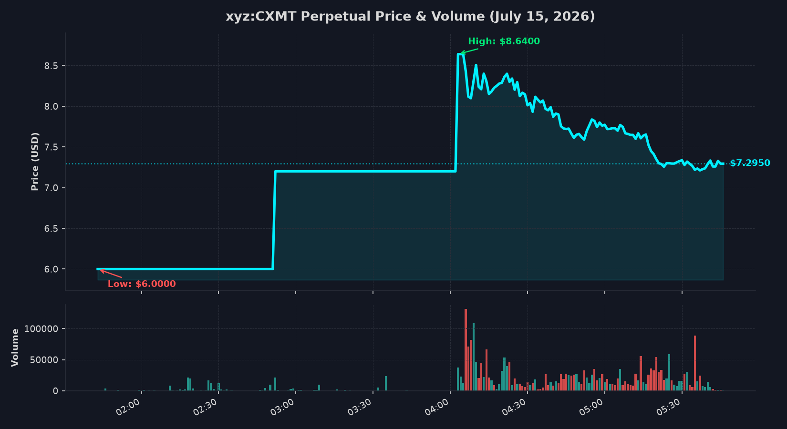

#+TITLE: ChangXin Memory Technologies (CXMT) Perpetual Future Tracker
#+AUTHOR: Antigravity Pairing Assistant
#+DATE: 2026-07-15
#+OPTIONS: toc:nil num:nil

* Overview
This document tracks the Hyperliquid perpetual future contract =xyz:CXMT=, which represents the pre-IPO valuation of *ChangXin Memory Technologies (CXMT)*, a leading Chinese semiconductor company specializing in DRAM memory chips.

The contract launched today (*July 15, 2026*). 

** Valuation Methodology
According to the IPO prospectus for ChangXin Memory Technologies (STAR Market STAR-board IPO):
- *IPO Offering Shares*: 6,688,000,000 shares (new shares issued, representing 10% of total shares).
- *Total Share Capital*: 66,880,000,000 shares (post-issuance total).
- *USD/CNY Exchange Rate*: Assumed to be *7.25* for valuation conversion (historical media comparison reports used ~6.78 when quoting a 2.72 Trillion RMB valuation at a $6.00 perp price).

Based on these figures, we calculate two implied valuations:
1. *Implied IPO Offering Valuation* = =Perp Price * 6.688 Billion=
2. *Implied Fully Diluted Valuation (Total Market Cap)* = =Perp Price * 66.88 Billion=

* Live Tracking
You can execute the python code block below to fetch real-time and 1-minute historical data for today from the Hyperliquid API and update the tables.

#+begin_src python :results output raw :exports both
import subprocess
print(subprocess.check_output(["python", "track_cxmt.py"], text=True))
#+end_src

#+RESULTS:
#+TITLE: Hyperliquid xyz:CXMT Tracker
#+DATE: 2026-07-15 13:46:03 (UTC+8)

* Real-Time Market Context
This table shows the latest real-time market data and calculated implied valuations based on the current mark price.

#+CAPTION: CXMT Real-Time Market Context
| Metric | Value | Description |
|--------+-------+-------------|
| Mark Price | $7.2950 | Current fair value price used for liquidations |
| Mid Price | $7.2896 | Midpoint of the current order book bid-ask spread |
| 24h Volume (USD) | $19,763,118.49 | Cumulative dollar trading volume in the last 24h |
| 24h Volume (CXMT) | 2,620,889.7 | Cumulative contract trading volume in the last 24h |
| Open Interest | 2,094,461.4 | Outstanding active perpetual positions |
| Funding Rate | -0.001793% / hr | Hourly premium rate (APR: -15.70%) |
| Spot Oracle Premium | -2.64% | Premium of perp price relative to index oracle |
| Implied IPO Offering Valuation | $48.789B (RMB 353.720B) | Valuation of the 6.688B new shares offered |
| Implied Fully Diluted Valuation | $487.890B (RMB 3.537T) | Total company valuation based on 66.88B shares |

* Price Chart
Visual representation of today's intraday price movement and trading volume.

* Today's Pricing Data (1-Minute Candles)
Showing all granular 1-minute historical data for today (July 15, 2026). In total, 244 minutes of trading data are available.

#+CAPTION: CXMT 1-Minute Candlestick Data
| Time (Local) | Open (USD) | High (USD) | Low (USD) | Close (USD) | Volume (CXMT) | Notional (USD) | Fully Diluted Val (USD) | Fully Diluted Val (RMB) |
|--------------+------------+------------+-----------+-------------+---------------+----------------+-------------------------+-------------------------|
| 2026-07-15 09:43 |     6.0000 |     6.0000 |    6.0000 |      6.0000 |           3.8 | $        22.80 | $401.280B               | RMB 2.909T              |
| 2026-07-15 09:44 |     6.0000 |     6.0000 |    6.0000 |      6.0000 |           0.0 | $         0.00 | $401.280B               | RMB 2.909T              |
| 2026-07-15 09:45 |     6.0000 |     6.0000 |    6.0000 |      6.0000 |           0.0 | $         0.00 | $401.280B               | RMB 2.909T              |
| 2026-07-15 09:46 |     6.0000 |     6.0000 |    6.0000 |      6.0000 |        3219.4 | $     19316.40 | $401.280B               | RMB 2.909T              |
| 2026-07-15 09:47 |     6.0000 |     6.0000 |    6.0000 |      6.0000 |           0.0 | $         0.00 | $401.280B               | RMB 2.909T              |
| 2026-07-15 09:48 |     6.0000 |     6.0000 |    6.0000 |      6.0000 |           0.0 | $         0.00 | $401.280B               | RMB 2.909T              |
| 2026-07-15 09:49 |     6.0000 |     6.0000 |    6.0000 |      6.0000 |           0.0 | $         0.00 | $401.280B               | RMB 2.909T              |
| 2026-07-15 09:50 |     6.0000 |     6.0000 |    6.0000 |      6.0000 |           0.0 | $         0.00 | $401.280B               | RMB 2.909T              |
| 2026-07-15 09:51 |     6.0000 |     6.0000 |    6.0000 |      6.0000 |        1018.5 | $      6111.00 | $401.280B               | RMB 2.909T              |
| 2026-07-15 09:52 |     6.0000 |     6.0000 |    6.0000 |      6.0000 |          51.7 | $       310.20 | $401.280B               | RMB 2.909T              |
| 2026-07-15 09:53 |     6.0000 |     6.0000 |    6.0000 |      6.0000 |          18.5 | $       111.00 | $401.280B               | RMB 2.909T              |
| 2026-07-15 09:54 |     6.0000 |     6.0000 |    6.0000 |      6.0000 |           0.0 | $         0.00 | $401.280B               | RMB 2.909T              |
| 2026-07-15 09:55 |     6.0000 |     6.0000 |    6.0000 |      6.0000 |           0.0 | $         0.00 | $401.280B               | RMB 2.909T              |
| 2026-07-15 09:56 |     6.0000 |     6.0000 |    6.0000 |      6.0000 |          10.0 | $        60.00 | $401.280B               | RMB 2.909T              |
| 2026-07-15 09:57 |     6.0000 |     6.0000 |    6.0000 |      6.0000 |           0.0 | $         0.00 | $401.280B               | RMB 2.909T              |
| 2026-07-15 09:58 |     6.0000 |     6.0000 |    6.0000 |      6.0000 |           0.0 | $         0.00 | $401.280B               | RMB 2.909T              |
| 2026-07-15 09:59 |     6.0000 |     6.0000 |    6.0000 |      6.0000 |        1555.0 | $      9330.00 | $401.280B               | RMB 2.909T              |
| 2026-07-15 10:00 |     6.0000 |     6.0000 |    6.0000 |      6.0000 |           0.0 | $         0.00 | $401.280B               | RMB 2.909T              |
| 2026-07-15 10:01 |     6.0000 |     6.0000 |    6.0000 |      6.0000 |        1666.6 | $      9999.60 | $401.280B               | RMB 2.909T              |
| 2026-07-15 10:02 |     6.0000 |     6.0000 |    6.0000 |      6.0000 |         110.0 | $       660.00 | $401.280B               | RMB 2.909T              |
| 2026-07-15 10:03 |     6.0000 |     6.0000 |    6.0000 |      6.0000 |         195.3 | $      1171.80 | $401.280B               | RMB 2.909T              |
| 2026-07-15 10:04 |     6.0000 |     6.0000 |    6.0000 |      6.0000 |           0.0 | $         0.00 | $401.280B               | RMB 2.909T              |
| 2026-07-15 10:05 |     6.0000 |     6.0000 |    6.0000 |      6.0000 |         166.6 | $       999.60 | $401.280B               | RMB 2.909T              |
| 2026-07-15 10:06 |     6.0000 |     6.0000 |    6.0000 |      6.0000 |           1.8 | $        10.80 | $401.280B               | RMB 2.909T              |
| 2026-07-15 10:07 |     6.0000 |     6.0000 |    6.0000 |      6.0000 |           0.0 | $         0.00 | $401.280B               | RMB 2.909T              |
| 2026-07-15 10:08 |     6.0000 |     6.0000 |    6.0000 |      6.0000 |           0.0 | $         0.00 | $401.280B               | RMB 2.909T              |
| 2026-07-15 10:09 |     6.0000 |     6.0000 |    6.0000 |      6.0000 |          54.6 | $       327.60 | $401.280B               | RMB 2.909T              |
| 2026-07-15 10:10 |     6.0000 |     6.0000 |    6.0000 |      6.0000 |          27.3 | $       163.80 | $401.280B               | RMB 2.909T              |
| 2026-07-15 10:11 |     6.0000 |     6.0000 |    6.0000 |      6.0000 |        8513.2 | $     51079.20 | $401.280B               | RMB 2.909T              |
| 2026-07-15 10:12 |     6.0000 |     6.0000 |    6.0000 |      6.0000 |         166.6 | $       999.60 | $401.280B               | RMB 2.909T              |
| 2026-07-15 10:13 |     6.0000 |     6.0000 |    6.0000 |      6.0000 |           0.0 | $         0.00 | $401.280B               | RMB 2.909T              |
| 2026-07-15 10:14 |     6.0000 |     6.0000 |    6.0000 |      6.0000 |         273.2 | $      1639.20 | $401.280B               | RMB 2.909T              |
| 2026-07-15 10:15 |     6.0000 |     6.0000 |    6.0000 |      6.0000 |        1816.6 | $     10899.60 | $401.280B               | RMB 2.909T              |
| 2026-07-15 10:16 |     6.0000 |     6.0000 |    6.0000 |      6.0000 |        1666.6 | $      9999.60 | $401.280B               | RMB 2.909T              |
| 2026-07-15 10:17 |     6.0000 |     6.0000 |    6.0000 |      6.0000 |        2000.0 | $     12000.00 | $401.280B               | RMB 2.909T              |
| 2026-07-15 10:18 |     6.0000 |     6.0000 |    6.0000 |      6.0000 |       21585.9 | $    129515.40 | $401.280B               | RMB 2.909T              |
| 2026-07-15 10:19 |     6.0000 |     6.0000 |    6.0000 |      6.0000 |       19453.7 | $    116722.20 | $401.280B               | RMB 2.909T              |
| 2026-07-15 10:20 |     6.0000 |     6.0000 |    6.0000 |      6.0000 |        3412.4 | $     20474.40 | $401.280B               | RMB 2.909T              |
| 2026-07-15 10:21 |     6.0000 |     6.0000 |    6.0000 |      6.0000 |           0.0 | $         0.00 | $401.280B               | RMB 2.909T              |
| 2026-07-15 10:22 |     6.0000 |     6.0000 |    6.0000 |      6.0000 |           1.8 | $        10.80 | $401.280B               | RMB 2.909T              |
| 2026-07-15 10:23 |     6.0000 |     6.0000 |    6.0000 |      6.0000 |         835.1 | $      5010.60 | $401.280B               | RMB 2.909T              |
| 2026-07-15 10:24 |     6.0000 |     6.0000 |    6.0000 |      6.0000 |          16.6 | $        99.60 | $401.280B               | RMB 2.909T              |
| 2026-07-15 10:25 |     6.0000 |     6.0000 |    6.0000 |      6.0000 |         300.0 | $      1800.00 | $401.280B               | RMB 2.909T              |
| 2026-07-15 10:26 |     6.0000 |     6.0000 |    6.0000 |      6.0000 |       16598.3 | $     99589.80 | $401.280B               | RMB 2.909T              |
| 2026-07-15 10:27 |     6.0000 |     6.0000 |    6.0000 |      6.0000 |       12500.0 | $     75000.00 | $401.280B               | RMB 2.909T              |
| 2026-07-15 10:28 |     6.0000 |     6.0000 |    6.0000 |      6.0000 |        2647.0 | $     15882.00 | $401.280B               | RMB 2.909T              |
| 2026-07-15 10:29 |     6.0000 |     6.0000 |    6.0000 |      6.0000 |           0.0 | $         0.00 | $401.280B               | RMB 2.909T              |
| 2026-07-15 10:30 |     6.0000 |     6.0000 |    6.0000 |      6.0000 |       12492.3 | $     74953.80 | $401.280B               | RMB 2.909T              |
| 2026-07-15 10:31 |     6.0000 |     6.0000 |    6.0000 |      6.0000 |        1925.7 | $     11554.20 | $401.280B               | RMB 2.909T              |
| 2026-07-15 10:32 |     6.0000 |     6.0000 |    6.0000 |      6.0000 |         833.3 | $      4999.80 | $401.280B               | RMB 2.909T              |
| 2026-07-15 10:33 |     6.0000 |     6.0000 |    6.0000 |      6.0000 |        1923.1 | $     11538.60 | $401.280B               | RMB 2.909T              |
| 2026-07-15 10:34 |     6.0000 |     6.0000 |    6.0000 |      6.0000 |           0.0 | $         0.00 | $401.280B               | RMB 2.909T              |
| 2026-07-15 10:35 |     6.0000 |     6.0000 |    6.0000 |      6.0000 |         166.6 | $       999.60 | $401.280B               | RMB 2.909T              |
| 2026-07-15 10:36 |     6.0000 |     6.0000 |    6.0000 |      6.0000 |           2.0 | $        12.00 | $401.280B               | RMB 2.909T              |
| 2026-07-15 10:37 |     6.0000 |     6.0000 |    6.0000 |      6.0000 |           0.0 | $         0.00 | $401.280B               | RMB 2.909T              |
| 2026-07-15 10:38 |     6.0000 |     6.0000 |    6.0000 |      6.0000 |           0.0 | $         0.00 | $401.280B               | RMB 2.909T              |
| 2026-07-15 10:39 |     6.0000 |     6.0000 |    6.0000 |      6.0000 |           0.0 | $         0.00 | $401.280B               | RMB 2.909T              |
| 2026-07-15 10:40 |     6.0000 |     6.0000 |    6.0000 |      6.0000 |           0.0 | $         0.00 | $401.280B               | RMB 2.909T              |
| 2026-07-15 10:41 |     6.0000 |     6.0000 |    6.0000 |      6.0000 |          10.0 | $        60.00 | $401.280B               | RMB 2.909T              |
| 2026-07-15 10:42 |     6.0000 |     6.0000 |    6.0000 |      6.0000 |           0.0 | $         0.00 | $401.280B               | RMB 2.909T              |
| 2026-07-15 10:43 |     6.0000 |     6.0000 |    6.0000 |      6.0000 |          16.6 | $        99.60 | $401.280B               | RMB 2.909T              |
| 2026-07-15 10:44 |     6.0000 |     6.0000 |    6.0000 |      6.0000 |           0.0 | $         0.00 | $401.280B               | RMB 2.909T              |
| 2026-07-15 10:45 |     6.0000 |     6.0000 |    6.0000 |      6.0000 |           0.0 | $         0.00 | $401.280B               | RMB 2.909T              |
| 2026-07-15 10:46 |     6.0000 |     6.0000 |    6.0000 |      6.0000 |        1016.6 | $      6099.60 | $401.280B               | RMB 2.909T              |
| 2026-07-15 10:47 |     6.0000 |     6.0000 |    6.0000 |      6.0000 |         168.4 | $      1010.40 | $401.280B               | RMB 2.909T              |
| 2026-07-15 10:48 |     6.0000 |     6.0000 |    6.0000 |      6.0000 |        4000.0 | $     24000.00 | $401.280B               | RMB 2.909T              |
| 2026-07-15 10:49 |     6.0000 |     6.0000 |    6.0000 |      6.0000 |           0.0 | $         0.00 | $401.280B               | RMB 2.909T              |
| 2026-07-15 10:50 |     6.0000 |     6.0000 |    6.0000 |      6.0000 |       10000.0 | $     60000.00 | $401.280B               | RMB 2.909T              |
| 2026-07-15 10:51 |     6.0000 |     6.0000 |    6.0000 |      6.0000 |          43.3 | $       259.80 | $401.280B               | RMB 2.909T              |
| 2026-07-15 10:52 |     6.0001 |     7.2000 |    6.0001 |      7.2000 |       21440.5 | $    154371.60 | $481.536B               | RMB 3.491T              |
| 2026-07-15 10:53 |     7.2000 |     7.2000 |    7.2000 |      7.2000 |        1305.6 | $      9400.32 | $481.536B               | RMB 3.491T              |
| 2026-07-15 10:54 |     7.2000 |     7.2000 |    7.2000 |      7.2000 |          16.9 | $       121.68 | $481.536B               | RMB 3.491T              |
| 2026-07-15 10:55 |     7.2000 |     7.2000 |    7.2000 |      7.2000 |           0.0 | $         0.00 | $481.536B               | RMB 3.491T              |
| 2026-07-15 10:56 |     7.2000 |     7.2000 |    7.2000 |      7.2000 |          27.5 | $       198.00 | $481.536B               | RMB 3.491T              |
| 2026-07-15 10:57 |     7.2000 |     7.2000 |    7.2000 |      7.2000 |         891.2 | $      6416.64 | $481.536B               | RMB 3.491T              |
| 2026-07-15 10:58 |     7.2000 |     7.2000 |    7.2000 |      7.2000 |        2798.7 | $     20150.64 | $481.536B               | RMB 3.491T              |
| 2026-07-15 10:59 |     7.2000 |     7.2000 |    7.2000 |      7.2000 |        3694.3 | $     26598.96 | $481.536B               | RMB 3.491T              |
| 2026-07-15 11:00 |     7.2000 |     7.2000 |    7.2000 |      7.2000 |           0.0 | $         0.00 | $481.536B               | RMB 3.491T              |
| 2026-07-15 11:01 |     7.2000 |     7.2000 |    7.2000 |      7.2000 |        1000.0 | $      7200.00 | $481.536B               | RMB 3.491T              |
| 2026-07-15 11:02 |     7.2000 |     7.2000 |    7.2000 |      7.2000 |        1000.0 | $      7200.00 | $481.536B               | RMB 3.491T              |
| 2026-07-15 11:03 |     7.2000 |     7.2000 |    7.2000 |      7.2000 |           0.0 | $         0.00 | $481.536B               | RMB 3.491T              |
| 2026-07-15 11:04 |     7.2000 |     7.2000 |    7.2000 |      7.2000 |          10.0 | $        72.00 | $481.536B               | RMB 3.491T              |
| 2026-07-15 11:05 |     7.2000 |     7.2000 |    7.2000 |      7.2000 |           2.0 | $        14.40 | $481.536B               | RMB 3.491T              |
| 2026-07-15 11:06 |     7.2000 |     7.2000 |    7.2000 |      7.2000 |           0.0 | $         0.00 | $481.536B               | RMB 3.491T              |
| 2026-07-15 11:07 |     7.2000 |     7.2000 |    7.2000 |      7.2000 |        1208.0 | $      8697.60 | $481.536B               | RMB 3.491T              |
| 2026-07-15 11:08 |     7.2000 |     7.2000 |    7.2000 |      7.2000 |        1388.8 | $      9999.36 | $481.536B               | RMB 3.491T              |
| 2026-07-15 11:09 |     7.2000 |     7.2000 |    7.2000 |      7.2000 |       10013.8 | $     72099.36 | $481.536B               | RMB 3.491T              |
| 2026-07-15 11:10 |     7.2000 |     7.2000 |    7.2000 |      7.2000 |           1.5 | $        10.80 | $481.536B               | RMB 3.491T              |
| 2026-07-15 11:11 |     7.2000 |     7.2000 |    7.2000 |      7.2000 |           0.0 | $         0.00 | $481.536B               | RMB 3.491T              |
| 2026-07-15 11:12 |     7.2000 |     7.2000 |    7.2000 |      7.2000 |          10.0 | $        72.00 | $481.536B               | RMB 3.491T              |
| 2026-07-15 11:13 |     7.2000 |     7.2000 |    7.2000 |      7.2000 |           0.0 | $         0.00 | $481.536B               | RMB 3.491T              |
| 2026-07-15 11:14 |     7.2000 |     7.2000 |    7.2000 |      7.2000 |           4.0 | $        28.80 | $481.536B               | RMB 3.491T              |
| 2026-07-15 11:15 |     7.2000 |     7.2000 |    7.2000 |      7.2000 |         113.8 | $       819.36 | $481.536B               | RMB 3.491T              |
| 2026-07-15 11:16 |     7.2000 |     7.2000 |    7.2000 |      7.2000 |        2385.3 | $     17174.16 | $481.536B               | RMB 3.491T              |
| 2026-07-15 11:17 |     7.2000 |     7.2000 |    7.2000 |      7.2000 |           8.5 | $        61.20 | $481.536B               | RMB 3.491T              |
| 2026-07-15 11:18 |     7.2000 |     7.2000 |    7.2000 |      7.2000 |           3.0 | $        21.60 | $481.536B               | RMB 3.491T              |
| 2026-07-15 11:19 |     7.2000 |     7.2000 |    7.2000 |      7.2000 |        1072.0 | $      7718.40 | $481.536B               | RMB 3.491T              |
| 2026-07-15 11:20 |     7.2000 |     7.2000 |    7.2000 |      7.2000 |           0.0 | $         0.00 | $481.536B               | RMB 3.491T              |
| 2026-07-15 11:21 |     7.2000 |     7.2000 |    7.2000 |      7.2000 |         700.4 | $      5042.88 | $481.536B               | RMB 3.491T              |
| 2026-07-15 11:22 |     7.2000 |     7.2000 |    7.2000 |      7.2000 |          62.0 | $       446.40 | $481.536B               | RMB 3.491T              |
| 2026-07-15 11:23 |     7.2000 |     7.2000 |    7.2000 |      7.2000 |           0.0 | $         0.00 | $481.536B               | RMB 3.491T              |
| 2026-07-15 11:24 |     7.2000 |     7.2000 |    7.2000 |      7.2000 |           0.0 | $         0.00 | $481.536B               | RMB 3.491T              |
| 2026-07-15 11:25 |     7.2000 |     7.2000 |    7.2000 |      7.2000 |           0.0 | $         0.00 | $481.536B               | RMB 3.491T              |
| 2026-07-15 11:26 |     7.2000 |     7.2000 |    7.2000 |      7.2000 |           0.0 | $         0.00 | $481.536B               | RMB 3.491T              |
| 2026-07-15 11:27 |     7.2000 |     7.2000 |    7.2000 |      7.2000 |          30.0 | $       216.00 | $481.536B               | RMB 3.491T              |
| 2026-07-15 11:28 |     7.2000 |     7.2000 |    7.2000 |      7.2000 |           0.0 | $         0.00 | $481.536B               | RMB 3.491T              |
| 2026-07-15 11:29 |     7.2000 |     7.2000 |    7.2000 |      7.2000 |           0.0 | $         0.00 | $481.536B               | RMB 3.491T              |
| 2026-07-15 11:30 |     7.2000 |     7.2000 |    7.2000 |      7.2000 |           0.0 | $         0.00 | $481.536B               | RMB 3.491T              |
| 2026-07-15 11:31 |     7.2000 |     7.2000 |    7.2000 |      7.2000 |         120.0 | $       864.00 | $481.536B               | RMB 3.491T              |
| 2026-07-15 11:32 |     7.2000 |     7.2000 |    7.2000 |      7.2000 |        4997.0 | $     35978.40 | $481.536B               | RMB 3.491T              |
| 2026-07-15 11:33 |     7.2000 |     7.2000 |    7.2000 |      7.2000 |           0.0 | $         0.00 | $481.536B               | RMB 3.491T              |
| 2026-07-15 11:34 |     7.2000 |     7.2000 |    7.2000 |      7.2000 |           0.0 | $         0.00 | $481.536B               | RMB 3.491T              |
| 2026-07-15 11:35 |     7.2000 |     7.2000 |    7.2000 |      7.2000 |       23763.0 | $    171093.60 | $481.536B               | RMB 3.491T              |
| 2026-07-15 11:36 |     7.2000 |     7.2000 |    7.2000 |      7.2000 |           0.0 | $         0.00 | $481.536B               | RMB 3.491T              |
| 2026-07-15 11:37 |     7.2000 |     7.2000 |    7.2000 |      7.2000 |          44.1 | $       317.52 | $481.536B               | RMB 3.491T              |
| 2026-07-15 11:38 |     7.2000 |     7.2000 |    7.2000 |      7.2000 |           0.0 | $         0.00 | $481.536B               | RMB 3.491T              |
| 2026-07-15 11:39 |     7.2000 |     7.2000 |    7.2000 |      7.2000 |          40.5 | $       291.60 | $481.536B               | RMB 3.491T              |
| 2026-07-15 11:40 |     7.2000 |     7.2000 |    7.2000 |      7.2000 |           0.0 | $         0.00 | $481.536B               | RMB 3.491T              |
| 2026-07-15 11:41 |     7.2000 |     7.2000 |    7.2000 |      7.2000 |         100.0 | $       720.00 | $481.536B               | RMB 3.491T              |
| 2026-07-15 11:42 |     7.2000 |     7.2000 |    7.2000 |      7.2000 |          45.4 | $       326.88 | $481.536B               | RMB 3.491T              |
| 2026-07-15 11:43 |     7.2000 |     7.2000 |    7.2000 |      7.2000 |         153.8 | $      1107.36 | $481.536B               | RMB 3.491T              |
| 2026-07-15 11:44 |     7.2000 |     7.2000 |    7.2000 |      7.2000 |           0.0 | $         0.00 | $481.536B               | RMB 3.491T              |
| 2026-07-15 11:45 |     7.2000 |     7.2000 |    7.2000 |      7.2000 |          47.6 | $       342.72 | $481.536B               | RMB 3.491T              |
| 2026-07-15 11:46 |     7.2000 |     7.2000 |    7.2000 |      7.2000 |           0.0 | $         0.00 | $481.536B               | RMB 3.491T              |
| 2026-07-15 11:47 |     7.2000 |     7.2000 |    7.2000 |      7.2000 |           1.4 | $        10.08 | $481.536B               | RMB 3.491T              |
| 2026-07-15 11:48 |     7.2000 |     7.2000 |    7.2000 |      7.2000 |           0.0 | $         0.00 | $481.536B               | RMB 3.491T              |
| 2026-07-15 11:49 |     7.2000 |     7.2000 |    7.2000 |      7.2000 |           0.0 | $         0.00 | $481.536B               | RMB 3.491T              |
| 2026-07-15 11:50 |     7.2000 |     7.2000 |    7.2000 |      7.2000 |           0.0 | $         0.00 | $481.536B               | RMB 3.491T              |
| 2026-07-15 11:51 |     7.2000 |     7.2000 |    7.2000 |      7.2000 |          15.3 | $       110.16 | $481.536B               | RMB 3.491T              |
| 2026-07-15 11:52 |     7.2000 |     7.2000 |    7.2000 |      7.2000 |           0.0 | $         0.00 | $481.536B               | RMB 3.491T              |
| 2026-07-15 11:53 |     7.2000 |     7.2000 |    7.2000 |      7.2000 |           0.0 | $         0.00 | $481.536B               | RMB 3.491T              |
| 2026-07-15 11:54 |     7.2000 |     7.2000 |    7.2000 |      7.2000 |           1.4 | $        10.08 | $481.536B               | RMB 3.491T              |
| 2026-07-15 11:55 |     7.2000 |     7.2000 |    7.2000 |      7.2000 |           0.0 | $         0.00 | $481.536B               | RMB 3.491T              |
| 2026-07-15 11:56 |     7.2000 |     7.2000 |    7.2000 |      7.2000 |           0.0 | $         0.00 | $481.536B               | RMB 3.491T              |
| 2026-07-15 11:57 |     7.2000 |     7.2000 |    7.2000 |      7.2000 |           0.0 | $         0.00 | $481.536B               | RMB 3.491T              |
| 2026-07-15 11:58 |     7.2000 |     7.2000 |    7.2000 |      7.2000 |          27.7 | $       199.44 | $481.536B               | RMB 3.491T              |
| 2026-07-15 11:59 |     7.2000 |     7.2000 |    7.2000 |      7.2000 |           0.0 | $         0.00 | $481.536B               | RMB 3.491T              |
| 2026-07-15 12:00 |     7.2000 |     7.2000 |    7.2000 |      7.2000 |           0.0 | $         0.00 | $481.536B               | RMB 3.491T              |
| 2026-07-15 12:01 |     7.2000 |     7.2000 |    7.2000 |      7.2000 |           0.0 | $         0.00 | $481.536B               | RMB 3.491T              |
| 2026-07-15 12:02 |     7.2000 |     7.2000 |    7.2000 |      7.2000 |           0.0 | $         0.00 | $481.536B               | RMB 3.491T              |
| 2026-07-15 12:03 |     7.2000 |     8.6400 |    7.2000 |      8.6400 |       37400.9 | $    323143.78 | $577.843B               | RMB 4.189T              |
| 2026-07-15 12:04 |     8.6400 |     8.6400 |    8.6400 |      8.6400 |       22399.4 | $    193530.82 | $577.843B               | RMB 4.189T              |
| 2026-07-15 12:05 |     8.6400 |     8.6400 |    8.6400 |      8.6400 |       12776.7 | $    110390.69 | $577.843B               | RMB 4.189T              |
| 2026-07-15 12:06 |     8.6400 |     8.6400 |    8.0000 |      8.4300 |      131780.4 | $   1110908.77 | $563.798B               | RMB 4.088T              |
| 2026-07-15 12:07 |     8.3853 |     8.5000 |    8.1180 |      8.1180 |       70824.0 | $    574949.23 | $542.932B               | RMB 3.936T              |
| 2026-07-15 12:08 |     8.1297 |     8.1999 |    7.5600 |      8.0983 |       81724.4 | $    661828.71 | $541.614B               | RMB 3.927T              |
| 2026-07-15 12:09 |     8.0983 |     8.4000 |    8.0983 |      8.3050 |      108605.8 | $    901971.17 | $555.438B               | RMB 4.027T              |
| 2026-07-15 12:10 |     8.3200 |     8.5067 |    8.3200 |      8.5067 |       45770.1 | $    389352.51 | $568.928B               | RMB 4.125T              |
| 2026-07-15 12:11 |     8.5067 |     8.5316 |    8.1950 |      8.2400 |       20250.3 | $    166862.47 | $551.091B               | RMB 3.995T              |
| 2026-07-15 12:12 |     8.2300 |     8.4356 |    7.8222 |      8.2088 |       45092.2 | $    370152.85 | $549.005B               | RMB 3.980T              |
| 2026-07-15 12:13 |     8.2000 |     8.4556 |    8.1320 |      8.4000 |       22315.2 | $    187447.68 | $561.792B               | RMB 4.073T              |
| 2026-07-15 12:14 |     8.4000 |     8.4556 |    8.2680 |      8.3090 |       66306.1 | $    550937.38 | $555.706B               | RMB 4.029T              |
| 2026-07-15 12:15 |     8.3291 |     8.3380 |    8.0800 |      8.1510 |       20932.9 | $    170624.07 | $545.139B               | RMB 3.952T              |
| 2026-07-15 12:16 |     8.1510 |     8.2686 |    8.1401 |      8.1810 |       16345.1 | $    133719.26 | $547.145B               | RMB 3.967T              |
| 2026-07-15 12:17 |     8.2590 |     8.2950 |    8.1856 |      8.2262 |        8725.4 | $     71776.89 | $550.168B               | RMB 3.989T              |
| 2026-07-15 12:18 |     8.2340 |     8.2722 |    8.2130 |      8.2500 |        3147.3 | $     25965.23 | $551.760B               | RMB 4.000T              |
| 2026-07-15 12:19 |     8.2699 |     8.2880 |    8.2600 |      8.2784 |       10219.9 | $     84604.42 | $553.659B               | RMB 4.014T              |
| 2026-07-15 12:20 |     8.2784 |     8.2880 |    8.2150 |      8.2880 |       31944.3 | $    264754.36 | $554.301B               | RMB 4.019T              |
| 2026-07-15 12:21 |     8.2752 |     8.3652 |    8.2752 |      8.3600 |       53426.7 | $    446647.21 | $559.117B               | RMB 4.054T              |
| 2026-07-15 12:22 |     8.3600 |     8.3990 |    8.3400 |      8.3990 |       40006.9 | $    336017.95 | $561.725B               | RMB 4.073T              |
| 2026-07-15 12:23 |     8.3990 |     8.4500 |    8.3000 |      8.3000 |       46160.9 | $    383135.47 | $555.104B               | RMB 4.025T              |
| 2026-07-15 12:24 |     8.3400 |     8.3990 |    8.3000 |      8.3400 |        9028.3 | $     75296.02 | $557.779B               | RMB 4.044T              |
| 2026-07-15 12:25 |     8.3783 |     8.3783 |    8.1500 |      8.2026 |       19723.0 | $    161779.88 | $548.590B               | RMB 3.977T              |
| 2026-07-15 12:26 |     8.2026 |     8.3000 |    8.1600 |      8.2960 |       10840.0 | $     89928.64 | $554.836B               | RMB 4.023T              |
| 2026-07-15 12:27 |     8.2960 |     8.2960 |    8.1247 |      8.1247 |       11454.9 | $     93067.63 | $543.380B               | RMB 3.940T              |
| 2026-07-15 12:28 |     8.1720 |     8.1950 |    8.1070 |      8.1660 |        7278.7 | $     59437.86 | $546.142B               | RMB 3.960T              |
| 2026-07-15 12:29 |     8.1950 |     8.2400 |    8.1440 |      8.1459 |        5873.5 | $     47844.94 | $544.798B               | RMB 3.950T              |
| 2026-07-15 12:30 |     8.1984 |     8.2100 |    8.0100 |      8.0120 |       14336.7 | $    114865.64 | $535.843B               | RMB 3.885T              |
| 2026-07-15 12:31 |     8.0100 |     8.0953 |    8.0000 |      8.0388 |        9279.2 | $     74593.63 | $537.635B               | RMB 3.898T              |
| 2026-07-15 12:32 |     8.0388 |     8.0556 |    7.9200 |      7.9321 |       11790.6 | $     93524.22 | $530.499B               | RMB 3.846T              |
| 2026-07-15 12:33 |     7.9321 |     8.1599 |    7.9103 |      8.1160 |       18038.1 | $    146397.22 | $542.798B               | RMB 3.935T              |
| 2026-07-15 12:34 |     8.1160 |     8.1160 |    8.0538 |      8.0800 |        1815.2 | $     14666.82 | $540.390B               | RMB 3.918T              |
| 2026-07-15 12:35 |     8.0538 |     8.0982 |    8.0475 |      8.0475 |        2710.5 | $     21812.75 | $538.217B               | RMB 3.902T              |
| 2026-07-15 12:36 |     8.0960 |     8.1000 |    8.0001 |      8.0700 |        5183.3 | $     41829.23 | $539.722B               | RMB 3.913T              |
| 2026-07-15 12:37 |     8.0524 |     8.0700 |    7.8900 |      7.9675 |       26614.9 | $    212054.22 | $532.866B               | RMB 3.863T              |
| 2026-07-15 12:38 |     7.9675 |     7.9772 |    7.8700 |      7.9508 |        8939.2 | $     71073.79 | $531.750B               | RMB 3.855T              |
| 2026-07-15 12:39 |     7.9507 |     8.0699 |    7.8700 |      7.9880 |       13513.6 | $    107946.64 | $534.237B               | RMB 3.873T              |
| 2026-07-15 12:40 |     7.9879 |     7.9880 |    7.8705 |      7.8705 |        8337.8 | $     65622.65 | $526.379B               | RMB 3.816T              |
| 2026-07-15 12:41 |     7.8960 |     7.9100 |    7.8690 |      7.9100 |       15052.3 | $    119063.69 | $529.021B               | RMB 3.835T              |
| 2026-07-15 12:42 |     7.9171 |     7.9400 |    7.8600 |      7.9000 |       13178.5 | $    104110.15 | $528.352B               | RMB 3.831T              |
| 2026-07-15 12:43 |     7.8999 |     7.9000 |    7.7100 |      7.7550 |       26478.1 | $    205337.67 | $518.654B               | RMB 3.760T              |
| 2026-07-15 12:44 |     7.8099 |     7.8200 |    7.7224 |      7.7274 |       19280.6 | $    148988.91 | $516.809B               | RMB 3.747T              |
| 2026-07-15 12:45 |     7.8120 |     7.8300 |    7.7000 |      7.7201 |       27634.7 | $    213342.65 | $516.320B               | RMB 3.743T              |
| 2026-07-15 12:46 |     7.7080 |     7.8075 |    7.6611 |      7.7250 |       24701.3 | $    190817.54 | $516.648B               | RMB 3.746T              |
| 2026-07-15 12:47 |     7.6840 |     7.7925 |    7.6600 |      7.6650 |       24626.8 | $    188764.42 | $512.635B               | RMB 3.717T              |
| 2026-07-15 12:48 |     7.7460 |     7.7467 |    7.6112 |      7.6125 |       25474.9 | $    193927.68 | $509.124B               | RMB 3.691T              |
| 2026-07-15 12:49 |     7.6200 |     7.6520 |    7.6000 |      7.6500 |       26771.9 | $    204805.04 | $511.632B               | RMB 3.709T              |
| 2026-07-15 12:50 |     7.6480 |     7.6900 |    7.6275 |      7.6599 |       13622.8 | $    104349.29 | $512.294B               | RMB 3.714T              |
| 2026-07-15 12:51 |     7.6589 |     7.6595 |    7.6200 |      7.6200 |       10746.5 | $     81888.33 | $509.626B               | RMB 3.695T              |
| 2026-07-15 12:52 |     7.6296 |     7.6669 |    7.5636 |      7.5901 |       33051.8 | $    250866.47 | $507.626B               | RMB 3.680T              |
| 2026-07-15 12:53 |     7.5901 |     7.7000 |    7.5901 |      7.6950 |       21499.9 | $    165441.73 | $514.642B               | RMB 3.731T              |
| 2026-07-15 12:54 |     7.6770 |     7.7697 |    7.6480 |      7.7650 |       11918.4 | $     92546.38 | $519.323B               | RMB 3.765T              |
| 2026-07-15 12:55 |     7.7620 |     7.8400 |    7.7620 |      7.8372 |       26186.7 | $    205230.41 | $524.152B               | RMB 3.800T              |
| 2026-07-15 12:56 |     7.8372 |     7.8393 |    7.7199 |      7.8200 |       34875.4 | $    272725.63 | $523.002B               | RMB 3.792T              |
| 2026-07-15 12:57 |     7.8000 |     7.8327 |    7.7200 |      7.7440 |       16541.5 | $    128097.38 | $517.919B               | RMB 3.755T              |
| 2026-07-15 12:58 |     7.7800 |     7.8000 |    7.7473 |      7.8000 |       20140.9 | $    157099.02 | $521.664B               | RMB 3.782T              |
| 2026-07-15 12:59 |     7.8000 |     7.8327 |    7.7220 |      7.7616 |       26740.4 | $    207548.29 | $519.096B               | RMB 3.763T              |
| 2026-07-15 13:00 |     7.7700 |     7.8096 |    7.7700 |      7.7722 |       13821.0 | $    107419.58 | $519.805B               | RMB 3.769T              |
| 2026-07-15 13:01 |     7.7959 |     7.7959 |    7.7199 |      7.7199 |       18704.5 | $    144396.87 | $516.307B               | RMB 3.743T              |
| 2026-07-15 13:02 |     7.7199 |     7.7500 |    7.7025 |      7.7217 |       10483.1 | $     80947.35 | $516.427B               | RMB 3.744T              |
| 2026-07-15 13:03 |     7.7405 |     7.7832 |    7.7200 |      7.7311 |       11493.2 | $     88855.08 | $517.056B               | RMB 3.749T              |
| 2026-07-15 13:04 |     7.7460 |     7.7500 |    7.7148 |      7.7299 |        9051.7 | $     69968.74 | $516.976B               | RMB 3.748T              |
| 2026-07-15 13:05 |     7.7299 |     7.7400 |    7.7000 |      7.7001 |       19831.2 | $    152702.22 | $514.983B               | RMB 3.734T              |
| 2026-07-15 13:06 |     7.7220 |     7.7730 |    7.6667 |      7.7699 |       35326.0 | $    274479.49 | $519.651B               | RMB 3.767T              |
| 2026-07-15 13:07 |     7.7680 |     7.7699 |    7.7230 |      7.7459 |        9287.0 | $     71936.17 | $518.046B               | RMB 3.756T              |
| 2026-07-15 13:08 |     7.7459 |     7.7660 |    7.6680 |      7.6680 |       14925.1 | $    114445.67 | $512.836B               | RMB 3.718T              |
| 2026-07-15 13:09 |     7.6739 |     7.7280 |    7.6600 |      7.6600 |       10349.3 | $     79275.64 | $512.301B               | RMB 3.714T              |
| 2026-07-15 13:10 |     7.6600 |     7.6798 |    7.6480 |      7.6480 |        8636.7 | $     66053.48 | $511.498B               | RMB 3.708T              |
| 2026-07-15 13:11 |     7.6556 |     7.6679 |    7.6480 |      7.6480 |        7848.7 | $     60026.86 | $511.498B               | RMB 3.708T              |
| 2026-07-15 13:12 |     7.6480 |     7.6590 |    7.6000 |      7.6000 |       27589.7 | $    209681.72 | $508.288B               | RMB 3.685T              |
| 2026-07-15 13:13 |     7.6139 |     7.7510 |    7.6000 |      7.6680 |       16908.8 | $    129656.68 | $512.836B               | RMB 3.718T              |
| 2026-07-15 13:14 |     7.6787 |     7.7509 |    7.6068 |      7.6068 |       56087.4 | $    426645.63 | $508.743B               | RMB 3.688T              |
| 2026-07-15 13:15 |     7.6261 |     7.6720 |    7.5766 |      7.6392 |       13784.5 | $    105302.55 | $510.910B               | RMB 3.704T              |
| 2026-07-15 13:16 |     7.6001 |     7.6530 |    7.5620 |      7.6530 |       10442.0 | $     79912.63 | $511.833B               | RMB 3.711T              |
| 2026-07-15 13:17 |     7.5673 |     7.5899 |    7.5100 |      7.5234 |       25848.5 | $    194468.60 | $503.165B               | RMB 3.648T              |
| 2026-07-15 13:18 |     7.5369 |     7.5480 |    7.4240 |      7.4491 |       36178.7 | $    269498.75 | $498.196B               | RMB 3.612T              |
| 2026-07-15 13:19 |     7.4491 |     7.4800 |    7.4000 |      7.4124 |       32436.4 | $    240431.57 | $495.741B               | RMB 3.594T              |
| 2026-07-15 13:20 |     7.4126 |     7.4340 |    7.3000 |      7.3510 |       54152.6 | $    398075.76 | $491.635B               | RMB 3.564T              |
| 2026-07-15 13:21 |     7.3008 |     7.4124 |    7.2300 |      7.3000 |       30328.4 | $    221397.32 | $488.224B               | RMB 3.540T              |
| 2026-07-15 13:22 |     7.2999 |     7.3500 |    7.2420 |      7.2899 |       33702.6 | $    245688.58 | $487.549B               | RMB 3.535T              |
| 2026-07-15 13:23 |     7.2721 |     7.3200 |    7.2300 |      7.2574 |       17164.6 | $    124570.37 | $485.375B               | RMB 3.519T              |
| 2026-07-15 13:24 |     7.2559 |     7.3000 |    7.2225 |      7.3000 |       19329.4 | $    141104.62 | $488.224B               | RMB 3.540T              |
| 2026-07-15 13:25 |     7.2360 |     7.3000 |    7.2100 |      7.3000 |       58851.5 | $    429615.95 | $488.224B               | RMB 3.540T              |
| 2026-07-15 13:26 |     7.3000 |     7.3290 |    7.2525 |      7.2960 |       16842.6 | $    122883.61 | $487.956B               | RMB 3.538T              |
| 2026-07-15 13:27 |     7.2701 |     7.3332 |    7.2550 |      7.2958 |        9884.9 | $     72118.25 | $487.943B               | RMB 3.538T              |
| 2026-07-15 13:28 |     7.2801 |     7.3255 |    7.2700 |      7.3120 |        7686.3 | $     56202.23 | $489.027B               | RMB 3.545T              |
| 2026-07-15 13:29 |     7.3080 |     7.3255 |    7.2660 |      7.3255 |       16096.3 | $    117913.45 | $489.929B               | RMB 3.552T              |
| 2026-07-15 13:30 |     7.3260 |     7.3460 |    7.2900 |      7.3368 |       15944.4 | $    116980.87 | $490.685B               | RMB 3.557T              |
| 2026-07-15 13:31 |     7.3400 |     7.3440 |    7.2600 |      7.2789 |       27236.1 | $    198248.85 | $486.813B               | RMB 3.529T              |
| 2026-07-15 13:32 |     7.2789 |     7.3255 |    7.2600 |      7.3200 |       30747.7 | $    225073.16 | $489.562B               | RMB 3.549T              |
| 2026-07-15 13:33 |     7.3018 |     7.3098 |    7.2700 |      7.2931 |        9108.5 | $     66429.20 | $487.763B               | RMB 3.536T              |
| 2026-07-15 13:34 |     7.3118 |     7.3119 |    7.2525 |      7.2680 |        5944.4 | $     43203.90 | $486.084B               | RMB 3.524T              |
| 2026-07-15 13:35 |     7.2679 |     7.2800 |    7.2100 |      7.2200 |       88621.8 | $    639849.40 | $482.874B               | RMB 3.501T              |
| 2026-07-15 13:36 |     7.2200 |     7.2750 |    7.2110 |      7.2350 |       15172.7 | $    109774.48 | $483.877B               | RMB 3.508T              |
| 2026-07-15 13:37 |     7.2220 |     7.2400 |    7.2000 |      7.2120 |       24210.1 | $    174603.24 | $482.339B               | RMB 3.497T              |
| 2026-07-15 13:38 |     7.2120 |     7.2310 |    7.2050 |      7.2269 |        7585.2 | $     54817.48 | $483.335B               | RMB 3.504T              |
| 2026-07-15 13:39 |     7.2163 |     7.2417 |    7.2130 |      7.2377 |        6114.6 | $     44255.64 | $484.057B               | RMB 3.509T              |
| 2026-07-15 13:40 |     7.2399 |     7.2897 |    7.2214 |      7.2897 |       14292.9 | $    104190.95 | $487.535B               | RMB 3.535T              |
| 2026-07-15 13:41 |     7.2897 |     7.3332 |    7.2601 |      7.3332 |        5947.8 | $     43616.41 | $490.444B               | RMB 3.556T              |
| 2026-07-15 13:42 |     7.3332 |     7.3332 |    7.2600 |      7.2600 |        2967.6 | $     21544.78 | $485.549B               | RMB 3.520T              |
| 2026-07-15 13:43 |     7.2600 |     7.3094 |    7.2421 |      7.2598 |        1383.8 | $     10046.11 | $485.535B               | RMB 3.520T              |
| 2026-07-15 13:44 |     7.2598 |     7.3290 |    7.2441 |      7.3290 |        1110.0 | $      8135.19 | $490.164B               | RMB 3.554T              |
| 2026-07-15 13:45 |     7.3278 |     7.3278 |    7.2700 |      7.2950 |         964.3 | $      7034.57 | $487.890B               | RMB 3.537T              |
| 2026-07-15 13:46 |     7.2842 |     7.2950 |    7.2842 |      7.2950 |         150.3 | $      1096.44 | $487.890B               | RMB 3.537T              |

* Market Summary Statistics
Summary of CXMT market activity since launch today:

#+CAPTION: CXMT Launch-to-Date Performance
| Metric | Value | Description |
|--------+-------+-------------|
| Launch Price | $6.0000 | Opening price of first 1m candle |
| Current Price | $7.2950 | Closing price of most recent candle |
| Net Price Change | $+1.2950 (+21.58%) | Price difference since launch |
| Session High | $8.6400 | Highest traded price today |
| Session Low | $6.0000 | Lowest traded price today |
| Cumulative Volume (CXMT) | 2,621,039.7 tokens | Total contracts traded today |
| Cumulative Notional (USD) | $20,310,417.44 | Total USD value exchanged today |
| Implied Valuation (USD) | $487.890B | Based on current price & 66.88B shares |
| Implied Valuation (RMB) | RMB 3.537T | Converted at USD/CNY = 7.25 |
